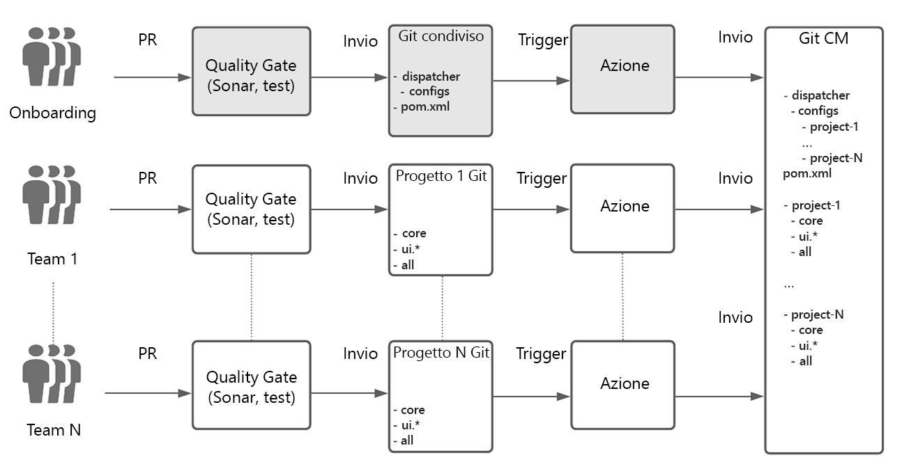
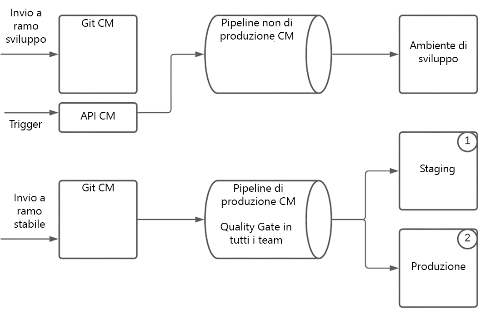
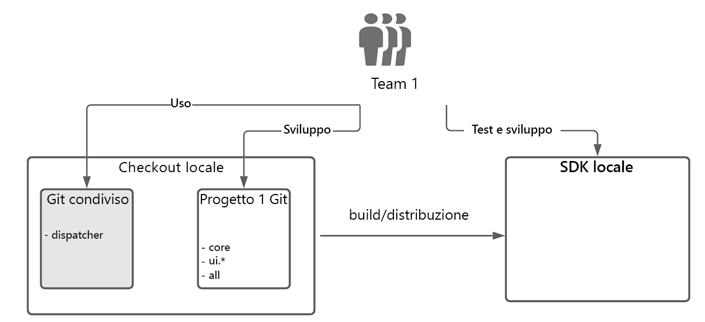

# Configurazione di sviluppo team Enterprise per AEM come Cloud Service {#enterprise-setup}

## Introduzione {#introduction}

AEM come Cloud Service, un&#39;offerta nativa per il cloud che fornisce AEM come servizio è progettata per beneficiare di oltre 10 anni di fornitura di software aziendali ai team aziendali con le loro specifiche esigenze. Mentre si AEM nel mondo nativo cloud, con nuovi valori come sempre attivi, sempre attuali, sempre sicuri e sempre su larga scala, mantiene la proposta di valore principale che AEM fornisce come piattaforma personalizzabile ai nostri clienti e consente ai team di livello enterprise di integrarsi nelle loro procedure di sviluppo e consegna.

Per supportare i nostri clienti con le configurazioni di sviluppo aziendali, AEM as a Cloud Service si integra completamente con Cloud Manager e le sue pipeline CI/CD appositamente progettate, che sono dotate di best practice e vantaggi derivanti dall’esperienza pluriennale nello sviluppo e nella distribuzione di livello enterprise, garantendo test approfonditi e la massima qualità del codice per offrire esperienze eccezionali.

## Supporto di Cloud Manager per l’installazione di Enterprise Team Development {#cloud-manager}

Per garantire ai clienti l’onboarding rapido, Cloud Manager offre tutto il necessario per iniziare a sviluppare esperienze immediatamente, incluso un archivio Git per archiviare personalizzazioni che vengono poi create, verificate e distribuite da Cloud Manager.
Utilizzando Cloud Manager, i team di sviluppo possono lavorare spesso per eseguire modifiche senza dipendere dal personale di Adobe.

In Cloud Manager sono disponibili tre tipi di ambiente:

* Sviluppo
* Area di visualizzazione
* Produzione

Il codice può essere distribuito agli ambienti di sviluppo utilizzando una pipeline non di produzione. Per Stage e Produzione, che vanno sempre insieme e garantiscono così la convalida prima dell’implementazione di produzione come best practice, una pipeline di produzione utilizza i gate di qualità per convalidare il codice dell’applicazione e le modifiche di configurazione.

La pipeline di produzione distribuisce prima il codice e la configurazione nell’ambiente di staging, esegue il test dell’applicazione e infine distribuisce in produzione.
Un SDK di Cloud Service sempre aggiornato con gli ultimi miglioramenti del Cloud Service consente lo sviluppo locale utilizzando direttamente l’hardware locale dello sviluppatore. Ciò consente uno sviluppo rapido con tempi di rotazione molto bassi. In questo modo, gli sviluppatori possono rimanere nel loro ambiente locale familiare e scegliere tra un&#39;ampia varietà di strumenti di sviluppo, oltre a essere spinti negli ambienti di sviluppo o produzione quando lo ritengano opportuno.

Cloud Manager supporta configurazioni multi-team flessibili che possono essere regolate in base alle esigenze di un’azienda. Questo vale sia per il Cloud Service che per AMS. Per garantire implementazioni stabili con più team ed evitare che un solo team influisca sulla produzione per tutti i team, la pipeline con opinioni diverse convalida e verifica sempre il codice da tutti i team.

## Esempio di mondo reale {#real-world-example}

Ogni azienda ha requisiti diversi, tra cui configurazione del team, processi e flussi di lavoro di sviluppo diversi. La configurazione descritta di seguito viene utilizzata da Adobe per diversi progetti che forniscono esperienze al di sopra di AEM come Cloud Service.

Ad esempio, le applicazioni Adobe Creative Cloud, come Adobe Photoshop o Adobe Illustrator, includono risorse di contenuto quali esercitazioni, esempi e guide disponibili per gli utenti finali. Questo contenuto viene utilizzato dalle applicazioni client che utilizzano AEM come Cloud Service in modo *headless*, effettuando chiamate API al livello di pubblicazione AEM Cloud per recuperare il contenuto strutturato come flussi JSON e sfruttando la rete CDN del Cloud Service AEM per distribuire contenuti strutturati e non strutturati con prestazioni ottimali.

I team che contribuiscono a questo progetto seguono il processo descritto di seguito.

>[!NOTE]
>Per ulteriori informazioni sulla configurazione, consulta [Utilizzo di più archivi Git di origine](https://experienceleague.adobe.com/docs/experience-manager-cloud-manager/using/managing-code/working-with-multiple-source-git-repos.html#managing-code) .

Ogni team utilizza il proprio flusso di lavoro di sviluppo e dispone di un archivio git separato. Un archivio Git condiviso aggiuntivo viene utilizzato per l’onboarding dei progetti. Questo archivio Git contiene la struttura principale dell’archivio Git di Cloud Manager, inclusa la configurazione del dispatcher condiviso. L’onboarding di un nuovo progetto richiede l’inserimento nel file di progetto Maven del reattore nella directory principale dell’archivio git condiviso. Per la configurazione del dispatcher viene creato un nuovo file di configurazione all’interno del progetto dispatcher. Questo file viene quindi incluso dalla configurazione del dispatcher principale. Ogni team è responsabile del proprio file di configurazione del dispatcher. Le modifiche all’archivio Git condiviso sono rare e di solito sono necessarie solo quando viene effettuato l’onboarding di un nuovo progetto. Il lavoro principale viene svolto da ogni team di progetto all’interno del proprio archivio Git.

L’archivio Git per ogni team è stato configurato utilizzando l’archetipo AEM Maven e quindi segue le best practice per l’impostazione AEM progetti. L’unica eccezione è la gestione della configurazione del dispatcher che viene eseguita nell’archivio Git condiviso come descritto sopra.
Ogni team utilizza un flusso di lavoro Git semplificato con due rami + N, seguendo il modello di flusso Git:

* Un ramo di rilascio stabile contiene il codice di produzione

* Un ramo di sviluppo contiene l&#39;ultimo sviluppo

* Per ogni feature viene creato un nuovo ramo

Lo sviluppo viene eseguito in un ramo di feature, quando la feature matura viene unita al ramo di sviluppo. Le funzioni completate e convalidate vengono prelevate dal ramo di sviluppo e unite al ramo stabile. Tutte le modifiche vengono effettuate tramite le richieste di pull (PR). Ogni PR viene convalidato automaticamente dai gate di qualità. Sonar viene utilizzato per il controllo della qualità del codice e viene eseguito un set di suite di test per garantire che il nuovo codice non introduca alcuna regressione.

La configurazione nell’archivio Git di Cloud Manager ha due rami:

* A *ramo rilascio stabile*, contenente il codice di produzione di tutti i team
* A *ramo di sviluppo*, contenente il codice di sviluppo di tutti i team

Ogni push all&#39;archivio Git di un team nello sviluppo o nel ramo stabile attiva un&#39;azione [github](https://experienceleague.adobe.com/docs/experience-manager-cloud-manager/using/managing-code/working-with-multiple-source-git-repos.html?lang=en#managing-code). Tutti i progetti seguono la stessa impostazione per il ramo stabile. Un push sul ramo stabile di un progetto viene inviato automaticamente al ramo stabile nell’archivio Git di Cloud Manager. La pipeline di produzione in Cloud Manager è configurata per essere attivata da un push al ramo stabile. La pipeline di produzione viene quindi eseguita da ogni push di un team in un ramo stabile e la distribuzione di produzione viene aggiornata se tutti i gate di qualità passano.

I push al ramo di sviluppo vengono gestiti in modo diverso. Anche se un push a un ramo di sviluppatori nell’archivio Git di un team sta attivando un’azione github e il codice viene inviato automaticamente nel ramo di sviluppo nell’archivio Git di Cloud Manager, la pipeline non di produzione non viene attivata automaticamente dal push del codice. Viene attivata da una chiamata all’api di Cloud Manager.
L’esecuzione della pipeline di produzione include il controllo del codice di tutti i team tramite i gate di qualità forniti. Una volta distribuito il codice sullo stage, i test e i controlli vengono eseguiti per garantire che tutto funzioni come previsto. Una volta passati tutti i cancelli, le modifiche vengono implementate in produzione senza interruzioni o tempi di inattività.
Per lo sviluppo locale, viene utilizzato l&#39;SDK per Cloud Service . L’SDK consente di configurare un autore, una pubblicazione e un dispatcher locali. Questo consente lo sviluppo offline e tempi di consegna rapidi. A volte solo l’autore viene utilizzato per lo sviluppo, ma la configurazione rapida del dispatcher e la pubblicazione consentono di testare tutto ciò che si trova localmente prima di inviarlo all’archivio Git. In genere, i membri di ogni team estraggono il codice dall’git condiviso per e il codice del loro progetto. Non è necessario effettuare il pagamento di altri progetti in quanto i progetti sono indipendenti.

Questa configurazione reale può essere utilizzata come blueprint e quindi personalizzata in base alle esigenze di un&#39;azienda. Il concetto di branching e unione flessibile di git consente di modificare i flussi di lavoro di cui sopra in base alle esigenze di ogni team. AEM come Cloud Service supporta tutte queste varianti senza sacrificare il valore di base della pipeline di Cloud Manager opinionata.

### Considerazioni per un&#39;installazione di più team {#considerations}

>[!NOTE]
>Per qualsiasi configurazione multi-team è fondamentale definire un modello di governance e un insieme di standard che tutti i team devono seguire. Il modello sopra descritto per una configurazione multi-team consente di scalare un numero maggiore di team e puoi utilizzare questo modello come punto di partenza.

Con l’archivio Git di Cloud Manager e la pipeline di produzione, il codice di produzione completo viene sempre eseguito attraverso tutti i gate di qualità, trattandolo come un’unica unità di distribuzione. In questo modo il sistema di produzione viene mantenuto *sempre acceso* senza interruzioni o tempi di inattività.
Al contrario, senza un tale sistema, poiché ogni team può distribuire separatamente, c&#39;è il rischio che un aggiornamento da un singolo team possa portare a problemi di stabilità della produzione. Inoltre, per distribuire gli aggiornamenti è necessario il coordinamento e i tempi di inattività pianificati. Con un numero crescente di squadre, lo sforzo di coordinamento diventerà molto più complesso e rapidamente ingestibile.

Se viene rilevato un problema nei cancelli di qualità, la produzione non viene influenzata e il problema può essere rilevato e risolto senza il personale Adobe necessario per intervenire. Senza Cloud Service e senza sempre testare l&#39;intera implementazione, le distribuzioni parziali possono causare interruzioni che richiedono il rollback di una richiesta o persino un ripristino completo da un backup. Il test parziale potrebbe anche portare ad altri problemi che devono poi essere risolti dopo il fatto che ancora una volta richiede il coordinamento e il sostegno del personale Adobe.