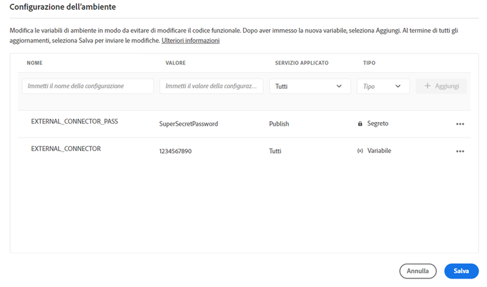
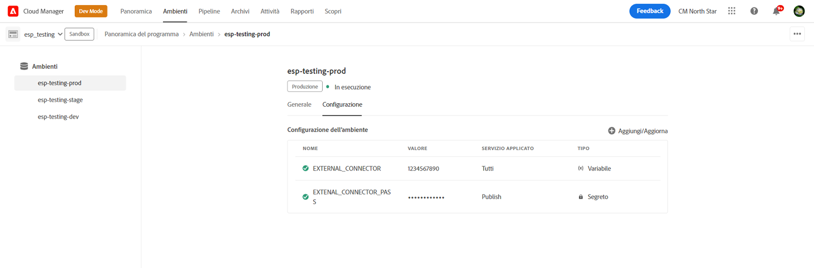

# Variabili di ambiente di Cloud Manager {#environment-variables}

È possibile configurare e gestire le variabili di ambiente standard tramite Cloud Manager. Vengono fornite all’ambiente di runtime e possono essere utilizzate nelle configurazioni OSGi. Le variabili di ambiente possono essere valori specifici dell’ambiente o segreti dell’ambiente, in base alle modifiche apportate.

## Panoramica {#overview}

Le variabili di ambiente offrono una serie di vantaggi per gli utenti di AEM as a Cloud Service:

* Consentono di modificare il comportamento del codice e dell’applicazione in base al contesto e all’ambiente. Ad esempio, possono essere utilizzate per abilitare diverse configurazioni nell’ambiente di sviluppo rispetto agli ambienti di produzione o di staging per evitare costosi errori.
* Devono essere configurate e impostate una sola volta e possono essere aggiornate ed eliminate secondo necessità.
* I valori delle variabili possono essere aggiornati in qualsiasi momento e avere effetto immediato senza la necessità di alcuna modifica o distribuzione del codice.
* Possono separare il codice dalla configurazione e rimuovere il necessario per includere informazioni sensibili nel controllo della versione.
* Migliorano la sicurezza dell’applicazione AEM as a Cloud Service poiché si trovano all’esterno del codice.

Tra i casi d’uso tipici per l’utilizzo delle variabili di ambiente vi sono:

* Collegamento dell’applicazione AEM a diversi endpoint esterni
* Utilizzo di un riferimento durante l’archiviazione delle password anziché direttamente nella base di codice
* Quando in un programma sono presenti più ambienti di sviluppo e alcune configurazioni differiscono tra i vari ambienti

## Aggiunta delle variabili di ambiente {#add-variables}

>[!NOTE]
>
>Per poter aggiungere o modificare le variabili di ambiente è necessario avere il ruolo [**Responsabile dell’implementazione**](/help/onboarding/cloud-manager-introduction.md#role-based-premissions).

1. Accedi a Adobe Cloud Manager all’indirizzo [my.cloudmanager.adobe.com](https://my.cloudmanager.adobe.com/).
1. Cloud Manager elenca i vari programmi disponibili. Seleziona il programma che desideri gestire.
1. Seleziona la scheda **Ambienti** per il programma scelto, quindi dal pannello di navigazione a sinistra seleziona l’ambiente per il quale desideri creare una variabile di ambiente.
1. Nel dettaglio dell’ambiente seleziona la scheda **Configurazione**, quindi seleziona **Aggiungi** per aprire la finestra di dialogo **Configurazione ambiente**.
   * Se stai aggiungendo una variabile di ambiente per la prima volta, viene visualizzato un pulsante **Aggiungi configurazione** al centro della pagina. Apri la finestra di dialogo **Configurazione ambiente** con questo pulsante o con **Aggiungi**.

   

1. Inserisci i dettagli della variabile.
   * **Nome**
   * **Valore**
   * **Servizio applicato**: definisce per quale servizio applicare la variabile (Author/Publish/Anteprima) o se applicarla a tutti i servizi
   * **Tipo**: definisce se la variabile è di tipo normale o segreto

   

1. Dopo aver inserito la nuova variabile, seleziona **Aggiungi** nell’ultima colonna della riga contenente la nuova variabile.
   * Per inserire più variabili alla volta, inserisci una nuova riga e seleziona **Aggiungi**.

   

1. Per salvare le variabili in modo permanente, seleziona **Salva**.

Nella parte superiore della tabella, a fianco della variabile appena aggiunta, viene visualizzato un indicatore con lo stato **Aggiornamento in corso** per indicare che l’ambiente è in fase di aggiornamento con la configurazione. Al termine dell’operazione, la nuova variabile di ambiente sarà visibile nella tabella.

>[!TIP]
>
>Per aggiungere più variabili, si consiglia di aggiungere la prima variabile e quindi di utilizzare il pulsante **Aggiungi** nella finestra di dialogo **Configurazione ambiente** per aggiungere altre variabili. In questo modo è possibile aggiungerle all’ambiente con un unico aggiornamento.

## Aggiornamento delle variabili di ambiente {#update-variables}

Dopo aver creato le variabili di ambiente, è possibile aggiornarle con il pulsante **Aggiungi/aggiorna** per aprire la finestra di dialogo **Configurazione ambiente**.

1. Accedi a Adobe Cloud Manager all’indirizzo [my.cloudmanager.adobe.com](https://my.cloudmanager.adobe.com/).
1. Cloud Manager elenca i vari programmi disponibili. Seleziona il programma che desideri gestire.
1. Seleziona la scheda **Ambienti** per il programma scelto, quindi dal pannello di navigazione a sinistra seleziona l’ambiente per il quale desideri creare una variabile di ambiente.
1. Nel dettaglio dell’ambiente seleziona la scheda **Configurazione**, quindi seleziona **Aggiungi/aggiorna** in alto a destra per aprire la finestra di dialogo **Configurazione ambiente**.

   

1. Dal pulsante con i puntini di sospensione nell’ultima colonna della riga della variabile che desideri modificare, seleziona **Modifica** o **Elimina**.

   

1. Modifica la variabile di ambiente in base alle tue esigenze.
   * Durante la modifica, il pulsante con i puntini di sospensione si modifica diventando il pulsante Opzioni per ripristinare il valore originale o confermare la modifica.
   * Durante la modifica dei segreti, i valori possono essere solo aggiornati e non visualizzati.

   

1. Dopo aver apportato tutte le modifiche di configurazione richieste, seleziona **Salva**.

[Come per l’aggiunta delle variabili,](#add-variables) a fianco delle variabili appena aggiornate viene visualizzato un indicatore con lo stato **Aggiornamento in corso** per indicare che è in corso l’aggiornamento dell’ambiente con la configurazione. Al termine dell’operazione, le variabili di ambiente aggiornate saranno visibili nella tabella.

>[!TIP]
>
>Se desideri aggiornare più variabili, ti consigliamo di utilizzare la finestra di dialogo **Configurazione ambiente** per aggiornare tutte le variabili necessarie contemporaneamente prima di selezionare o fare clic su **Salva**. In questo modo è possibile aggiungerle all’ambiente con un unico aggiornamento.

## Utilizzo delle variabili di ambiente {#using}

Le variabili di ambiente possono aumentare sicurezza e flessibilità delle configurazioni `pom.xml`. Ad esempio, non è necessario che le password siano hardcoded e la configurazione può essere adattata in base ai valori contenuti nelle variabili di ambiente.

Puoi accedere alle variabili di ambiente e dei segreti tramite XML come indicato di seguito.

* `${env.VARIABLE_NAME}`

Per un esempio su come utilizzare entrambi i tipi di variabili in un file `pom.xml`, consulta il documento [Configurazione del progetto](/help/implementing/cloud-manager/getting-access-to-aem-in-cloud/setting-up-project.md#password-protected-maven-repository-support-password-protected-maven-repositories).

Per ulteriori informazioni, consulta la [documentazione Maven ufficiale](https://maven.apache.org/settings.html#quick-overview).

## Disponibilità di variabili di ambiente {#availability}

Le variabili di ambiente possono essere utilizzate in diverse posizioni.

### Authoring, Anteprima e Pubblicazione {#author-preview-publish}

Negli ambienti di authoring, anteprima e pubblicazione è possibile utilizzare sia le normali variabili di ambiente che i segreti.

### Dispatcher {#dispatcher}

Solo le variabili di ambiente normali possono essere utilizzate dal [Dispatcher.](https://experienceleague.adobe.com/docs/experience-manager-dispatcher/using/dispatcher.html?lang=it) I segreti non possono essere utilizzati.

Tuttavia, le variabili di ambiente non possono essere utilizzate nelle direttive `IfDefine`.

>[!TIP]
>
>È necessario convalidare l’utilizzo di variabili di ambiente con il [Dispatcher localmente](https://experienceleague.adobe.com/docs/experience-manager-learn/cloud-service/local-development-environment-set-up/dispatcher-tools.html?lang=it) prima della distribuzione.

### Configurazioni OSGi {#osgi}

Le normali variabili di ambiente e i segreti possono essere utilizzati nelle [configurazioni OSGi.](/help/implementing/deploying/configuring-osgi.md)

### Variabili delle pipeline {#pipeline}

Oltre alle variabili di ambiente, sono presenti anche variabili di pipeline, che vengono esposte durante la fase di creazione. [Qui puoi trovare ulteriori informazioni sulle variabili della pipeline.](/help/implementing/cloud-manager/getting-access-to-aem-in-cloud/build-environment-details.md#pipeline-variables)
