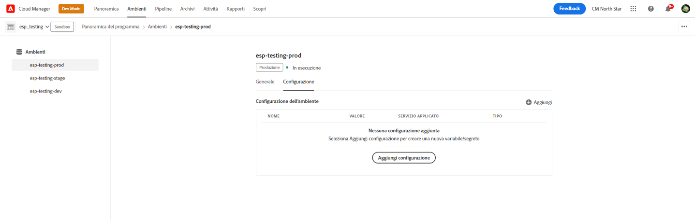
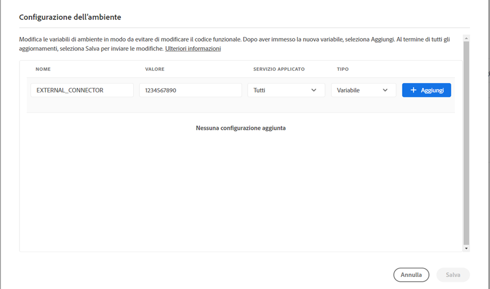
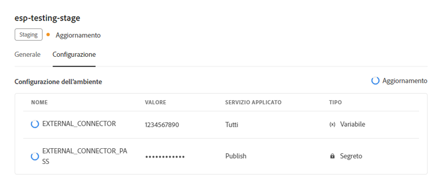
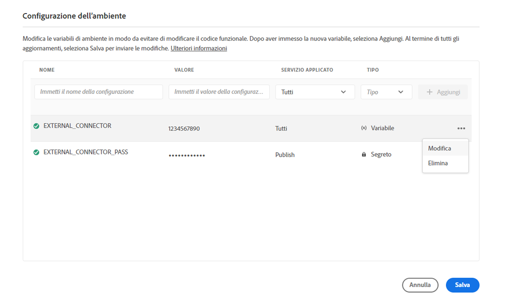
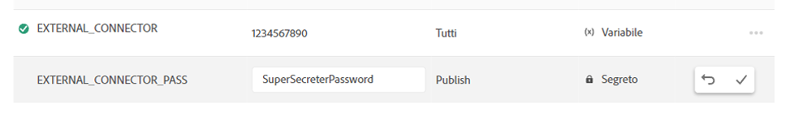

# Variabili di ambiente in Cloud Manager {#environment-variables}

È possibile configurare e gestire le variabili di ambiente standard tramite Cloud Manager. Vengono fornite all’ambiente di runtime e possono essere utilizzate nelle configurazioni OSGi.

Le variabili di ambiente possono essere valori specifici dell’ambiente o segreti dell’ambiente, in base alle modifiche apportate.

## Informazioni sulle variabili di ambiente {#overview}

Le variabili di ambiente offrono una serie di vantaggi per gli utenti di AEM as a Cloud Service, ad esempio:

* Consentono di modificare il comportamento del codice e dell’applicazione in base al contesto e all’ambiente. Ad esempio, possono essere utilizzati per abilitare diverse configurazioni nell’ambiente di sviluppo rispetto agli ambienti di produzione o di staging per evitare costosi errori.
* Devono essere configurate e impostate una sola volta e possono essere aggiornate ed eliminate secondo necessità.
* I valori delle variabili possono essere aggiornati in qualsiasi momento e avere effetto immediato senza la necessità di alcuna modifica o distribuzione del codice.
* Possono separare il codice dalla configurazione e rimuovere il necessario per includere informazioni sensibili nel controllo della versione.
* Migliorano la sicurezza dell’applicazione AEM as a Cloud Service poiché si trovano all’esterno del codice.

I casi d’uso tipici per l’utilizzo delle variabili di ambiente includono:

* Collegamento dell’applicazione AEM a diversi endpoint esterni
* Utilizzo di un riferimento durante l’archiviazione delle password anziché direttamente nella base di codice
* Quando in un programma sono presenti più ambienti di sviluppo e alcune configurazioni differiscono tra i vari ambienti

## Aggiungere una variabile di ambiente {#add-variables}

Se desideri aggiungere più variabili, Adobe consiglia di aggiungere la prima variabile e quindi di utilizzare l&#39;icona  **Aggiungi** nella finestra di dialogo **Configurazione ambiente** per aggiungere altre variabili. Questo metodo consente di aggiungerli all’ambiente con un solo aggiornamento.

Per aggiungere, aggiornare o eliminare variabili di ambiente, è necessario essere membri del ruolo [**Responsabile della distribuzione**](/help/onboarding/cloud-manager-introduction.md#role-based-premissions).

**Per aggiungere una variabile di ambiente:**

1. Accedi a Cloud Manager all’indirizzo [my.cloudmanager.adobe.com](https://my.cloudmanager.adobe.com/) e seleziona l’organizzazione appropriata.
1. Nella console **[Programmi](/help/implementing/cloud-manager/navigation.md#my-programs)** selezionare quello che si desidera gestire.
1. Dal menu laterale, fai clic su **Ambienti**.
1. Nella pagina **Ambienti** selezionare una riga della tabella contenente l&#39;ambiente per il quale si desidera aggiungere una variabile di ambiente.
1. Nella pagina dei dettagli dell&#39;ambiente fare clic sulla scheda **Configurazione**.
1. Fai clic su  **Aggiungi/Aggiorna**.
Se stai aggiungendo una variabile di ambiente per la prima volta, fai clic su **Aggiungi configurazione** al centro della pagina.

   

1. Nella finestra di dialogo **Configurazione ambiente**, immettere i dettagli nella prima riga della tabella.

   | Campo | Descrizione |
   | --- | --- |
   | Nome | Nome univoco della variabile di configurazione. Identifica la variabile specifica utilizzata nell’ambiente. Deve rispettare le seguenti convenzioni di denominazione:<ul><li>Le variabili possono contenere solo caratteri alfanumerici e il carattere di sottolineatura (`_`).</li><li>Esiste un limite di 200 variabili per ambiente.</li><li>Ogni nome non può contenere più di 100 caratteri.</li></ul> |
   | Valore | Valore contenuto nella variabile. |
   | Passaggio applicato | Seleziona il servizio a cui si applica la variabile. Selezionare **Tutti** per applicare la variabile a tutti i servizi.<ul><li>**Tutti**</li><li>**Authoring**</li><li>**Pubblica**</li><li>**Anteprima**</li></ul> |
   | Tipo | Seleziona se la variabile è normale o segreta. |

   

1. Fai clic sull&#39;icona **Aggiungi**.

   Aggiungi ulteriori variabili in base alle esigenze.

1. Fai clic su **Salva**.

   Nell&#39;angolo superiore destro della tabella viene visualizzato un rotatore con stato **Aggiornamento**. A sinistra delle variabili appena aggiunte viene visualizzato anche un rotatore. Questi stati indicano che l’ambiente è in fase di aggiornamento con la configurazione. Al termine dell’operazione, la nuova variabile di ambiente è visibile nella tabella.

## Aggiornare una variabile di ambiente {#update-variables}

Dopo aver creato le variabili di ambiente, è possibile aggiornarle utilizzando  **Aggiungi/Aggiorna** per aprire la finestra di dialogo **Configurazione ambiente**.

Se si desidera aggiornare più variabili, Adobe consiglia di utilizzare la finestra di dialogo **Configurazione ambiente** per aggiornare tutte le variabili necessarie contemporaneamente prima di fare clic su **Salva**. In questo modo è possibile aggiungerle all’ambiente con un unico aggiornamento.

**Per aggiornare una variabile di ambiente:**

1. Accedi a Cloud Manager all’indirizzo [my.cloudmanager.adobe.com](https://my.cloudmanager.adobe.com/) e seleziona l’organizzazione appropriata.
1. Nella console **[Programmi](/help/implementing/cloud-manager/navigation.md#my-programs)** selezionare quello che si desidera gestire.
1. Dal menu laterale, fai clic su **Ambienti**.
1. Nella pagina **Ambienti** selezionare una riga della tabella contenente l&#39;ambiente per il quale si desidera aggiornare una variabile.
1. Nella pagina dei dettagli dell&#39;ambiente fare clic sulla scheda **Configurazione**.
1. Fai clic su  **Aggiungi/Aggiorna**.
1. Nella finestra di dialogo **Configurazione ambiente**, fai clic su  nell&#39;ultima colonna della riga della variabile che desideri modificare.
1. Nel menu a discesa, fare clic su **Modifica**.

   

1. Se necessario, aggiorna il valore della variabile di ambiente.
Quando si modifica un segreto, il valore può essere solo aggiornato e non visualizzato.

   

1. Effettua una delle seguenti operazioni:

   * Fai clic su  per applicare la modifica.
   * Fai clic sull&#39;icona  per annullare la modifica.

1. Fai clic su **Salva**.

   Nell&#39;angolo superiore destro della tabella viene visualizzato un rotatore con stato **Aggiornamento**. A sinistra di qualsiasi variabile aggiornata viene visualizzato anche un rotatore. Questi stati indicano che l’ambiente è in fase di aggiornamento con la configurazione. Al termine, la variabile di ambiente aggiornata è visibile nella tabella.

## Eliminare una variabile di ambiente {#delete-env-variable}

1. Accedi a Cloud Manager all’indirizzo [my.cloudmanager.adobe.com](https://my.cloudmanager.adobe.com/) e seleziona l’organizzazione appropriata.
1. Nella console **[Programmi](/help/implementing/cloud-manager/navigation.md#my-programs)** selezionare quello che si desidera gestire.
1. Dal menu laterale, fai clic su **Ambienti**.
1. Nella pagina **Ambienti** selezionare una riga della tabella contenente l&#39;ambiente per il quale si desidera aggiornare una variabile.
1. Nella pagina dei dettagli dell&#39;ambiente fare clic sulla scheda **Configurazione**.
1. Fai clic su  **Aggiungi/Aggiorna**.
1. Nella finestra di dialogo **Configurazione ambiente**, fai clic su  nell&#39;ultima colonna della riga della variabile che desideri modificare.
1. Nel menu a discesa, fare clic su **Elimina** per rimuovere immediatamente la variabile.
1. Fai clic su **Salva**.

## Utilizzo delle variabili di ambiente {#using}

Le variabili di ambiente possono aumentare sicurezza e flessibilità delle configurazioni `pom.xml`. Ad esempio, non è necessario che le password siano hardcoded e la configurazione può essere adattata in base ai valori contenuti nelle variabili di ambiente.

Puoi accedere alle variabili di ambiente e ai segreti tramite XML nel modo seguente:

`${env.VARIABLE_NAME}`

Per un esempio di utilizzo di entrambi i tipi di variabili in un file [, vedere &#x200B;](/help/implementing/cloud-manager/getting-access-to-aem-in-cloud/setting-up-project.md#password-protected-maven-repository-support-password-protected-maven-repositories)Configurazione del progetto`pom.xml`.

Per ulteriori informazioni, consulta anche la [documentazione Maven ufficiale](https://maven.apache.org/settings.html#quick-overview).

## Disponibilità delle variabili di ambiente {#availability}

Le variabili di ambiente possono essere utilizzate in diverse posizioni, come segue:

| Dove è possibile utilizzare le variabili di ambiente | Descrizione |
| --- | --- |
| Authoring, Anteprima e Pubblicazione | Negli ambienti di authoring, anteprima e pubblicazione è possibile utilizzare sia le normali variabili di ambiente che i segreti. |
| Dispatcher | Solo le normali variabili di ambiente possono essere utilizzate con [Dispatcher](https://experienceleague.adobe.com/it/docs/experience-manager-dispatcher/using/dispatcher).<ul><li>I segreti non possono essere utilizzati.</li><li>Le variabili di ambiente non possono essere utilizzate in `IfDefine` direttive.</li><li>Convalida l’utilizzo di variabili di ambiente con il [Dispatcher localmente](https://experienceleague.adobe.com/it/docs/experience-manager-learn/cloud-service/local-development-environment-set-up/dispatcher-tools) prima della distribuzione.</li></ul> |
| Configurazioni OSGi | Sia le normali variabili di ambiente che i segreti possono essere utilizzati nelle [configurazioni OSGi](/help/implementing/deploying/configuring-osgi.md). |
| Variabili delle pipeline | Oltre alle variabili di ambiente, sono presenti anche variabili di pipeline, che vengono esposte durante la fase di creazione. Ulteriori informazioni sulle variabili della pipeline in [Ambiente di compilazione](/help/implementing/cloud-manager/getting-access-to-aem-in-cloud/build-environment-details.md#pipeline-variables). |

