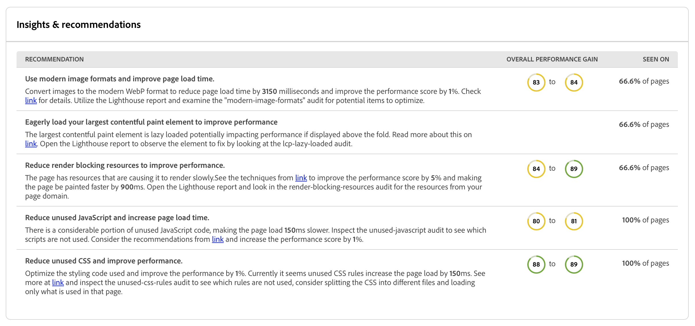

# Dashboard di audit dell’esperienza {#experience-audit-dashboard}

Scopri in che modo l’audit dell’esperienza convalida il processo di distribuzione e garantisce che le modifiche implementate soddisfino gli standard di base in termini di prestazioni, accessibilità, best practice e SEO tramite un’interfaccia dashboard chiara e informativa.

>[!NOTE]
>
>Questa funzione è disponibile solo per [il programma di adozione anticipata.](/help/implementing/cloud-manager/release-notes/current.md#early-adoption)
>
>Per informazioni dettagliate sulla funzione Audit dell’esperienza esistente per AEM as a Cloud Service, consulta [Test di Experience Audit](/help/implementing/cloud-manager/experience-audit-testing.md).

## Panoramica {#overview}

L’audit dell’esperienza è una funzione disponibile nelle pipeline di produzione di Cloud Manager Sites atta a convalidare il processo di distribuzione e garantire che le modifiche implementate:

1. soddisfino gli standard di base per prestazioni, accessibilità, best practice, SEO (Search Engine Optimization) e PWA (app web progressiva);

1. non introducano regressioni.

L’audit dell’esperienza in Cloud Manager assicura che l’esperienza dell’utente sul sito sia degli standard più elevati.

I risultati dell’audit sono informativi e consentono agli utenti con ruolo Responsabile dell’implementazione di visualizzare i punteggi e cosa è cambiato tra i punteggi correnti e precedenti. Questa informazione è utile per determinare l’eventuale introduzione di una regressione con la distribuzione corrente.

Audit dell’esperienza è basato su [Google Lighthouse](https://developer.chrome.com/docs/lighthouse/overview/), strumento open source di Google abilitato in tutte le pipeline di produzione di Cloud Manager.

>[!TIP]
>
>Puoi configurare le pagine incluse nell’audit dell’esperienza quando [configuri la pipeline](/help/implementing/cloud-manager/configuring-pipelines/configuring-production-pipelines.md#full-stack-code).

## Dashboard di audit dell’esperienza {#dashboard}

I risultati dell’audit dell’esperienza sono presentati nel **Test dello staging** fase della pipeline di produzione tramite [pagina di esecuzione della pipeline di produzione](/help/implementing/cloud-manager/deploy-code.md).

L’audit dell’esperienza fornisce risultati di test aggregati e dettagliati a livello di pagina, riepilogati in quattro schede:

* **[Approfondimenti](#insights)** fornisci una breve descrizione dei consigli utilizzabili per migliorare le prestazioni del sito.
* **[Punteggi faro](#lighthouse)** sono un riepilogo dei punteggi di Lighthouse per il codice distribuito in questa esecuzione della pipeline.
* **[Pagine](#pages)** è un riepilogo delle prestazioni delle pagine configurate specificamente per l’analisi.
* **[Problemi](#issues)** riepiloga eventuali problemi di prestazioni rilevati nel codice di questa esecuzione della pipeline.

### Approfondimenti {#insights}

Il **Approfondimenti** fornisce una breve descrizione dei consigli utilizzabili per migliorare le prestazioni del sito.

Seleziona la **Mostra altro** per aprire la dashboard completa.

In **Approfondimenti e raccomandazioni** Questa sezione contiene un elenco dettagliato di consigli actionable con un chiaro indicatore di valore legato ai guadagni prevedibili in termini di prestazioni, insieme alla percentuale di pagine interessate. Questo consente di assegnare facilmente la priorità a questi consigli per i team.

Per tornare alla pagina di esecuzione della pipeline di produzione, seleziona semplicemente la freccia indietro sul browser.

### Punteggi faro {#lighthouse}

Il **Punteggi faro** La scheda è un riepilogo dei punteggi di Lighthouse per il codice distribuito in questa esecuzione della pipeline.

Seleziona la **Mostra altro** per aprire la dashboard completa.

In **Punteggi faro** sezione, si trova una visualizzazione delle tendenze dei vari punteggi. Seleziona **Prestazioni**, **Accessibilità**, **PWA**, o **SEO** per visualizzare la visualizzazione con tendenze mensili per tali valori.

Ogni punto del grafico rappresenta la media di tutte le distribuzioni nel mese di interesse.

Per tornare alla pagina di esecuzione della pipeline di produzione, seleziona semplicemente la freccia indietro sul browser.

### Pagine {#pages}

Il **Pagine** La scheda è un riepilogo delle prestazioni delle pagine configurate specificamente per l’analisi.

Seleziona la **Mostra altro** per aprire la dashboard completa.

Il **Pagine** Questa sezione fornisce un elenco delle pagine testate, con i punteggi di prestazioni di Lighthouse più recenti e il raggruppamento.

Puoi configurare le pagine incluse nell’audit dell’esperienza quando [configuri la pipeline](/help/implementing/cloud-manager/configuring-pipelines/configuring-production-pipelines.md#full-stack-code).

Per tornare alla pagina di esecuzione della pipeline di produzione, seleziona semplicemente la freccia indietro sul browser.

### Edizioni {#issues}

Il **Problemi** la scheda riepiloga eventuali problemi di prestazioni rilevati nel codice di questa esecuzione della pipeline.

Seleziona la **Mostra altro** per aprire la dashboard completa.

In **Approfondimenti e raccomandazioni** Questa sezione contiene un elenco più dettagliato dei consigli actionable con un chiaro indicatore di valore legato ai guadagni prevedibili in termini di prestazioni, insieme alla percentuale di pagine interessate. Questo consente di assegnare facilmente la priorità a questi consigli per i team.

Per tornare alla pagina di esecuzione della pipeline di produzione, seleziona semplicemente la freccia indietro sul browser.

### Dettagli pagina {#page-detail}

Se selezioni il collegamento di una pagina in una delle schede di **Audit dell’esperienza** nella scheda della pagina di esecuzione della pipeline o nella **Pagine** sezione del dashboard completo di Audit dell’esperienza, puoi visualizzare i dettagli di una pagina particolare.

Puoi visualizzare il punteggio ottenuto dalle singole pagine per il test specifico e i cambiamenti rispetto all’esecuzione del test precedente.

Facendo clic sui dettagli di una pagina, puoi accedere alle informazioni sugli elementi valutati e a indicazioni per risolvere i problemi in caso vengano rilevate opportunità di miglioramento.

Per tornare alla pagina di esecuzione della pipeline di produzione, seleziona semplicemente la freccia indietro sul browser.
