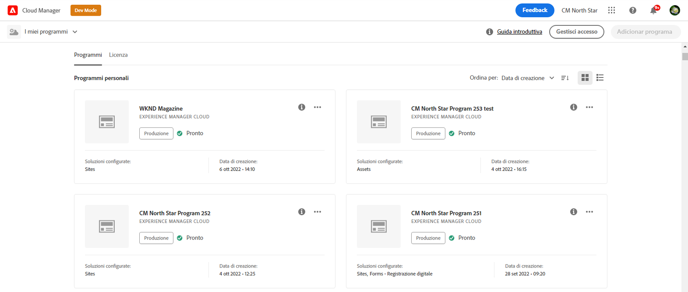
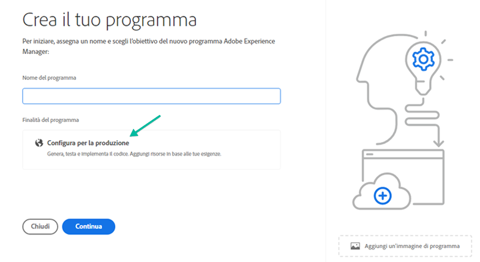

# Creazione di un programma di produzione {#create-production-program}

Un programma *Produzione* è destinato a un utente che ha dimestichezza con AEM e Cloud Manager ed è pronto per iniziare a scrivere, creare e testare il codice allo scopo di distribuirlo in Produzione.

Guarda i video tutorial in due parti per scoprire come creare un programma in Cloud Manager:

>[!VIDEO](https://video.tv.adobe.com/v/334953)

>[!VIDEO](https://video.tv.adobe.com/v/334954)

Inoltre,

Segui i passaggi seguenti per creare un programma di produzione:

1. Avvia la pagina di destinazione di Cloud Manager e fai clic su **Aggiungi programma** dall’angolo in alto a destra dello schermo.

   

1. Seleziona **Imposta per produzione** nella procedura guidata Crea programma per creare un programma di produzione. L&#39;utente può accettare il nome del programma predefinito o modificarlo prima di selezionare **Crea**.

   

1. L&#39;utente selezionerà le soluzioni da includere nel programma nella schermata che verrà presentata dopo la schermata precedente. Dopo aver selezionato la soluzione o le soluzioni richieste, fai clic su **Crea**.

   

   Inoltre, puoi selezionare l&#39;opzione del componente aggiuntivo **Commerce** in **Sites**, come illustrato nella figura seguente, e fare clic su **Crea**.

   

1. Una volta visualizzata la scheda del programma nella pagina di destinazione, seleziona la cartella **...** per visualizzare le opzioni di menu disponibili. Seleziona **Cloud Manager**, come illustrato nella figura seguente, per passare alla pagina **Panoramica** di Cloud Manager.

   

1. La scheda di chiamata all’azione principale guiderà l’utente a creare un ambiente, creare una pipeline non di produzione e, infine, una pipeline di produzione.
   

   >[!NOTE]
   >Un programma di produzione non dispone della funzione **Configurazione automatica**.
