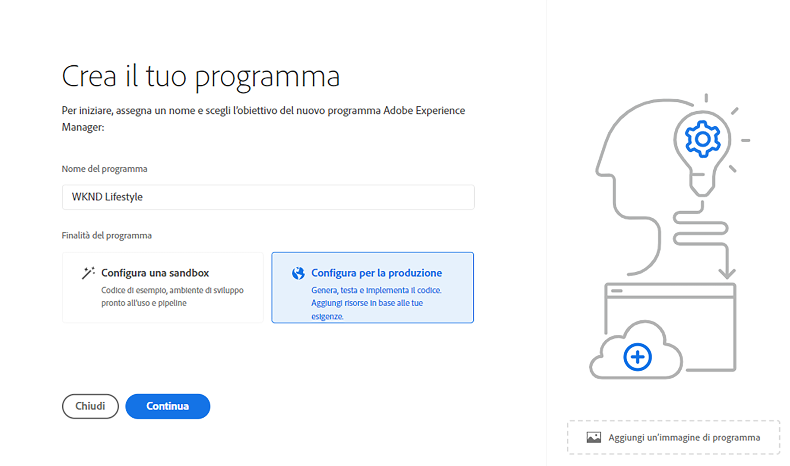
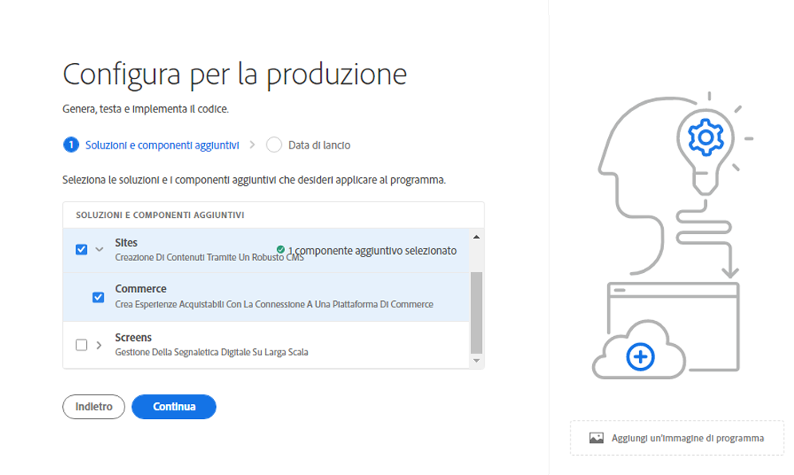
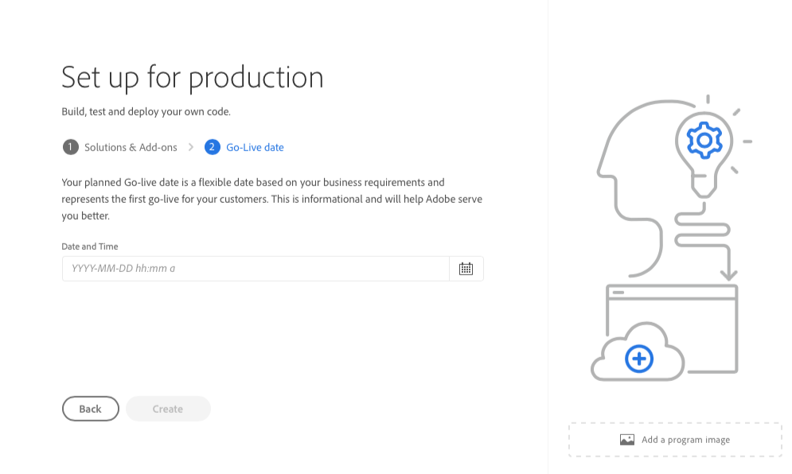
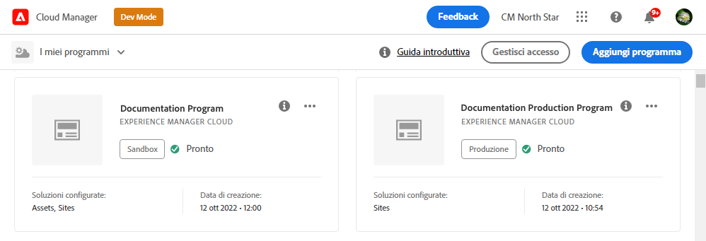
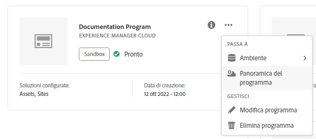
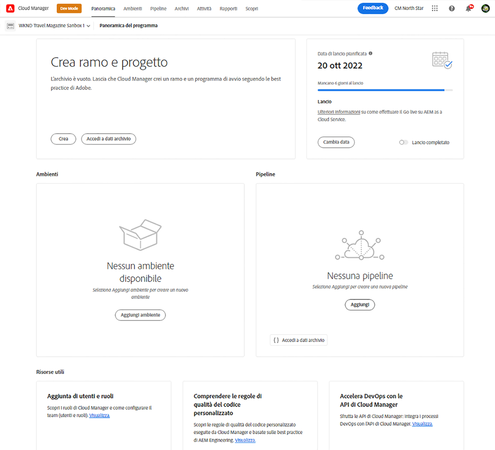

# Creare programmi di produzione {#create-production-program}

Un programma di produzione è per gli utenti che hanno familiarità con Adobe Experience Manager (AEM) e Cloud Manager, pronti per scrivere, generare e testare il codice, con l’obiettivo di distribuirlo per gestire il traffico in tempo reale.

Ulteriori informazioni sui tipi di programmi nel documento [Informazioni su programmi e tipi di programmi](program-types.md).

## Creare un programma di produzione {#create}

A seconda dei diritti dell’organizzazione, è possibile che durante l’aggiunta del programma vengano visualizzate opzioni aggiuntive relative al programma di produzione.
Consulta [Altre opzioni del programma di produzione](#options).

**Per creare un programma di produzione:**

1. Accedi a Cloud Manager all’indirizzo [my.cloudmanager.adobe.com](https://my.cloudmanager.adobe.com/) e seleziona l’organizzazione appropriata.

1. Nella console **[Programmi](/help/implementing/cloud-manager/navigation.md#my-programs)**, nell&#39;angolo superiore destro, fare clic su **Aggiungi programma**.

   

1. Nella procedura guidata *Crea il programma*, nel campo di testo **Nome programma**, digita il nome desiderato per il programma.

1. In **Obiettivo programma**, seleziona **Imposta per la produzione**.

   

1. (Facoltativo) Nell&#39;angolo inferiore destro della finestra di dialogo della procedura guidata, effettuate una delle seguenti operazioni:

   * Trascina e rilascia un file di immagine sull&#39; **Aggiungi un&#39;immagine del programma** di destinazione.
   * Fai clic sull&#39; **Aggiungi un&#39;immagine del programma**, quindi seleziona un&#39;immagine da un browser di file.
   * Fai clic su  per rimuovere un&#39;immagine aggiunta.

1. Fai clic su **Continua**.

1. Nella casella di riepilogo **Soluzioni e componenti aggiuntivi** selezionare una o più soluzioni da includere nel programma.

   * Se non sai per certo se ti servono uno o più programmi per le varie soluzioni disponibili, seleziona quella che più ti interessa. Potrai attivare altre soluzioni in un secondo tempo [modificando il programma](/help/implementing/cloud-manager/getting-access-to-aem-in-cloud/editing-programs.md). Per ulteriori consigli sulla configurazione del programma, consulta [Introduzione ai programmi di produzione](/help/implementing/cloud-manager/getting-access-to-aem-in-cloud/introduction-production-programs.md).
   * È necessario selezionare almeno una soluzione per la creazione del programma. Ad esempio, puoi scegliere di selezionare **Edge Delivery Services** per una soluzione CDN completamente gestita che ottimizza le esperienze digitali. Consulta [Informazioni sull&#39;utilizzo di Edge Delivery Services per consegnare il tuo progetto Cloud Manager](/help/implementing/cloud-manager/edge-delivery/introduction-to-edge-delivery-services.md)

   

   <!-- * If you selected the **[Enable Enhanced Security](#security)** option, you can select only as many solutions for which HIPAA entitlements are available. -->

   * Fai clic sull&#39;icona  a sinistra del nome di una soluzione per visualizzare eventuali componenti aggiuntivi facoltativi. <!-- such as the **Commerce** add-on option under **Sites**. -->

   

1. Dopo aver selezionato le soluzioni e i componenti aggiuntivi, fare clic su **Continua**.

1. Nella scheda **Data di pubblicazione**, inserisci la data in cui intendi avviare il programma di produzione.

   

   * Puoi modificare questa data in qualsiasi momento.
   * La data ha scopo informativo e attiva il widget di pubblicazione nella pagina [**Panoramica del programma**](/help/implementing/cloud-manager/getting-access-to-aem-in-cloud/editing-programs.md#program-overview). Questa funzionalità fornisce collegamenti tempestivi alle best practice di AEM as a Cloud Service per supportare un’esperienza di pubblicazione fluida.

1. Fai clic su **Crea**. Cloud Manager crea il programma e lo visualizza nella pagina di destinazione per la selezione.

   

## Opzioni aggiuntive del programma di produzione {#options}

A seconda dei diritti disponibili per l’organizzazione, è possibile che siano disponibili le seguenti opzioni aggiuntive al momento della creazione di un programma di produzione.

### Protezione {#security}

Se si dispone dei diritti necessari, la scheda **Protezione** verrà visualizzata come prima scheda nella finestra di dialogo **`Set up for production`**.

La scheda **Sicurezza** fornisce le opzioni per attivare **HIPAA** o **Protezione WAF-DDOS** o entrambi per il programma di produzione.

Conformità HIPAA di Adobe e WAF-DDOS (Web Application Firewall - Distributed Denial of Service) facilitano la sicurezza basata sul cloud come parte di un approccio multilivello per la protezione contro le vulnerabilità.

* **HIPAA** - Questa opzione abilita l&#39;implementazione della soluzione compatibile con HIPAA di Adobe.
   * [Ulteriori informazioni](https://www.adobe.com/trust/compliance/hipaa-ready.html) sull’implementazione della soluzione compatibile HIPAA di Adobe.
   * Impossibile abilitare o disabilitare HIPAA dopo la creazione del programma.
* **Protezione WAF-DDOS** - Questa opzione abilita il firewall dell&#39;applicazione Web tramite regole per la protezione dell&#39;applicazione.
   * Una volta attivata, la protezione WAF-DDOS può quindi essere configurata impostando una [pipeline non di produzione](/help/implementing/cloud-manager/configuring-pipelines/configuring-non-production-pipelines.md).
   * Consulta [Regole filtro traffico, incluse le regole di WAF](/help/security/traffic-filter-rules-including-waf.md) per scoprire come gestire le regole filtro traffico nel tuo archivio in modo che vengano distribuite correttamente.

### SLA {#sla}

Se si dispone dei diritti necessari, la scheda **SLA** verrà visualizzata come seconda o terza scheda nella finestra di dialogo **`Set up for production`**.

Sites e Forms offrono un service level agreement (SLA) standard al 99,9%. L&#39;opzione **99,99% di Service level agreement** garantisce un tempo di attività minimo del 99,99% per gli ambienti di produzione, sia per Sites che per Forms, Edge Delivery Services o per tutti e tre.

Il 99,99% di SLA offre vantaggi quali maggiore disponibilità e latenza ridotta.

Per i programmi Sites e Forms, il SLA al 99,99% richiede un [area di pubblicazione aggiuntiva](/help/implementing/cloud-manager/manage-environments.md#multiple-regions) da applicare all&#39;ambiente di produzione nel programma. Quando sono soddisfatti i [requisiti](#sla-requirements) per abilitare SLA al 99,99%, è necessario eseguire una [pipeline full stack](/help/implementing/cloud-manager/configuring-pipelines/configuring-production-pipelines.md) per attivarla.

Per Edge Delivery Services, è necessario *no* oltre alla configurazione della licenza SLA al 99,99% nel programma.

#### Requisiti per SLA al 99,99% {#sla-requirements}

Oltre alle adesioni richieste, l&#39;utilizzo del 99,99% di SLA per Sites o Forms include i seguenti requisiti aggiuntivi:

* Quando applichi al programma il 99,99% di SLA, l’organizzazione deve disporre del 99,99% di SLA e di altre autorizzazioni per area geografica di pubblicazione.
* Cloud Manager verifica che sia disponibile un diritto di [area di pubblicazione aggiuntiva](/help/implementing/cloud-manager/manage-environments.md#multiple-regions) inutilizzato prima di applicare SLA al programma al 99,99%.
* Durante la modifica di un programma, se contiene già un ambiente di produzione con almeno un’area di pubblicazione aggiuntiva, Cloud Manager controlla solo la disponibilità di un diritto SLA del 99,99%.
* Per attivare il 99,99% di SLA e il reporting, è necessario che sia stato creato l&#39;[ambiente di produzione/staging](/help/implementing/cloud-manager/manage-environments.md#adding-environments) e che sia stata applicata almeno un&#39;area di pubblicazione aggiuntiva all&#39;ambiente di produzione/staging.
   * Se utilizzi la [rete avanzata](/help/security/configuring-advanced-networking.md), assicurati di controllare nel documento [Aggiunta di più aree di pubblicazione a un nuovo ambiente](/help/implementing/cloud-manager/manage-environments.md#adding-regions) che non siano presenti consigli in modo da mantenere la connettività in caso di errore regionale.
* Il programma SLA al 99,99% deve sempre includere almeno un&#39;area geografica di pubblicazione aggiuntiva. Gli utenti non possono eliminare l’ultima area di pubblicazione aggiuntiva rimanente dal programma.
* Il 99,99% di SLA è supportato per i programmi di produzione in cui è abilitata la soluzione Sites o Forms.
* Esegui una [pipeline full stack](/help/implementing/cloud-manager/configuring-pipelines/configuring-production-pipelines.md) per attivare o, quando modifichi un programma, disattivare il SLA al 99,99%.

## Accedere al programma {#accessing}

1. Quando visualizzi la scheda del programma nella pagina di destinazione, fai clic sull&#39;icona  per visualizzare le opzioni di menu disponibili.

   

1. Per accedere alla pagina **Panoramica** di Cloud Manager, seleziona **Panoramica del programma**.

1. La scheda call-to-action principale nella pagina della panoramica ti guida attraverso la creazione di un ambiente, una pipeline non di produzione e infine una pipeline di produzione.

   

>[!TIP]
>
>Consulta [Navigare nell&#39;interfaccia utente di Cloud Manager](/help/implementing/cloud-manager/navigation.md) per informazioni su come esplorare Cloud Manager e comprendere la console **Programmi**.

>[!NOTE]
>
>A differenza di un [programma sandbox](introduction-sandbox-programs.md#auto-creation), un programma di produzione richiede che l&#39;utente con il ruolo Cloud Manager appropriato crei il progetto e aggiunga un ambiente tramite l&#39;interfaccia utente self-service.

