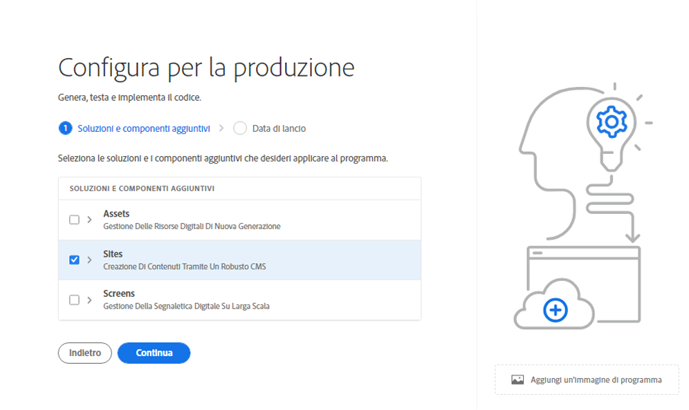
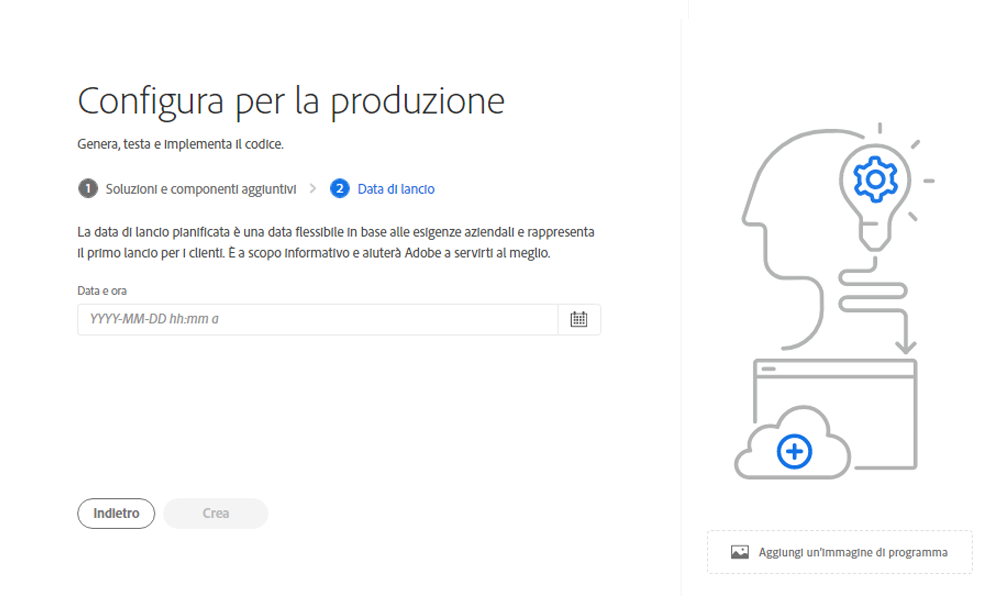
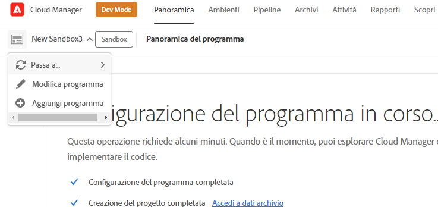

# Creazione di programmi di produzione {#create-production-program}

Un programma di produzione è destinato agli utenti che hanno familiarità con AEM e Cloud Manager e sono pronti per iniziare a scrivere, creare e testare il codice allo scopo di distribuirlo per ospitare il traffico in tempo reale.

Per ulteriori informazioni sui tipi di programmi, consulta il documento [Informazioni su programmi e tipi di programmi.](program-types.md)

## Video tutorial {#video-tutorials}

Guarda questi due video tutorial per scoprire come creare un programma in Cloud Manager o [segui le nostre istruzioni dettagliate.](#create)

>[!VIDEO](https://video.tv.adobe.com/v/334953)

>[!VIDEO](https://video.tv.adobe.com/v/334954)

## Creazione di un programma di produzione {#create}

Per creare un programma di produzione, segui la procedura riportata di seguito.

1. Accedi a Cloud Manager all’indirizzo [my.cloudmanager.adobe.com](https://my.cloudmanager.adobe.com/) e seleziona l’organizzazione appropriata.

1. Fai clic su **Aggiungi programma** dall’angolo superiore destro della schermata.

   

1. Per creare un programma di produzione, seleziona **Configurazione per la produzione** nella procedura guidata Crea programma.

   1. È possibile accettare il nome predefinito del programma o modificarlo.
   1. Facoltativamente, puoi trascinare e rilasciare un’immagine in miniatura per identificare il programma.
   1. Tocca o fai clic su **Continua**.

   

1. Se disponi di diritti per la sicurezza migliorati, la scheda **Protezione avanzata** fornisce l’opzione per **Abilitare la protezione avanzata** per il programma di produzione. Se necessario, seleziona l’opzione per abilitare la protezione avanzata e tocca o fai clic su **Continua**.

   * Impossibile abilitare o disabilitare la protezione avanzata dopo la creazione del programma.
   * [Ulteriori informazioni](https://www.adobe.com/go/hipaa-ready_it) sull’implementazione della soluzione compatibile HIPAA di Adobe.

   

1. Dalla scheda **Soluzioni e componenti aggiuntivi**, seleziona le soluzioni da includere nel programma.

   * Se hai selezionato **Abilita protezione avanzata** in precedenza, potrai selezionare solo il numero di soluzioni per le quali sono disponibili adesioni HIPAA.

   

1. Per visualizzare i componenti aggiuntivi facoltativi, come l’opzione per il componente **Commerce** in **Sites**, fai clic sulla freccia che precede il nome della soluzione.

   

1. Dopo aver selezionato le soluzioni e i componenti aggiuntivi, fai clic su **Continua**.

1. Nella scheda **Data di pubblicazione**, inserisci la data di pubblicazione pianificata per il programma di produzione.

   

   * Questa data può essere modificata in qualsiasi momento.
   * Questa data è solo per uso informativo e attiva il widget di pubblicazione sulla pagina della panoramica del programma per fornire collegamenti rapidi alla documentazione sulle best practice di AEM as a Cloud Service, al fine di allinearsi con il percorso che culmina in un’esperienza di pubblicazione fluida e di successo.

1. Fai clic su **Crea**.

Il programma viene creato da Cloud Manager e visualizzato nella pagina di destinazione, disponibile per la selezione.

## Accesso al programma {#acessing}

1. Quando visualizzi la scheda del programma nella pagina di destinazione, seleziona il pulsante con i puntini di sospensione per visualizzare le opzioni di menu disponibili.

   

1. Per accedere alla pagina **Panoramica** di Cloud Manager, seleziona **Panoramica del programma**.

1. La principale scheda di invito all’azione nella pagina della panoramica ti guiderà attraverso la creazione di un ambiente, una pipeline non di produzione e infine una pipeline di produzione.

   

Se in qualsiasi momento è necessario passare a un altro programma o tornare alla pagina della panoramica per crearne uno nuovo, fai clic sul nome del programma nella parte superiore sinistra della schermata per visualizzare l’opzione **Accedi a**.

>[!NOTE]
>
>A differenza di un [programma sandbox](introduction-sandbox-programs.md#auto-creation), un programma di produzione richiede che l’utente con il ruolo di Cloud Manager appropriato crei il progetto e aggiunga un ambiente tramite l’interfaccia utente self-service.
