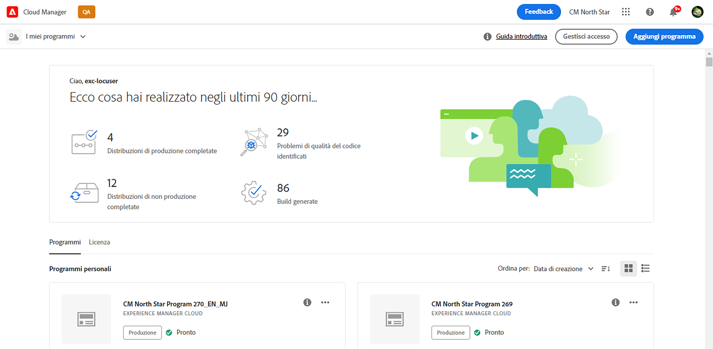
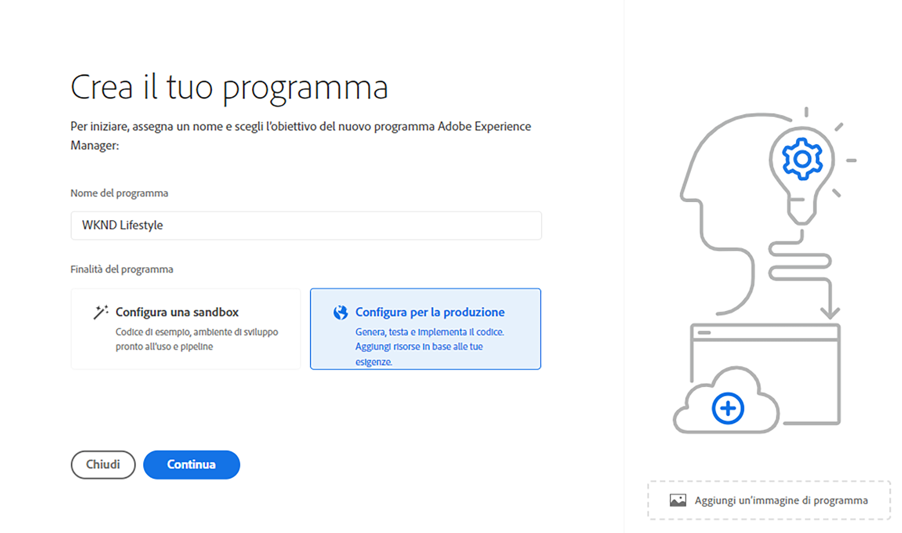
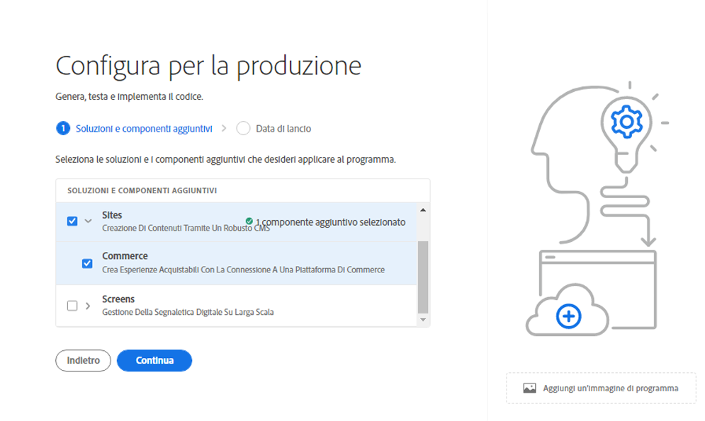
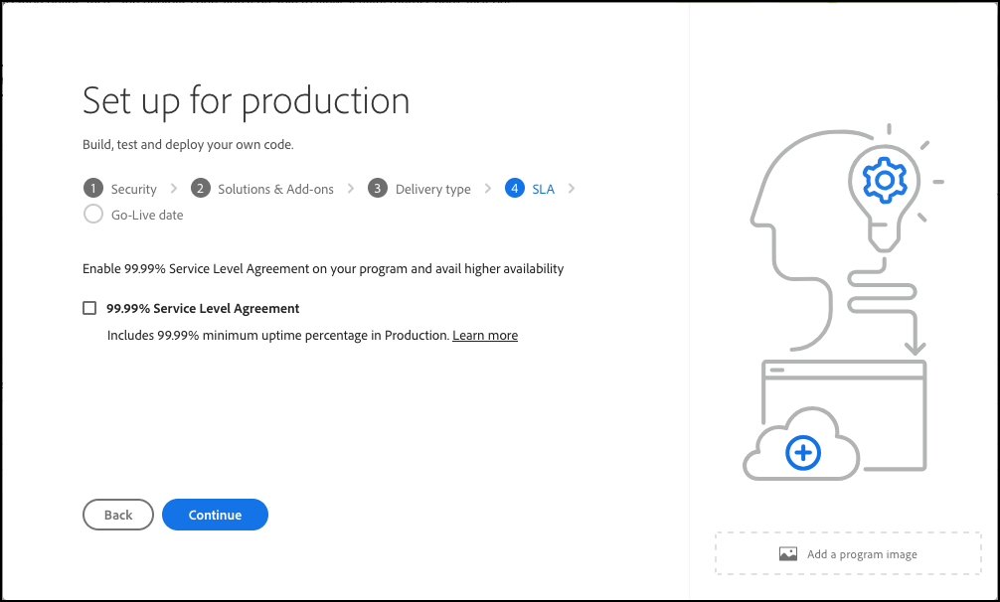
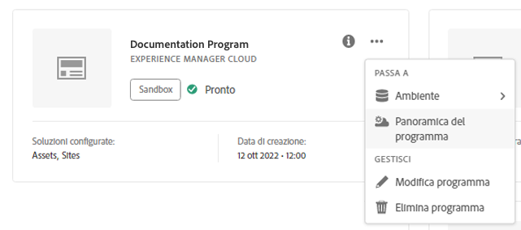
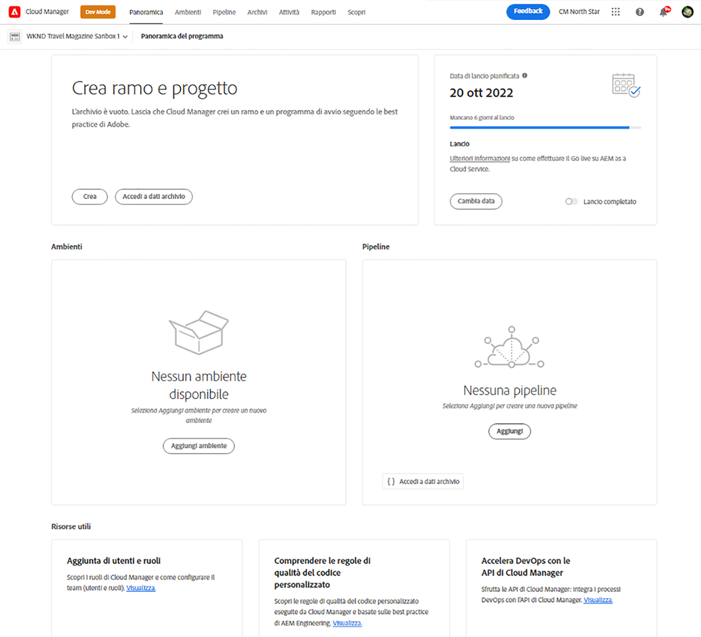

# Creare programmi di produzione {#create-production-program}

Un programma di produzione è per gli utenti che hanno familiarità con Adobe Experience Manager (AEM) e Cloud Manager, pronti per scrivere, generare e testare il codice, con l’obiettivo di distribuirlo per gestire il traffico in tempo reale.

Ulteriori informazioni sui tipi di programmi nel documento [Informazioni su programmi e tipi di programmi](program-types.md).

## Creare un programma di produzione {#create}

A seconda dei diritti dell’organizzazione, è possibile che durante l’aggiunta del programma vengano visualizzate opzioni aggiuntive relative al programma di produzione.
Consulta [Altre opzioni del programma di produzione](#options).

**Per creare un programma di produzione:**

1. Accedi a Cloud Manager all’indirizzo [my.cloudmanager.adobe.com](https://my.cloudmanager.adobe.com/) e seleziona l’organizzazione appropriata.

1. Nella console **[Programmi](/help/implementing/cloud-manager/navigation.md#my-programs)**, nell&#39;angolo superiore destro, fare clic su **Aggiungi programma**.

   

1. Nella procedura guidata *Crea il programma*, nel campo di testo **Nome programma**, digita il nome desiderato per il programma.

1. In **Obiettivo programma**, seleziona **Imposta per la produzione**.

   

1. (Facoltativo) Nell&#39;angolo inferiore destro della finestra di dialogo della procedura guidata, effettuate una delle seguenti operazioni:

   * Trascina e rilascia un file di immagine sull&#39; **Aggiungi un&#39;immagine del programma** di destinazione.
   * Fai clic sull&#39; **Aggiungi un&#39;immagine del programma**, quindi seleziona un&#39;immagine da un browser di file.
   * Fai clic su  per rimuovere un&#39;immagine aggiunta.

1. Fai clic su **Continua**.

1. Nella scheda **Protezione** selezionare le opzioni di protezione che si desidera utilizzare. Vedi [Sicurezza](#security).

   

1. Fai clic su **Continua**.

1. Nella casella di riepilogo **Soluzioni e componenti aggiuntivi** selezionare una o più soluzioni da includere nel programma.

   * Se non sai per certo se ti servono uno o più programmi per le varie soluzioni disponibili, seleziona quella che più ti interessa. Potrai attivare altre soluzioni in un secondo tempo [modificando il programma](/help/implementing/cloud-manager/getting-access-to-aem-in-cloud/editing-programs.md). Per ulteriori consigli sulla configurazione del programma, consulta [Introduzione ai programmi di produzione](/help/implementing/cloud-manager/getting-access-to-aem-in-cloud/introduction-production-programs.md).
   * È necessario selezionare almeno una soluzione per la creazione del programma. Ad esempio, puoi scegliere di selezionare **Edge Delivery Services** per una soluzione CDN completamente gestita che ottimizza le esperienze digitali. Consulta [Informazioni sull&#39;utilizzo di Edge Delivery Services per consegnare il tuo progetto Cloud Manager](/help/implementing/cloud-manager/edge-delivery/introduction-to-edge-delivery-services.md).

   * Fai clic sull&#39;icona  a sinistra del nome di una soluzione per visualizzare eventuali componenti aggiuntivi facoltativi. <!-- such as the **Commerce** add-on option under **Sites**. -->

<!--    -->

    >[!NOTE]
    >
    >Se il programma utilizza Edge Delivery Services per la consegna, potrebbe non essere necessario un livello di pubblicazione. Con la funzione livello di pubblicazione flessibile (Beta), puoi configurare se eseguire il provisioning di un livello di pubblicazione nella scheda Soluzioni e componenti aggiuntivi. Consulta [Livello di pubblicazione flessibile (Beta)](/help/implementing/cloud-manager/getting-access-to-aem-in-cloud/creating-production-programs.md#flexible-publish-tier).
    
    .[Seleziona soluzioni](/help/implementing/cloud-manager/getting-access-to-aem-in-cloud/assets/create-production-program-solutions.png)

1. Fai clic su **Continua**.

1. Nella scheda **Tipo di consegna**, tieni presente che è precompilato in base alle soluzioni e ai componenti aggiuntivi scelti nel passaggio precedente. Se selezioni **Pubblicazione AEM**, in seguito potrai eseguirne il provisioning su richiesta.

   

   <!-- * If you selected the **[Enable Enhanced Security](#security)** option, you can select only as many solutions for which HIPAA entitlements are available. -->

1. Fai clic su **Continua**.

1. Se si dispone dei diritti necessari, la scheda **SLA** verrà visualizzata come seconda o terza scheda nella finestra di dialogo **`Set up for production`**. Vedi [SLA](#sla).

   

   Sites e Forms offrono un service level agreement (SLA) standard al 99,9%.

1. Fai clic su **Continua**.

1. Nella scheda **Data di lancio**, inserisci la data pianificata per l&#39;avvio del programma di produzione.

   

   * Puoi modificare questa data in qualsiasi momento.
   * La data ha scopo informativo e attiva il widget di pubblicazione nella pagina [**Panoramica del programma**](/help/implementing/cloud-manager/getting-access-to-aem-in-cloud/editing-programs.md#program-overview). Questa funzionalità fornisce collegamenti tempestivi alle best practice di AEM as a Cloud Service per supportare un’esperienza di pubblicazione fluida.

1. Fai clic su **Crea**. Cloud Manager crea il programma e lo visualizza nella pagina di destinazione per la selezione.

   

## Opzioni aggiuntive del programma di produzione {#options}

A seconda dei diritti disponibili per l’organizzazione, è possibile che siano disponibili le seguenti opzioni aggiuntive al momento della creazione di un programma di produzione.

### Protezione {#security}

Se si dispone dei diritti necessari, la scheda **Protezione** verrà visualizzata come prima scheda nella finestra di dialogo **`Set up for production`**.

La scheda **Sicurezza** fornisce le opzioni per attivare **HIPAA** o **Protezione WAF-DDOS** o entrambi per il programma di produzione.

Conformità HIPAA di Adobe e WAF-DDOS (Web Application Firewall - Distributed Denial of Service) facilitano la sicurezza basata sul cloud come parte di un approccio multilivello per la protezione contro le vulnerabilità.

* **HIPAA** - Questa opzione abilita l&#39;implementazione della soluzione compatibile con HIPAA di Adobe.
   * Ulteriori informazioni sulla [preparazione HIPAA per Adobe Experience Manager as a Cloud Service](/help/compliance/hipaa/hipaa-readiness.md) e sull&#39;implementazione della soluzione compatibile con HIPAA di [Adobe](https://www.adobe.com/trust/compliance/hipaa-ready.html).
   * Impossibile abilitare o disabilitare HIPAA dopo la creazione del programma.
* **Protezione WAF-DDOS** - Questa opzione abilita il firewall dell&#39;applicazione Web tramite regole per la protezione dell&#39;applicazione.
   * Una volta attivata, la protezione WAF-DDOS può quindi essere configurata impostando una [pipeline non di produzione](/help/implementing/cloud-manager/configuring-pipelines/configuring-non-production-pipelines.md).
   * Consulta [Regole filtro traffico, incluse le regole di WAF](/help/security/traffic-filter-rules-including-waf.md) per scoprire come gestire le regole filtro traffico nel tuo archivio in modo che vengano distribuite correttamente.

### Livello di pubblicazione flessibile (Beta) {#flexible-publish-tier}

>[!NOTE]
>
>Il livello di pubblicazione flessibile descritto qui è in Beta. Per partecipare a Beta, invia un&#39;e-mail a [grp-beta_xwalk-publish_config@adobe.com](mailto:grp-beta_xwalk-publish_config@adobe.com) con il tuo ID organizzazione Adobe e l&#39;ID programma.

Se nell’organizzazione è abilitata la funzione livello di pubblicazione flessibile, puoi configurare se per gli ambienti del programma è necessario un livello di pubblicazione. Questa opzione viene visualizzata nella scheda **Tipo di consegna** della finestra di dialogo **Imposta per la produzione** (durante la [creazione del programma](/help/implementing/cloud-manager/getting-access-to-aem-in-cloud/creating-production-programs.md)).

Viene inoltre visualizzato nella finestra di dialogo **Modifica programma** (quando si [modifica un programma](/help/implementing/cloud-manager/getting-access-to-aem-in-cloud/editing-programs.md)).

Non tutte le architetture richiedono un livello di pubblicazione. La tabella seguente mostra quali architetture richiedono un livello di pubblicazione e quali no:

| Architettura | Livello di pubblicazione |
| --- | --- |
| AEM Sites tradizionale | Obbligatorio |
| Headless/API-first | Obbligatorio |
| Edge Delivery Services | Non obbligatorio |

Attivando il livello di pubblicazione solo quando necessario, i team possono effettuare le seguenti operazioni:

* Eseguire il provisioning degli ambienti più rapidamente.
* Semplificare l&#39;infrastruttura.
* Ridurre i componenti non necessari.

**Come funziona**
Quando la funzione del livello di pubblicazione flessibile è abilitata per la tua organizzazione:

* Per impostazione predefinita, per tutti i nuovi ambienti del programma viene eseguito il provisioning con il **solo livello di authoring**. Questo comportamento è confermato da un messaggio informativo visualizzato nell’interfaccia utente.
* Se l&#39;utente seleziona **AEM Publish** durante la creazione di un programma, il livello di pubblicazione viene attivato e viene eseguito il provisioning con *nuovi ambienti*.
* Il livello di pubblicazione può essere attivato anche in un secondo momento modificando il programma. Consulta [Modificare i programmi](/help/implementing/cloud-manager/getting-access-to-aem-in-cloud/editing-programs.md).

>[!NOTE]
>
>Se il programma utilizza Edge Delivery Services per la distribuzione dei contenuti e AEM Author per la creazione dei contenuti, non è necessario un livello di pubblicazione. Il contenuto viene distribuito tramite Edge Delivery e non passa attraverso il livello di pubblicazione di AEM. Consulta Informazioni su Edge Delivery Services con authoring AEM (Beta).

### SLA {#sla}

Se si dispone dei diritti necessari, la scheda **SLA** verrà visualizzata come seconda o terza scheda nella finestra di dialogo **`Set up for production`**.

Sites e Forms offrono un service level agreement (SLA) standard al 99,9%. L&#39;opzione **99,99% di Service level agreement** garantisce un tempo di attività minimo del 99,99% per gli ambienti di produzione, sia per Sites che per Forms, Edge Delivery Services o per tutti e tre.

Il 99,99% di SLA offre vantaggi quali maggiore disponibilità e latenza ridotta.

Per i programmi Sites e Forms, il SLA al 99,99% richiede un [area di pubblicazione aggiuntiva](/help/implementing/cloud-manager/manage-environments.md#multiple-regions) da applicare all&#39;ambiente di produzione nel programma. Quando sono soddisfatti i [requisiti](#sla-requirements) per abilitare SLA al 99,99%, è necessario eseguire una [pipeline full stack](/help/implementing/cloud-manager/configuring-pipelines/configuring-production-pipelines.md) per attivarla.

Per Edge Delivery Services, è necessario *no* oltre alla configurazione della licenza SLA al 99,99% nel programma.

#### Requisiti per SLA al 99,99% {#sla-requirements}

Oltre alle adesioni richieste, l&#39;utilizzo del 99,99% di SLA per Sites o Forms include i seguenti requisiti aggiuntivi:

* Quando applichi al programma il 99,99% di SLA, l’organizzazione deve disporre del 99,99% di SLA e di altre autorizzazioni per area geografica di pubblicazione.
* Cloud Manager verifica che sia disponibile un diritto di [area di pubblicazione aggiuntiva](/help/implementing/cloud-manager/manage-environments.md#multiple-regions) inutilizzato prima di applicare SLA al programma al 99,99%.
* Durante la modifica di un programma, se contiene già un ambiente di produzione con almeno un’area di pubblicazione aggiuntiva, Cloud Manager controlla solo la disponibilità di un diritto SLA del 99,99%.
* Per l&#39;attivazione del 99,99% di SLA e del reporting, è necessario che sia stato creato l&#39;[ambiente di produzione/stage](/help/implementing/cloud-manager/manage-environments.md#adding-environments) e che sia stata applicata almeno un&#39;area di pubblicazione aggiuntiva all&#39;ambiente di produzione/stage.
   * Se utilizzi la [rete avanzata](/help/security/configuring-advanced-networking.md), assicurati di controllare nel documento [Aggiunta di più aree di pubblicazione a un nuovo ambiente](/help/implementing/cloud-manager/manage-environments.md#adding-regions) che non siano presenti consigli in modo da mantenere la connettività in caso di errore regionale.
* Il programma SLA al 99,99% deve sempre includere almeno un&#39;area geografica di pubblicazione aggiuntiva. Gli utenti non possono eliminare l’ultima area di pubblicazione aggiuntiva rimanente dal programma.
* Il 99,99% di SLA è supportato per i programmi di produzione in cui è abilitata la soluzione Sites o Forms.
* Esegui una [pipeline full stack](/help/implementing/cloud-manager/configuring-pipelines/configuring-production-pipelines.md) per attivare o, quando modifichi un programma, disattivare il SLA al 99,99%.

## Accedere al programma {#accessing}

1. Quando visualizzi la scheda del programma nella pagina di destinazione, fai clic sull&#39;icona  per visualizzare le opzioni di menu disponibili.

   

1. Per accedere alla pagina **Panoramica** di Cloud Manager, seleziona **Panoramica del programma**.

1. La scheda call-to-action principale nella pagina della panoramica ti guida attraverso la creazione di un ambiente, una pipeline non di produzione e infine una pipeline di produzione.

   

>[!TIP]
>
>Consulta [Navigare nell&#39;interfaccia utente di Cloud Manager](/help/implementing/cloud-manager/navigation.md) per informazioni su come esplorare Cloud Manager e comprendere la console **Programmi**.

>[!NOTE]
>
>A differenza di un [programma sandbox](introduction-sandbox-programs.md#auto-creation), un programma di produzione richiede che l&#39;utente con il ruolo Cloud Manager appropriato crei il progetto e aggiunga un ambiente tramite l&#39;interfaccia utente self-service.

