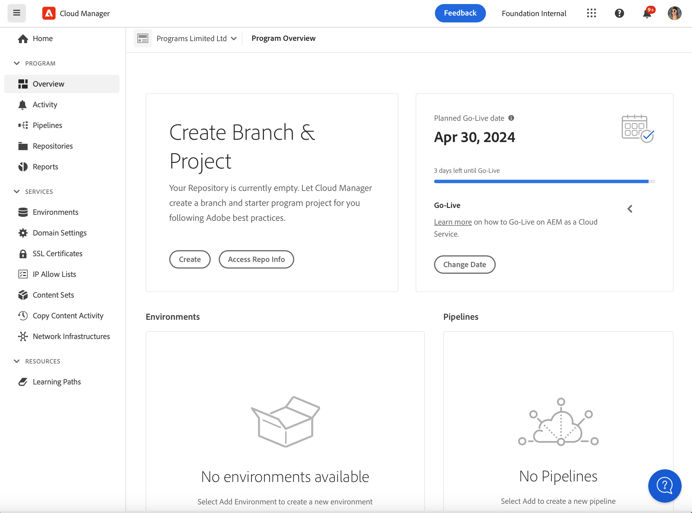

# Creazione di programmi di produzione {#create-production-program}

Un programma di produzione è destinato agli utenti che hanno familiarità con AEM e Cloud Manager e sono pronti per iniziare a scrivere, creare e testare il codice allo scopo di distribuirlo per ospitare il traffico in tempo reale.

Per ulteriori informazioni sui tipi di programmi, consulta il documento [Informazioni su programmi e tipi di programmi.](program-types.md)

## Creazione di un programma di produzione {#create}

Per creare un programma di produzione, segui la procedura riportata di seguito. Tieni presente che, a seconda dei diritti della tua organizzazione, potresti vedere [opzioni aggiuntive](#options) durante l’aggiunta del programma.

1. Accedi a Cloud Manager all’indirizzo [my.cloudmanager.adobe.com](https://my.cloudmanager.adobe.com/) e seleziona l’organizzazione appropriata.

1. Il giorno **[I miei programmi](/help/implementing/cloud-manager/navigation.md#my-programs)** console, tocca o fai clic su **Aggiungi programma** nell’angolo in alto a destra dello schermo.

   

1. Per creare un programma di produzione, seleziona **Configura per produzione** nella procedura guidata Crea programma nome e specifica un nome.

   

1. Se lo desideri, puoi anche aggiungere un’immagine al programma trascinando un file immagine nell’area **Aggiungi un’immagine del programma** oppure fai clic per selezionare un’immagine da un browser di file. Seleziona **Continua**.

1. Dalla scheda **Soluzioni e componenti aggiuntivi**, seleziona le soluzioni da includere nel programma.

   * Se non sai per certo se ti servono uno o più programmi per le varie soluzioni disponibili, seleziona quella che più ti interessa. Potrai attivare altre soluzioni in un secondo tempo [modificando il programma](/help/implementing/cloud-manager/getting-access-to-aem-in-cloud/editing-programs.md). Per ulteriori consigli sulla configurazione del programma, consulta [Introduzione ai programmi di produzione](/help/implementing/cloud-manager/getting-access-to-aem-in-cloud/introduction-production-programs.md).
   * Per la creazione del programma è necessaria almeno una soluzione.
   * Se hai selezionato **[Abilita sicurezza avanzata](#security)** è possibile selezionare solo tutte le soluzioni per le quali sono disponibili i diritti HIPAA.

   

1. Per visualizzare i componenti aggiuntivi facoltativi, come la selezione del componente aggiuntivo, fai clic sulla freccia che precede il nome della soluzione **Commerce** opzione del componente aggiuntivo in **Sites**.

   

1. Dopo aver selezionato le soluzioni e i componenti aggiuntivi, fai clic su **Continua**.

1. Nella scheda **Data di pubblicazione**, inserisci la data di pubblicazione pianificata per il programma di produzione.

   

   * Questa data può essere modificata in qualsiasi momento.
   * Questa data è solo per uso informativo e attiva il widget di pubblicazione sul [**Panoramica del programma** pagina](/help/implementing/cloud-manager/getting-access-to-aem-in-cloud/editing-programs.md#program-overview) fornire collegamenti interni al prodotto alla documentazione sulle best practice as a Cloud Service per l’AEM in modo tempestivo, in linea con il percorso che culmina in un’esperienza di pubblicazione fluida e di successo.

1. Fai clic su **Crea**.

Il programma viene creato da Cloud Manager e visualizzato nella pagina di destinazione, disponibile per la selezione.

## Opzioni aggiuntive del programma di produzione {#options}

A seconda dei diritti disponibili per l’organizzazione, è possibile che siano disponibili opzioni aggiuntive al momento della creazione di un programma di produzione.

### Sicurezza {#security}

Se si dispone dei diritti necessari, il **Sicurezza** verrà visualizzata come prima scheda della **Configurazione per la produzione** .

Il **Sicurezza** fornisce le opzioni per attivare **HIPAA** e/o **Protezione WAF-DDOS** per il programma di produzione.

Adobe Conformità HIPAA e Web Application Firewall (WAF) facilitano la sicurezza basata sul cloud come parte di un approccio multilivello per la protezione contro le vulnerabilità.

* **HIPAA** - Questa opzione consente l’implementazione della soluzione compatibile con HIPPA di Adobe.
   * [Ulteriori informazioni](https://www.adobe.com/go/hipaa-ready_it) sull’implementazione della soluzione compatibile HIPAA di Adobe.
   * Impossibile abilitare o disabilitare HIPAA dopo la creazione del programma.
* **Protezione WAF-DDOS** : questa opzione abilita il firewall dell’applicazione web tramite regole per proteggere l’applicazione.
   * Una volta attivata, la protezione WAF-DDOS può essere configurata impostando un [pipeline non di produzione.](/help/implementing/cloud-manager/configuring-pipelines/configuring-non-production-pipelines.md)
   * Consulta il documento [Regole del filtro del traffico, incluse le regole WAF](/help/security/traffic-filter-rules-including-waf.md) per scoprire come gestire le regole del filtro del traffico nell’archivio in modo che vengano distribuite correttamente.

### SLA {#sla}

Se si dispone dei diritti necessari, il **SLA** verrà visualizzata come seconda o terza scheda nella **Configurazione per la produzione** .

AEM Sites offre un contratto di servizio (SLA) standard del 99,9%. Il **Contratto del livello di servizio del 99,99%** consente un tempo di attività minimo del 99,99% per gli ambienti di produzione.

Il 99,99% del contratto di servizio offre vantaggi quali maggiore disponibilità e latenza inferiore e richiede un [area geografica di pubblicazione aggiuntiva](/help/implementing/cloud-manager/manage-environments.md#multiple-regions) da applicare all’ambiente di produzione nel programma.

Una volta [requisiti](#sla-requirements) per abilitare il 99,99% SLA sono soddisfatti, è necessario eseguire un [pipeline full stack](/help/implementing/cloud-manager/configuring-pipelines/configuring-production-pipelines.md) per attivarlo.

#### Requisiti per il 99,99% SLA {#sla-requirements}

Oltre alle adesioni richieste, il 99,99% degli SLA prevede requisiti aggiuntivi per l&#39;utilizzo.

* Al momento dell’applicazione del 99,99% del contratto di servizio (SLA) al programma, l’organizzazione deve avere a disposizione sia il 99,99% che i diritti aggiuntivi per regione di pubblicazione.
* Per applicare al programma un SLA del 99,99%, Cloud Manager verificherà che non sia stato utilizzato [area geografica di pubblicazione aggiuntiva](/help/implementing/cloud-manager/manage-environments.md#multiple-regions) Il diritto è disponibile anche e può essere applicato al programma.
* Durante la modifica di un programma, se contiene già un ambiente di produzione con almeno un’area di pubblicazione aggiuntiva, Cloud Manager controlla solo la disponibilità di un diritto SLA del 99,99%.
* Affinché lo SLA del 99,99% e il reporting siano attivati, il [ambiente di produzione/stage](/help/implementing/cloud-manager/manage-environments.md#adding-environments) deve essere stata creata e almeno un’area di pubblicazione aggiuntiva deve essere stata applicata all’ambiente di produzione/stage.
   * Se si utilizza [reti avanzate,](/help/security/configuring-advanced-networking.md) assicurati di controllare il [Aggiunta di più aree di pubblicazione a un nuovo ambiente](/help/implementing/cloud-manager/manage-environments.md#adding-regions) documenti per raccomandazioni in modo da mantenere la connettività in caso di guasto regionale.
* Almeno un&#39;area geografica di pubblicazione aggiuntiva deve rimanere nel programma SLA al 99,99%. Gli utenti non possono eliminare l’ultima area di pubblicazione aggiuntiva dal programma SLA al 99,99%.
* Il 99,99% di SLA è supportato per i programmi di produzione in cui è abilitata la soluzione Sites.
* È necessario eseguire un [pipeline full stack](/help/implementing/cloud-manager/configuring-pipelines/configuring-production-pipelines.md) per attivare (o disattivare, durante la modifica di un programma) lo SLA del 99,99%.

## Accesso al programma {#accessing}

1. Quando visualizzi la scheda del programma nella pagina di destinazione, seleziona il pulsante con i puntini di sospensione per visualizzare le opzioni di menu disponibili.

   

1. Per accedere alla pagina **Panoramica** di Cloud Manager, seleziona **Panoramica del programma**.

1. La principale scheda di invito all’azione nella pagina della panoramica ti guiderà attraverso la creazione di un ambiente, una pipeline non di produzione e infine una pipeline di produzione.

   

>[!TIP]
>
>Consulta il documento [Navigazione nell’interfaccia utente di Cloud Manager](/help/implementing/cloud-manager/navigation.md) per informazioni dettagliate su come navigare in Cloud Manager e sulla **I miei programmi** console.

>[!NOTE]
>
>A differenza di un [programma sandbox](introduction-sandbox-programs.md#auto-creation), un programma di produzione richiede che l’utente con il ruolo di Cloud Manager appropriato crei il progetto e aggiunga un ambiente tramite l’interfaccia utente self-service.
