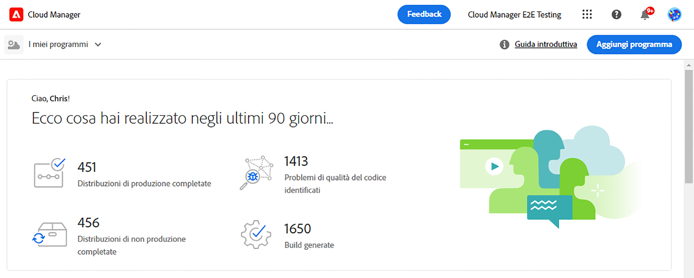

# Creazione di programmi sandbox {#create-sandbox-program}

Un programma sandbox viene tipicamente creato per scopi di formazione, esecuzione di demo, attivazione, POC o documentazione e non è quindi destinato a contenere traffico in tempo reale.

Per ulteriori informazioni sui tipi di programmi, consulta il documento [Informazioni su programmi e tipi di programmi.](program-types.md)

## Creazione di un programma sandbox {#create}

Per creare un programma sandbox, segui la procedura riportata di seguito.

1. Accedi a Cloud Manager all’indirizzo [my.cloudmanager.adobe.com](https://my.cloudmanager.adobe.com/) e seleziona l’organizzazione appropriata.

1. Dalla pagina di destinazione di Cloud Manager, fai clic su **Aggiungi programma** nell’angolo in alto a destra della schermata.

   

1. Dalla procedura guidata Crea programma, seleziona **Configura una sandbox** e assegna un nome al programma.

   

1. Facoltativamente, puoi aggiungere un’immagine al programma trascinando un file di immagine sul target **Aggiungi un’immagine del programma** o facendo clic su di esso per aggiungere un’immagine da un browser del file. Tocca o fai clic su **Continua**.

   * L’immagine funge solo da titolo nella finestra di panoramica del programma e aiuta a identificarlo.

1. Nella finestra di dialogo **Configura una sandbox**, seleziona le soluzioni da abilitare nel programma sandbox selezionando le opzioni nella tabella **Soluzioni e componenti aggiuntivi**.

   * Utilizza le frecce accanto ai nomi delle soluzioni per mostrare ulteriori componenti aggiuntivi facoltativi per le soluzioni.

   * Le soluzioni **Sites** e **Assets** sono sempre incluse nei programmi sandbox e non possono essere deselezionate.

   

1. Dopo aver selezionato le soluzioni e i componenti aggiuntivi per il programma sandbox, tocca o fai clic su **Crea**.

Nella pagina di destinazione viene visualizzata una nuova scheda del programma sandbox e un indicatore di stato che mostra l’avanzamento del processo di configurazione.

## Accesso alla sandbox {#access}

Visualizzando la pagina di panoramica del programma, è possibile visualizzare i dettagli della configurazione sandbox e accedere all’ambiente (non appena disponibile).

1. Dalla pagina di destinazione di Cloud Manager, fai clic sul pulsante con i puntini di sospensione del programma appena creato.

   

1. Al termine della fase di creazione del progetto, puoi accedere a **Accedi a dati archivio** per poter utilizzare l’archivio Git.

   

   >[!TIP]
   >
   >Per ulteriori informazioni sull’accesso e la gestione dell’archivio Git, consulta il documento [Accesso a Git](/help/implementing/cloud-manager/managing-code/accessing-repos.md).

1. Dopo aver creato l’ambiente di sviluppo, è possibile utilizzare il collegamento **Accedi a AEM** per accedere a AEM.

   

1. Dopo aver completato la distribuzione della pipeline non di produzione nell’ambiente di sviluppo, la procedura guidata indica di accedere all’ambiente di sviluppo AEM o di distribuire il codice.

   

Se in qualsiasi momento è necessario passare a un altro programma o tornare alla pagina della panoramica per crearne uno nuovo, fai clic sul nome del programma nella parte superiore sinistra della schermata per visualizzare l’opzione **Accedi a**.

