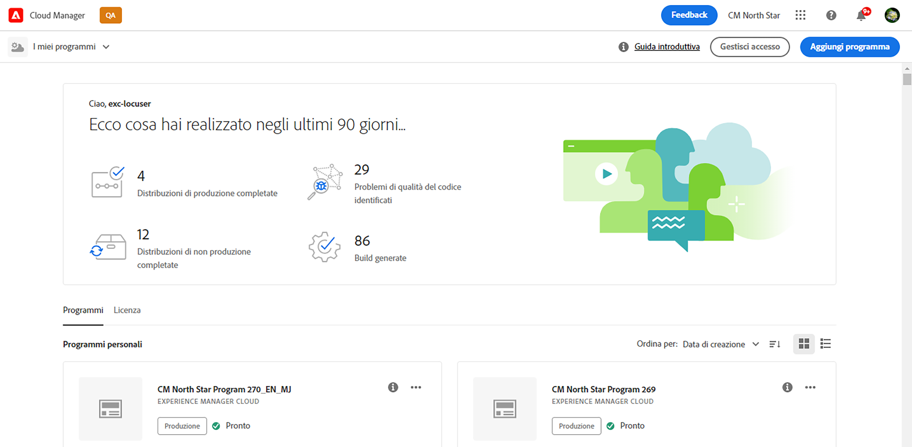
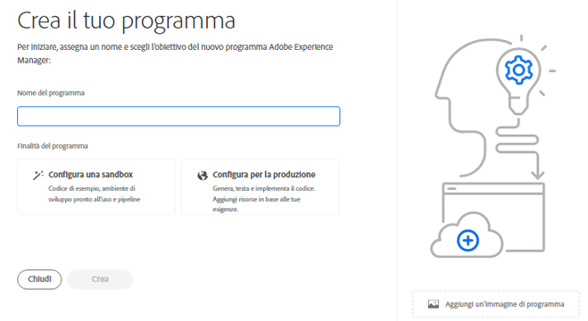
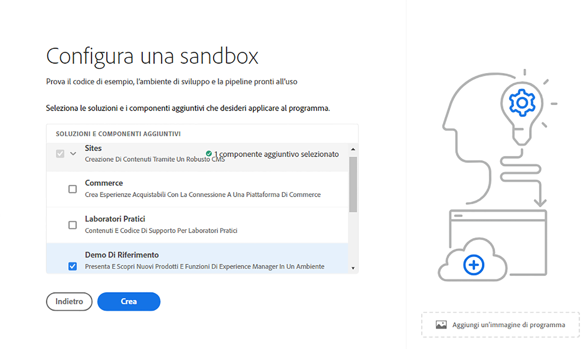
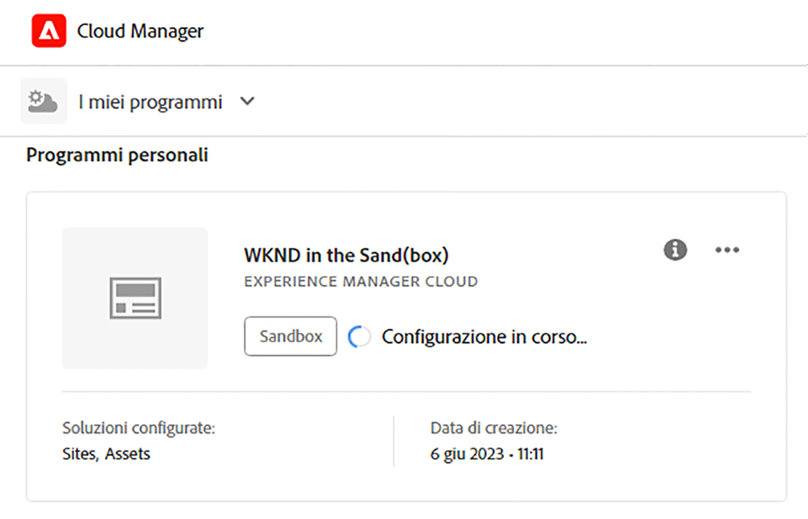
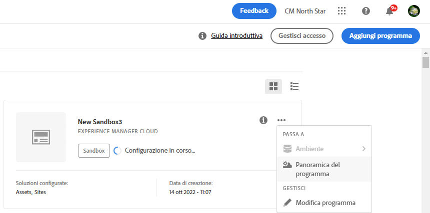
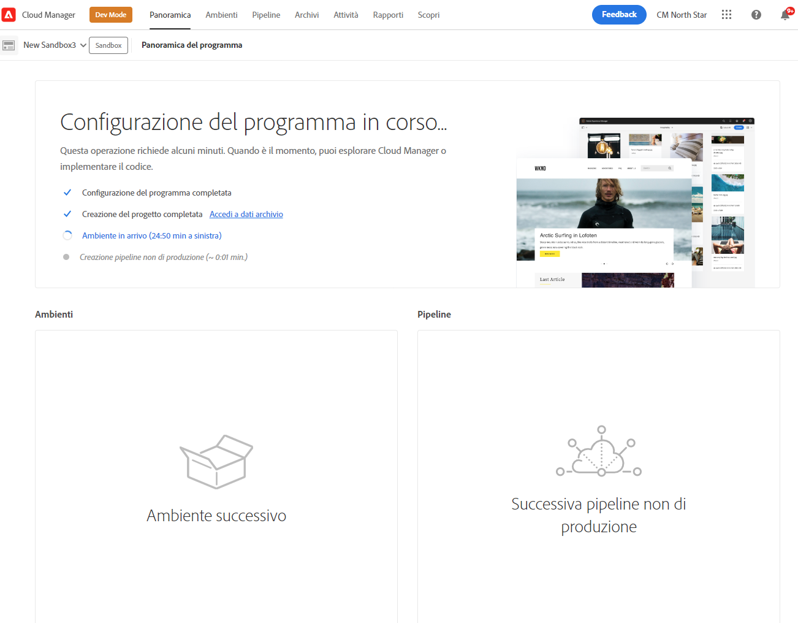
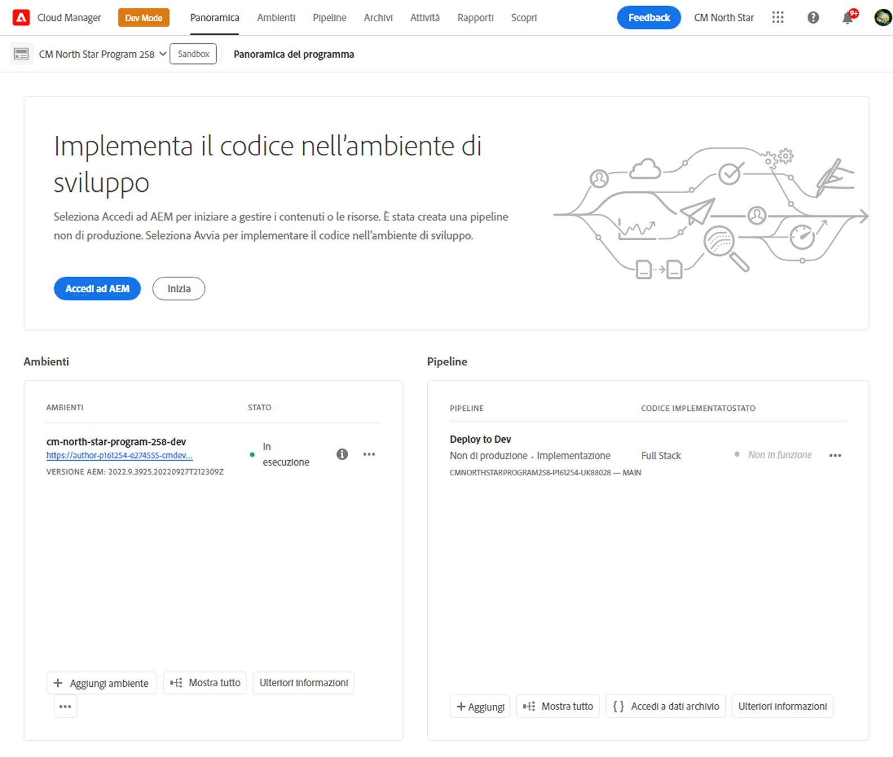

# Creare programmi sandbox {#create-sandbox-program}

Un programma sandbox viene generalmente creato a scopi di formazione, esecuzione di demo, abilitazione, POC o documentazione e non è destinato a contenere traffico in tempo reale. Vedi [Introduzione ai programmi sandbox](/help/implementing/cloud-manager/getting-access-to-aem-in-cloud/introduction-sandbox-programs.md).

Ulteriori informazioni sui tipi di programmi nel documento [Informazioni su programmi e tipi di programmi](program-types.md).

## Creare un programma sandbox {#create}

1. Accedi a Cloud Manager all’indirizzo [my.cloudmanager.adobe.com](https://my.cloudmanager.adobe.com/) e seleziona l’organizzazione appropriata.

1. Nella console **[Programmi](/help/implementing/cloud-manager/navigation.md#my-programs)**, nell&#39;angolo superiore destro, fare clic su **Aggiungi programma**.

   

1. Nella procedura guidata *Crea il programma*, nel campo di testo **Nome programma**, digita il nome desiderato per il programma.

1. In **Obiettivo programma**, seleziona  **Configura sandbox**.

   

1. (Facoltativo) Nell&#39;angolo inferiore destro della finestra di dialogo della procedura guidata, effettuate una delle seguenti operazioni:

   * Trascina e rilascia un file di immagine sull&#39; **Aggiungi un&#39;immagine del programma** di destinazione.
   * Fai clic sull&#39; **Aggiungi un&#39;immagine del programma**, quindi seleziona un&#39;immagine da un browser di file.
   * Fai clic su  per rimuovere un&#39;immagine aggiunta.

1. Fai clic su **Continua**.

1. Nella casella di riepilogo **Soluzioni e componenti aggiuntivi** selezionare una o più soluzioni da includere nel programma.

   * Fai clic sulla freccia a sinistra del nome di una soluzione per visualizzare eventuali componenti aggiuntivi opzionali disponibili che desideri includere con una soluzione selezionata.
   * Le soluzioni **Sites**, **Assets** e **Edge Delivery Services** sono sempre selezionate per impostazione predefinita quando si crea un programma sandbox. Non è possibile deselezionarli.

   

1. Fai clic su **Crea**. Cloud Manager crea il programma sandbox e lo visualizza nella pagina di destinazione per la selezione.

## Accesso alla sandbox {#access}

Al termine della creazione di un nuovo programma sandbox, puoi visualizzare i dettagli della configurazione sandbox e accedere all’ambiente visualizzando la pagina di panoramica del programma.

1. Nella pagina di destinazione di Cloud Manager, nel programma sandbox, fai clic sull&#39;icona  nel programma sandbox creato.

   

1. Al termine della creazione del progetto, puoi fare clic sul collegamento **Accedi a dati archivio** per utilizzare l&#39;archivio Git.

   

   >[!TIP]
   >
   >Per ulteriori informazioni sull&#39;accesso e la gestione dell&#39;archivio Git, vedere [Accesso a Git](/help/implementing/cloud-manager/managing-code/accessing-repos.md).

1. Dopo aver creato l&#39;ambiente di sviluppo, puoi fare clic su **Accedi ad AEM** e accedere ad AEM.

   

1. Al termine della distribuzione della pipeline non di produzione nell’ambiente di sviluppo, la procedura guidata di call-to-action ti guida ad accedere all’ambiente di sviluppo AEM o a distribuire il codice nell’ambiente di sviluppo.

   

>[!TIP]
>
>Consulta [Navigazione nell&#39;interfaccia utente di Cloud Manager](/help/implementing/cloud-manager/navigation.md) per informazioni dettagliate su come esplorare Cloud Manager e comprendere la console **Programmi personali**.
