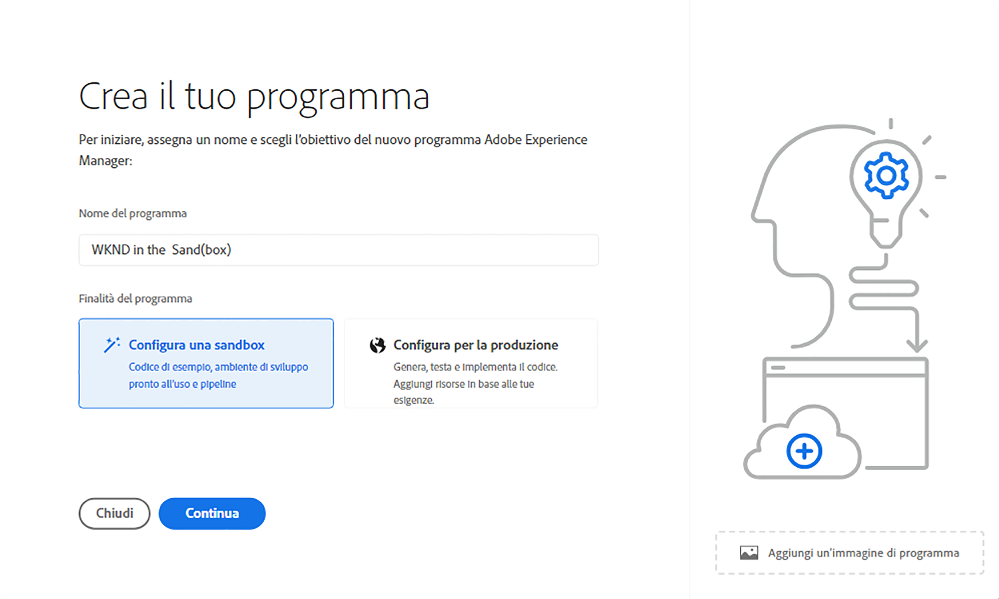

# Creazione di programmi sandbox {#create-sandbox-program}

Generalmente, un programma sandbox viene creato per scopi di formazione, demo in esecuzione, abilitazione, POC o documentazione e non è destinato a trasportare traffico live.

Ulteriori informazioni sui tipi di programma nel documento [Informazioni sui tipi di programma e di programma.](program-types.md)

## Creare un programma sandbox {#create}

Segui questi passaggi per creare un programma sandbox.

1. Accedi a Cloud Manager all&#39;indirizzo [my.cloudmanager.adobe.com](https://my.cloudmanager.adobe.com/) e selezionare l&#39;organizzazione appropriata.

1. Dalla pagina di destinazione di Cloud Manager, fai clic su **Aggiungi programma** nell’angolo in alto a destra dello schermo.

   

1. Dalla procedura guidata Crea programma, seleziona **Configurare una sandbox**, specificare un nome di programma e quindi fare clic su **Crea**.

   

Nella pagina di destinazione verrà visualizzata una nuova scheda del programma sandbox con un indicatore di stato durante il processo di configurazione.

## Accedere alla sandbox {#access}

Puoi visualizzare i dettagli della configurazione della sandbox e accedere all’ambiente (una volta disponibile) visualizzando la pagina di panoramica del programma.

1. Dalla pagina di destinazione di Cloud Manager, fai clic sul pulsante con i puntini di sospensione nel programma appena creato.

   

1. Al termine del passaggio di creazione del progetto, puoi accedere al **Accesso alle informazioni sul repository** per poter utilizzare il tuo archivio git.

   

   >[!TIP]
   >
   >Per ulteriori informazioni sull’accesso e la gestione dell’archivio Git, consulta il documento [Accesso a Git.](/help/implementing/cloud-manager/managing-code/accessing-repos.md)

1. Una volta creato l’ambiente di sviluppo, puoi utilizzare la funzione **AEM di accesso** collegamento per accedere a AEM.

   

1. Una volta completata l’implementazione della pipeline non di produzione per lo sviluppo, la procedura guidata ti guida ad accedere all’ambiente di sviluppo AEM o a distribuire il codice nell’ambiente di sviluppo.

   

Se in qualsiasi momento è necessario passare a un altro programma o tornare alla pagina di panoramica per creare un altro programma, fai clic sul nome del programma in alto a sinistra dello schermo per visualizzare il **Passa a** opzione .

