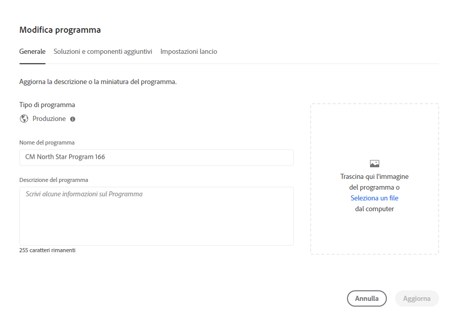
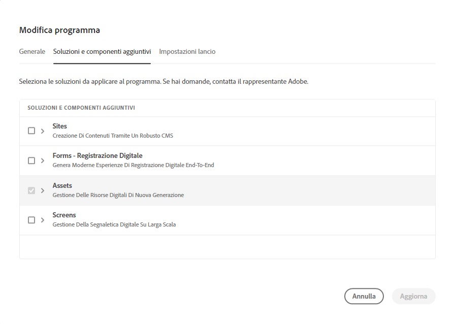
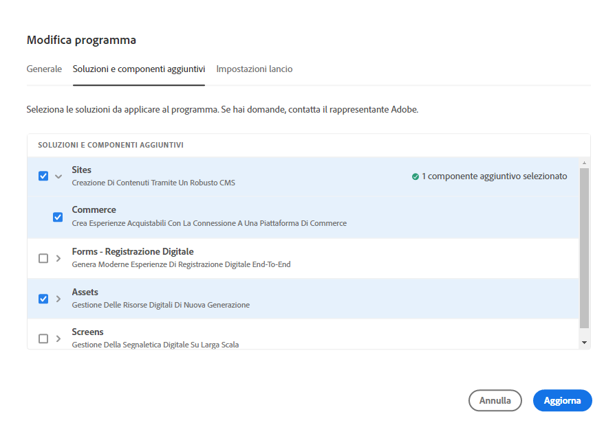
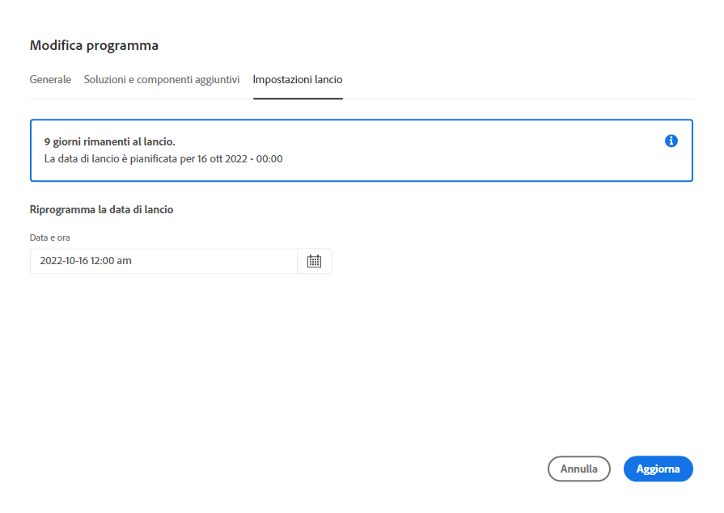
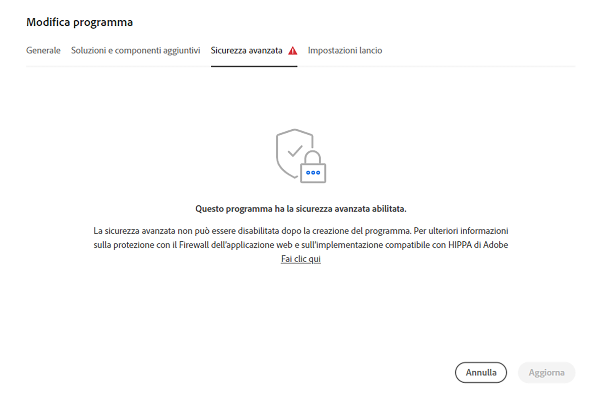
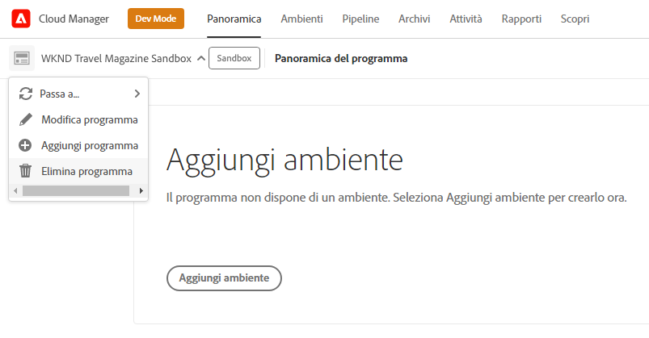
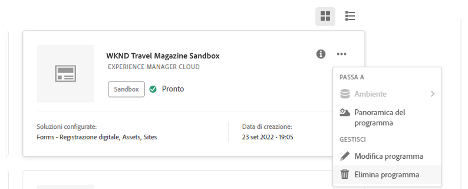

# Modifica dei programmi {#editing-programs}

Gli utenti con le autorizzazioni necessarie possono modificare [programmi di produzione creati nell’organizzazione](creating-production-programs.md) e [programmi sandbox creati nell’organizzazione.](creating-sandbox-programs.md) Modificando un programma è possibile:

* Aggiungere la soluzione Sites a un programma esistente con Assets e viceversa.
* Rimuovere Sites o Assets da un programma esistente con entrambi Sites e Assets.
* Aggiungere una seconda soluzione non utilizzata a un programma esistente o nuovo.
* Eliminare i programmi sandbox.

## Autorizzazioni {#permissions}

Per modificare i programmi o eliminare i programmi sandbox, è necessario avere il ruolo di **Proprietario business**.

## Modifica di un programma {#editing}

Per modificare un programma, segui la procedura riportata di seguito.

1. Accedi a Cloud Manager all’indirizzo [my.cloudmanager.adobe.com](https://my.cloudmanager.adobe.com/) e seleziona l’organizzazione appropriata.

1. Per visualizzare i dettagli del programma, fai clic su quello che desideri modificare.

1. Fai clic sul nome del programma nella parte superiore sinistra della pagina e seleziona **Modifica programma**.

   

1. Viene visualizzata la pagina **Modifica programma**. Dalla scheda **Generale**, modifica il nome e la descrizione del programma.

   * È necessario selezionare almeno una soluzione per programma.

   

1. Dalla scheda **Soluzioni e componenti aggiuntivi**, modifica le soluzioni del programma.

   

1. Per visualizzare i componenti aggiuntivi facoltativi, come l’opzione per il componente **Commerce** in **Sites**, fai clic sulla freccia che precede il nome della soluzione.

   

1. Dalla scheda **Impostazioni pubblicazione**, modifica la data di pubblicazione pianificata per il programma.

   

   * Questa data è solo per uso informativo e attiva il widget di pubblicazione sulla pagina della panoramica del programma per fornire collegamenti rapidi alla documentazione sulle best practice di AEM as a Cloud Service, al fine di allinearsi con il percorso che culmina in un’esperienza di pubblicazione fluida e di successo.
   * Questa scheda non è disponibile per i programmi sandbox.

1. Per salvare le modifiche apportate al programma, fai clic su **Aggiorna**.

Ogni volta che si modifica un programma, compreso aggiungere o rimuovere una soluzione o un componente aggiuntivo, le modifiche hanno effetto dopo la distribuzione successiva.

Se nel programma di produzione è stata abilitata la protezione avanzata, verrà **Sicurezza avanzata** è disponibile nella scheda **Modifica programma** per confermare che la funzione è attiva per il programma.

Questa impostazione non può essere modificata dopo la creazione del programma. Per ulteriori informazioni sull&#39;opzione di protezione avanzata, vedere [Creazione di programmi di produzione](creating-production-programs.md) documento.

## Eliminazione dei programmi sandbox {#delete-sandbox-program}

L’eliminazione di un programma sandbox comporta la rimozione di tutti gli ambienti e delle relative pipeline associate.

>[!TIP]
>
>In alternativa, gli utenti con i ruoli **Proprietario business** o **Responsabile dell’implementazione** possono eliminare gli ambienti di produzione e di staging al posto dell’intero programma sandbox.

Per eliminare un programma sandbox, segui la procedura riportata di seguito.

1. Accedi a Cloud Manager all’indirizzo [my.cloudmanager.adobe.com](https://my.cloudmanager.adobe.com/) e seleziona l’organizzazione appropriata.

1. Per visualizzare i dettagli del programma, fai clic su quello che desideri modificare.

1. Fai clic sul nome del programma nella parte superiore sinistra della pagina e seleziona **Elimina programma**.

   

In alternativa, dalla pagina della panoramica di Cloud Manager, accedi alla scheda del programma, fai clic sul pulsante con i puntini di sospensione e seleziona **Elimina programma**.

>[!NOTE]
>
>È possibile eliminare solo i programmi sandbox. I programmi di produzione non possono essere eliminati.
