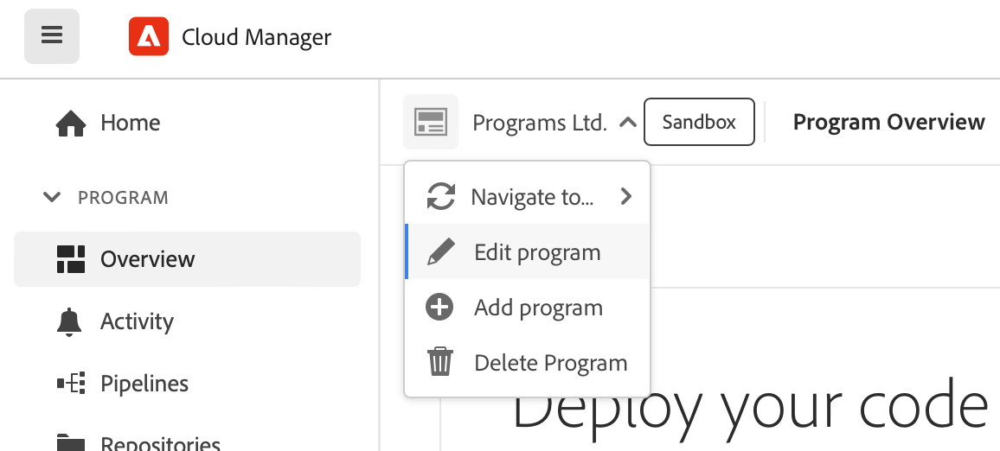

# Gestione e modifica dei programmi {#editing-programs}

Il **I miei programmi** Questa pagina fornisce una panoramica di tutti i programmi a cui si ha accesso. Quando si seleziona un singolo programma, **Panoramica del programma** fornisce dettagli sul programma in una panoramica.

Dalla sezione **Panoramica del programma**, gli utenti con le autorizzazioni necessarie possono modificare [programmi di produzione creati nell’organizzazione](creating-production-programs.md) e [programmi sandbox creati nell’organizzazione.](creating-sandbox-programs.md) Modificando un programma è possibile:

* Aggiungere la soluzione Sites a un programma esistente con Assets e viceversa.
* Rimuovere Sites o Assets da un programma esistente con entrambi Sites e Assets.
* Aggiungere una seconda soluzione non utilizzata a un programma esistente o nuovo.
* Eliminare i programmi sandbox.

## Autorizzazioni {#permissions}

Devi essere membro di **Proprietario business** per modificare i programmi o eliminare i programmi sandbox e per accedere alla dashboard delle licenze.

## I miei programmi {#my-programs}

1. Accedi a Cloud Manager all’indirizzo [my.cloudmanager.adobe.com](https://my.cloudmanager.adobe.com/) e seleziona l’organizzazione appropriata.

1. Il **I miei programmi** pagina mostra un elenco di tutti i programmi a cui si ha accesso come riquadri.

### Invito all’azione {#cta}

Nella parte superiore della pagina è riportato un invito all’azione relativo allo stato dell’organizzazione. Ad esempio, se hai configurato correttamente i programmi, potrebbero essere visualizzate le statistiche delle attività degli ultimi 90 giorni, tra cui:

* Numero di [implementazioni](/help/implementing/cloud-manager/deploy-code.md)
* Numero di [problemi di qualità del codice](/help/implementing/cloud-manager/code-quality-testing.md) identificati
* Numero di build

Oppure, se stai iniziando la configurazione dell’organizzazione, ci potrebbero essere suggerimenti sui passaggi successivi o sulle risorse della documentazione.

### Scheda Programmi {#programs-tab}

Il **Programmi** scheda elenca le schede che rappresentano ogni programma a cui hai accesso. Tocca o fai clic su una scheda per accedere al **Panoramica del programma** pagina del programma per informazioni dettagliate sul programma.

Utilizza le opzioni di ordinamento per trovare meglio il programma necessario.

* Ordina per
   * Data di creazione (impostazione predefinita)
   * Nome del programma
   * Stato
* Crescente (predefinito) / Decrescente
* Vista griglia (impostazione predefinita)
* Vista a elenco 

### Scheda Licenza {#license-tab}

Il **Licenza** consente di accedere rapidamente al [Dashboard delle licenze.](/help/implementing/cloud-manager/license-dashboard.md)

## Panoramica del programma {#program-overview}

Dopo aver selezionato un programma da **[I miei programmi](#my-programs)** , Cloud Manager apre la pagina **Panoramica del programma** per il programma selezionato.

Tocca o fai clic sul nome del programma nell’angolo in alto a sinistra della pagina per passare rapidamente a un altro programma o tornare al **[I miei programmi](#my-programs)** pagina. È inoltre possibile [modifica il programma selezionato](#editing) o [aggiungi un programma.](/help/implementing/cloud-manager/getting-access-to-aem-in-cloud/creating-production-programs.md)

L’invito all’azione nella parte superiore ti fornirà informazioni utili a seconda dello stato del programma. Per un nuovo programma puoi vedere i passaggi successivi offerti e un promemoria della data di pubblicazione, [impostato durante la creazione del programma.](/help/implementing/cloud-manager/getting-access-to-aem-in-cloud/editing-programs.md)

Per un programma live, lo stato dell’ultima implementazione con collegamenti per i dettagli e l’avvio di una nuova implementazione.

**Ambienti** e **Pipeline** Le schede forniscono una rapida panoramica di entrambi all&#39;interno del programma selezionato.

Il **Prestazioni** offre una panoramica della **[Dashboard CDN.](/help/implementing/cloud-manager/cdn-performance.md)**

## Modifica di un programma {#editing}

1. Accedi a Cloud Manager all’indirizzo [my.cloudmanager.adobe.com](https://my.cloudmanager.adobe.com/) e seleziona l’organizzazione appropriata.

1. Il giorno **[I miei programmi](#my-programs)** , fare clic sul programma che si desidera modificare per visualizzarne i dettagli.

1. Fai clic sul nome del programma nella parte superiore sinistra della pagina e seleziona **Modifica programma**.

   

1. Il **Modifica programma** La pagina si apre su **Generale** scheda.

   

1. Le opzioni disponibili per la modifica del programma sono le stesse della creazione del programma.
   * Consulta i documenti [Creazione di programmi di produzione](/help/implementing/cloud-manager/getting-access-to-aem-in-cloud/creating-production-programs.md) e [Creazione di programmi sandbox](/help/implementing/cloud-manager/getting-access-to-aem-in-cloud/creating-sandbox-programs.md) per informazioni dettagliate sulle singole opzioni.
   * [Opzioni aggiuntive](/help/implementing/cloud-manager/getting-access-to-aem-in-cloud/creating-production-programs.md#options) può essere disponibile per il programma di produzione in base ai diritti dell’organizzazione.

1. Clic **Aggiorna** per salvare le modifiche apportate al programma.

Le modifiche apportate al programma vengono salvate.

>[!NOTE]
>
>Ogni volta che si modifica un programma, incluso l&#39;aggiunta o la rimozione di una soluzione o di un componente aggiuntivo, tali modifiche diventano effettive dopo la distribuzione successiva.

## Eliminazione dei programmi sandbox {#delete-sandbox-program}

L’eliminazione di un programma sandbox comporta la rimozione di tutti gli ambienti e delle relative pipeline associate.

>[!TIP]
>
>In alternativa, gli utenti con i ruoli **Proprietario business** o **Responsabile dell’implementazione** possono eliminare gli ambienti di produzione e di staging al posto dell’intero programma sandbox.

Per eliminare un programma sandbox, effettuare le seguenti operazioni.

1. Accedi a Cloud Manager all’indirizzo [my.cloudmanager.adobe.com](https://my.cloudmanager.adobe.com/) e seleziona l’organizzazione appropriata.

1. Il giorno **[I miei programmi](#my-programs)** , fare clic sul programma che si desidera modificare per visualizzarne i dettagli.

1. Fai clic sul nome del programma nella parte superiore sinistra della pagina e seleziona **Elimina programma**.

   

In alternativa, dalla pagina della panoramica di Cloud Manager, accedi alla scheda del programma, fai clic sul pulsante con i puntini di sospensione e seleziona **Elimina programma**.

>[!NOTE]
>
>È possibile eliminare solo i programmi sandbox. I programmi di produzione non possono essere eliminati.
