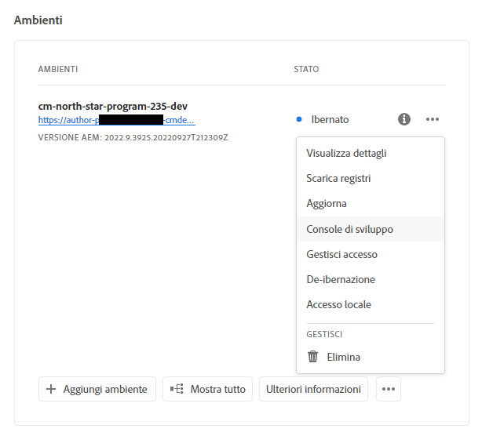

# Sospensione e disattivazione degli ambienti sandbox {#hibernating-introduction}

Gli ambienti di un programma sandbox entrano in modalità di sospensione se non viene rilevata alcuna attività per otto ore. La sospensione è specifica degli ambienti dei programmi sandbox. Per gli ambienti dei programmi di produzione la sospensione non è disponibile.

## Sospensione {#hibernation-introduction}

La sospensione può essere attivata automaticamente o manualmente.

* **Automatica**: la sospensione degli ambienti di un programma sandbox viene attivata automaticamente dopo otto ore di inattività. L’inattività è definita dall’assenza di richieste ricevute dal servizio di Author, Anteprima e Publish.
* **Manuale**: l’utente può attivare manualmente la sospensione di un ambiente di un programma sandbox. Non si tratta di un requisito, in quanto la sospensione viene attivata automaticamente come descritto in precedenza.

Potrebbero essere necessari alcuni minuti prima che gli ambienti del programma sandbox entrino in modalità di sospensione. Durante la sospensione i dati vengono conservati.

### Utilizzo della sospensione manuale {#using-manual-hibernation}

Puoi sospendere manualmente il programma sandbox da Console sviluppatori. L’accesso a Console sviluppatori di un programma sandbox è disponibile per tutti gli utenti di Cloud Manager.

Per sospendere manualmente gli ambienti di un programma sandbox, segui la procedura riportata di seguito.

1. Accedi a Cloud Manager all’indirizzo [my.cloudmanager.adobe.com](https://my.cloudmanager.adobe.com/) e seleziona l’organizzazione appropriata.

1. Per visualizzare i dettagli del programma, fai clic su quello che desideri sospendere.

1. Dalla scheda **Ambienti**, fai clic sul pulsante con i puntini di sospensione e seleziona **Console sviluppatori**.

   * Consulta [Accesso a Console sviluppatori](/help/implementing/cloud-manager/manage-environments.md#accessing-developer-console) per ulteriori dettagli su Console sviluppatori.

   

1. In Console sviluppatori, fai clic su **Sospendi**.

   

1. Per confermare, fai clic su **Sospendi**.

   

Quando la sospensione si attiva correttamente, nella schermata di **Console sviluppatori** viene visualizzata la notifica di completamento del processo di sospensione.

Per accedere all’elenco di ambienti da sospendere in Console sviluppatori, fai clic sul collegamento **Ambienti** nel percorso di navigazione sopra all’elenco a discesa **Pod**.

## Riattivazione {#de-hibernation-introduction}

Puoi sospendere manualmente il programma sandbox da Console sviluppatori.

>[!IMPORTANT]
>
>L’utente con il ruolo **Sviluppatore** può riattivare un ambiente di un programma sandbox.

1. Accedi a Cloud Manager all’indirizzo [my.cloudmanager.adobe.com](https://my.cloudmanager.adobe.com/) e seleziona l’organizzazione appropriata.

1. Per visualizzare i dettagli del programma, fai clic su quello che desideri sospendere.

1. Dalla scheda **Ambienti**, fai clic sul pulsante con i puntini di sospensione e seleziona **Console sviluppatori**.

   * Consulta [Accesso a Console sviluppatori](/help/implementing/cloud-manager/manage-environments.md#accessing-developer-console) per ulteriori dettagli su Console sviluppatori.

1. Fai clic su **Riattiva**.

   

1. Per confermare, fai clic su **Riattiva**.

   

1. Viene visualizzata una notifica dell’avvio del processo di riattivazione e aggiornamenti sull’avanzamento.

   

1. Al termine del processo, l’ambiente del programma sandbox è nuovamente attivo.

   

Per accedere all’elenco di ambienti da riattivare in Console sviluppatori, fai clic sul collegamento **Ambienti** nel percorso di navigazione sopra all’elenco a discesa **Pod**.

### Autorizzazioni per la riattivazione {#permissions-de-hibernate}

Tutti gli utenti con un profilo di prodotto che consente di accedere a AEM as a Cloud Service possono accedere a **Console sviluppatori** e riattivare l’ambiente.

## Accesso a un ambiente sospeso {#accessing-hibernated-environment}

Quando un browser invia richieste al servizio di Author, Anteprima o Publish di un ambiente sospeso, l’utente visualizza una pagina di destinazione in cui viene indicato lo stato di sospensione dell’ambiente e un collegamento a Console sviluppatori da cui è possibile riattivarlo.

## Distribuzioni e aggiornamenti AEM {#deployments-updates}

Negli ambienti sospesi è ancora possibile eseguire distribuzioni e aggiornamenti AEM manuali.

* È possibile utilizzare una pipeline per distribuire il codice personalizzato negli ambienti sospesi. L’ambiente rimane sospeso e il nuovo codice verrà visualizzato nell’ambiente alla sua riattivazione.

* Gli aggiornamenti AEM possono essere applicati agli ambienti sospesi e attivati manualmente da Cloud Manager. L’ambiente rimane sospeso e la nuova versione verrà visualizzata nell’ambiente alla sua riattivazione.

## Sospensione ed eliminazione {#hibernation-deletion}

* Gli ambienti in un programma sandbox vengono automaticamente sospesi dopo otto ore di inattività.
   * L’inattività è definita dall’assenza di richieste ricevute dal servizio di Author, Anteprima e Publish.
   * Una volta ibernati, possono essere [riattivati manualmente.](#de-hibernation-introduction)
* I programmi sandbox vengono eliminati dopo sei mesi di sospensione continua. Al termine di questo periodo, possono essere ricreati.

>[!NOTE]
>
>Solo gli ambienti sandbox vengono eliminati automaticamente dopo sei mesi di ibernazione continua. Il programma sandbox con il relativo archivio e codice viene mantenuto.
