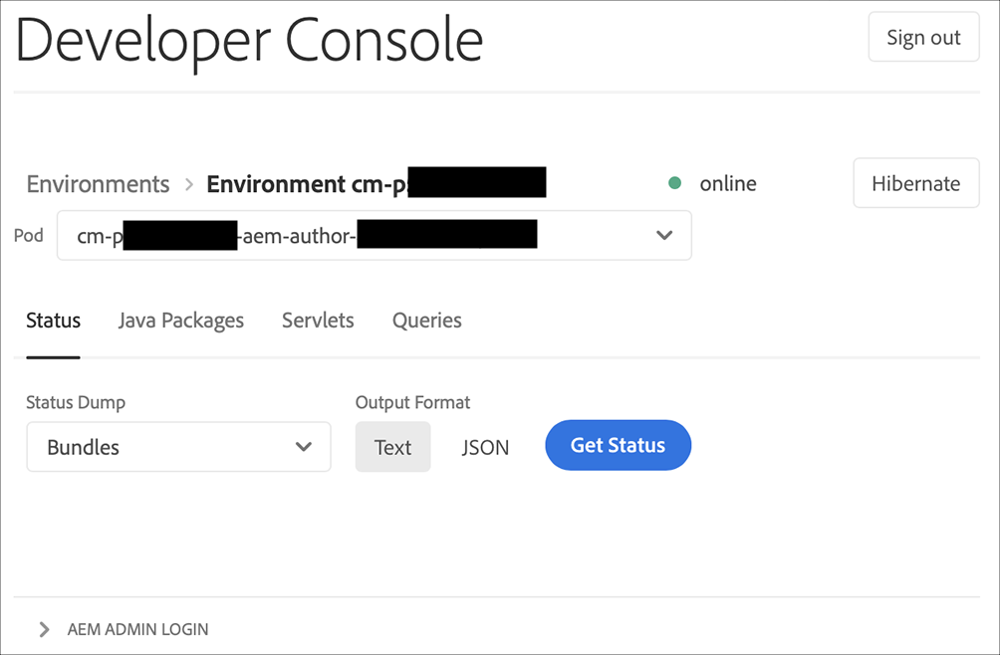

# Ambienti Sandbox sospensione e disattivazione {#hibernating-introduction}

Gli ambienti di un programma sandbox entrano in modalità ibernazione se non viene rilevata alcuna attività per otto ore.La sospensione è unica per gli ambienti di programma sandbox. Gli ambienti dei programmi di produzione non sono in ibernazione.

## Sospensione {#hibernation-introduction}

La sospensione può avvenire automaticamente o manualmente.

* **Automatico** - Gli ambienti dei programmi sandbox vengono automaticamente ibernati dopo otto ore di inattività. L’inattività non è definita né come il servizio di authoring, né come servizio di anteprima o pubblicazione ricevano richieste.
* **Manuale** - In qualità di utente, è possibile ibernare manualmente un ambiente di programma sandbox. Non è necessario farlo, poiché l&#39;ibernazione si verifica automaticamente come descritto in precedenza.

Potrebbero essere necessari fino a pochi minuti per l&#39;accesso alla modalità ibernazione degli ambienti del programma sandbox. I dati vengono conservati durante la sospensione.

### Utilizzo della sospensione manuale {#using-manual-hibernation}

Puoi riattivare manualmente il programma sandbox dalla Console per sviluppatori. L’accesso a Developer Console per un programma sandbox è disponibile per qualsiasi utente di Cloud Manager.

Segui questi passaggi per ibernare manualmente gli ambienti del programma sandbox.

1. Accedi a Cloud Manager all&#39;indirizzo [my.cloudmanager.adobe.com](https://my.cloudmanager.adobe.com/) e selezionare l&#39;organizzazione appropriata.

1. Clicca sul programma che desideri ibernare per mostrarne i dettagli.

1. Sulla **Ambienti** fare clic sul pulsante con i puntini di sospensione e selezionare **Console per sviluppatori**.

   * Consulta il documento [Accesso alla Console per sviluppatori](/help/implementing/cloud-manager/manage-environments.md#accessing-developer-console) per ulteriori informazioni su Developer Console.

   

1. In Developer Console, fai clic su **Sospensione**.

   

1. Fai clic su **Sospensione** per confermare il passaggio.

   

Quando la sospensione avrà esito positivo, verrà visualizzata la notifica completa del processo di ibernazione per l&#39;ambiente nel **Console per sviluppatori** schermo.

In Developer Console puoi anche fare clic sul pulsante **Ambienti** collegamento nel percorso di navigazione al di sopra del **Pod** elenco a discesa per un elenco di ambienti da ibernare.

## Disibernazione {#de-hibernation-introduction}

Puoi attivare manualmente il programma sandbox dalla Console per sviluppatori.

>[!IMPORTANT]
>
>Un utente con un **Sviluppatore** Il ruolo può annullare la sospensione di un ambiente di programma sandbox.

1. Accedi a Cloud Manager all&#39;indirizzo [my.cloudmanager.adobe.com](https://my.cloudmanager.adobe.com/) e selezionare l&#39;organizzazione appropriata.

1. Clicca sul programma che desideri ibernare per mostrarne i dettagli.

1. Sulla **Ambienti** fare clic sul pulsante con i puntini di sospensione e selezionare **Console per sviluppatori**.

   * Consulta il documento [Accesso alla Console per sviluppatori](/help/implementing/cloud-manager/manage-environments.md#accessing-developer-console) per ulteriori informazioni su Developer Console.

1. Fai clic su **De-ibernare**.

   

1. Fai clic su **De-Ibernato** per confermare il passaggio.

   

1. Ricevi una notifica dell’avvio del processo di disattivazione e dell’aggiornamento con l’avanzamento.

   

1. Al termine del processo, l’ambiente del programma sandbox è nuovamente attivo.

   

In Developer Console puoi anche fare clic sul pulsante **Ambienti** collegamento nel percorso di navigazione al di sopra del **Pod** elenco a discesa per un elenco di ambienti da disattivare.

### Autorizzazioni per lo scioglimento {#permissions-de-hibernate}

Qualsiasi utente con un profilo di prodotto che dia accesso a AEM as a Cloud Service deve essere in grado di accedere al **Console per sviluppatori**, permettendo loro di deibernare l&#39;ambiente.

## Accesso a un ambiente sospeso {#accessing-hibernated-environment}

Quando effettua richieste del browser al servizio di authoring, anteprima o pubblicazione di un ambiente attivato, l’utente incontra una pagina di destinazione che descrive lo stato di ibernazione dell’ambiente e un collegamento alla Console per sviluppatori, in cui è possibile disattivare il servizio.

## Implementazioni e aggiornamenti AEM {#deployments-updates}

Gli ambienti sospesi consentono comunque l’implementazione e l’aggiornamento AEM manuale.

* Un utente può utilizzare una pipeline per distribuire codice personalizzato per gli ambienti in sospensione. L’ambiente rimarrà in ibernazione e il nuovo codice verrà visualizzato nell’ambiente una volta disattivato.

* Gli aggiornamenti AEM possono essere applicati agli ambienti in sospensione e possono essere attivati manualmente da Cloud Manager. L’ambiente rimarrà in ibernazione e la nuova versione apparirà nell’ambiente una volta disattivata.

## Sospensione e cancellazione {#hibernation-deletion}

* Gli ambienti in un programma sandbox vengono automaticamente ibernati dopo otto ore di inattività.
   * L’inattività non è definita né come il servizio di authoring, né come servizio di anteprima o pubblicazione ricevano richieste.
   * Una volta ibernati, possono essere disattivati manualmente.
* I programmi sandbox vengono cancellati dopo sei mesi di essere in modalità di sospensione continua, dopo di che, possono essere ricreati.
