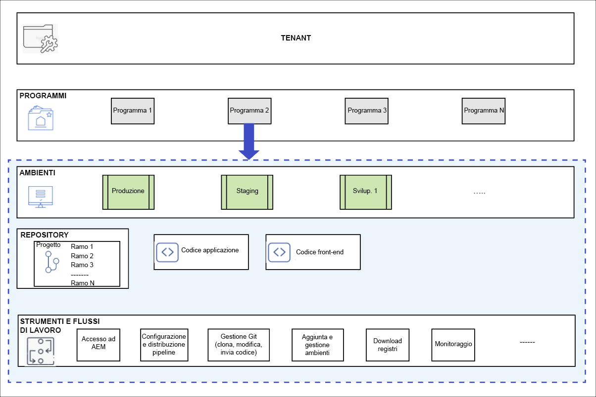

# Programmi e tipi di programmi {#understanding-programs}

Cloud Manager è basato su una gerarchia di entità. I dettagli non sono fondamentali per il lavoro quotidiano in Cloud Manager, ma una panoramica di questo può aiutarti a comprendere i programmi e a configurarne di personalizzati.



* **TENANT** - Parte superiore della gerarchia. A ogni cliente viene fornito un tenant.
* **PROGRAMMI** - Ogni tenant dispone di uno o più programmi, [che spesso riflettono le soluzioni concesse in licenza al cliente](introduction-production-programs.md).
* **AMBIENTI**: ogni programma dispone di più ambienti, come ad esempio quello di produzione di contenuti live, quello di staging e quello di sviluppo.
   * Ogni programma può disporre di un solo ambiente di produzione ma averne diversi non di produzione.
* **ARCHIVIO** - I programmi dispongono di archivi Git in cui vengono mantenuti l&#39;applicazione e il codice front-end degli ambienti.
* **STRUMENTI E FLUSSI DI LAVORO**: le pipeline gestiscono la distribuzione del codice dagli archivi agli ambienti, mentre altri strumenti consentono l’accesso ai registri, il monitoraggio e la gestione degli ambienti.

Un esempio è spesso utile per contestualizzare questa gerarchia.

* WKND Travel and Adventure Enterprises potrebbe essere un **tenant** che si occupa di media legati ai viaggi.
* Il tenant WKND Travel and Adventure Enterprises potrebbe avere due **programmi**: un programma Sites per WKND Magazine e un programma Assets per WKND Media.
* I programmi WKND Magazine e WKND Media potrebbero **ambienti** sia di sviluppo sia di staging e produzione.

## Archivio del codice sorgente {#source-code-repository}

Un programma Cloud Manager viene fornito automaticamente con il proprio archivio Git.

Gli utenti possono accedere all’archivio Git di Cloud Manager utilizzando un client Git con uno strumento della riga di comando o un client Git visivo indipendente. In alternativa, è possibile utilizzare l&#39;IDE (Integrated Development Environment) preferito, ad esempio Eclipse, IntelliJ o NetBeans.

Una volta configurato il client Git, puoi gestire l’archivio Git dall’interfaccia utente di Cloud Manager. Per informazioni su come gestire Git utilizzando l&#39;interfaccia utente di Cloud Manager, vedere [Accesso a Git](/help/implementing/cloud-manager/managing-code/accessing-repos.md).

Per iniziare a sviluppare l’applicazione AEM Cloud, estrai il codice dell’applicazione dall’archivio Cloud Manager al computer locale.

```java
$ git clone {URL}
```

Il flusso di lavoro segue un processo Git standard:

1. Un utente clona l’archivio Git remoto localmente.
1. L’utente apporta le modifiche nel proprio archivio locale.
1. Quando è pronto, l’utente ripristina le modifiche nell’archivio Git remoto.

L’unica differenza è che l’archivio Git remoto fa parte di Cloud Manager, che è trasparente per lo sviluppatore.

## Tipi di programmi {#program-types}

Un utente può creare un programma **production** o un programma **sandbox**.

* Un **programma di produzione** viene creato per abilitare il traffico in tempo reale per il sito.
   * Consulta [Introduzione ai programmi di produzione](/help/implementing/cloud-manager/getting-access-to-aem-in-cloud/introduction-production-programs.md) per ulteriori dettagli.
* I **programmi sandbox** vengono generalmente creati a scopi di formazione, esecuzione di demo, abilitazione, POC o documentazione.
   * Un ambiente sandbox non è concepito per il traffico in tempo reale e presenta limitazioni non riscontrate in un programma di produzione.
   * Include Sites, Assets e Edge Delivery Services ed è precompilato con un ramo Git contenente il codice di esempio, un ambiente di sviluppo e una pipeline non di produzione.
   * Per ulteriori dettagli, consulta [Introduzione ai programmi sandbox](/help/implementing/cloud-manager/getting-access-to-aem-in-cloud/introduction-sandbox-programs.md).
