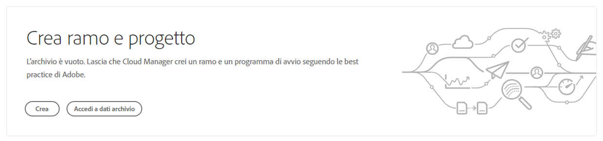
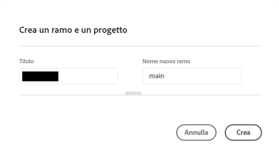
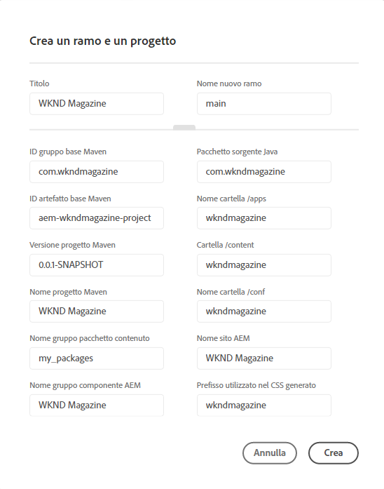
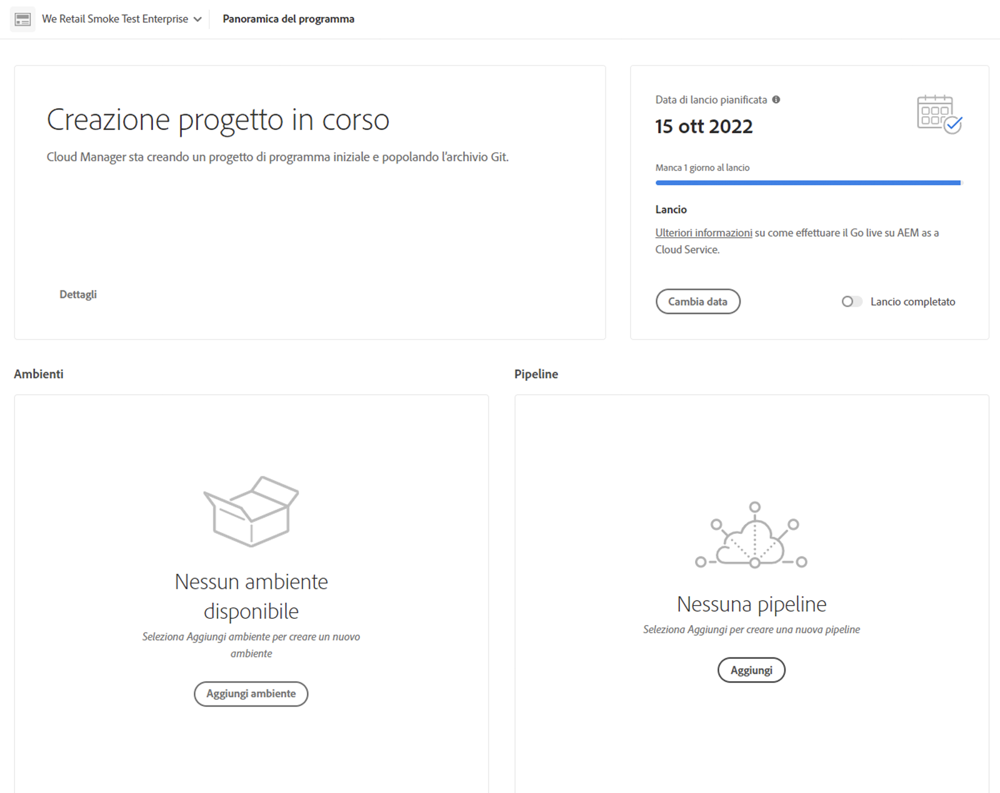
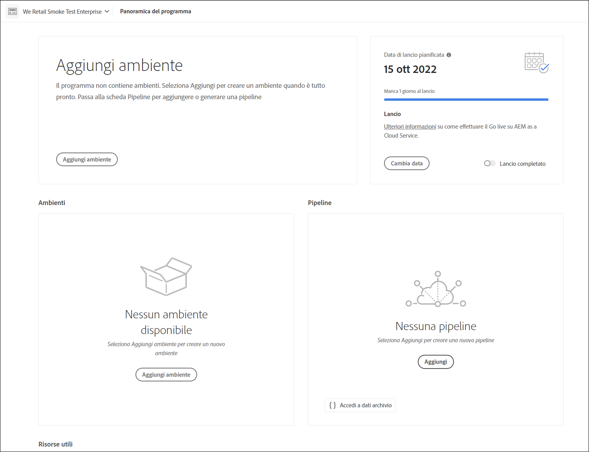

# Creazione guidata di un progetto {#project-creation-wizard}

Dopo aver creato il programma di produzione, Cloud Manager offre una procedura guidata per creare un progetto AEM minimo basato sull’[archetipo del progetto AEM](https://experienceleague.adobe.com/docs/experience-manager-core-components/using/developing/archetype/overview.html?lang=it) e iniziare subito.

Segui questi passaggi per creare un progetto di applicazione AEM in Cloud Manager seguendo la procedura guidata.

1. Crea un programma di produzione seguendo i passaggi riportati nel documento [Creazione di programmi di produzione](creating-production-programs.md)

1. Dopo aver completato la configurazione del programma, accedi alla schermata **Panoramica** del programma e apri la scheda di invito all’azione **Crea ramo e progetto** nella parte superiore.

   

1. Per avviare la procedura guidata, fai clic su **Crea** e, nella finestra **Crea ramo e progetto**, conferma **Titolo** e **Nome nuovo ramo** del progetto.

   

1. Se necessario, fai clic sul divisore per visualizzare i parametri aggiuntivi del progetto. I valori predefiniti vengono forniti dall’archetipo del progetto AEM e in genere non è necessario modificarli.

   

1. Per avviare il processo di creazione del progetto, fai clic su **Crea**.

Ora la scheda **Creazione progetto in corso** sostituisce la scheda di invito all’azione **Crea ramo e progetto** nella parte superiore della schermata **Panoramica programma**.

Dopo aver completato la creazione del programma, la scheda **Aggiungi ambiente** sostituisce la scheda **Creazione del progetto in corso** nella parte superiore della schermata **Panoramica programma**.

Ora hai aggiunto all’archivio Git un progetto AEM basato sull’archetipo AEM, da utilizzare come base di sviluppo per il tuo progetto. Ora puoi creare ambienti in cui distribuire il codice del progetto.

Per informazioni su come aggiungere o gestire gli ambienti, consulta [Gestione degli ambienti](/help/implementing/cloud-manager/manage-environments.md).

>[!NOTE]
>
>La procedura guidata è disponibile solo per i programmi di produzione. Per i [programmi sandbox](introduction-sandbox-programs.md#auto-creation), la procedura guidata non è necessaria in quanto già includono la creazione automatica del progetto.