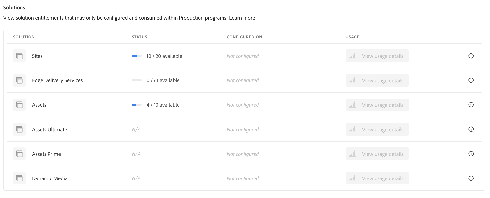

# Dashboard delle licenze {#license-dashboard}

Cloud Manager fornisce una dashboard per visualizzare facilmente i diritti dei prodotti Adobe Experience Manager as a Cloud Service (AEMaaCS) disponibili per la tua organizzazione o tenant.

>[!IMPORTANT]
>
>La dashboard Licenza si applica solo ai programmi AEM as a Cloud Service. [I programmi AMS](https://experienceleague.adobe.com/it/docs/experience-manager-cloud-manager/content/introduction) non sono inclusi nel dashboard delle licenze.
>
>Per determinare il tipo di servizio del programma (AMS o AEMaaCS), vedi [Navigazione nell&#39;interfaccia utente di Cloud Manager](/help/implementing/cloud-manager/navigation.md#program-cards).

## Panoramica {#overview}

La dashboard delle licenze di Cloud Manager consente di accedere facilmente ai diritti delle soluzioni disponibili per tutti i programmi, inclusi ciò che viene utilizzato e ciò che è disponibile. Inoltre, le metriche di consumo delle richieste di contenuto hanno mostrato tendenze mensili per la soluzione Sites.

## Accedere alla dashboard delle licenze {#using-dashboard}

>[!NOTE]
>
>Per visualizzare la dashboard delle licenze, l&#39;utente con il ruolo **Proprietario business** deve aver effettuato l&#39;accesso.

1. Accedi a Cloud Manager all’indirizzo [my.cloudmanager.adobe.com](https://my.cloudmanager.adobe.com/) e seleziona l’organizzazione appropriata.
1. Nella console **[I miei programmi](/help/implementing/cloud-manager/navigation.md#my-programs)**, fai clic su  nell&#39;[Intestazione Cloud Manager](/help/implementing/cloud-manager/navigation.md#cloud-manager-header). Questa azione mostra le schede.
1. Fai clic sull&#39;opzione **Licenza** nella scheda.

La dashboard è divisa in tre sezioni:

* **Soluzioni** - Quali soluzioni hai concesso la licenza. Ad esempio Sites, Edge Delivery Services e Assets.

  

* **Componenti aggiuntivi** - Quali componenti aggiuntivi disponibili per le soluzioni concesse in licenza.
* **Altri diritti** - Quale ambiente sandbox e di sviluppo e altri diritti è possibile utilizzare all&#39;interno del tenant.

Ogni sezione riepiloga ciò che è disponibile e come viene utilizzato, se del caso. Attualmente, anche se nel tenant sono presenti altre soluzioni, vengono visualizzate solo quelle Sites e Assets.

* La colonna **Stato** visualizza il numero di diritti inutilizzati rispetto al totale disponibile per il tenant.
* La colonna **Configurato per** indica i programmi ai quali il diritto per la soluzione è stato applicato.
   * Un diritto viene considerato utilizzato solo quando viene creato un ambiente di produzione. Oppure, se ne esiste una, se è stata eseguita una pipeline di aggiornamento.
   * Solo un numero limitato di programmi è elencato singolarmente nella colonna con il resto rappresentato da una voce `+x`.
   * Passa il puntatore del mouse sulla voce `+x` per visualizzare un popup con i dettagli di tutti i programmi.
* La colonna **Utilizzo** visualizza un pulsante **[Visualizza dettagli sull&#39;utilizzo](#view-usage-details)** per visualizzare le statistiche di utilizzo per la soluzione.

>[!TIP]
>
>Per informazioni su come gestire i diritti Adobe in tutta l&#39;organizzazione da Admin Console, consulta la [panoramica di Admin Console](https://helpx.adobe.com/it/enterprise/using/admin-console.html).

## Visualizza i dettagli sull’utilizzo {#view-usage-details}

<!--
The **View usage details** button gives access to the chosen solution's **Usage Details** window. This window gives a detailed breakdown including charts to show your solution's usage. How that usage is measured depends on the chosen solution. -->

Il pulsante **Visualizza dettagli sull&#39;utilizzo** nell&#39;area Licenza di Cloud Manager fornisce un&#39;analisi dettagliata dell&#39;utilizzo corrente delle risorse. Se cliccato, si apre un report o un dashboard che mostra metriche importanti relative alla licenza. <!-- ADD THIS SENTENCE IF ASSETS USAGE DETAILS GETS REINSTATED ", such as the number of users, storage consumption, or bandwidth usage, depending on the type of services you're using." --> Questa funzionalità consente di monitorare e assicurarsi di rimanere entro i limiti del contratto, offrendo al contempo informazioni approfondite per una migliore pianificazione e ottimizzazione delle risorse.

### Dettagli sull’utilizzo di Sites {#sites-usage-details}

La finestra **Dettagli sull&#39;utilizzo di Sites** presenta grafici che offrono una panoramica dell&#39;utilizzo delle licenze di Sites in base a [richieste di contenuto](#what-is-a-content-request).

Il lato sinistro della finestra presenta un grafico a torta che mostra il raggruppamento del contratto per l&#39;anno contrattuale selezionato nel menu a discesa **Visualizza anno contrattuale**.

Il lato destro della finestra presenta un grafico ad area che mostra l&#39;utilizzo suddiviso per programma nel tempo per l&#39;anno di contratto selezionato. Al passaggio del mouse viene visualizzata una finestra a comparsa con i dettagli del programma per il momento selezionato.

Nell&#39;angolo superiore destro della pagina del dashboard, puoi fare clic su **Scarica report** per esportare i dati come file CSV. Questo download semplifica l’analisi e la condivisione delle tendenze di utilizzo.

<!-- REMOVED AS PER CQDOC-21983
### Assets usage details {#assets-usage-details}

The **Assets usage details** window, presents graphs giving an overview of the usage of your Assets licenses based on [storage](#storage) and [standard users](#standard-users). Select the appropriate tab to toggle between the views.

For both storage and standard users views, you can use the **Environment Type** dropdown to toggle the view between production, stage, and development environments.

#### Storage {#storage}

The left side of the window presents a pie chart showing the contract breakdown for the contract year selected in the **View contract year** dropdown.

The right side of the window presents an area chart showing the usage broken down by program over time for the selected contract year. A hover reveals a popup with details per program for the selected point in time.

#### Standard Users {#standard-users}

The left side of the window presents a pie chart showing the contract breakdown for the contract year selected in the **View contract year** dropdown.

The right side of the window presents an area chart showing the usage broken down by program over time for the selected contract year. A hover reveals a popup with details per program for the selected point in time. -->

## Domande frequenti {#faq}

### Che cos’è una richiesta di contenuto?{#what-is-a-content-request}

Per richiesta di contenuto si intende qualsiasi richiesta indirizzata ad AEM Sites o a un sistema di caching fornito dal cliente, ad esempio una rete per la distribuzione di contenuti. Recupera contenuto o dati in formato HTML per le visualizzazioni di pagina. Oppure in formato JSON per le chiamate API.

Viene conteggiata una richiesta di contenuto per ogni visualizzazione di pagina o per ogni cinque chiamate API, misurate all’ingresso del primo sistema di caching che riceve una richiesta di contenuto. Le richieste di contenuto vengono conteggiate solo per gli ambienti di produzione.

Le richieste di contenuto escludono le richieste o le attività avviate da o per conto di Adobe al solo scopo di fornire prodotti e servizi. È escluso anche il traffico dell’agente utente identificato da Adobe come proveniente da bot, crawler e spider relativi ai comuni motori di ricerca e servizi di social media.

Vedi anche [Comprendere le richieste di contenuto di Cloud Service](/help/implementing/cloud-manager/content-requests.md).

### In che modo Adobe Experience Manager misura le richieste di contenuto?{#how-are-content-requests-measured}

Le richieste di contenuto vengono tracciate sui server Edge di AEM as a Cloud Service. Il traffico di origine non viene conteggiato per le richieste di contenuto. La rete CDN integrata in AEM as a Cloud Service traccia le richieste HTML e JSON valide.

AEM inoltre offre regole per escludere bot noti, tra cui servizi noti che visitano regolarmente il sito per aggiornare l’indice di ricerca o il servizio.

Vedi anche [Informazioni sulle richieste di contenuto di Cloud Service](/help/implementing/cloud-manager/content-requests.md).

### Perché il rapporto di Analytics mostra risultati diversi rispetto alle richieste di contenuto di AEM?{#why-are-reports-different}

Le richieste di contenuto possono presentare varianze con gli strumenti di reporting di Analytics di un’organizzazione. Per ulteriori informazioni, vedere [Informazioni sulle richieste di contenuto di Cloud Service](/help/implementing/cloud-manager/content-requests.md).

### Come posso ottenere ulteriori informazioni sul volume di richieste di contenuto?{#current-request-volumes}

Se desideri ulteriori informazioni sul volume di richieste di contenuto visualizzato nella dashboard Licenza, il team di Adobe può fornire un rapporto che mostra i principali driver di volume delle richieste di contenuto. Rivolgiti al tuo team di Adobe o all’Assistenza clienti di Adobe per richiedere un rapporto sull’utilizzo ottimale.

### Cosa succede se utilizzo una mia rete CDN?{#using-own-cdn}

La dashboard Licenze mostra solo i dati tracciati dalla rete CDN di Cloud Service. Se scegli di usare una tua rete CDN (BYOCDN), devi segnalare il volume di richieste di contenuto ad Adobe su base annuale, come indicato nel contratto.

