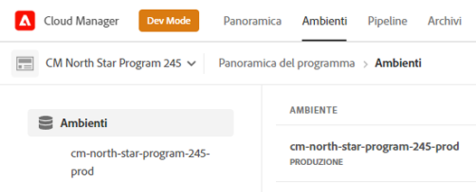
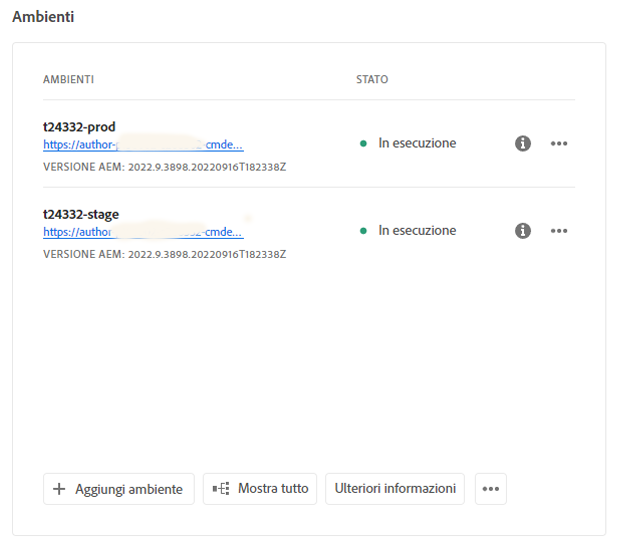
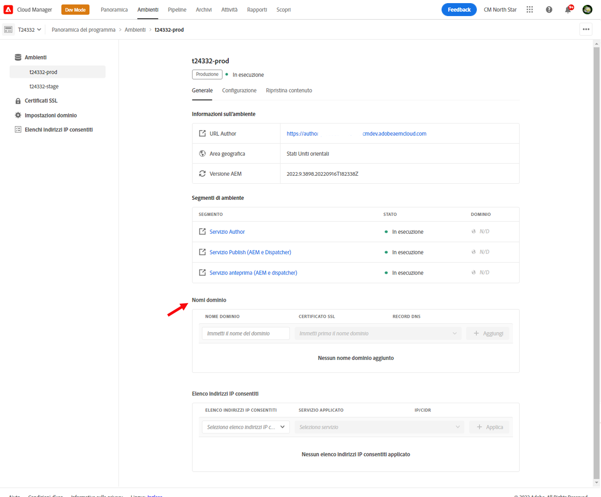

# Gestione degli ambienti {#managing-environments}

Scopri i tipi di ambienti che puoi creare per il tuo progetto Cloud Manager e come farlo.

## Tipi di ambienti {#environment-types}

L’utente con le autorizzazioni necessarie può creare i seguenti tipi di ambienti (entro i limiti delle opzioni disponibili per il tenant specifico).

* **Produzione e staging** - Gli ambienti di produzione e di staging sono disponibili in coppia e vengono utilizzati rispettivamente a scopo di produzione e test.

* **Sviluppo**: è possibile creare un ambiente di sviluppo sia per scopi di sviluppo sia per scopi di test e associarlo solo a pipeline non di produzione.

* **Sviluppo rapido** - Un ambiente di sviluppo rapido (RDE, rapid development environment) consente allo sviluppatore di implementare e rivedere rapidamente le modifiche, riducendo al minimo il tempo necessario per testare le funzioni che hanno dimostrato di funzionare in un ambiente di sviluppo locale. Consulta [documentazione dell’ambiente di sviluppo rapido](/help/implementing/developing/introduction/rapid-development-environments.md) per informazioni dettagliate sull&#39;utilizzo di un RDE.

Le funzionalità dei singoli ambienti dipendono dalle soluzioni abilitate in [programma](/help/implementing/cloud-manager/getting-access-to-aem-in-cloud/program-types.md) dell&#39;ambiente.

* [Sites](/help/sites-cloud/home.md)
* [Assets](/help/assets/home.md)
* [Forms](/help/forms/home.md)
* [Screens](/help/screens-cloud/home.md)

>[!NOTE]
>
>Gli ambienti di produzione e staging vengono creati solo in coppia. Non è possibile creare solo un ambiente di staging o solo un ambiente di produzione.

## Aggiunta di un ambiente {#adding-environments}

1. Accedi a Cloud Manager all’indirizzo [my.cloudmanager.adobe.com](https://my.cloudmanager.adobe.com/) e seleziona l’organizzazione appropriata.

1. Fai clic sul programma al quale desideri aggiungere un ambiente.

1. Per aggiungere un programma, dalla pagina **Panoramica del programma**, accedi alla scheda **Ambienti** e fai clic su **Aggiungi ambiente**.

   

   * L’opzione **Aggiungi ambiente** è disponibile anche nella scheda **Ambienti**.

      

   * L’opzione **Aggiungi ambiente** potrebbe essere disattivata per mancanza di autorizzazioni o a seconda delle risorse concesse in licenza.

1. Nella finestra di dialogo **Aggiungi ambiente** che viene visualizzata:

   * Seleziona un [**tipo di ambiente**.](#environment-types)
      * Il numero di ambienti disponibili/utilizzati viene visualizzato tra parentesi dopo il nome del tipo di ambiente.
   * Fornire un ambiente **Nome**.
   * Fornire un ambiente **Descrizione**.
   * Seleziona un **Area geografica primaria** dal menu a discesa.
      * Nota che questo non può essere modificato dopo la creazione.
   * Se stai aggiungendo una **Produzione e staging** è necessario fornire un nome e una descrizione dell’ambiente sia per l’ambiente di produzione che per quello di staging.
      

1. Per aggiungere l’ambiente specificato, fai clic su **Salva**.

Ora il nuovo ambiente viene visualizzato nella schermata **Panoramica** della scheda **Ambienti**. Ora puoi configurare le pipeline per il nuovo ambiente.

## Dettagli dell’ambiente {#viewing-environment}

La scheda **Ambienti** nella pagina della panoramica consente di accedere ai dettagli di un ambiente in due modi.

1. Dalla pagina **Panoramica**, fai clic sulla scheda **Ambienti** nella parte superiore della schermata.

   

   * In alternativa, per passare direttamente alla scheda **Ambienti**, fai clic sul pulsante **Mostra tutto** nella scheda **Ambienti**.

      

1. La scheda **Ambienti** apre ed elenca tutti gli ambienti del programma.

   

1. Fai clic su un ambiente dell’elenco per visualizzarne i dettagli.

   

In alternativa, fai clic sul pulsante con i puntini di sospensione dell’ambiente desiderato, quindi seleziona **Visualizza dettagli**.

>[!NOTE]
>
>Nella scheda **Ambienti** sono elencati solo tre ambienti. Per visualizzare tutti gli ambienti del programma, fai clic sul pulsante **Mostra tutto** come descritto in precedenza.

### Accesso al servizio di anteprima {#access-preview-service}

Cloud Manager fornisce un servizio di anteprima (fornito come servizio di pubblicazione aggiuntivo) per ogni ambiente di AEM as a Cloud Service.

Con il servizio puoi visualizzare in anteprima l’esperienza finale di un sito web prima di aggiungerla all’ambiente di pubblicazione effettivo e renderla disponibile agli utenti.

Al momento della creazione, al servizio di anteprima viene applicato un elenco IP consentiti predefinito, denominato `Preview Default [<envId>]`, che blocca tutto il traffico verso il servizio. Per abilitare l’accesso, rimuovi l’elenco IP consentiti predefinito dal servizio di anteprima.

Per garantire l’accesso al servizio di anteprima, prima di condividerlo l’utente con le autorizzazioni necessarie deve completare i passaggi seguenti.

1. Crea un elenco IP consentiti appropriato, applicalo al servizio di anteprima e rimuovi immediatamente l’elenco Consentiti `Preview Default [<envId>]`.

   * Per ulteriori informazioni, consulta il documento [Applicazione e rimozione degli elenchi IP consentiti](/help/implementing/cloud-manager/ip-allow-lists/apply-allow-list.md).

1. Rimuovi l’IP predefinito e aggiungi gli IP appropriati con il flusso di lavoro per l’aggiornamento dell’**elenco IP consentiti**. Per ulteriori informazioni, consulta [Gestione degli elenchi IP consentiti](/help/implementing/cloud-manager/ip-allow-lists/managing-ip-allow-lists.md).

Una volta sbloccato l’accesso al servizio di anteprima, l’icona a forma di lucchetto davanti al nome del servizio non viene più visualizzata.

Dopo l’attivazione puoi pubblicare il contenuto nel servizio di anteprima tramite l’interfaccia utente Gestisci pubblicazione in AEM. Per ulteriori informazioni, consulta il documento [Anteprima del contenuto](/help/sites-cloud/authoring/fundamentals/previewing-content.md).

>[!NOTE]
>
>La versione dell’ambiente deve essere AEM `2021.05.5368.20210529T101701Z` o più recente per utilizzare il servizio di anteprima. Per eseguire l’operazione, assicurati che nell’ambiente sia stata eseguita correttamente una pipeline di aggiornamento.

## Aggiornamento degli ambienti {#updating-dev-environment}

Come servizio nativo per il cloud, Adobe gestisce automaticamente gli aggiornamenti degli ambienti di staging e produzione all’interno dei programmi di produzione.

Tuttavia, gli aggiornamenti degli ambienti di sviluppo e degli ambienti nei programmi sandbox vengono gestiti internamente ai programmi. Se in tale ambiente non è in esecuzione l’ultima versione di AEM disponibile pubblicamente, lo stato nella scheda **Ambienti** della schermata **Panoramica** del programma indica **Aggiornamento disponibile**.

### Aggiornamenti e pipeline {#updates-pipelines}

Le pipeline sono l’unico modo per [distribuire il codice negli ambienti di AEM as a Cloud Service.](deploy-code.md) Per questo motivo, ogni pipeline è associata a una particolare versione di AEM.

Se Cloud Manager rileva che è disponibile una versione di AEM più recente rispetto all’ultima distribuita con la pipeline, viene visualizzato lo stato **Aggiornamento disponibile** per l’ambiente.

Il processo di aggiornamento è quindi articolato in due fasi:

1. Aggiornamento della pipeline all’ultima versione di AEM
1. Esecuzione della pipeline per distribuire la nuova versione di AEM in un ambiente

### Aggiornamento degli ambienti {#updating-your-environments}

Per gli ambienti di sviluppo e gli ambienti nei programmi sandbox, facendo clic sul pulsante con i puntini di sospensione nella scheda **Ambienti** è disponibile l’opzione **Aggiorna**.

L’opzione è disponibile anche facendo clic sulla scheda **Ambienti** del programma e selezionando il pulsante con i puntini di sospensione corrispondente all’ambiente.

Con quest’opzione, l’utente con il ruolo **Responsabile dell’implementazione** può aggiornare alla versione di AEM più recente la pipeline associata a questo ambiente.

Dopo aver aggiornato la pipeline alla versione di AEM più recente disponibile al pubblico, viene richiesto di eseguire la pipeline associata per distribuire la suddetta versione nell’ambiente.

Il comportamento dell’opzione **Aggiorna** varia a seconda della configurazione e dello stato corrente del programma.

* Se la pipeline è già stata aggiornata, l’opzione **Aggiorna** richiede all’utente di eseguire la pipeline.
* Se l’aggiornamento della pipeline è già in corso, l’opzione **Aggiorna** informa l’utente circa la presenza di un aggiornamento in corso.
* Se non esiste una pipeline appropriata, l’opzione **Aggiorna** richiede all’utente di crearne una.

## Eliminazione degli ambienti di sviluppo {#deleting-environment}

L’utente con le autorizzazioni necessarie può eliminare un ambiente di sviluppo.

Dalla schermata **Panoramica** del programma, accedi alla scheda **Ambienti** e fai clic sul pulsante con i puntini di sospensione corrispondente all’ambiente che desideri eliminare.

L’opzione Elimina è disponibile anche dalla scheda **Ambienti** della finestra **Panoramica** del programma. Fai clic sul pulsante con i puntini di sospensione corrispondente all’ambiente e seleziona **Elimina**.

>[!NOTE]
>
>* Non è possibile eliminare gli ambienti di produzione e di staging creati in un programma di produzione.
>* È possibile eliminare gli ambienti di produzione e di staging contenuti in un programma sandbox.

## Gestione dell’accesso {#managing-access}

Dal menu con i puntini di sospensione dell’ambiente nella scheda **Ambienti**, seleziona **Gestisci accesso**. Puoi accedere direttamente all’istanza di authoring e gestire l’accesso all’ambiente.

## Accesso a Console sviluppatori {#accessing-developer-console}

Dal menu con i puntini di sospensione dell’ambiente nella scheda **Ambienti**, seleziona **Console sviluppatori**. Si apre una nuova scheda nel browser con la pagina di accesso a **Console sviluppatori**.

Solo gli utenti con il ruolo **Sviluppatore** possono accedere a **Console sviluppatori**. Tuttavia, per i programmi sandbox, tutti gli utenti con accesso al programma sandbox hanno accesso a **Console sviluppatori**.

Per ulteriori informazioni, consulta il documento [Sospensione e riattivazione degli ambienti sandbox](https://experienceleague.adobe.com/docs/experience-manager-cloud-service/onboarding/getting-access/cloud-service-programs/sandbox-programs.html?lang=it#hibernating-introduction).

Questa opzione è disponibile anche nella scheda **Ambiente** della finestra **Panoramica**, facendo clic sul menu con i puntini di sospensione dell’ambiente di interesse.

## Accesso locale {#login-locally}

Per accedere a Adobe Experience Manager a livello locale, fai clic sul menu con i puntini di sospensione dell’ambiente nella scheda **Ambienti** e seleziona **Accesso locale**.

È possibile accedere a livello locale anche dalla scheda **Ambienti** della pagina **Panoramica**.

## Gestione dei nomi di dominio personalizzati {#manage-cdn}

I nomi di dominio personalizzati sono supportati in Cloud Manager per i programmi Sites, sia per i servizi di pubblicazione sia per quelli di anteprima. Ogni ambiente di Cloud Manager può ospitare fino a un massimo di 250 domini personalizzati.

Per configurare i nomi di dominio personalizzati, accedi alla scheda **Ambienti** e fai clic su un ambiente per visualizzare i relativi dettagli.

Nell’ambito del servizio di pubblicazione dell’ambiente, è possibile eseguire le azioni indicate di seguito.

* [Aggiunta di un nome di dominio personalizzato](/help/implementing/cloud-manager/custom-domain-names/add-custom-domain-name.md)

* [Gestione dei nomi di dominio personalizzati](/help/implementing/cloud-manager/custom-domain-names/managing-custom-domain-names.md)

* [Controllo dello stato del nome di dominio personalizzato](/help/implementing/cloud-manager/custom-domain-names/check-domain-name-status.md#pre-existing-cdn) o di un [certificato SSL](/help/implementing/cloud-manager/managing-ssl-certifications/managing-certificates.md#pre-existing-cdn).

* [Gestione degli elenchi IP consentiti](/help/implementing/cloud-manager/ip-allow-lists/managing-ip-allow-lists.md#pre-existing-cdn)

## Gestione degli elenchi IP consentiti {#manage-ip-allow-lists}

Gli elenchi IP consentiti sono supportati in Cloud Manager per i servizi di Author, Publish e anteprima dei programmi Sites.

Per gestire gli elenchi IP consentiti, accedi alla scheda **Ambienti** della pagina **Panoramica** del programma. Fai clic su un ambiente per gestire i relativi dettagli.

### Applicazione di un elenco IP consentiti {#apply-ip-allow-list}

Applicando un elenco IP consentiti, tutti gli intervalli IP inclusi nella definizione dell’elenco vengono associati a un servizio Author o Publish in un ambiente. Per applicare un elenco IP consentiti, l’utente con il ruolo **Proprietario business** o **Responsabile dell’implementazione** deve aver effettuato l’accesso.

Per poter applicare l’elenco IP consentiti a un ambiente, l’elenco deve esistere in Cloud Manager. Per ulteriori informazioni sugli elenchi IP consentiti in Cloud Manager, consulta il documento [Introduzione agli elenchi IP consentiti in Cloud Manager.](/help/implementing/cloud-manager/ip-allow-lists/introduction.md)

Per applicare un elenco IP consentiti, segui la procedura riportata di seguito.

1. Dalla scheda **Ambienti** della schermata **Panoramica** del programma, accedi all’ambiente specifico e seleziona la tabella **Elenco IP consentiti**.
1. Seleziona l’elenco IP consentiti e il servizio Author o Publish che desideri applicare con i campi di immissione nella parte superiore della tabella Elenco IP consentiti.
1. Fai clic su **Applica** e conferma quanto inserito.

### Rimozione di un elenco IP consentiti {#unapply-ip-allow-list}

Rimuovendo un elenco IP consentiti, tutti gli intervalli IP inclusi nella definizione dell’elenco vengono rimossi da un servizio Author o Publish in un ambiente. Per rimuovere un elenco IP consentiti, l’utente con il ruolo **Proprietario business** o **Responsabile dell’implementazione** deve aver effettuato l’accesso.

Per rimuovere un elenco IP consentiti, segui la procedura riportata di seguito.

1. Dalla scheda **Ambienti** della schermata **Panoramica** del programma, accedi all’ambiente specifico e seleziona la tabella **Elenco IP consentiti**.
1. Individua la riga corrispondente alla regola dell’elenco IP consentiti che desideri rimuovere.
1. Seleziona il pulsante con i puntini di sospensione alla fine della riga.
1. Seleziona **Annulla applicazione** e conferma quanto inserito.
