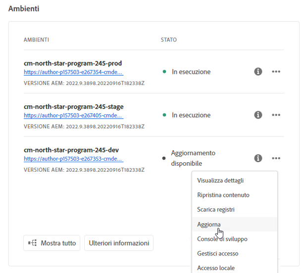
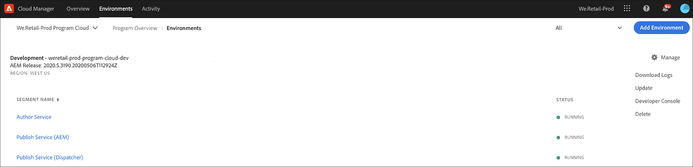
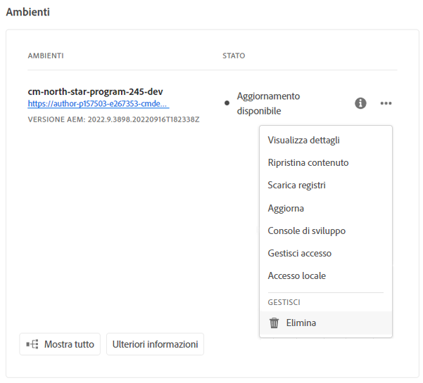
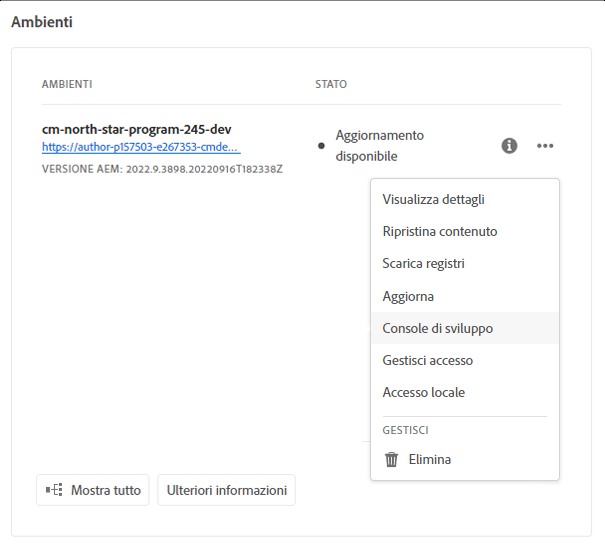

# Gestione degli ambienti {#manage-environments}

La sezione seguente descrive i tipi di ambiente che un utente può creare e come l&#39;utente può creare un ambiente.

## Tipi di ambiente {#environment-types}

Un utente con le autorizzazioni richieste può creare i seguenti tipi di ambiente (entro i limiti di ciò che è disponibile per il tenant specifico).

* **Ambiente**di produzione e fase:
La produzione e lo stage sono disponibili come due elementi e sono utilizzati a scopo di test e produzione.

* **Sviluppo**: Un ambiente di sviluppo può essere creato a scopo di sviluppo e test e sarà associato solo a condotte non di produzione.

   >[!NOTE]
   >Un ambiente di sviluppo creato automaticamente in un programma sandbox sarà configurato per includere le soluzioni Siti e Risorse.

   Nella tabella seguente sono riepilogati i tipi di ambiente e i relativi attributi:

   | Nome | Livello autore | Pubblica livello | Utente può creare | L&#39;utente può eliminare | Pipeline che può essere associata all&#39;ambiente |
   |--- |--- |--- |--- |---|---|
   | Produzione | Sì | Sì se Siti inclusi | Sì | No | pipeline di produzione |
   | Area di visualizzazione | Sì | Sì se Siti inclusi | Sì | No | pipeline di produzione |
   | Sviluppo | Sì | Sì se Siti inclusi | Sì | Sì | pipeline non di produzione |

   >[!NOTE]
   >La produzione e lo stage sono disponibili come due elementi e sono utilizzati a scopo di test e produzione.  L&#39;utente non sarà in grado di creare solo l&#39;ambiente Stage o solo l&#39;ambiente Production.

## Aggiunta di un ambiente {#adding-environments}

1. Fate clic su **Aggiungi ambiente** per aggiungere un ambiente. Questo pulsante è accessibile dalla schermata **Ambienti** .
   

   L&#39;opzione **Aggiungi ambiente** è disponibile anche nella scheda **Ambienti** , se il programma non contiene ambienti.

   

   >[!NOTE]
   >L&#39;opzione **Aggiungi ambiente** verrà disattivata in base alla mancanza di autorizzazioni o agli eventuali contratti.

1. Viene visualizzata la finestra di dialogo **Aggiungi ambiente**. L’utente deve inviare dettagli quali **tipo di ambiente**, **nome dell’ambiente** e **descrizione dell’ambiente** (a seconda dell’obiettivo dell’utente nella creazione dell’ambiente ed entro i limiti di ciò che è disponibile per il tenant specifico).

   

   >[!NOTE]
   >Durante la creazione di un ambiente, in Adobe I/O vengono create una o più *integrazioni* . Questi sono visibili agli utenti del cliente che hanno accesso alla console di I/O di Adobe e non devono essere eliminati. Questo viene negato nella descrizione nella console di I/O di Adobe.

   

1. Fate clic su **Salva** per aggiungere un ambiente con i criteri popolati.  Ora nella schermata *Panoramica* viene visualizzata la scheda da cui è possibile impostare la pipeline.

   >[!NOTE]
   >Se non avete ancora impostato la pipeline di non produzione, nella schermata *Panoramica* viene visualizzata la scheda da cui potete creare la pipeline non di produzione.

## Aggiornamento dell&#39;ambiente {#updating-dev-environment}

Gli aggiornamenti degli ambienti Stage e Produzione vengono gestiti automaticamente da Adobe.

Gli aggiornamenti agli ambienti di sviluppo sono gestiti dagli utenti del programma. Se un ambiente non esegue l’ultima versione di AEM disponibile al pubblico, lo stato della scheda Ambienti nella Home Screen mostra **AGGIORNAMENTO DISPONIBILE**.

L&#39;opzione **Aggiorna** è disponibile dal menu a discesa nella scheda **Ambienti** .
Questa opzione è disponibile anche dal pulsante **Gestisci** , se fate clic su **Dettagli** dalla scheda **Ambienti** .

Selezionando questa opzione dal menu a discesa, un gestore distribuzione potrà aggiornare la pipeline associata a questo ambiente alla versione più recente ed eseguire la pipeline.

Se la pipeline è già stata aggiornata, all&#39;utente viene richiesto di eseguire la pipeline.

## Eliminazione dell&#39;ambiente {#deleting-environment}

L&#39;utente con le autorizzazioni necessarie sarà in grado di eliminare un ambiente di sviluppo.

L&#39;opzione **Elimina** è disponibile dal menu a discesa nella scheda **Ambienti** .
Questa opzione è disponibile anche dal pulsante **Gestisci** , se fate clic su **Dettagli** dalla scheda **Ambienti** .

>[!NOTE]
Questa funzione non è disponibile per l&#39;ambiente Produzione/Fase impostato in un programma regolare impostato a scopo di produzione. La funzione è tuttavia disponibile per gli ambienti Produzione/Fase in un programma sandbox.

## Accesso alla console per sviluppatori {#accessing-developer-console}

Selezionate **Developer Console** dal menu a discesa nella scheda **Ambienti** .

Potete anche selezionare questa opzione dal pulsante **Gestisci** , se fate clic su **Dettagli** dalla scheda **Ambienti** .

