# Gestire gli ambienti {#managing-environments}

Scopri i tipi di ambienti che puoi creare per il tuo progetto Cloud Manager e come farlo.

## Tipi di ambiente {#environment-types}

L’utente con le autorizzazioni necessarie può creare i seguenti tipi di ambienti (entro i limiti delle opzioni disponibili per il tenant specifico).

| Tipo di ambiente | Descrizione |
| --- | --- |
| **Produzione + Stage** | Gli ambienti di produzione e di staging sono disponibili in coppia e vengono utilizzati rispettivamente a scopo di produzione e test. Esecuzione di test di prestazioni e sicurezza nell&#39;ambiente stage. Ha le stesse dimensioni della produzione. |
| **Sviluppo** | È possibile creare un ambiente di sviluppo a scopo di sviluppo e test e associarlo solo a pipeline non di produzione. Gli ambienti di sviluppo non hanno le stesse dimensioni di quelli di staging e produzione e non devono essere utilizzati per eseguire test di prestazioni e sicurezza. |
| **Sviluppo rapido** | Un ambiente di sviluppo rapido (RDE, Rapid Development Environment) consente agli sviluppatori di implementare e rivedere rapidamente le modifiche. Questa funzionalità riduce il tempo necessario per testare le funzionalità già convalidate in un ambiente di sviluppo locale. Consulta [la documentazione sull’ambiente di sviluppo rapido](/help/implementing/developing/introduction/rapid-development-environments.md) per ottenere informazioni dettagliate sull’utilizzo di un RDE. |
| **Ambiente di testing specializzato** | Gli ambienti di test specializzati forniscono uno spazio dedicato per convalidare le funzioni in condizioni di produzione prossime alla produzione, ideale per i test di stress e i controlli avanzati di pre-distribuzione. Consulta [Aggiungere un ambiente di test specializzato](/help/implementing/cloud-manager/specialized-test-environment.md) |

>[!NOTE]
>
>La funzionalità **Ambiente di test specializzato** è attualmente disponibile solo tramite il programma beta privato. Per iscriverti alla versione beta privata, consulta [Ambiente di test specializzato](/help/implementing/cloud-manager/release-notes/current.md#specialized-test-environment).

Le funzionalità dei singoli ambienti dipendono dalle soluzioni abilitate nel [programma](/help/implementing/cloud-manager/getting-access-to-aem-in-cloud/program-types.md) dell&#39;ambiente.

* [Sites](/help/overview/introduction.md)
* [Assets](/help/assets/overview.md)
* [Forms](/help/forms/home.md)
* [Screens](/help/screens-cloud/introduction/introduction.md)

>[!NOTE]
>
>Gli ambienti di produzione e staging vengono creati solo in coppia. Non è possibile creare un ambiente di sola produzione o di sola gestione temporanea.

## Aggiungere un ambiente {#adding-environments}

Per aggiungere o modificare un ambiente, un utente deve essere membro del ruolo **Proprietario business**.

**Per aggiungere un ambiente:**

1. Accedi a Cloud Manager all’indirizzo [my.cloudmanager.adobe.com](https://my.cloudmanager.adobe.com/) e seleziona l’organizzazione appropriata.

1. Nella console **[Programmi](/help/implementing/cloud-manager/navigation.md#my-programs)** fare clic sul programma per il quale si desidera aggiungere un ambiente.

1. Effettua una delle seguenti operazioni:

   Se l&#39;opzione **Aggiungi ambiente** è disattivata (disabilitata), è possibile che non disponga delle autorizzazioni necessarie o che dipenda dalle risorse con licenza.

   * Nella console **[Programmi](/help/implementing/cloud-manager/navigation.md#my-programs)**, nella scheda **Ambienti**, fare clic su **Aggiungi ambiente**.

   

   * Nel pannello a sinistra, fai clic sull&#39;icona  **Ambienti**, quindi nella pagina Ambienti, nell&#39;angolo superiore destro, fai clic su **Aggiungi ambiente**.

     

1. Nella finestra di dialogo **Aggiungi ambiente** eseguire le operazioni seguenti:

   * Selezionare un tipo di ambiente [**&#128279;**](#environment-types). Il numero di ambienti disponibili/utilizzati è visualizzato tra parentesi dopo il nome del tipo di ambiente.
   * Fornisci un ambiente **Nome**. Una volta creato l’ambiente, non è possibile modificarne il nome.
   * Fornisci una **Descrizione** facoltativa per l&#39;ambiente.
   * Se stai aggiungendo un ambiente di **produzione e fase**, è necessario fornire un nome ambiente e una descrizione sia per l’ambiente di produzione che per quello di staging.
   * Seleziona una **area geografica primaria** dal menu a discesa. Dopo la creazione, non è possibile modificare l’area primaria. Inoltre, a seconda dei diritti disponibili, è possibile configurare [più aree geografiche](#multiple-regions).

   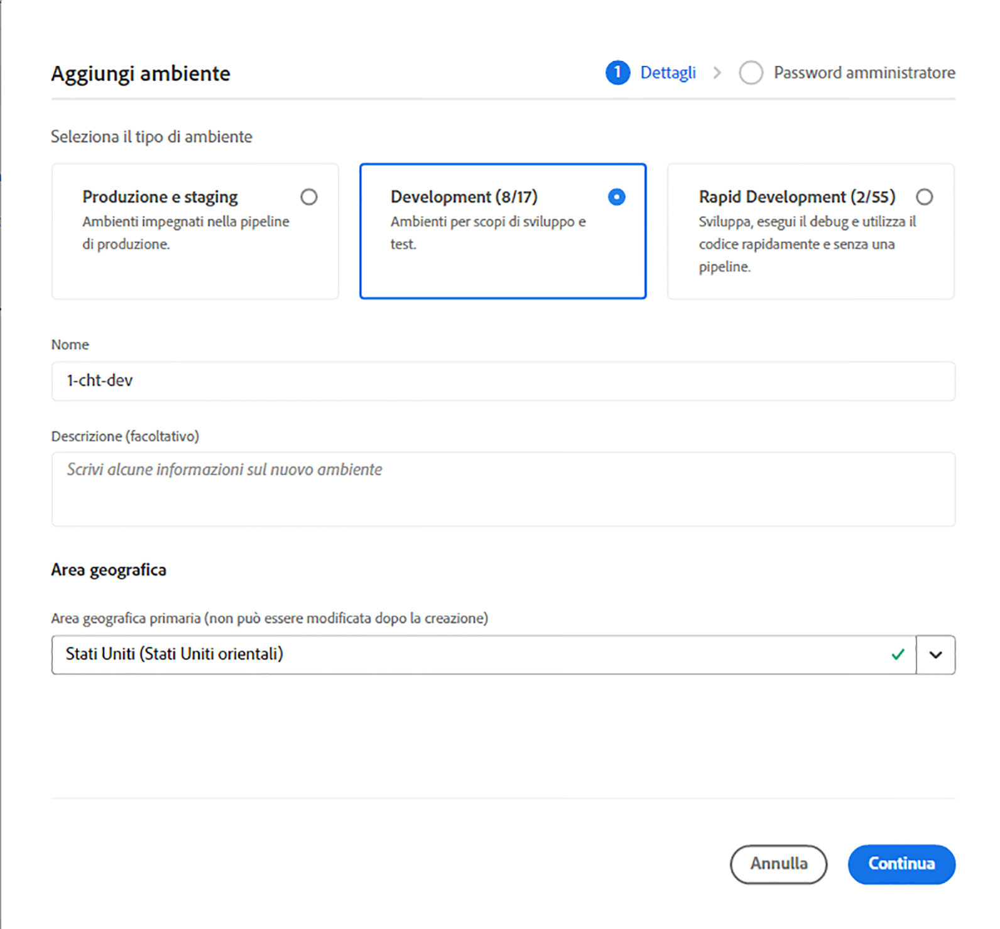

1. Fai clic su **Salva**.

Nella pagina **Panoramica** il nuovo ambiente viene ora visualizzato nella scheda **Ambienti**. Ora puoi configurare le pipeline per il nuovo ambiente.

## Più aree geografiche di pubblicazione {#multiple-regions}

Un utente con il ruolo di **Proprietario business** può configurare gli ambienti di produzione e di staging in modo da includere fino a tre aree geografiche di pubblicazione aggiuntive, oltre all’area geografica primaria. Aree geografiche di pubblicazione aggiuntiva possono migliorare la disponibilità. Consulta la [Documentazione sulle aree geografiche di pubblicazione aggiuntiva](/help/operations/additional-publish-regions.md) per ulteriori dettagli.

>[!TIP]
>
>Puoi utilizzare l’[API di Cloud Manager](https://developer.adobe.com/experience-cloud/cloud-manager/guides/api-usage/creating-programs-and-environments/#creating-aem-cloud-service-environments.it) per eseguire una query su un elenco corrente di aree geografiche disponibili.

### Aggiungere più aree geografiche di pubblicazione a un nuovo ambiente {#add-regions}

Quando aggiungi un nuovo ambiente, puoi scegliere di configurare aree geografiche aggiuntive oltre all’area geografica primaria.

1. Seleziona l’**Area geografica principale**.
   * Dopo la creazione dell’ambiente, non è possibile modificare l’area geografica primaria.
1. Seleziona l’opzione **Aggiungi aree geografiche di pubblicazione aggiuntive**. In questo modo verrà visualizzato un nuovo menu a discesa **Aree geografiche di pubblicazione aggiuntive**.
1. Nel menu a discesa **Aree geografiche di pubblicazione aggiuntive**, seleziona un’area geografica aggiuntiva.
1. L’area geografica selezionata viene aggiunta sotto il menu a discesa per indicarne la selezione.
   * Selezionare `X` accanto all&#39;area selezionata per deselezionarla.
1. Seleziona un’altra area geografica dal menu a discesa **Aree geografiche di pubblicazione aggiuntiva** per aggiungere un’altra area geografica.
1. Seleziona **Salva** quando sei pronto per creare il tuo ambiente.

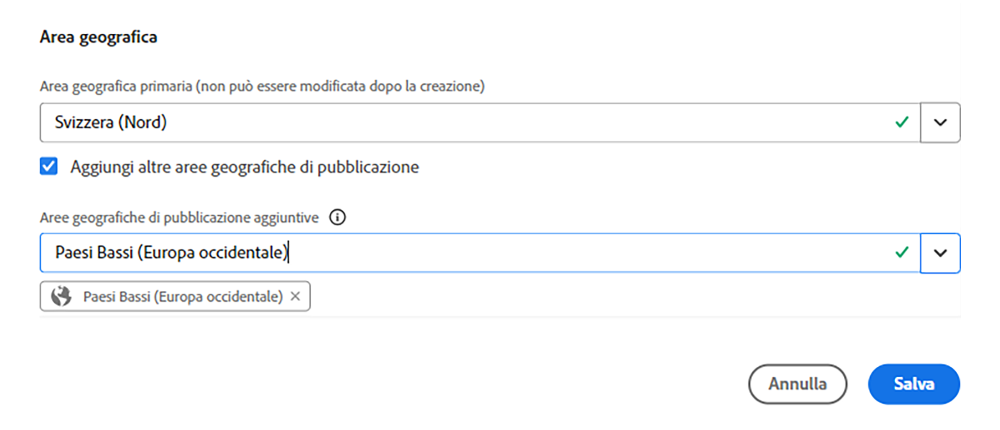

Le aree geografiche selezionate verranno applicate agli ambienti di produzione e di staging.

Se non si specificano altre aree, [sarà possibile farlo in seguito dopo la creazione degli ambienti](#edit-regions).

Se desideri effettuare il provisioning di [rete avanzata](/help/security/configuring-advanced-networking.md) per il programma, si consiglia di eseguire questa operazione prima di aggiungere aree geografiche di pubblicazione aggiuntiva agli ambienti utilizzando API di Cloud Manager. In caso contrario, il traffico delle aree geografiche di pubblicazione aggiuntiva passerà attraverso il proxy dell’area geografica principale.

### Modificare più aree geografiche di pubblicazione {#edit-regions}

Se inizialmente non hai specificato altre aree, puoi farlo dopo la creazione dell’ambiente e disponi dei diritti necessari.

Puoi anche rimuovere le aree geografiche di pubblicazione aggiuntiva. Tuttavia, è possibile aggiungere o rimuovere solo aree in una transazione. Se è necessario aggiungere un’area geografica e rimuoverne un’altra, per prima cosa aggiungi, salva la modifica e quindi rimuovi (o viceversa).

1. Dalla console Panoramica programma del programma, fai clic sull&#39;icona  per l&#39;ambiente di produzione e seleziona **Modifica** dal menu.

   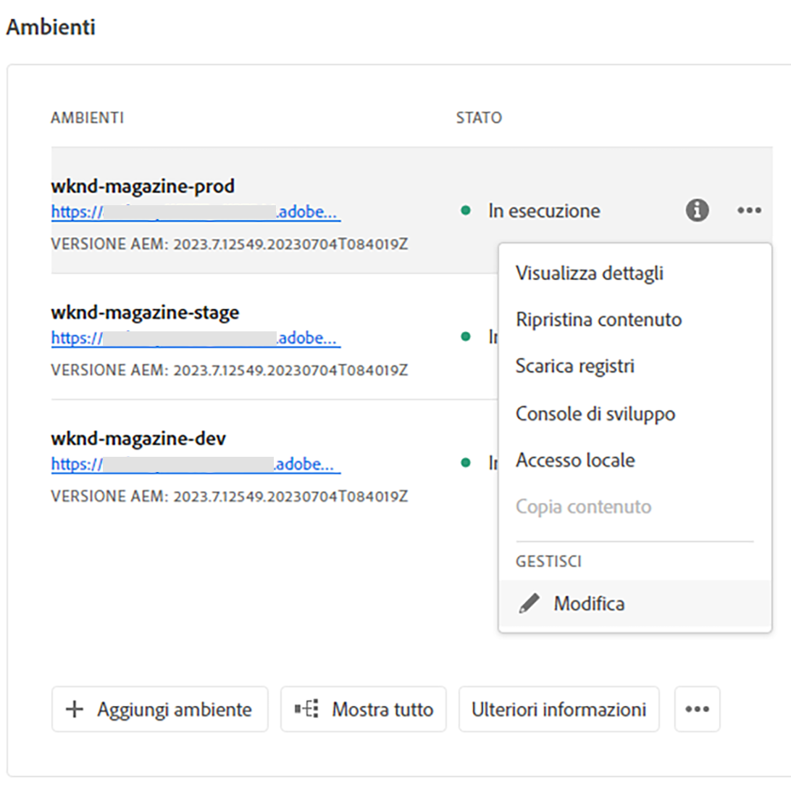

1. Nella finestra di dialogo **Modifica ambiente di produzione**, apporta le modifiche necessarie alle aree geografiche di pubblicazione aggiuntiva.
   * Utilizza il menu **Aree geografiche di pubblicazione aggiuntiva** per selezionare altre aree geografiche.
   * Fai clic sulla X accanto alle aree geografiche di pubblicazione aggiuntiva selezionate per deselezionarle.

   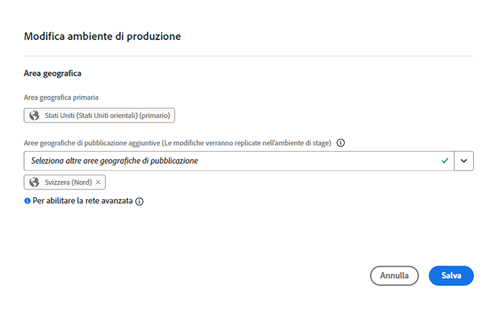

1. Seleziona **Salva** per salvare le modifiche.

Le modifiche apportate all’ambiente di produzione verranno applicate sia agli ambienti di produzione che a quelli di staging. Le modifiche apportate a più aree geografiche di pubblicazione possono essere modificate solo nell’ambiente di produzione.

Se desideri effettuare il provisioning di [rete avanzata](/help/security/configuring-advanced-networking.md) per il programma, si consiglia di eseguire questa operazione prima di aggiungere aree geografiche di pubblicazione aggiuntiva negli ambienti. In caso contrario, il traffico delle aree geografiche di pubblicazione aggiuntiva passerà attraverso il proxy dell’area geografica principale.

## Visualizzare i dettagli di un ambiente {#viewing-environment}

1. Accedi a Cloud Manager all’indirizzo [my.cloudmanager.adobe.com](https://my.cloudmanager.adobe.com/) e seleziona l’organizzazione appropriata.

1. Nella console **[Programmi](/help/implementing/cloud-manager/navigation.md#my-programs)** fare clic sul programma per il quale si desidera visualizzare i dettagli di un ambiente.

1. Elencare tutti gli ambienti per il programma eseguendo una delle operazioni seguenti:

   * Dal menu a sinistra, in **Servizi**, fai clic sull&#39;icona  **Ambienti**.

   

   * Dal menu a sinistra, nella sezione **Programma**, fai clic su **Panoramica**, quindi dalla scheda **Ambienti** fai clic sull&#39;icona  **Mostra tutto**.

     

   >[!NOTE]
   >
   >Nella scheda **Ambienti** sono elencati solo tre ambienti. Fai clic su **Mostra tutto** nella scheda per visualizzare *tutti* gli ambienti del programma.

1. Nella pagina Ambienti, effettua una delle seguenti operazioni:

   * Fai clic su un ambiente nell’elenco per visualizzarne i dettagli.

   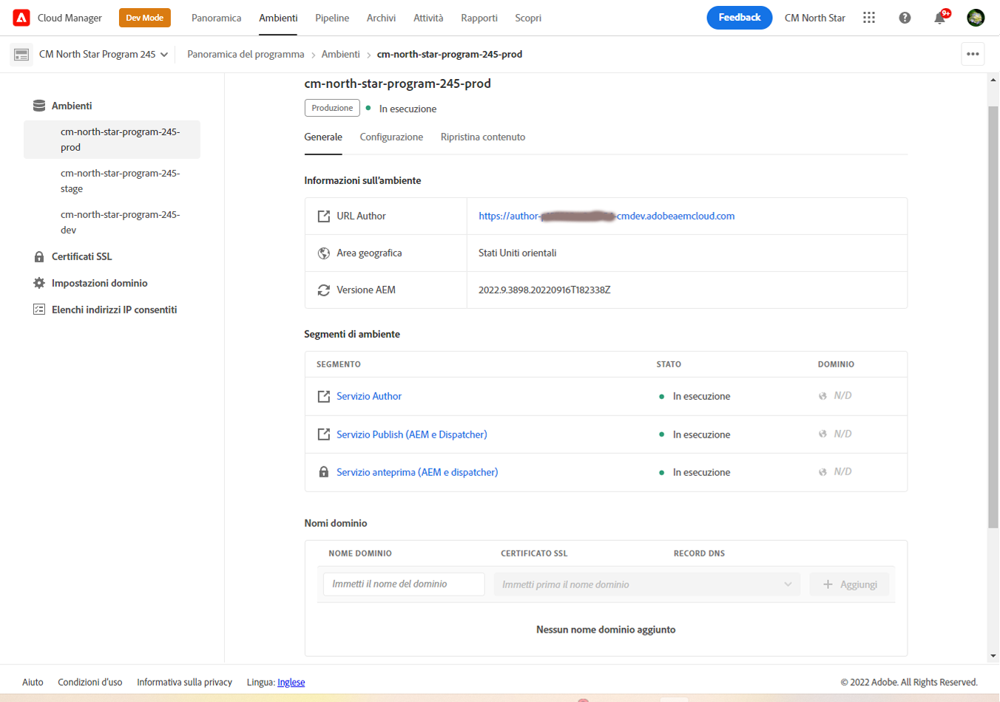

   * Fai clic sull&#39;icona  dell&#39;ambiente desiderato, quindi fai clic su **Visualizza dettagli**.

   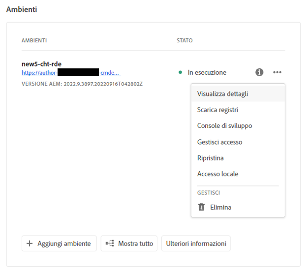

## Ripristinare il contenuto di un ambiente {#restore-environment}

Vedi [Ripristina contenuto in AEM as a Cloud Service](/help/operations/restore.md).

## Ripristina il codice precedente distribuito {#restore-previous-code-deployed}

Vedi [Ripristina il codice precedente distribuito in AEM as a Cloud Service](/help/operations/restore-previous-code-deployed.md).

### Accedere al servizio di anteprima {#access-preview-service}

Cloud Manager fornisce un servizio di anteprima (fornito come servizio di pubblicazione aggiuntivo) per ogni ambiente di AEM as a Cloud Service.

Con il servizio puoi visualizzare in anteprima l’esperienza finale di un sito web prima di aggiungerla all’ambiente di pubblicazione effettivo e renderla disponibile agli utenti.

Al momento della creazione, al servizio di anteprima viene applicato un elenco Consentiti IP predefinito, denominato `Preview Default [<envId>]`, che blocca tutto il traffico verso il servizio. Per abilitare l’accesso, annulla l’applicazione dell’elenco Consentiti IP predefinito dal servizio di anteprima.

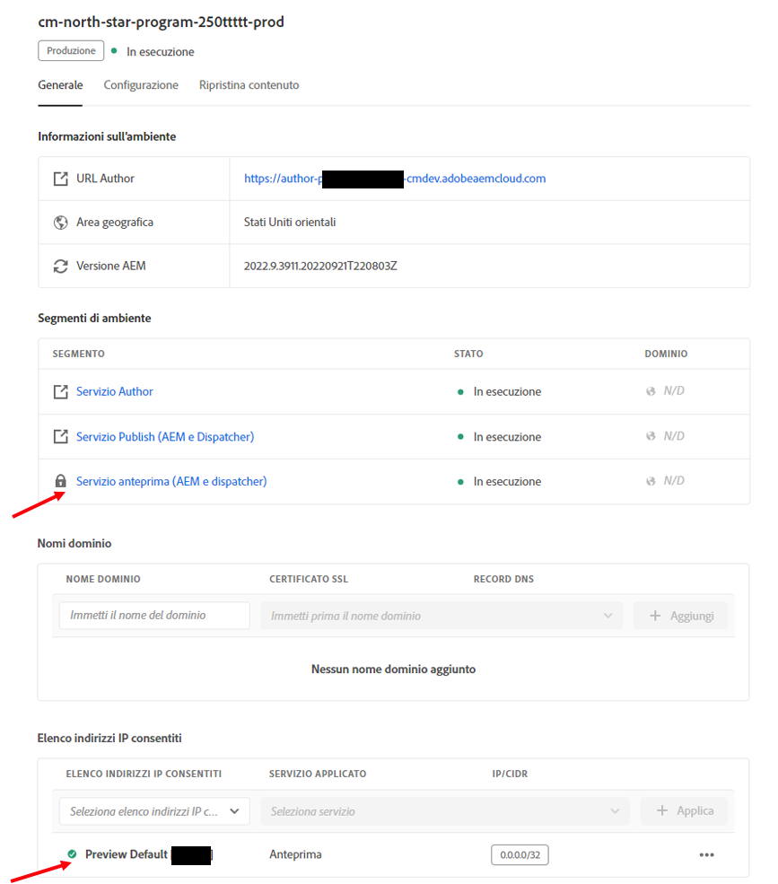

Per garantire l’accesso, prima di condividere l’URL del servizio di anteprima, l’utente con le autorizzazioni necessarie deve completare i passaggi seguenti.

1. Creare un Elenco consentiti inserì nell&#39;elenco Consentiti IP appropriato, applicarlo al servizio di anteprima e annullare immediatamente l&#39;applicazione del `Preview Default [<envId>]`.

   Per ulteriori dettagli, vedi [Applica e rimuovi Elenchi consentiti IP](/help/implementing/cloud-manager/ip-allow-lists/apply-allow-list.md).

1. Utilizza il flusso di lavoro di aggiornamento dell&#39;Elenco consentiti **IP** per rimuovere l&#39;IP predefinito e aggiungere gli IP necessari. Per ulteriori informazioni, consulta [Gestione Elenchi consentiti IP](/help/implementing/cloud-manager/ip-allow-lists/managing-ip-allow-lists.md).

Una volta sbloccato l’accesso al servizio di anteprima, l’icona a forma di lucchetto posta davanti al nome del servizio di anteprima non viene più visualizzata.

Una volta attivato, è possibile pubblicare il contenuto nel servizio di anteprima utilizzando l&#39;interfaccia utente **`Manage Publication`** in AEM. Per ulteriori dettagli, consulta [Anteprima contenuto](/help/sites-cloud/authoring/sites-console/previewing-content.md).

>[!NOTE]
>
>La versione dell’ambiente deve essere AEM `2021.05.5368.20210529T101701Z` o più recente per utilizzare il servizio di anteprima. Assicurati che una pipeline di aggiornamento sia stata eseguita correttamente nell’ambiente in uso, in modo da poter utilizzare il servizio di anteprima.

### Stato di altre aree geografiche di pubblicazione {#additional-region-status}

Se hai attivato altre aree di pubblicazione, puoi controllarne lo stato dalla scheda **Ambienti**.

1. Nella pagina **Panoramica**, individua la scheda **Ambienti**.

1. Nella scheda **Ambienti**, la colonna **Stato** riflette l&#39;eventuale presenza di problemi con le aree di pubblicazione aggiuntive configurate. Fai clic sull&#39;icona **Info** per i dettagli delle aree geografiche.

   

In alternativa, è possibile accedere alle stesse informazioni dalla scheda **Ambienti**.

1. Nella pagina **Panoramica**, fai clic sull&#39;icona  **Ambienti**.

1. Nella pagina **Ambienti**, seleziona l&#39;ambiente in cui desideri eseguire la query nel menu a sinistra.

1. Dopo aver selezionato un ambiente:

   * La tabella **Informazioni ambiente** mostra le aree configurate per l&#39;ambiente selezionato.
   * La colonna **Stato** della tabella **Segmenti di ambiente** riflette l&#39;eventuale presenza di problemi con le aree di pubblicazione aggiuntive configurate. Passa il cursore del mouse sullo stato per visualizzare i dettagli di eventuali problemi.

   

In caso di problemi segnalati con altre aree geografiche di pubblicazione, attendi. Cloud Manager cerca continuamente di recuperare la regione, che può diventare disponibile in qualsiasi momento. Se il problema persiste dopo diverse ore, puoi rimuovere l’area di pubblicazione aggiuntiva e aggiungerla nuovamente (nella stessa area o in un’altra) per attivare una distribuzione completa.

Il tempo che si attende dal ripristino del sistema prima di intraprendere ulteriori azioni dipende dall&#39;impatto che il guasto di quell&#39;area ha sui sistemi.

Il traffico [viene sempre indirizzato all&#39;area più vicina in linea](/help/operations/additional-publish-regions.md). Se continui a visualizzare dei problemi, contatta l’Assistenza clienti di Adobe.

## Aggiornare ambienti {#updating-dev-environment}

In qualità di servizio nativo per il cloud, Adobe gestisce automaticamente gli aggiornamenti per gli ambienti di sviluppo, staging e produzione all’interno dei programmi di produzione.

Tuttavia, gli aggiornamenti degli ambienti nei programmi sandbox vengono gestiti all’interno dei programmi. Se in tale ambiente non è in esecuzione l’ultima versione di AEM disponibile pubblicamente, lo stato nella scheda **Ambienti** della schermata **Panoramica** del programma indica **Aggiornamento disponibile**.

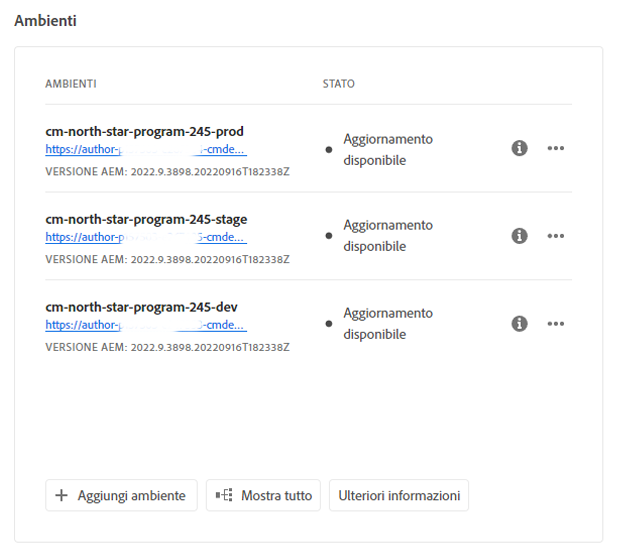

### Aggiornamenti e pipeline {#updates-pipelines}

Le pipeline sono l&#39;unico modo per [distribuire il codice negli ambienti di AEM as a Cloud Service](deploy-code.md). Per questo motivo, ogni pipeline è associata a una particolare versione di AEM.

Quando Cloud Manager rileva una versione di AEM più recente rispetto all&#39;ultima distribuita con la pipeline, viene visualizzato lo stato **Aggiornamento disponibile** per l&#39;ambiente.

Il processo di aggiornamento è quindi articolato in due fasi:

1. Aggiornamento della pipeline all’ultima versione di AEM
1. Esecuzione della pipeline per distribuire la nuova versione di AEM in un ambiente

### Aggiornare gli ambienti {#updating-your-environments}

>[!NOTE]
> A partire dal 2024, le istanze di sviluppo e alcuni programmi sandbox sono già aggiornati automaticamente, pertanto non è necessario gestirne manualmente gli aggiornamenti. In seguito a questa transizione, l&#39;opzione di aggiornamento manuale dell&#39;ambiente per le istanze di sviluppo potrebbe non essere disponibile per _alcuni_ programmi.

L&#39;opzione **Aggiorna** è disponibile nella scheda **Ambienti** per ambienti di sviluppo e sandbox specifici. Fai clic sull&#39;icona  accanto all&#39;ambiente per accedere a **Aggiorna**.

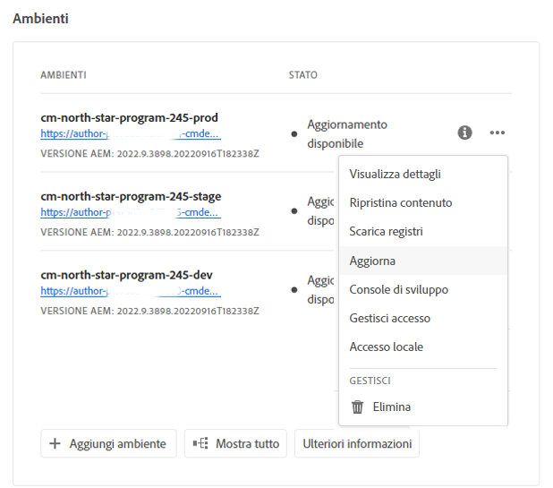

Questa opzione è disponibile anche facendo clic sulla scheda **Ambienti** del programma e quindi su  dell&#39;ambiente.

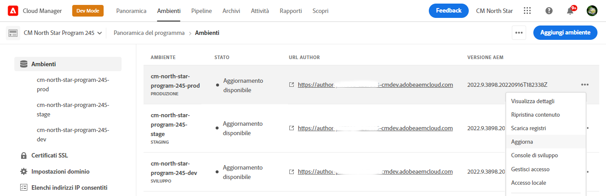

Un utente con il ruolo **Responsabile dell&#39;implementazione** o **Proprietario business** può utilizzare questa opzione per aggiornare la pipeline associata a questo ambiente alla versione più recente di AEM.

Dopo aver aggiornato la pipeline alla versione di AEM più recente disponibile al pubblico, viene richiesto di eseguire la pipeline associata per distribuire la suddetta versione nell’ambiente.

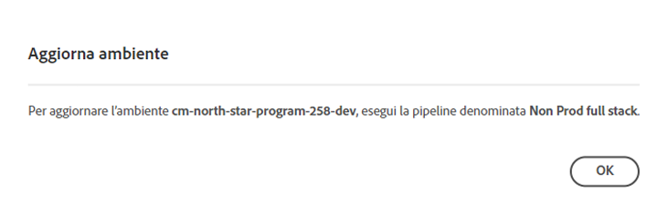

Il comportamento dell’opzione **Aggiorna** varia a seconda della configurazione e dello stato corrente del programma.

| Stato | Opzione Aggiorna... |
| --- | --- |
| La pipeline è già stata aggiornata | richiede all’utente di eseguire la pipeline. |
| Aggiornamento della pipeline già in corso | informa l&#39;utente che è già in esecuzione un aggiornamento. |
| La pipeline non esiste | richiede all&#39;utente di crearne uno. |

## Eliminazione degli ambienti di sviluppo {#deleting-environment}

Un utente con il ruolo **Responsabile dell&#39;implementazione** o **Proprietario business** è in grado di eliminare un ambiente di sviluppo.

Dalla schermata **Panoramica** del programma nella scheda **Ambienti**, fai clic sull&#39;icona  dell&#39;ambiente di sviluppo da eliminare.

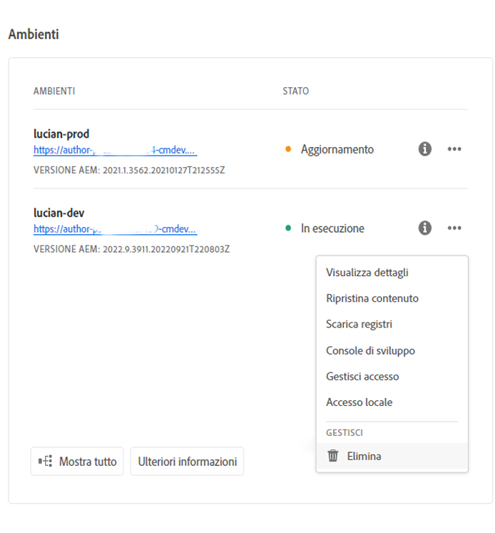

L&#39;opzione **Elimina** è disponibile anche nella scheda **Ambienti** della finestra **Panoramica** del programma. Fai clic sull&#39;icona  dell&#39;ambiente e seleziona **Elimina**.

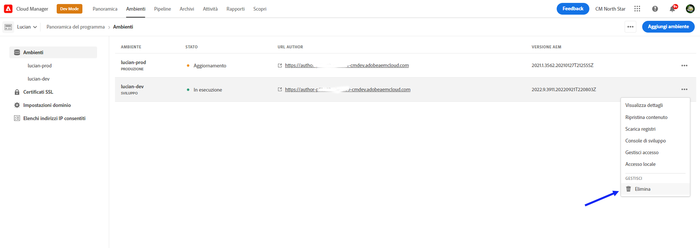

>[!NOTE]
>
>* Non è possibile eliminare gli ambienti di produzione e di staging creati in un programma di produzione.
>* È possibile eliminare gli ambienti di produzione e di staging contenuti in un programma sandbox.

## Gestisci accesso {#managing-access}

Dal menu con i puntini di sospensione dell’ambiente nella scheda **Ambienti**, seleziona **Gestisci accesso**. Puoi accedere direttamente all’istanza di authoring e gestire l’accesso all’ambiente.

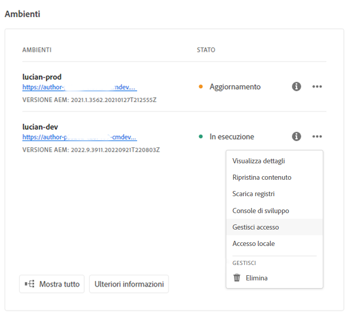

>[!TIP]
>
>Consulta [Profili di prodotto e team di AEM as a Cloud Service](/help/onboarding/aem-cs-team-product-profiles.md) per scoprire come i profili di prodotto e team di AEM as a Cloud Service possono concedere e limitare l&#39;accesso alle soluzioni Adobe con licenza.

## Accedere alla Console per sviluppatori {#accessing-developer-console}

1. Dalla scheda **Ambiente**, fai clic sull&#39;icona , quindi su **Developer Console**.

Nel browser viene aperta una nuova scheda con la pagina di accesso a **Developer Console**.

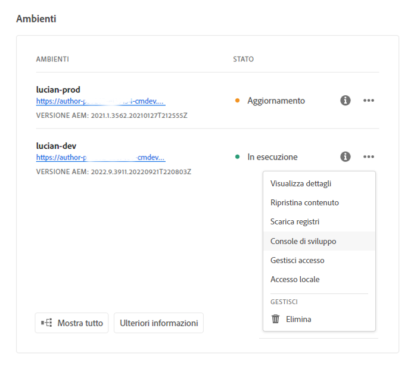

Solo gli utenti con il ruolo **Sviluppatore** possono accedere a **Developer Console**. Tuttavia, per i programmi sandbox, qualsiasi utente con accesso al programma sandbox ha accesso a **Developer Console**.

Vedi [Sospensione e riattivazione degli ambienti sandbox](https://experienceleague.adobe.com/it/docs/experience-manager-cloud-service/content/implementing/using-cloud-manager/programs/introduction-sandbox-programs#hibernation) per ulteriori dettagli.

Questa opzione è disponibile anche nella scheda **Ambiente** della finestra **Panoramica** quando si fa clic sull&#39;icona  di un singolo ambiente.

## Accesso locale {#login-locally}

1. Effettua una delle seguenti operazioni:

   * Dalla scheda **Ambiente**, fai clic sull&#39;icona , quindi su **Accesso locale**.

     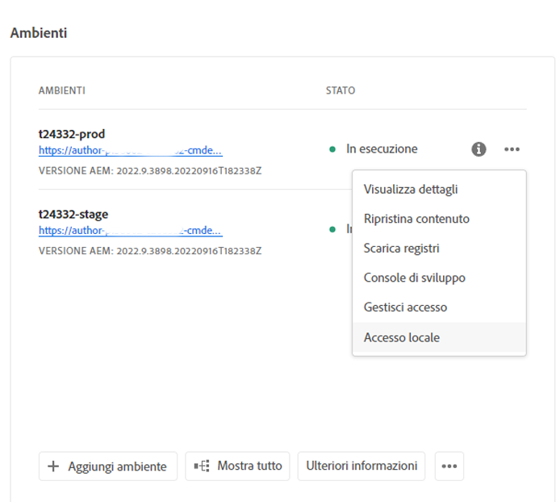

   * Nel pannello a sinistra, fai clic sull&#39;icona  **Ambienti**. Nella pagina **Ambienti**, fai clic sull&#39;icona , quindi su **Accesso locale**.

     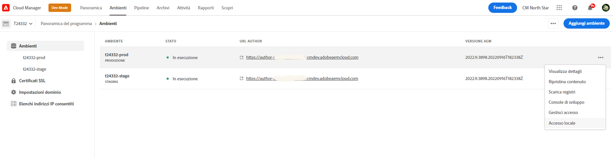

## Gestire i nomi di dominio personalizzati {#manage-cdn}

I nomi di dominio personalizzati sono supportati in Cloud Manager per i programmi Sites sia per i servizi di pubblicazione che per quelli di anteprima.

>[!TIP]
>
>Per ulteriori informazioni, vedere [Introduzione ai nomi di dominio personalizzati](/help/implementing/cloud-manager/custom-domain-names/introduction.md).

## Gestire gli elenchi IP consentiti {#manage-ip-allow-lists}

In Cloud Manager è supportato un Elenco consentiti IP per i servizi di authoring, pubblicazione e anteprima dei programmi Sites.

Per gestire gli Elenchi consentiti IP, passa alla pagina  **Ambienti** della pagina **Panoramica** del programma. Fai clic su un singolo ambiente per gestirne i dettagli.

### Applicare un Elenco consentiti IP {#apply-ip-allow-list}

L’applicazione di un Elenco consentiti IP collega tutti gli intervalli IP definiti a un servizio Author o Publish nell’ambiente.

>[!TIP]
>
>Per ulteriori informazioni, vedere [Introduzione agli Elenchi consentiti IP](/help/implementing/cloud-manager/ip-allow-lists/introduction.md).
