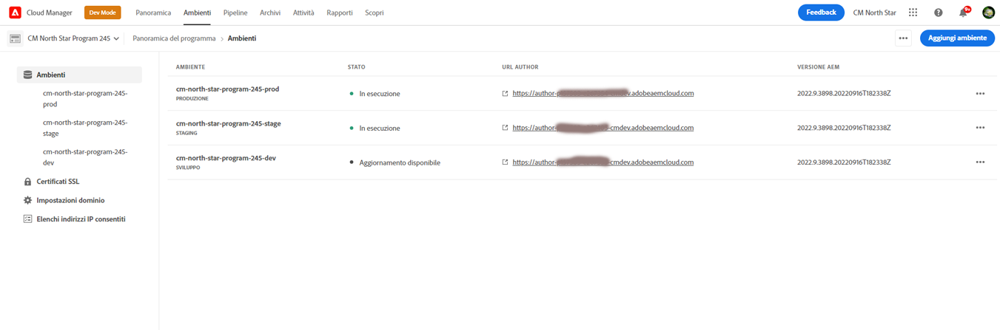
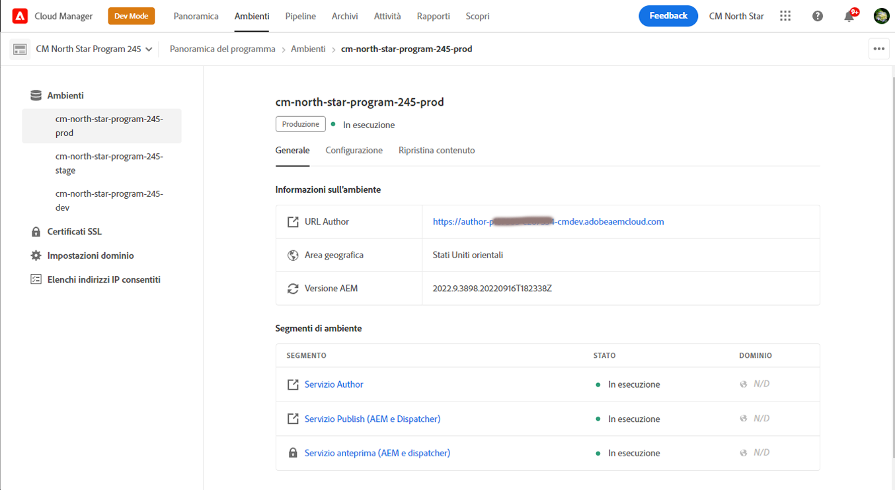

# Gestione degli ambienti {#manage-environments}

La sezione seguente descrive i tipi di ambiente che un utente può creare e come l&#39;utente può creare un ambiente.

## Tipi di ambiente {#environment-types}

Un utente con le autorizzazioni richieste può creare i seguenti tipi di ambiente (entro i limiti di ciò che è disponibile per il tenant specifico).

* **Ambiente** di produzione e fase: La produzione e lo stage sono disponibili come due elementi e sono utilizzati a scopo di test e produzione.

* **Sviluppo**: Un ambiente di sviluppo può essere creato a scopo di sviluppo e test e sarà associato solo a condotte non di produzione.

   >[!NOTE]
   >Un ambiente di sviluppo creato automaticamente in un programma sandbox sarà configurato per includere le soluzioni Siti e Risorse.

   Nella tabella seguente sono riepilogati i tipi di ambiente e i relativi attributi:

   | Nome | Livello di authoring | Pubblica livello | Utente può creare | L&#39;utente può eliminare | Pipeline che può essere associata all&#39;ambiente |
   |--- |--- |--- |--- |---|---|
   | Produzione | Sì | Sì se Siti inclusi | Sì | No | pipeline di produzione |
   | Area di visualizzazione | Sì | Sì se Siti inclusi | Sì | No | pipeline di produzione |
   | Sviluppo | Sì | Sì se Siti inclusi | Sì | Sì | pipeline non di produzione |

   >[!NOTE]
   >La produzione e lo stage sono disponibili come due elementi e sono utilizzati a scopo di test e produzione.  L&#39;utente non sarà in grado di creare solo l&#39;ambiente Stage o solo l&#39;ambiente Production.

## Aggiunta di un ambiente {#adding-environments}

1. Fare clic su **Aggiungi ambiente** per aggiungere un ambiente. Questo pulsante sarà accessibile dalla schermata **Ambienti**.
   

   L&#39;opzione **Aggiungi ambiente** è disponibile anche sulla scheda **Ambienti** quando il programma non contiene alcun ambiente.

   

   >[!NOTE]
   >L&#39;opzione **Aggiungi ambiente** verrà disattivata in base alla mancanza di autorizzazioni o agli eventuali contratti.

1. Viene visualizzata la finestra di dialogo **Aggiungi ambiente**. L’utente deve inviare dettagli quali **tipo di ambiente**, **nome dell’ambiente** e **descrizione dell’ambiente** (a seconda dell’obiettivo dell’utente nella creazione dell’ambiente ed entro i limiti di ciò che è disponibile per il tenant specifico).

   

   >[!NOTE]
   >Durante la creazione di un ambiente, in  Adobe I/O vengono create una o più *integrazioni*. Questi sono visibili agli utenti del cliente che hanno accesso alla  Adobe I/O Console e non devono essere eliminati. Questo viene negato nella descrizione nella  Adobe I/O Console.

   

1. Fare clic su **Salva** per aggiungere un ambiente con i criteri popolati.  A questo punto, nella schermata *Panoramica* viene visualizzata la scheda da cui è possibile impostare la pipeline.

   >[!NOTE]
   >Se non avete ancora impostato la pipeline di non produzione, nella schermata *Panoramica* viene visualizzata la scheda da cui potete creare la pipeline non di produzione.

## Ambiente di visualizzazione {#viewing-environment}

La scheda **Ambienti** nella pagina Panoramica elenca fino a tre ambienti.

1. Selezionare il pulsante **Mostra tutto** per passare alla pagina di riepilogo **Ambiente** per visualizzare una tabella con un elenco completo degli ambienti.

   

1. Nella pagina **Ambienti** viene visualizzato l&#39;elenco di tutti gli ambienti esistenti.

   

1. Selezionare uno degli ambienti elencati per visualizzare i dettagli dell&#39;ambiente.

   

## Aggiornamento dell&#39;ambiente {#updating-dev-environment}

Gli aggiornamenti degli ambienti Stage e Produzione vengono gestiti automaticamente da  Adobe.

Gli aggiornamenti agli ambienti di sviluppo sono gestiti dagli utenti del programma. Se un ambiente non esegue l&#39;ultima versione AEM disponibile al pubblico, lo stato della scheda Ambienti nella Home Screen mostrerà **UPDATE AVAILABLE**.

L&#39;opzione **Aggiorna** è disponibile dalla scheda **Ambienti**.
Questa opzione è disponibile anche, se si fa clic su **Dettagli** dalla scheda **Ambienti**. Viene visualizzata la pagina **Ambienti** e, dopo aver selezionato l&#39;ambiente di sviluppo, fare clic su **...** e selezionare **Aggiorna**, come illustrato nella figura seguente:

Selezionando questa opzione, un gestore distribuzione potrà aggiornare la pipeline associata a questo ambiente alla versione più recente ed eseguire la pipeline.

Se la pipeline è già stata aggiornata, all&#39;utente viene richiesto di eseguire la pipeline.

## Eliminazione dell&#39;ambiente {#deleting-environment}

L&#39;utente con le autorizzazioni necessarie sarà in grado di eliminare un ambiente di sviluppo.

L&#39;opzione **Elimina** è disponibile dal menu a discesa nella scheda **Ambienti**. Fare clic su **...** per un ambiente di sviluppo da eliminare.

L&#39;opzione di eliminazione è disponibile anche, se si fa clic su **Details** dalla scheda **Environment**. Viene visualizzata la pagina **Ambienti** e, dopo aver selezionato l&#39;ambiente di sviluppo, fare clic su **...** e selezionare **Elimina**, come illustrato nella figura seguente:

>[!NOTE]
>
>Questa funzione non è disponibile per l&#39;ambiente Produzione/Fase impostato in un programma regolare impostato a scopo di produzione. La funzione è tuttavia disponibile per gli ambienti Produzione/Fase in un programma sandbox.

## Gestione dell&#39;accesso {#managing-access}

Selezionare **Gestisci accesso** dal menu a discesa nella scheda **Ambienti**. Potete passare direttamente all’istanza di authoring e gestire l’accesso all’ambiente in uso.

Per ulteriori informazioni, fare riferimento a [Managing Access to Author Instance](/help/onboarding/getting-access-to-aem-in-cloud/navigation.md#manage-access-aem) (Gestione dell&#39;accesso all&#39;istanza Author).

## Accesso alla console per sviluppatori {#accessing-developer-console}

Selezionare **Developer Console** dal menu a discesa nella scheda **Ambienti**. In questo modo si aprirà una nuova scheda nel browser con la pagina di accesso su **Developer Console**.

Solo un utente nel ruolo Sviluppatore avrà accesso a **Developer Console**. Eccezione per i programmi sandbox, in cui qualsiasi utente con accesso al Programma sandbox di Cloud Manager avrà accesso a **Developer Console**.

Per ulteriori informazioni, fare riferimento a [Ambienti sandbox in sospensione e in sospensione](https://docs.adobe.com/content/help/en/experience-manager-cloud-service/onboarding/getting-access/cloud-service-programs/sandbox-programs.html#hibernating-introduction).

Questa opzione è disponibile anche, se si fa clic su **Dettagli** dalla scheda **Ambienti**. Viene visualizzata la pagina **Ambienti** e, dopo aver selezionato un ambiente, fare clic su **...** e selezionare **Developer Console**.

## Login Locale {#login-locally}

Selezionare **Accesso locale** dal menu a discesa nella scheda **Ambienti** per accedere localmente ad Adobe Experience Manager.

È inoltre possibile accedere localmente dalla pagina di riepilogo **Ambienti**.

## Gestione dei nomi di dominio personalizzati {#manage-cdn}

Passare alla pagina dei dettagli **Ambienti** dalla pagina Riepilogo ambienti.

Per il servizio Pubblica del vostro ambiente potete effettuare le seguenti operazioni, come descritto di seguito:

1. [Aggiunta di un nome di dominio personalizzato](/help/implementing/cloud-manager/custom-domain-names/add-custom-domain-name.md)

1. [Visualizzazione e aggiornamento di un nome di dominio personalizzato](/help/implementing/cloud-manager/custom-domain-names/view-update-replace-custom-domain-name.md)

1. [Eliminazione di un nome di dominio personalizzato](/help/implementing/cloud-manager/custom-domain-names/delete-custom-domain-name.md)

## Gestione dei Elenchi consentiti di  IP {#manage-ip-allow-lists}

Passate alla pagina Dettagli ambiente dalla pagina Riepilogo ambienti. Potete eseguire le seguenti operazioni sui servizi Pubblica e/o Autore del vostro ambiente.

### Applicazione di un Elenco consentiti di  IP {#apply-ip-allow-list}

L’applicazione di un Elenco consentiti di  IP è il processo tramite il quale tutti gli intervalli IP inclusi nella definizione di elenco di autorizzazioni sono associati a un servizio di creazione o pubblicazione in un ambiente. Per poter applicare un Elenco consentiti di  IP, è necessario che un utente nel ruolo Proprietario business o Gestione distribuzione abbia eseguito l&#39;accesso.

>[!NOTE]
>Il Elenco consentiti di  IP deve esistere in Cloud Manager per poterlo applicare a un servizio di ambiente. Per ulteriori informazioni sui Elenchi consentiti di  IP in Cloud Manager, vai a [Introduzione ai Elenchi consentiti di  IP in Gestione risorse ](/help/implementing/cloud-manager/ip-allow-lists/introduction.md).

Per applicare un Elenco consentiti di  IP, effettuate le seguenti operazioni:

1. Andate all&#39;ambiente specifico dalla pagina dei dettagli **Ambienti** e andate alla tabella **Elenchi consentiti  IP**.
1. Utilizzate i campi di input nella parte superiore della tabella del Elenco consentiti di  IP per selezionare il Elenco consentiti di  IP e il servizio Autore o Pubblica a cui desiderate applicarlo.
1. Fare clic su **Applica** e confermare l&#39;invio.

### Annullamento dell&#39;applicazione di un Elenco consentiti di  IP {#unapply-ip-allow-list}

L&#39;annullamento dell&#39;applicazione di un Elenco consentiti di  IP è il processo tramite il quale tutti gli intervalli IP inclusi nella definizione del Elenco consentiti di  vengono disassociati da un servizio Author o Publisher in un ambiente. Per poter annullare l’applicazione di un Elenco consentiti di  IP, è necessario che un utente nel ruolo Proprietario business o Gestione distribuzione abbia eseguito l’accesso.

Per annullare l’applicazione di un Elenco consentiti di  IP, effettuate le seguenti operazioni:

1. Andate alla pagina dei dettagli **Ambienti** specifica dalla schermata Ambienti e andate alla tabella **Elenchi consentiti  IP**.
1. Identificare la riga in cui è elencata la regola del Elenco consentiti  IP che si desidera annullare l&#39;applicazione.
1. Selezionare la **...** menu dall&#39;estremità destra della riga.
1. Selezionare l&#39;opzione **Annulla applicazione** e confermare l&#39;invio.

