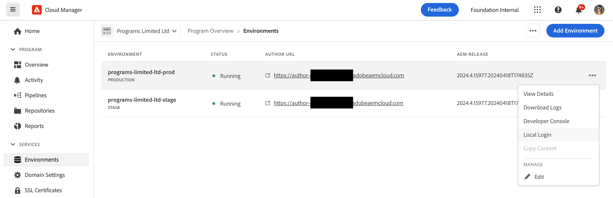

# Gestione degli ambienti {#managing-environments}

Scopri i tipi di ambienti che è possibile creare e come crearli per il progetto Cloud Manager.

## Tipi di ambienti {#environment-types}

L’utente con le autorizzazioni necessarie può creare i seguenti tipi di ambienti (entro i limiti delle opzioni disponibili per il tenant specifico).

* **Produzione e staging**: gli ambienti di produzione e staging sono disponibili in coppia e sono rispettivamente utilizzati a scopo di produzione e di test.

* **Sviluppo**: è possibile creare un ambiente di sviluppo sia per scopi di sviluppo che per scopi di test, che può essere associato solo a pipeline non destinate alla produzione.

* **Sviluppo rapido** - Un ambiente di sviluppo rapido (RDE, rapid development environment) consente allo sviluppatore di implementare e rivedere rapidamente le modifiche, riducendo al minimo il tempo necessario per testare le funzioni che hanno dimostrato di funzionare in un ambiente di sviluppo locale. Consulta [documentazione dell’ambiente di sviluppo rapido](/help/implementing/developing/introduction/rapid-development-environments.md) per informazioni dettagliate sull&#39;utilizzo di un RDE.

Le funzionalità dei singoli ambienti dipendono dalle soluzioni abilitate nel [programma](/help/implementing/cloud-manager/getting-access-to-aem-in-cloud/program-types.md) di ciascuno di essi.

* [Sites](/help/sites-cloud/home.md)
* [Assets](/help/assets/home.md)
* [Forms](/help/forms/home.md)
* [Screens](/help/screens-cloud/home.md)

>[!NOTE]
>
>Gli ambienti di produzione e staging vengono creati solo in coppia. Non è possibile creare solo un ambiente di staging o solo un ambiente di produzione.

## Aggiunta di un ambiente {#adding-environments}

1. Accedi a Cloud Manager all’indirizzo [my.cloudmanager.adobe.com](https://my.cloudmanager.adobe.com/) e seleziona l’organizzazione appropriata.

1. Fai clic sul programma al quale desideri aggiungere un ambiente.

1. Dalla sezione **Panoramica del programma** pagina, fai clic su **Aggiungi ambiente** il **Ambienti** per aggiungere un ambiente.

   

   * L’opzione **Aggiungi ambiente** è disponibile anche nella scheda **Ambienti**.

     

   * L’opzione **Aggiungi ambiente** potrebbe essere disattivata per mancanza di autorizzazioni o a seconda delle risorse concesse in licenza.

1. Nella finestra di dialogo **Aggiungi ambiente** che viene visualizzata:

   * Seleziona un [**tipo di ambiente**.](#environment-types)
      * Il numero di ambienti disponibili/utilizzati è visualizzato tra parentesi dopo il nome del tipo di ambiente.
   * Specifica il **nome** dell’ambiente.
   * Inserisci la **descrizione** dell’ambiente.
   * Se stai aggiungendo una **Produzione e staging** ambiente, è necessario fornire un nome e una descrizione per gli ambienti di produzione e di staging.
   * Seleziona un’**area geografica primaria** dal menu a discesa.
      * Dopo la creazione, non è possibile modificare l’area primaria.
      * A seconda dei diritti disponibili, è possibile configurare [più aree geografiche](#multiple-regions).

   

1. Per aggiungere l’ambiente specificato, fai clic su **Salva**.

Ora il nuovo ambiente viene visualizzato nella schermata **Panoramica** della scheda **Ambienti**. Ora puoi configurare le pipeline per il nuovo ambiente.

## Più aree geografiche di pubblicazione {#multiple-regions}

Un utente con **Proprietario business** Il ruolo può configurare gli ambienti di produzione e staging in modo da includere fino a tre aree di pubblicazione aggiuntive oltre all’area primaria. Ulteriori aree geografiche di pubblicazione possono migliorare la disponibilità. Consulta la [Documentazione aggiuntiva sulle aree geografiche di pubblicazione](/help/operations/additional-publish-regions.md) per ulteriori dettagli.

>[!TIP]
>
>È possibile utilizzare [API di Cloud Manager](https://developer.adobe.com/experience-cloud/cloud-manager/guides/api-usage/creating-programs-and-environments/#creating-aem-cloud-service-environments) per eseguire una query su un elenco corrente di aree disponibili.

### Aggiunta di più aree di pubblicazione a un nuovo ambiente {#add-regions}

Quando aggiungi un ambiente, puoi scegliere di configurare altre aree oltre all’area principale.

1. Seleziona la **Area geografica primaria**.
   * Dopo la creazione dell’ambiente non è possibile modificare l’area primaria.
1. Seleziona l’opzione **Aggiungi altre aree geografiche di pubblicazione** e un nuovo **Aree geografiche di pubblicazione aggiuntive** menu a discesa delle opzioni.
1. In **Aree geografiche di pubblicazione aggiuntive** , selezionare un&#39;area aggiuntiva.
1. L’area selezionata viene aggiunta sotto il menu a discesa per indicarne la selezione.
   * Tocca o fai clic su `X` accanto all&#39;area selezionata, per poterla deselezionare.
1. Seleziona un’altra regione dal menu **Aree geografiche di pubblicazione aggiuntive** per aggiungere un’altra area geografica.
1. Tocca o fai clic su **Salva** quando sei pronto per creare l’ambiente.

Le aree selezionate si applicano sia agli ambienti di produzione che a quelli di staging.

Se non si specifica alcuna area aggiuntiva, [puoi farlo in un secondo momento dopo la creazione degli ambienti.](#edit-regions)

Se desideri effettuare il provisioning di [rete avanzata](/help/security/configuring-advanced-networking.md) per il programma, si consiglia di eseguire questo provisioning prima di aggiungere ulteriori aree di pubblicazione agli ambienti utilizzando l’API di Cloud Manager. In caso contrario, il traffico aggiuntivo delle aree di pubblicazione passa attraverso il proxy dell’area primaria.

### Modifica di più aree di pubblicazione {#edit-regions}

Se inizialmente non hai specificato altre aree, puoi farlo dopo la creazione degli ambienti, se disponi dei diritti necessari.

Puoi anche rimuovere altre aree geografiche di pubblicazione. Tuttavia, è possibile aggiungere o rimuovere solo aree in una transazione. Se è necessario aggiungere una regione e rimuoverla, aggiungere, salvare la modifica e quindi rimuovere (o viceversa).

1. Dalla console Panoramica programma del programma, fai clic sul pulsante con i puntini di sospensione corrispondente all’ambiente di produzione e seleziona **Modifica** dal menu.

   

1. In **Modifica ambiente di produzione** , apportare le modifiche necessarie alle aree di pubblicazione aggiuntive.
   * Utilizza il **Aree geografiche di pubblicazione aggiuntive** per selezionare altre aree geografiche.
   * Fai clic sulla X accanto alle aree di pubblicazione aggiuntive selezionate per deselezionarle.

   

1. Tocca o fai clic su **Salva** per salvare le modifiche.

Le modifiche apportate all’ambiente di produzione si applicano sia agli ambienti di produzione che a quelli di staging. Le modifiche apportate a più aree di pubblicazione possono essere modificate solo nell’ambiente di produzione.

Se desideri effettuare il provisioning di [rete avanzata](/help/security/configuring-advanced-networking.md) per il programma, si consiglia di eseguire questo provisioning prima di aggiungere ulteriori aree di pubblicazione agli ambienti. In caso contrario, il traffico aggiuntivo delle aree di pubblicazione passa attraverso il proxy dell’area primaria.

## Dettagli dell’ambiente {#viewing-environment}

È possibile utilizzare **Ambienti** nella pagina della panoramica per accedere ai dettagli di un ambiente in due modi.

1. Dalla sezione **Panoramica** , fare clic su **Ambienti** nella parte superiore dello schermo.

   

   * In alternativa, fare clic su **Mostra tutto** pulsante sulla **Ambienti** per passare direttamente al **Ambienti** scheda.

     

1. La scheda **Ambienti** apre ed elenca tutti gli ambienti del programma.

   

1. Fai clic su un ambiente nell’elenco per visualizzarne i dettagli.

   

In alternativa, fai clic sul pulsante con i puntini di sospensione dell’ambiente desiderato, quindi seleziona **Visualizza dettagli**.

>[!NOTE]
>
>Nella scheda **Ambienti** sono elencati solo tre ambienti. Clic **Mostra tutto** come descritto in precedenza per visualizzare tutti gli ambienti del programma.

### Accesso al servizio di anteprima {#access-preview-service}

Cloud Manager fornisce un servizio di anteprima (fornito come servizio di pubblicazione aggiuntivo) per ogni ambiente as a Cloud Service AEM.

Con il servizio puoi visualizzare in anteprima l’esperienza finale di un sito web prima di aggiungerla all’ambiente di pubblicazione effettivo e renderla disponibile agli utenti.

Al momento della creazione, al servizio di anteprima è applicato un elenco Consentiti IP predefinito, denominato `Preview Default [<envId>]`, che blocca tutto il traffico verso il servizio di anteprima. Inserire nell&#39;elenco Consentiti Per abilitare l’accesso, annulla l’applicazione dell’IP predefinito dal servizio di anteprima.

Per garantire l’accesso, prima di condividere l’URL del servizio di anteprima, l’utente con le autorizzazioni necessarie deve completare i passaggi seguenti.

1. Creare un inserisco nell&#39;elenco Consentiti di IP appropriato, applicarlo al servizio di anteprima e annullare immediatamente l’applicazione di `Preview Default [<envId>]` inserisco nell&#39;elenco Consentiti DI.

   * Consulta [Applicazione e rimozione di Elenchi consentiti IP](/help/implementing/cloud-manager/ip-allow-lists/apply-allow-list.md) per ulteriori dettagli.

1. Rimuovi l’IP predefinito e aggiungi gli IP appropriati con il flusso di lavoro per l’aggiornamento dell’**elenco IP consentiti**. Per ulteriori informazioni, consulta [Gestione degli elenchi IP consentiti](/help/implementing/cloud-manager/ip-allow-lists/managing-ip-allow-lists.md).

Una volta sbloccato l’accesso al servizio di anteprima, l’icona a forma di lucchetto davanti al nome del servizio non viene più visualizzata.

Dopo l’attivazione puoi pubblicare il contenuto nel servizio di anteprima tramite l’interfaccia utente Gestisci pubblicazione in AEM. Consulta [Anteprima del contenuto](/help/sites-cloud/authoring/fundamentals/previewing-content.md) per ulteriori dettagli.

>[!NOTE]
>
>La versione dell’ambiente deve essere AEM `2021.05.5368.20210529T101701Z` o più recente per utilizzare il servizio di anteprima. Assicurati che una pipeline di aggiornamento sia stata eseguita correttamente nell’ambiente in uso, in modo da poter utilizzare il servizio di anteprima.

## Aggiornamento degli ambienti {#updating-dev-environment}

Come servizio nativo per il cloud, Adobe gestisce automaticamente gli aggiornamenti degli ambienti di staging e produzione all’interno dei programmi di produzione.

Tuttavia, gli aggiornamenti degli ambienti di sviluppo e degli ambienti nei programmi sandbox vengono gestiti all’interno dei programmi. Quando in tale ambiente non è in esecuzione l’ultima versione di AEM disponibile pubblicamente, lo stato **Ambienti** scheda su **Panoramica** schermata del programma mostra **Aggiornamento disponibile**.

### Aggiornamenti e pipeline {#updates-pipelines}

Le pipeline sono l’unico modo per [distribuire il codice negli ambienti di AEM as a Cloud Service.](deploy-code.md) Per questo motivo, ogni pipeline è associata a una particolare versione di AEM.

Se Cloud Manager rileva che è disponibile una versione più recente dell’AEM rispetto all’ultima distribuita con la pipeline, mostra **Aggiornamento disponibile** stato dell’ambiente.

Il processo di aggiornamento è quindi articolato in due fasi:

1. Aggiornamento della pipeline all’ultima versione di AEM
1. Esecuzione della pipeline per distribuire la nuova versione di AEM in un ambiente

### Aggiornamento degli ambienti {#updating-your-environments}

Il **Aggiorna** è disponibile dall&#39;opzione **Ambienti** per gli ambienti di sviluppo e gli ambienti nei programmi sandbox, facendo clic sul pulsante con i puntini di sospensione corrispondente all’ambiente.

Questa opzione è disponibile anche facendo clic sul pulsante **Ambienti** del programma e selezionando il pulsante con i puntini di sospensione corrispondente all’ambiente.

Con quest’opzione, l’utente con il ruolo **Responsabile dell’implementazione** può aggiornare alla versione di AEM più recente la pipeline associata a questo ambiente.

Dopo aver aggiornato la pipeline alla versione di AEM più recente disponibile al pubblico, viene richiesto di eseguire la pipeline associata per distribuire la suddetta versione nell’ambiente.

Il comportamento dell’opzione **Aggiorna** varia a seconda della configurazione e dello stato corrente del programma.

* Se la pipeline è già stata aggiornata, l’opzione **Aggiorna** richiede all’utente di eseguire la pipeline.
* Se l’aggiornamento della pipeline è già in corso, l’opzione **Aggiorna** informa l’utente circa la presenza di un aggiornamento in corso.
* Se non esiste una pipeline appropriata, l’opzione **Aggiorna** richiede all’utente di crearne una.

## Eliminazione degli ambienti di sviluppo {#deleting-environment}

L’utente con l’autorizzazione necessaria è in grado di eliminare un ambiente di sviluppo.

Dalla sezione **Panoramica** schermata del programma sulla **Ambienti** fare clic sul pulsante con i puntini di sospensione corrispondente all&#39;ambiente di sviluppo che si desidera eliminare.

L’opzione Elimina è disponibile anche dalla scheda **Ambienti** della finestra **Panoramica** del programma. Fai clic sul pulsante con i puntini di sospensione corrispondente all’ambiente e seleziona **Elimina**.

>[!NOTE]
>
>* Non è possibile eliminare gli ambienti di produzione e di staging creati in un programma di produzione.
>* È possibile eliminare gli ambienti di produzione e di staging contenuti in un programma sandbox.

## Gestione dell’accesso {#managing-access}

Dal menu con i puntini di sospensione dell’ambiente nella scheda **Ambienti**, seleziona **Gestisci accesso**. Puoi accedere direttamente all’istanza di authoring e gestire l’accesso all’ambiente.

>[!TIP]
>
>Consulta [Profili di prodotto e team as a Cloud Service AEM](/help/onboarding/aem-cs-team-product-profiles.md) se desideri scoprire in che modo i profili di prodotto e team as a Cloud Service all’AEM possono concedere e limitare l’accesso alle soluzioni Adobe con licenza.

## Accesso a Console sviluppatori {#accessing-developer-console}

Dal menu con i puntini di sospensione dell’ambiente nella scheda **Ambienti**, seleziona **Console sviluppatori**. Nel browser viene aperta una nuova scheda con la pagina di accesso al **Console per sviluppatori**.

Solo un utente con **Sviluppatore** il ruolo ha accesso al **Console per sviluppatori**. Tuttavia, per i programmi sandbox, tutti gli utenti con accesso al programma sandbox hanno accesso a **Console per sviluppatori**.

Consulta [Sospensione e riattivazione degli ambienti sandbox](https://experienceleague.adobe.com/docs/experience-manager-cloud-service/content/implementing/using-cloud-manager/programs/introduction-sandbox-programs.html#hibernation) per ulteriori dettagli.

Questa opzione è disponibile anche nella scheda **Ambiente** della finestra **Panoramica**, facendo clic sul menu con i puntini di sospensione dell’ambiente di interesse.

## Accesso locale {#login-locally}

Seleziona **Accesso locale** dal menu con i puntini di sospensione dell’ambiente in **Ambienti** in modo da poter accedere localmente ad Adobe Experience Manager.

Inoltre, è possibile accedere localmente da **Ambienti** scheda di **Panoramica** pagina.

## Gestione dei nomi di dominio personalizzati {#manage-cdn}

I nomi di dominio personalizzati sono supportati in Cloud Manager per i programmi Sites, sia per i servizi di pubblicazione sia per quelli di anteprima. Ogni ambiente di Cloud Manager può ospitare fino a un massimo di 250 domini personalizzati.

Per configurare i nomi di dominio personalizzati, vai al **Ambienti** e fai clic su un ambiente per visualizzarne i dettagli.

Nell’ambito del servizio di pubblicazione dell’ambiente, è possibile eseguire le azioni indicate di seguito.

* [Aggiunta di un nome di dominio personalizzato](/help/implementing/cloud-manager/custom-domain-names/add-custom-domain-name.md)

* [Gestione dei nomi di dominio personalizzati](/help/implementing/cloud-manager/custom-domain-names/managing-custom-domain-names.md)

* [Controllo dello stato del nome di dominio personalizzato](/help/implementing/cloud-manager/custom-domain-names/check-domain-name-status.md#pre-existing-cdn) o di un [certificato SSL](/help/implementing/cloud-manager/managing-ssl-certifications/managing-certificates.md#pre-existing-cdn).

* [Gestione degli elenchi IP consentiti](/help/implementing/cloud-manager/ip-allow-lists/managing-ip-allow-lists.md#pre-existing-cdn)

## Gestione degli elenchi IP consentiti {#manage-ip-allow-lists}

INSERIRE NELL&#39;ELENCO CONSENTITI I IP di Experience Manager sono supportati in Cloud Manager per i servizi di authoring, pubblicazione e anteprima dei programmi Sites.

Per gestire i inserisce nell&#39;elenco Consentiti di IP, passare alla **Ambienti** scheda di **Panoramica** del programma. Fai clic su un singolo ambiente per gestirne i dettagli.

### Applicazione di un elenco IP consentiti {#apply-ip-allow-list}

L’applicazione di un elenco Consentiti inserii nell&#39;elenco Consentiti di IP associa tutti gli intervalli IP inclusi nella definizione dell’IP a un servizio Author o Publish in un ambiente. Un utente in **Proprietario business** o **Responsabile dell’implementazione** per applicare un elenco Consentiti IP è necessario che il ruolo abbia eseguito l’accesso.

Per poter applicare l’elenco Consentiti IP a un ambiente, Cloud Manager deve esistere. Per ulteriori informazioni sui inserisce nell&#39;elenco Consentiti di IP in Cloud Manager, consulta [Introduzione agli Elenchi consentiti IP in Cloud Manager](/help/implementing/cloud-manager/ip-allow-lists/introduction.md).

**Per applicare un elenco Consentiti IP di:**

1. Dalla scheda **Ambienti** della schermata **Panoramica** del programma, accedi all’ambiente specifico e seleziona la tabella **Elenco IP consentiti**.
1. Utilizza i campi di input nella parte superiore della tabella di inserisce nell&#39;elenco Consentiti dell’IP in modo da poter selezionare il inserisco nell&#39;elenco Consentiti dell’IP e il servizio Author o Publish a cui desideri applicarlo.
1. Fai clic su **Applica** e conferma quanto inserito.

### Inserire nell&#39;elenco Consentiti Annullamento dell’applicazione di un IP {#unapply-ip-allow-list}

Se si annulla l’applicazione di un elenco Consentiti inserii nell&#39;elenco Consentiti IP, tutti gli intervalli IP inclusi nella definizione dell’IP vengono dissociati da un servizio Author o Publish in un ambiente. Un utente in **Proprietario business** o **Responsabile dell’implementazione** per poter annullare l&#39;applicazione di un elenco Consentiti IP, è necessario che il ruolo sia connesso.

**Per annullare l&#39;applicazione di un elenco Consentiti di IP di:**

1. Dalla scheda **Ambienti** della schermata **Panoramica** del programma, accedi all’ambiente specifico e seleziona la tabella **Elenco IP consentiti**.
1. Identifica la riga in cui è elencata la regola di inserisce nell&#39;elenco Consentiti dell’IP che desideri rimuovere.
1. Seleziona il pulsante con i puntini di sospensione alla fine della riga.
1. Seleziona **Annulla applicazione** e conferma quanto inserito.
