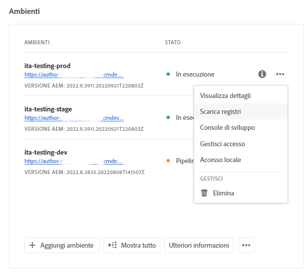
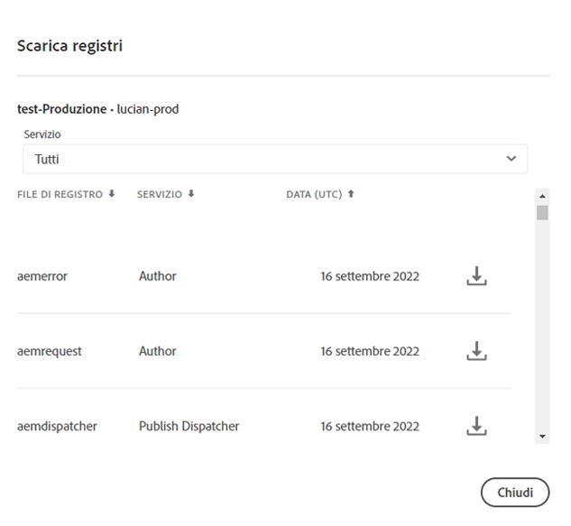
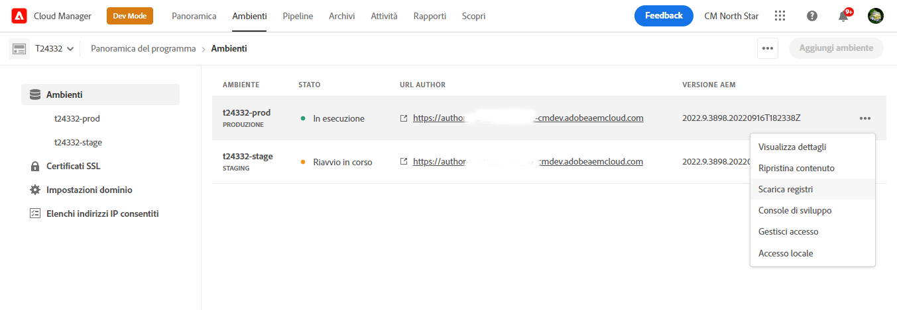

# Accesso e gestione dei registri {#manage-logs}

Scopri come accedere ai registri e gestirli per facilitare il processo di sviluppo in AEM as a Cloud Service.

Dalla scheda **Ambienti** della pagina **Panoramica** o dalla pagina Dettagli dell’ambiente è possibile accedere all’elenco dei file di registro disponibili per l’ambiente selezionato.

## Download dei registri {#download-logs}

Per scaricare i registri, segui la procedura riportata di seguito.

1. Accedi a Cloud Manager all’indirizzo [my.cloudmanager.adobe.com](https://my.cloudmanager.adobe.com/) e seleziona l’organizzazione e il programma appropriati.

1. Dalla pagina **Panoramica**, accedi alla scheda **Ambienti**.

1. Dal menu con i puntini di sospensione, seleziona **Scarica registri**.

   

1. Nella finestra di dialogo **Scarica registri**, seleziona il **Servizio** appropriato dal menu a discesa.

   

1. Dopo aver selezionato il servizio, fai clic sull’icona accanto al registro che desideri recuperare per scaricarlo.

È possibile accedere ai registri anche dalla pagina **Ambienti**.



## Registri tramite API {#logs-through-api}

Oltre che dall’interfaccia utente, i registri possono essere scaricati tramite l’API e l’interfaccia della riga di comando.

Per scaricare i file di registro di un ambiente specifico, il comando è simile al seguente.

```shell
$ aio cloudmanager:download-logs --programId 5 1884 author aemerror
```

È inoltre possibile visualizzare i registri tramite l’interfaccia della riga di comando.

```shell
$ aio cloudmanager:tail-log --programId 5 1884 author aemerror
```

Per ottenere l’ID dell’ambiente (1884 in questo esempio) e le opzioni del servizio o del nome di registro disponibili, puoi utilizzare i seguenti comandi.

```shell
$ aio cloudmanager:list-environments
Environment Id Name                     Type  Description                          
1884           FoundationInternal_dev   dev   Foundation Internal Dev environment  
1884           FoundationInternal_stage stage Foundation Internal STAGE environment
1884           FoundationInternal_prod  prod  Foundation Internal Prod environment
 
 
$ aio cloudmanager:list-available-log-options 1884
Environment Id Service    Name         
1884           author     aemerror     
1884           author     aemrequest   
1884           author     aemaccess    
1884           publish    aemerror     
1884           publish    aemrequest   
1884           publish    aemaccess    
1884           dispatcher httpderror   
1884           dispatcher aemdispatcher
1884           dispatcher httpdaccess
```

### Risorse aggiuntive {#resources}

Per ulteriori informazioni sull’API di Cloud Manager e sull’interfaccia della riga di comando Adobe I/O, consulta le seguenti risorse aggiuntive:

* [Documentazione API di Cloud Manager](https://www.adobe.io/apis/experiencecloud/cloud-manager/docs.html)
* [Interfaccia della riga di comando Adobe I/O](https://github.com/adobe/aio-cli-plugin-cloudmanager)
