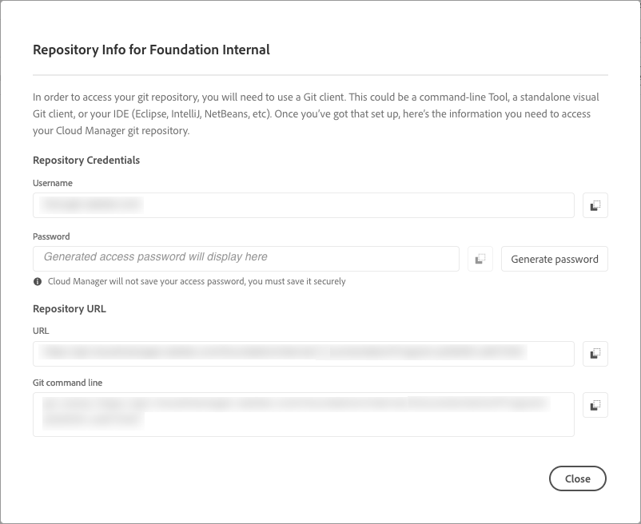

# Gestione degli archivi in Cloud Manager {#managing-repos}

Scopri come visualizzare, aggiungere ed eliminare gli archivi Git in Cloud Manager.

## Informazioni sugli archivi in Cloud Manager {#overview}

Gli archivi in Cloud Manager vengono utilizzati per archiviare e gestire il codice del progetto utilizzando Git. Per ogni *programma* aggiunto, viene automaticamente creato un archivio gestito da Adobe.

Inoltre, è disponibile l’opzione per creare altri archivi gestiti da Adobe e i tuoi archivi privati. Tutti gli archivi collegati al programma possono essere visualizzati nella pagina **Archivi**.

Gli archivi creati in Cloud Manager possono essere selezionati anche durante l’aggiunta o la modifica delle pipeline. Per ulteriori informazioni sulla configurazione delle pipeline, consulta [Pipeline CI/CD](/help/implementing/cloud-manager/configuring-pipelines/introduction-ci-cd-pipelines.md).

Ogni pipeline è collegata a un archivio principale o a un ramo. Grazie al [supporto dei sottomoduli Git](git-submodules.md), tuttavia, durante il processo di creazione è possibile aggiungere numerosi rami secondari.

## Visualizzare la pagina Archivi {#repositories-window}

Nella pagina **Archivi** è possibile visualizzare i dettagli dell’archivio selezionato. Tra le informazioni disponibili è incluso anche il tipo di archivio in uso. Se l’archivio è contrassegnato come **Adobe**, significa che si tratta di un archivio gestito da Adobe. Se invece è etichettato come **GitHub**, fa riferimento a un archivio GitHub privato che gestisci tu direttamente. Nella pagina viene specificato anche quando è stato creato l’archivio e quali sono le pipeline associate.

Per intervenire su un archivio selezionato, è possibile fare clic su di esso e utilizzare l’ per aprire un menu a discesa. Per gli archivi gestiti da Adobe è disponibile l’opzione **[Controlla rami/Crea progetto](#check-branches)**.

*Menu a discesa nella pagina Archivi.*

Altre azioni disponibili nel menu a discesa includono **[Copia URL archivio](#copy-url)**, **[Visualizza e aggiorna](#view-update)** ed **[Elimina](#delete)** l’archivio.

**Per visualizzare la pagina Archivi:**

1. Accedi a Cloud Manager all’indirizzo [my.cloudmanager.adobe.com](https://my.cloudmanager.adobe.com/) e seleziona l’organizzazione e il programma appropriati.

1. Nella pagina **Panoramica del programma**, dal menu laterale selezionare l’ **Archivi**.

1. Nella finestra **Archivi** vengono visualizzati tutti gli archivi associati al programma selezionato.

   
   *Pagina Archivi in Cloud Manager.*

## Aggiungere un archivio {#adding-repositories}

Per poter aggiungere un archivio, l’utente deve avere il ruolo di **Responsabile della distribuzione** o **Proprietario business**.

Nella pagina **Archivi** fai clic sull’opzione **Aggiungi archivio** nell’angolo in alto a destra.

*Finestra di dialogo Aggiungi archivio.*

Cloud Manager supporta due tipi di archivi: gli archivi gestiti da Adobe (**Archivio Adobe**) e quelli che puoi gestire direttamente (**Archivio privato**). I campi obbligatori dipendono dal tipo di archivio che scegli di aggiungere. Per ulteriori informazioni, consulta:

* [Aggiungere archivi Adobe in Cloud Manager](adobe-repositories.md)
* [Aggiungere archivi privati in Cloud Manager](private-repositories.md)

Per ogni azienda o organizzazione IMS, vi è un limite di 300 archivi per tutti i programmi.

## Accedere alle informazioni sull’archivio {#repo-info}

Quando visualizzi gli archivi nella finestra **Archivi**, puoi visualizzare i dettagli su come accedere agli archivi gestiti da Adobe a livello di programmazione facendo clic sul pulsante **Accedi a dati archivio** nella barra degli strumenti.

La finestra **Informazioni archivio** si apre con i dettagli. Per ulteriori informazioni sull’accesso alle informazioni dell’archivio, consulta [Accesso alle informazioni sull’archivio](/help/implementing/cloud-manager/managing-code/accessing-repos.md).

## Controlla rami/Crea progetto {#check-branches}

In **AEM Cloud Manager**, l’azione **Controlla rami / Crea progetto** ha due scopi, a seconda dello stato corrente dell’archivio.

* Se l’archivio è stato appena creato, questa azione genera un progetto di esempio basato sull’[Archetipo progetto AEM](https://experienceleague.adobe.com/it/docs/experience-manager-core-components/using/developing/archetype/overview).
* Se il progetto di esempio è già stato creato nell’archivio, l’azione verifica lo stato dell’archivio e dei relativi rami, fornendo feedback sull’esistenza o meno del progetto di esempio.

  

## Copia URL archivio {#copy-url}

L’azione **Copia URL archivio** copia negli Appunti l’URL dell’archivio selezionato nella finestra **Archivi** per utilizzarlo altrove.

## Visualizzare e aggiornare un archivio {#view-update}

L’azione **Visualizza e aggiorna** apre la finestra di dialogo **Aggiorna archivio**, in cui è possibile visualizzare il **Nome** e l’**Anteprima URL dell’archivio**. Inoltre consente di aggiornare la **Descrizione** dell’archivio.

## Eliminare un archivio {#delete}

L’azione **Elimina** rimuove l’archivio dal progetto. Un archivio non può essere eliminato se è associato a una pipeline.

L’eliminazione di un archivio rende il suo nome inutilizzabile per tutti i nuovi archivi creati in futuro. Se si tenta di aggiungere un repository utilizzando lo stesso nome di un repository eliminato, viene visualizzato il seguente messaggio di errore:

`Repository name should be unique within organization.`

Inoltre, l’archivio eliminato non è più disponibile in Cloud Manager e non può essere collegato ad alcuna pipeline.

