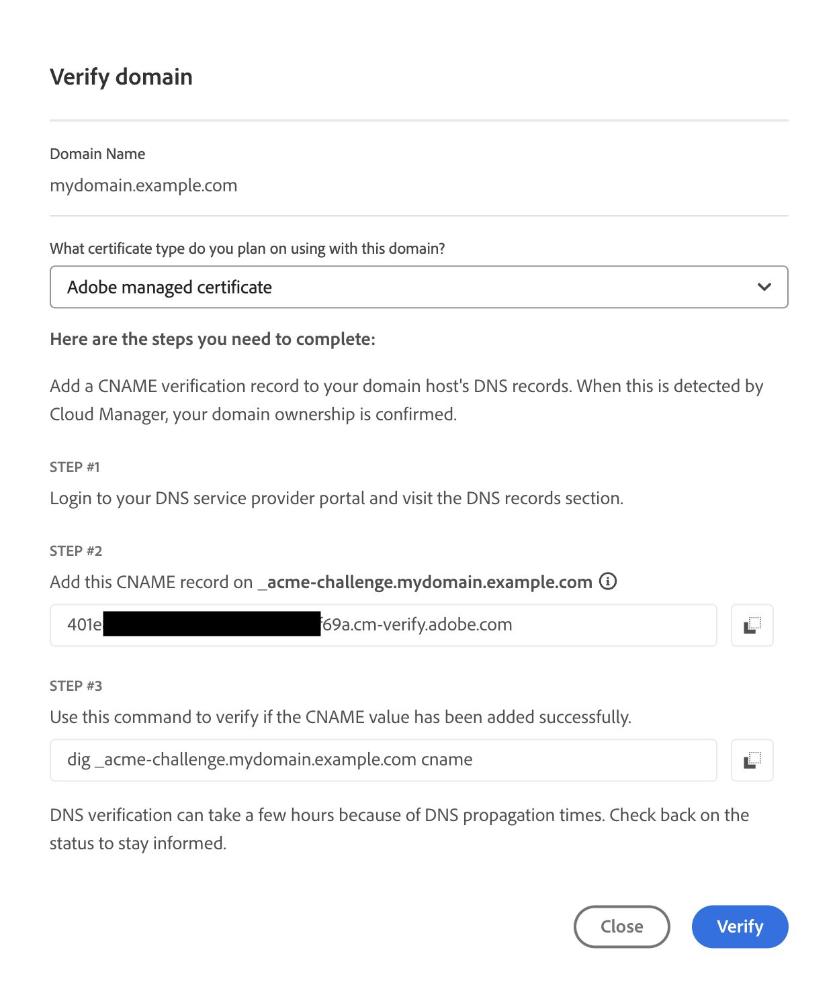

# Aggiungere un certificato SSL {#add-ssl-cert}

Scopri come aggiungere un certificato SSL gestito dal cliente o un certificato DV (convalida del dominio) generato e gestito da un Adobe utilizzando gli strumenti self-service di Cloud Manager.

Vedi anche [Risoluzione dei problemi relativi agli errori del certificato SSL](/help/implementing/cloud-manager/managing-ssl-certifications/troubleshoot-ssl-cert.md).

## Aggiungere un certificato SSL {#adding-an-ssl-certificate}

Il provisioning di un certificato può richiedere alcuni giorni. Di conseguenza, l’Adobe consiglia di eseguire il provisioning del certificato con largo anticipo rispetto a qualsiasi scadenza o data di pubblicazione.

Controlla i **requisiti del certificato** in [Introduzione alla gestione dei certificati SSL](/help/implementing/cloud-manager/managing-ssl-certifications/introduction.md#requirements) per assicurarti che AEM as a Cloud Service supporti il certificato che desideri aggiungere.

Per completare l&#39;attività, l&#39;utente deve avere il ruolo **Proprietario business** o **Responsabile dell&#39;implementazione**.

>[!NOTE]
>
>Ai clienti non è consentito caricare certificati DV (convalida dominio).

**Per aggiungere un certificato SSL:**

1. Accedi a Cloud Manager all’indirizzo [my.cloudmanager.adobe.com](https://my.cloudmanager.adobe.com/) e seleziona l’organizzazione appropriata.

1. Nella console **[I miei programmi](/help/implementing/cloud-manager/navigation.md#my-programs)**, seleziona il programma.

1. Dalla pagina **Panoramica**, passa alla schermata **Ambienti**.

1. Nel pannello di navigazione a sinistra, in **Servizi**, fai clic su **Certificati SSL**. Se il pannello di navigazione a sinistra non è visualizzato come nell’immagine seguente, potrebbe essere necessario fare clic sull’icona con l’hamburger nell’angolo in alto a sinistra.

   

1. Fai clic su **Aggiungi certificato SSL** nell&#39;angolo superiore destro della pagina.

1. Nella finestra di dialogo **Aggiungi certificato SSL**, in base al [caso d&#39;uso particolare](/help/implementing/cloud-manager/managing-ssl-certifications/introduction.md), eseguire una delle operazioni seguenti:

   | | Caso d’uso | Passaggi |
   | --- | --- | --- |
   | 1 | **Aggiungere un Adobe di certificato gestito (DV)** | **Per aggiungere un Adobe di certificato gestito (DV):**  a. Selezionare il tipo di certificato **Adobe gestito (DV)**.  b. Nell&#39;elenco a discesa **Seleziona domini** selezionare uno o più domini da associare al certificato DV. Nessun dominio da selezionare? In tal caso, devi aggiungere un dominio personalizzato. Vedere [Aggiungere un nome di dominio personalizzato](/help/implementing/cloud-manager/custom-domain-names/add-custom-domain-name.md). Dopo aver aggiunto un nome di dominio personalizzato, torna a questo argomento e ricomincia dal passaggio 1.  d. Continuare con il passaggio 7. |
   | 2 | **Aggiungere un certificato gestito dal cliente (OV/EV)** | **Per aggiungere un certificato gestito dal cliente (OV/EV):**  a. Selezionare il tipo di certificato **OV/EV gestito dal cliente**.  b. Nel campo **Nome certificato** immettere un nome per il certificato. Questo campo è solo a scopo informativo e può essere qualsiasi nome che ti aiuti a fare riferimento facilmente al certificato. c. Nei campi **Certificato**, **Chiave privata** e **Catena certificati**, incolla i valori richiesti nei rispettivi campi.  Vengono visualizzati tutti gli errori rilevati nei valori. Prima di poter salvare il certificato, è necessario risolvere tutti gli errori. Per ulteriori informazioni sulla risoluzione dei problemi relativi agli errori comuni, consulta [Errori relativi ai certificati](#certificate-errors).  d. Continuare con il passaggio 7. |

<!--
    **Add an SSL certificate:**
    1. Select the certificate type **Customer managed (OV/EV)**.
    1. In **Certificate name** field, enter a name for your certificate. This field is for informational purposes only and can be any name that helps you reference your certificate easily.
    1. In the **Certificate**, **Private key**, and **Certificate chain** fields, paste the required values into their respective fields.

        
  
    Any detected errors in values are displayed. Before you can save your certificate, you must address all errors. See [Certificate errors](#certificate-errors) to learn more about troubleshooting common errors.

    **Add a DV certificate:**
    1. Select the certificate type **Adobe managed (DV)**.

        

    1. In the **Select domains** drop-down list, select one or more domains that you want associated with the DV certificate.

        No domains to select? If so, it means that you must add a custom domain. See [Add a custom domain](#add-custom-domain). When you are finished, resume the steps from the beginning again. -->

1. Nell’angolo inferiore a destra della finestra di dialogo, fai clic su **Salva**.

   Dopo che il certificato è stato rilasciato, viene visualizzato un segno di spunta verde nella tabella **Certificati SSL**.

Ora hai aggiunto un certificato SSL funzionante per il progetto. Questo passaggio è spesso il primo a configurare un nome di dominio personalizzato.

* Per impostare un nome di dominio personalizzato, vedere [Aggiungere un nome di dominio personalizzato](/help/implementing/cloud-manager/custom-domain-names/add-custom-domain-name.md).
* Per informazioni sull&#39;aggiornamento e la gestione dei certificati SSL in Cloud Manager, vedere [Gestione dei certificati SSL](/help/implementing/cloud-manager/managing-ssl-certifications/managing-certificates.md).

<!--
### Add a custom domain {#add-custom-domain}

Before you can add an Adobe generated and managed Domain Validated (DV) certificate, you must first add a custom domain. The process for doing so is nearly the same as detailed in [Introduction to custom domain names](/help/implementing/cloud-manager/custom-domain-names/introduction.md) and [Add a custom domain name](/help/implementing/cloud-manager/custom-domain-names/add-custom-domain-name.md). However, that functionality is now slightly expanded, as described below.

1. When adding a custom domain name, in the **Verify domain** dialog box, select an **Adobe managed certificate**.

    

1. In the **Verify domain** dialog box, add a CNAME verification record to your DNS.

    

1. After the domain is created, click the ellipsis button in the list of domains and select **Verify** to verify the domain.

     

1. Resume the task [Add a DV certificate](#adding-an-ssl-certificate). -->

