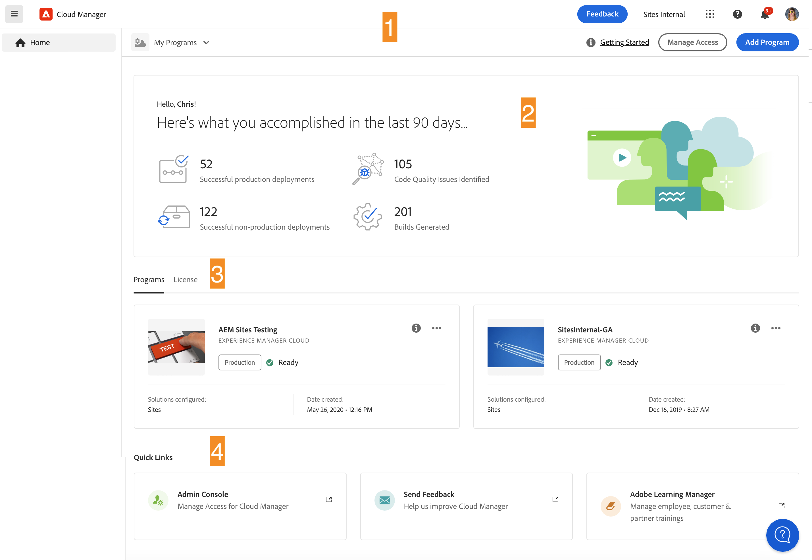
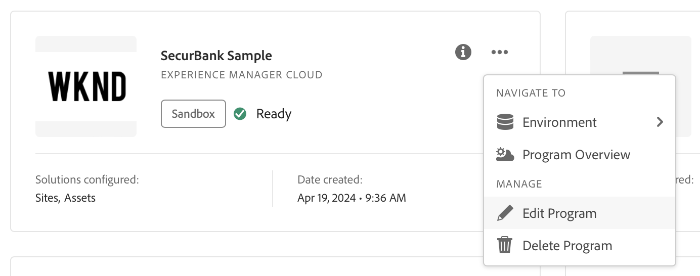
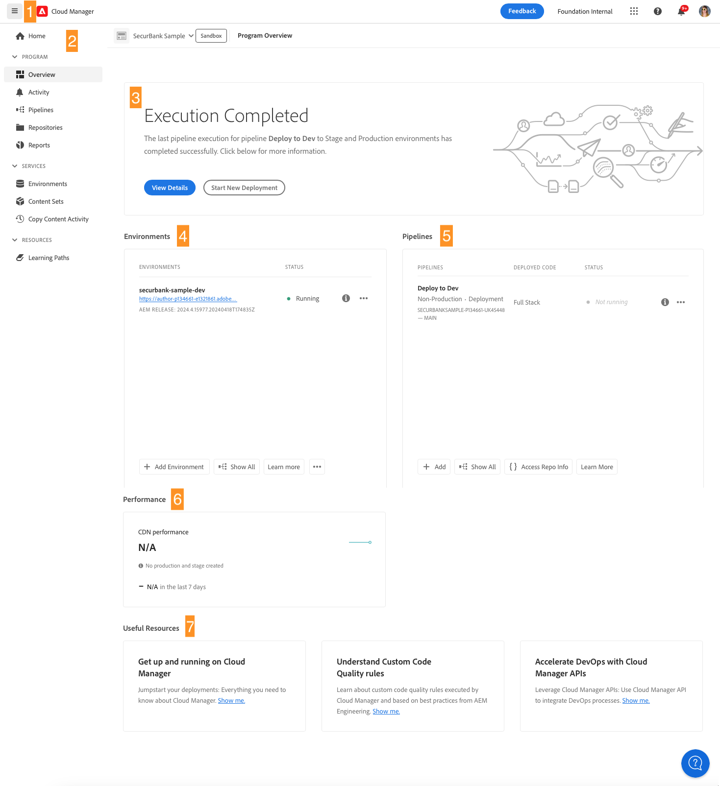

# Navigare nell’interfaccia utente di Cloud Manager {#navigation}

Scopri come è organizzata l’interfaccia utente di Cloud Manager e come spostarsi per gestire i programmi e gli ambienti.

L’interfaccia utente di Cloud Manager è composta principalmente da due interfacce grafiche:

* [La console Programmi personali](#my-programs-console) è la posizione da cui visualizzare e gestire tutti i programmi.
* [La finestra Panoramica del programma](#program-overview) è dove puoi visualizzare i dettagli e gestire un singolo programma.

>[!TIP]
>
>Consulta anche il [percorso di documentazione sull&#39;onboarding](/help/journey-onboarding/overview.md) per una panoramica completa su come iniziare a utilizzare AEM as a Cloud Service con Cloud Manager.

## Assistente IA in AEM

Per i clienti che hanno [completato i criteri dei prerequisiti](/help/implementing/cloud-manager/ai-assistant-in-aem.md#get-access), l&#39;Assistente AI in AEM è disponibile per gli utenti della loro organizzazione. Consulta [Assistente IA in AEM](/help/implementing/cloud-manager/ai-assistant-in-aem.md).

## Console Programmi personali {#my-programs-console}

Quando accedi a Cloud Manager all’indirizzo [my.cloudmanager.adobe.com](https://my.cloudmanager.adobe.com/) e selezioni l’organizzazione appropriata, vieni indirizzato alla console **Programmi personali**.

La console Programmi personali fornisce una panoramica di tutti i programmi a cui hai accesso nell’organizzazione selezionata. È costituita da diverse elementi.

1. [Barre degli strumenti](#toolbars-my-programs-toolbars) per la selezione di organizzazioni, avvisi e impostazioni account
1. Schede che consentono di attivare/disattivare la visualizzazione corrente dei programmi.
   * Visualizzazione **Pagina principale** (predefinita) che seleziona la visualizzazione **Programmi personali** con una panoramica di tutti i programmi
   * **Licenza** che accede alla [Dashboard delle licenze](/help/implementing/cloud-manager/license-dashboard.md).
   * Il valore predefinito delle schede è Chiuso e può essere visualizzato utilizzando  nell&#39;intestazione [Cloud Manager](#cloud-manager-header).
1. [Statistiche e invito all’azione](#statistics) per una panoramica dell’attività recente
1. Sezione [**Programmi personali** &#x200B;](#my-programs-section) con una panoramica di tutti i programmi
1. [Collegamenti rapidi](#quick-links-section) per accedere facilmente alle risorse correlate.

>[!TIP]
>
>Per ulteriori informazioni sui programmi, consulta [Programmi e tipi di programmi](/help/implementing/cloud-manager/getting-access-to-aem-in-cloud/program-types.md).

### Barre degli strumenti {#my-programs-toolbars}

Sono disponibili due barre degli strumenti una sopra l’altra.

#### Barra di navigazione superiore di Experience Platform {#cloud-manager-header}

La prima è la barra di navigazione superiore di Experience Platform, che è persistente durante la navigazione in Cloud Manager. Si tratta di un ancoraggio che consente di accedere alle impostazioni e alle informazioni applicabili ai diversi programmi di Cloud Manager.

* L&#39;icona  (mostra o nascondi menu laterale) consente di accedere a una serie di schede che consentono di accedere a parti specifiche di un singolo programma. In alternativa, è possibile passare dalla console [Dashboard delle licenze](/help/implementing/cloud-manager/license-dashboard.md) alla console **[Programmi personali](#my-programs-console)** a seconda del contesto.
* L&#39;icona  ([Notifiche](/help/implementing/cloud-manager/notifications.md)) consente di accedere, tra le altre cose, a notifiche e annunci.

Per ulteriori dettagli sulla barra di navigazione superiore di Experience Platform, consulta la [guida dell&#39;interfaccia utente di Adobe Experience Platform](https://experienceleague.adobe.com/en/docs/experience-platform/landing/platform-ui/ui-guide#top-navigation-bar).

#### Barra degli strumenti del programma {#program-toolbar}

La barra degli strumenti del programma fornisce collegamenti per passare da programmi ad azioni di Cloud Manager e viceversa appropriati al contesto.

1. Il selettore **Programmi personali** apre un elenco a discesa in cui è possibile selezionare rapidamente altri programmi o eseguire azioni appropriate al contesto, ad esempio la creazione di un nuovo programma
1. Il collegamento **Guida introduttiva** consente di accedere al [percorso di documentazione sull&#39;onboarding](/help/journey-onboarding/overview.md) per iniziare a utilizzare Cloud Manager.
1. Il pulsante di azione offre azioni appropriate al contesto, ad esempio l’aggiunta di un programma.

### Statistiche e inviti all&#39;azione {#statistics}

La sezione Statistiche e call-to-action fornisce dati aggregati per l’organizzazione. Ad esempio, se hai configurato correttamente i programmi, potrebbero essere visualizzate le statistiche delle attività degli ultimi 90 giorni, tra cui:

* Numero di [implementazioni](/help/implementing/cloud-manager/deploy-code.md)
* Numero di [problemi di qualità del codice](/help/implementing/cloud-manager/code-quality-testing.md) identificati
* Numero di build

Oppure, se stai iniziando la configurazione dell’organizzazione, potrebbero essere disponibili suggerimenti sui passaggi successivi o sulle risorse della documentazione.

### Sezione Programmi personali {#my-programs-section}

Il contenuto principale della console **Programmi** è l&#39;elenco dei programmi nella sezione **Programmi**.

Nella sezione **I miei programmi** sono elencate le schede che rappresentano ogni programma. Fai clic su una scheda per accedere alla pagina **Panoramica del programma** per informazioni dettagliate sul programma.

>[!NOTE]
>
>A seconda dei privilegi di cui disponi, potrebbe non essere possibile selezionare alcuni programmi.

Per trovare più facilmente il programma necessario, utilizzare le opzioni di ordinamento.

* Ordina per:
   * **Data creazione** (impostazione predefinita)
   * **Nome programma**
   * **Stato**
*  Crescente (impostazione predefinita) / 
*  Visualizzazione griglia (impostazione predefinita)
*  Visualizzazione elenco

#### Schede del programma {#program-cards}

Una scheda (o riga in una tabella) rappresenta ogni programma, fornendo una panoramica del programma e collegamenti rapidi per intervenire.

* Immagine associata al programma, se configurata. L&#39;immagine qui sopra è &quot;WKND&quot;.
* Nome assegnato al programma. L’immagine qui sopra mostra &quot;SecurBank Sample&quot; come nome del programma.
* Tipo di servizio:
   * **Experience Manager Cloud** — per programmi AEM as a Cloud Service
   * **Experience Manager** — per [programmi AMS (Adobe Managed Services)](https://experienceleague.adobe.com/en/docs/experience-manager-cloud-manager/content/introduction)
* [Tipo di programma](/help/implementing/cloud-manager/getting-access-to-aem-in-cloud/program-types.md):
   * Sandbox
   * Produzione
* Stato. Nell’immagine qui sopra, lo stato è Pronto con un segno di spunta.
* Soluzioni configurate. Nell’immagine precedente, Sites e Assets sono le soluzioni configurate.
* Data di creazione.

Un programma di produzione potrebbe essere contrassegnato per mostrare funzioni aggiuntive scelte al momento dell’aggiunta, ad esempio:

*  [HIPAA](/help/implementing/cloud-manager/getting-access-to-aem-in-cloud/creating-production-programs.md#security)

*  [Protezione WAF-DDOS](/help/implementing/cloud-manager/getting-access-to-aem-in-cloud/creating-production-programs.md#security)

* [99,99% SLA (Service level agreement)](/help/implementing/cloud-manager/getting-access-to-aem-in-cloud/creating-production-programs.md#sla)

L’icona delle informazioni consente inoltre di accedere rapidamente a informazioni aggiuntive sul programma (utili nella vista a elenco).

L&#39;icona  consente di accedere alle azioni aggiuntive che è possibile eseguire sul programma.

* Passa a una particolare  [ambiente](/help/implementing/cloud-manager/manage-environments.md) del programma
* Apri l&#39; [Panoramica programma](#program-overview)
*  [Modifica il programma](/help/implementing/cloud-manager/getting-access-to-aem-in-cloud/editing-programs.md#editing)
*  [Elimina un programma sandbox](/help/implementing/cloud-manager/getting-access-to-aem-in-cloud/editing-programs.md#delete-sandbox-program)

>[!TIP]
>
>Per ulteriori informazioni sui programmi e sull&#39;aggiunta e la gestione dei programmi, vedere:
>
>* [Programmi e tipi di programmi](/help/implementing/cloud-manager/getting-access-to-aem-in-cloud/program-types.md)
>* [Crea programmi di produzione](/help/implementing/cloud-manager/getting-access-to-aem-in-cloud/creating-production-programs.md)
>* [Creare programmi sandbox](/help/implementing/cloud-manager/getting-access-to-aem-in-cloud/creating-sandbox-programs.md)

### Sezione Collegamenti rapidi {#quick-links-section}

La sezione dei collegamenti rapidi consente di accedere alle risorse di uso comune correlate.

## Pagina di panoramica del programma {#program-overview}

Quando si seleziona un programma nella console **[Programmi personali](#my-programs-console)**, viene visualizzata la pagina **Panoramica programma**.

La panoramica del programma consente di accedere a tutti i dettagli di un programma di Cloud Manager. Come la console **Programmi**, è composta da diverse parti.

1. [Barre degli strumenti](#program-overview-toolbar) per tornare rapidamente alla console Programmi e per spostarsi nel programma
1. [Schede](#program-tabs) per passare da un aspetto all’altro del programma
1. Un [invito all’azione](#cta) basato sulle ultime azioni del programma
1. Una [panoramica degli ambienti](#environments) del programma
1. Una [panoramica delle pipeline](#pipelines) del programma
1. [panoramica delle prestazioni](#performance) del programma
1. Collegamenti a [risorse utili](#useful-resources)

### Barre degli strumenti {#program-overview-toolbar}

Le barre degli strumenti per la panoramica del programma sono simili a quelle della console [Programmi personali](#my-programs-toolbars). Qui sono illustrate solo le differenze.

#### Intestazione di Cloud Manager {#cloud-manager-header-2}

Nell’angolo in alto a sinistra della pagina è l’intestazione Cloud Manager di Adobe. È possibile fare clic su  per mostrare o nascondere il menu laterale delle schede in altre aree del software.

Fai clic su Adobe Cloud Manager per tornare alla Home.

#### Barra degli strumenti del programma {#program-toolbar-2}

La barra degli strumenti del programma consente di passare rapidamente ad altri programmi, ma anche di accedere ad azioni appropriate al contesto, come l’aggiunta e la modifica del programma.

La barra degli strumenti mostra sempre la scheda in uso, anche se le schede sono state nascoste utilizzando l&#39;icona .

### Schede Programma {#program-tabs}

A ogni programma sono associate molte opzioni e molti dati. Queste opzioni e questi dati vengono raccolti in schede per semplificare la navigazione nel programma. Le schede consentono di accedere a:

**Programma**

*  Panoramica - Panoramica del programma come descritto nel documento corrente
*  [Attività](/help/implementing/cloud-manager/configuring-pipelines/managing-pipelines.md#activity) - Cronologia delle esecuzioni della pipeline del programma
*  [Pipeline](/help/implementing/cloud-manager/configuring-pipelines/managing-pipelines.md#pipelines) - Tutte le pipeline configurate per il programma
*  [Archivi](/help/implementing/cloud-manager/managing-code/managing-repositories.md) - Tutti gli archivi configurati per il programma
*  [Rapporti](/help/implementing/cloud-manager/reports/report-sla.md) - Metriche quali dati di SLA

**Servizi**

*  [Ambienti](/help/implementing/cloud-manager/manage-environments.md) - Tutti gli ambienti configurati per il programma
*  [Siti Edge Delivery](/help/implementing/cloud-manager/edge-delivery/introduction-to-edge-delivery-services.md) - Gestisci siti Edge Delivery
*  [Impostazioni dominio](/help/implementing/cloud-manager/custom-domain-names/introduction.md) - Gestisci nomi di dominio personalizzati per il programma
*  [Certificati SSL](/help/implementing/cloud-manager/managing-ssl-certifications/introduction-to-ssl-certificates.md) - Gestisci certificati SSL per il programma
*  [Mappature dominio](/help/implementing/cloud-manager/custom-domain-names/introduction.md) - Gestisci mapping dominio
*  [`IP Allow Lists`](/help/implementing/cloud-manager/ip-allow-lists/introduction.md) - Definisci elenchi consentiti per determinati indirizzi IP
*  [Set di contenuti](/help/implementing/developing/tools/content-copy.md) - Set di contenuti creati a scopo di copia
*  [Attività copia contenuto](/help/implementing/developing/tools/content-copy.md) - Attività copia contenuto
*  [Infrastruttura di rete](/help/security/configuring-advanced-networking.md) - Gestisci opzioni di rete avanzate per il programma

**Risorse**

*  Percorsi di apprendimento - Risorse di apprendimento aggiuntive su Cloud Manager

Per impostazione predefinita, quando si apre un programma si accede alla scheda **Panoramica**. Viene evidenziata la scheda corrente. Seleziona un’altra scheda per visualizzarne i dettagli.

Nell&#39;angolo superiore sinistro dell&#39;intestazione [Cloud Manager](#cloud-manager-header-2), fare clic su  per visualizzare o nascondere il menu laterale delle schede.

### Invito all’azione {#cta}

La sezione relativa agli inviti all’azione fornisce informazioni utili in base allo stato del programma. Per un nuovo programma, potrebbero essere visualizzati i passaggi successivi e un promemoria della data di pubblicazione [impostata durante la creazione del programma](/help/implementing/cloud-manager/getting-access-to-aem-in-cloud/editing-programs.md).

Per un programma live, lo stato dell’ultima implementazione con collegamenti per i dettagli e l’avvio di una nuova implementazione.

### Scheda Ambienti {#environments}

La scheda **Ambienti** offre una panoramica degli ambienti e collegamenti per azioni rapide.

Nella scheda **Ambienti** sono elencati solo tre ambienti. Fai clic sull&#39;icona  **Mostra tutto** per visualizzare tutti gli ambienti del programma.

Vedi anche [Gestisci ambienti](/help/implementing/cloud-manager/manage-environments.md).

### Scheda Pipeline {#pipelines}

La scheda **Pipeline** offre una panoramica delle pipeline e collegamenti per azioni rapide.

Nella scheda **Pipeline** sono elencate solo tre pipeline. Fai clic sull&#39;icona  **Mostra tutto** per visualizzare tutte le pipeline del programma.

Vedi anche [Gestione pipeline](/help/implementing/cloud-manager/configuring-pipelines/managing-pipelines.md) per informazioni dettagliate su come gestire le pipeline.

### Scheda Prestazioni {#performance}

La scheda **Prestazioni** offre una panoramica della **[dashboard CDN](/help/implementing/cloud-manager/cdn-performance.md)**.

### Risorse utili {#useful-resources}

La sezione **Risorse utili** fornisce collegamenti a risorse di apprendimento aggiuntive per Cloud Manager.
