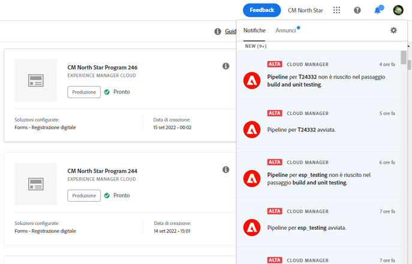

# Notifiche {#notifications}

[!UICONTROL Cloud Manager] consente all&#39;utente di ricevere notifiche all&#39;avvio e al completamento (con esito positivo o negativo) della pipeline di produzione all&#39;inizio di una distribuzione di produzione. Queste notifiche vengono inviate tramite il sistema di notifica Adobe [!UICONTROL Experience Cloud] .

>[!NOTE]
>
>L&#39;approvazione e le notifiche pianificate vengono inviate solo agli utenti nei ruoli Business Owner, Program Manager e Deployment Manager.

Le notifiche vengono visualizzate in una barra laterale nell’interfaccia utente di [!UICONTROL Cloud Manager] (Interfaccia utente) e in Adobe [!UICONTROL Experience Cloud].

Fate clic sull’icona della campana dall’intestazione per aprire la barra laterale e visualizzare le notifiche, come illustrato nella figura seguente:

Nella barra laterale sono elencate le notifiche più recenti.

## Notifiche e-mail {#email-notifications}

Per impostazione predefinita, le notifiche sono disponibili nell&#39;interfaccia utente Web tra le soluzioni Adobe [!UICONTROL Experience Cloud] . I singoli utenti possono inoltre scegliere di inviare queste notifiche tramite e-mail, sia in modo immediato che tramite riepilogo.

Questo porterà l&#39;utente nella schermata Preferenze notifiche in Adobe [!UICONTROL Experience Cloud].

Gli utenti possono attivare le notifiche e-mail e (facoltativamente) selezionare i tipi di notifiche che desiderano ricevere tramite e-mail.

>[!NOTE]
>
>Puoi anche abilitare la digestione da Adobe [!UICONTROL Experience Cloud], come mostrato di seguito:
