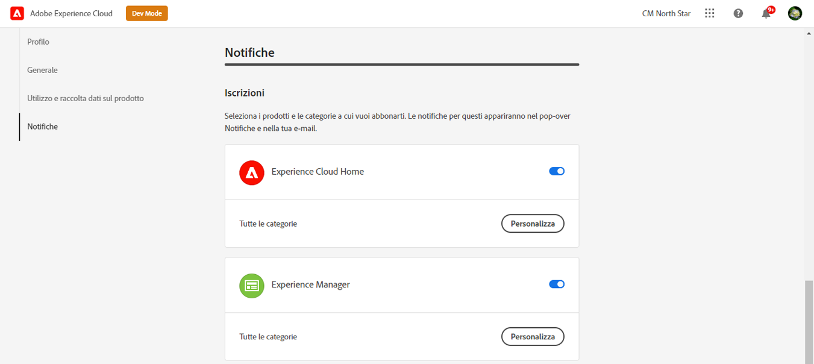
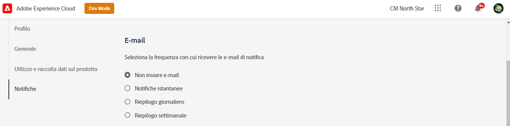

# Notifiche {#notifications}

[!UICONTROL Cloud Manager] consente all’utente di ricevere notifiche all’avvio e al completamento della pipeline di produzione (con successo o senza successo) durante un’implementazione di produzione.

Queste notifiche vengono inviate tramite l’Adobe [!UICONTROL Experience Cloud] sistema di notifica agli utenti con i ruoli **Proprietario business**, **Responsabile del programma** e **Gestione distribuzione**.

Le notifiche vengono visualizzate all’estremità destra della barra dei menu nel [!UICONTROL Cloud Manager] Interfaccia utente e Adobe [!UICONTROL Experience Cloud].

L&#39;icona della campana viene contrassegnata quando ci sono nuove notifiche. Fai clic su di esso per aprire il pannello a per visualizzare le notifiche.

Il pannello elenca solo le notifiche più recenti. Fai clic su **Visualizza tutto** nella parte inferiore del pannello per visualizzare tutte le notifiche.

## Notifiche e-mail {#email-notifications}

Per impostazione predefinita, le notifiche sono disponibili nell’interfaccia utente di Adobe [!UICONTROL Experience Cloud] soluzioni. I singoli utenti possono inoltre scegliere di inviare queste notifiche tramite e-mail seguendo questi passaggi.

1. Fai clic sull&#39;icona della campana per visualizzare le notifiche.
1. Fai clic sul pulsante **Modifica preferenze** icona (a forma di ingranaggio) nella parte superiore del pannello notifiche.
1. Nella finestra visualizzata, fai clic su **Notifiche** nella navigazione a sinistra.
   
1. Scorri verso il basso fino a **E-mail** intestazione.
   
1. Seleziona come desideri ricevere le e-mail.
   * Non inviare e-mail (impostazione predefinita)
   * Notifiche istantanee
   * Riepilogo giornaliero
   * Digest settimanale

Una volta effettuata la selezione, la scelta viene salvata automaticamente senza dover fare clic su un pulsante salva o applica.
