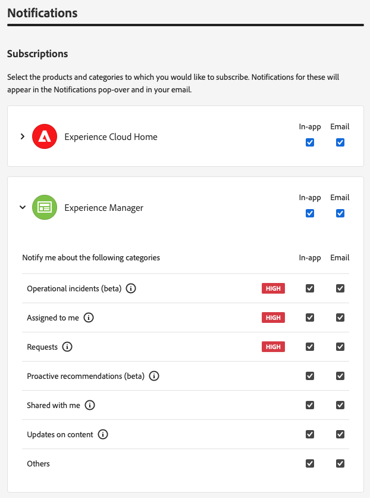

# Notifiche {#notifications}

Scopri in che modo Cloud Manager notifica gli eventi importanti.

## Notifiche in Cloud Manager {#cloud-manager-notifications}

[!UICONTROL Cloud Manager] invia notifiche quando una pipeline di produzione viene avviata e completata (con successo o senza successo) all’inizio di una distribuzione di produzione.

Le notifiche vengono inviate tramite il sistema di notifica [!UICONTROL Experience Cloud] agli utenti con i ruoli **Proprietario business**, **Responsabile del programma** e **Responsabile della distribuzione**.

Le notifiche vengono visualizzate in una barra laterale in [!UICONTROL Cloud Manager] e in tutto Adobe [!UICONTROL Experience Cloud]. Quando ricevi nuove notifiche, l’icona a forma di campana nell’intestazione viene contrassegnata.

Fai clic sull’icona a forma di campana per aprire la barra laterale e visualizzare le notifiche. La scheda **Notifiche** nella barra laterale elenca le notifiche più recenti, ad esempio le conferme di distribuzione. Le notifiche riguardano i tuoi ambienti.

La scheda **Annunci** include annunci di prodotti Adobe. Gli annunci riguardano il prodotto.

Fai clic su una notifica o un annuncio per visualizzarne i dettagli. Le notifiche collegate ad attività come le distribuzioni di pipeline ti portano ai dettagli di quell’attività, ad esempio la finestra di esecuzione della pipeline.

Fai clic sull&#39;opzione **Visualizza tutto** nella parte inferiore del pannello per visualizzare tutti gli annunci presenti nella casella in entrata.

Fai clic sull&#39;opzione **Contrassegna tutto come letto** nella parte inferiore del pannello per contrassegnare tutte le notifiche non lette come lette e cancellare il contrassegno dell&#39;icona della campana.

## Configurazione delle notifiche {#configuration}

Puoi personalizzare le modalità di ricezione delle notifiche e le notifiche ricevute.

Fai clic sull&#39;icona a forma di ingranaggio nella parte superiore della barra laterale delle notifiche per aprire la finestra **Preferenze di Experience Cloud**. Da qui puoi definire le tue iscrizioni alle notifiche e come riceverle.

### Sottoscrizioni {#subscriptions}

Le iscrizioni definiscono per quali prodotti ricevi le notifiche e quali notifiche.

Per impostazione predefinita, ricevi tutte le notifiche per tutti i prodotti sia nell’applicazione che tramite e-mail. Fai clic sulla freccia accanto al nome di un prodotto per visualizzare le opzioni dettagliate e definire i tipi di notifiche ricevute per quel prodotto. Oppure seleziona o deseleziona le opzioni a livello di prodotto per selezionare/deselezionare tutte le opzioni per il prodotto.

### Priorità {#priority}

Gli avvisi prioritari sono contrassegnati con un tag **ALTA**. Puoi configurarli in modo che vengano ricevuti esclusivamente come avvisi. Nella sezione **Priorità** è possibile definire quali categorie si qualificano come notifiche prioritarie.

Utilizza l’elenco a discesa per aggiungere all’elenco delle categorie idonee come priorità. Fai clic sulla X accanto ai nomi delle categorie per rimuoverli.

### Avvisi {#alerts}

Gli avvisi vengono visualizzati nell’angolo in alto a destra della finestra per alcuni secondi. Utilizza la sezione **Avvisi** per definire le notifiche per le quali ricevi gli avvisi.

È possibile definire il comportamento degli avvisi.

* **Mostra avvisi per** - Definisce i tipi di notifiche che attivano gli avvisi
* **Gli avvisi dovrebbero rimanere sullo schermo fino a quando non li ignoro** - Controlla se gli avvisi devono persistere a meno che non vengano attivamente ignorati
* **Durata** - Definisce per quanto tempo l’avviso deve rimanere sullo schermo se non si è scelto che rimanga sullo schermo.

### E-mail {#emails}

Per impostazione predefinita, le notifiche sono disponibili nell’interfaccia utente delle soluzioni Adobe [!UICONTROL Experience Cloud]. Puoi anche optare per l’invio di queste notifiche tramite e-mail nella sezione **E-mail**.

Per impostazione predefinita non vengono inviate e-mail. Puoi scegliere di ricevere e-mail come:

* Istantanea
* Giornaliero
* Settimanale

Quando scegli **Notifiche istantanee**, le e-mail vengono inviate immediatamente per ogni notifica. Con **Riepilogo giornaliero** e **Riepilogo settimanale** puoi scegliere quando inviare il riepilogo giornaliero e quello settimanale.