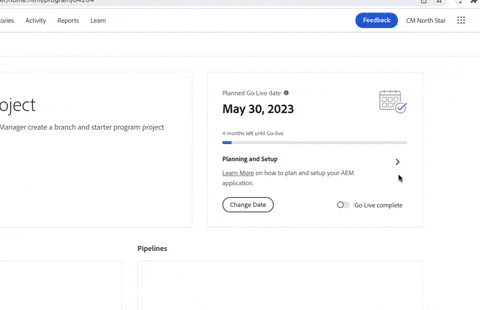

# Note sulla versione 2023.1.0 di Cloud Manager in Adobe Experience Manager as a Cloud Service {#release-notes}

In questa pagina sono documentate le note sulla versione per la versione 2023.1.0 di Cloud Manager in AEM as a Cloud Service.

>[!NOTE]
>
>Per le note sulla versione corrente di Adobe Experience Manager as a Cloud Service, consulta [questa pagina](/help/release-notes/release-notes-cloud/release-notes-current.md).

## Data di pubblicazione {#release-date}

La data di rilascio della versione 2023.1.0 di Cloud Manager in AEM as a Cloud Service è il 19 gennaio 2023. La prossima versione è prevista per il 16 febbraio 2023.

## Novità {#what-is-new}

* Sono stati apportati miglioramenti all’usabilità aggiornando gli stili del cursore che distinguono tra il punto in cui gli utenti possono intervenire e il puntatore predefinito.

* I report di test dell’interfaccia utente personalizzata vengono ora copiati nell’archivio di Cloud Manager e sono accessibili tramite la chiamata API di Cloud Manager.

* Gli utenti ora possono effettuare la transizione tra stati di widget go-live utilizzando le frecce sinistra-destra.

   

* Self-service [creazione di programmi abilitati per HIPAA](/help/implementing/cloud-manager/getting-access-to-aem-in-cloud/creating-production-programs.md) è ora possibile quando sono disponibili le autorizzazioni e le adesioni corrispondenti.

## Correzioni di bug {#bug-fixes}

* Cloud Manager impedirà l’avvio simultaneo di due esecuzioni della pipeline in (o quasi), evitando così gli errori della pipeline.
