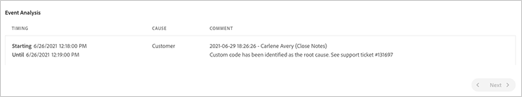

# Generazione rapporti SLA {#sla-reporting}

Scopri come visualizzare le prestazioni dell’ambiente di produzione AEM relative al contratto del livello di servizio (SLA) sottoscritto.

## Introduzione {#introduction}

I dati della generazione rapporti SLA sono disponibili per ogni programma di produzione tramite la scheda **Rapporti**. Per accedere, segui la procedura riportata di seguito.

1. Accedi a Cloud Manager all’indirizzo [my.cloudmanager.adobe.com](https://my.cloudmanager.adobe.com/) e seleziona l’organizzazione appropriata.

1. Nella console **[I miei programmi](/help/implementing/cloud-manager/navigation.md#my-programs)**, seleziona il programma.

1. Utilizzando il pannello di navigazione laterale, passa a **Rapporti** scheda da **Panoramica** pagina.

1. Fai clic sull’anno desiderato per visualizzare i dati SLA riportati nel grafico.

Sposta il cursore su un punto dati per visualizzarne i valori specifici.

## Metriche SLA {#sla-metrics}

Il grafico dell’anno selezionato include diversi set di dati.

* **Livello di pubblicazione da contratto**: si tratta dello SLA definito nel contratto con Adobe per il livello di pubblicazione.

* **Livello di pubblicazione effettivo**: si tratta del tempo di attività misurato relativo al livello di pubblicazione della produzione, che tiene conto dei problemi attribuibili a Adobe o ai relativi produttori.

* **Livello di creazione da contratto**: si tratta dello SLA definito nel contratto con Adobe per il livello di creazione.

* **Livello di creazione effettivo**: si tratta del tempo di attività misurato relativo al livello di creazione della produzione, che tiene conto dei problemi attribuibili a Adobe o ai relativi produttori.

## Analisi degli eventi {#event-analysis}

La sezione **Analisi degli eventi** sotto il grafico mostra i problemi relativi al programma che si sono verificati durante l’anno selezionato.

Ogni problema presenta un intervallo di tempo, una causa e una serie di commenti.

## Intervallo aggiornamento {#refresh}

Il reporting SLA fornisce informazioni approfondite sulle prestazioni dell’ambiente di produzione AEM ed è aggiornato, ma non istantaneo. La generazione di rapporti SLA avviene mensilmente e viene generata per i nuovi programmi contrassegnati come Produzione del mese precedente. Non è istantaneo. A causa di questo ritardo, tieni presente quanto segue durante la revisione del rapporto SLA:

* Lo SLA segnalato sarà quello esistente all&#39;inizio del mese, anche se lo SLA è stato modificato durante tale mese.
* Se all&#39;inizio del mese non esisteva alcun contratto di servizio perché il programma non esisteva, viene applicato lo SLA esistente alla data di creazione del programma.

## Anteprima ambienti {#preview}

L’ambiente di anteprima è uno strumento che consente agli autori dei contenuti di verificare l’esperienza finale del contenuto prima della pubblicazione. Per questo motivo, gli ambienti di anteprima non sono progettati con elevata disponibilità e non dispongono di un contratto di servizio associato.
