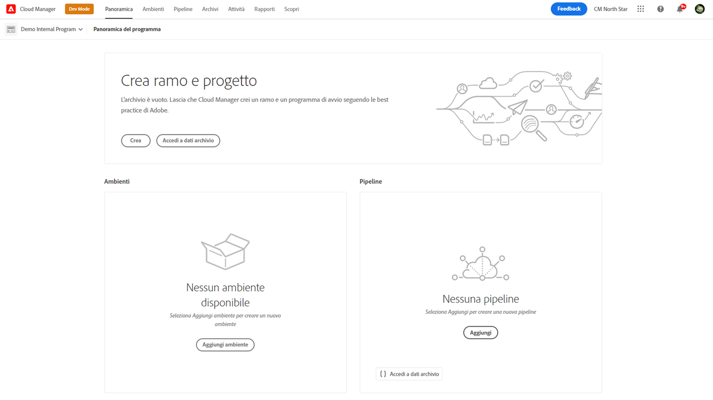
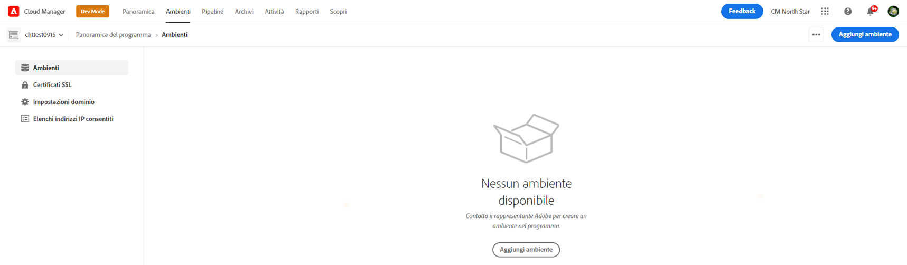

# Aggiungere un ambiente di test specializzato{#add-special-test-enviro}

<!-- badge: label="Private beta" type="Positive" url="/help/implementing/cloud-manager/release-notes/current.md#gitlab-bitbucket"
-->

>[!NOTE]
>
>Sono ora disponibili per l’acquisto ambienti di test specializzati. Contatta il tuo rappresentante Adobe per effettuare un ordine.

Specialized Testing Environment è un nuovo tipo di ambiente Cloud Manager che è possibile creare. È progettato per supportare casi d’uso avanzati, come test di accettazione utente (UAT) e convalida delle prestazioni. A differenza degli ambienti di sviluppo tradizionale, sviluppo rapido o staging, gli ambienti di test specializzati operano al di fuori della pipeline di implementazione della produzione. Offrono quindi maggiore flessibilità, pur mantenendo un rigoroso isolamento volto a evitare interferenze con i flussi di lavoro di produzione.

Un ambiente di test specializzato è progettato per riflettere le dimensioni, la scalabilità e le configurazioni di un ambiente di staging tipico. Questo approccio assicura che i test eseguiti nell’ambiente di test specializzato possano fornire informazioni realistiche sul funzionamento del codice e dei contenuti in condizioni simili a quelle della produzione. L’ambiente supporta anche la copia diretta dei contenuti dalla produzione o dallo stage. Mantiene inoltre la parità con gli ambienti di sviluppo in termini di flussi di lavoro di distribuzione, controlli di accesso e configurazioni di rete.

## Caratteristiche e configurazioni chiave di un ambiente di test specializzato {#key-features}

| Categoria | Comportamento |
| --- | --- |
| Scopo | UAT e test delle prestazioni. |
| Tipo di pipeline | Non nella pipeline di produzione. |
| Dimensione ambiente | Corrisponde all’ambiente di staging. |
| isolamento | Completamente isolato da altri ambienti. |
| Pipeline di codice | Come l’ambiente di sviluppo (convalida, compilazione, distribuzione). |
| Copia contenuto | Consentiti dalla produzione, dallo stage o da un ambiente di test specializzato. |
| Ripristino contenuto | Come l’ambiente di sviluppo. |
| Registri di accesso | Come l’ambiente di sviluppo. |
| Developer Console | Come l’ambiente di sviluppo. |
| `IP Allow List` | Come l’ambiente di sviluppo. |
| Rete | Come l’ambiente di sviluppo (servizi, nome di dominio, certificati SSL, rete avanzata). |

Vedi anche [Gestisci ambienti](/help/implementing/cloud-manager/manage-environments.md).

## Aggiungere un ambiente di test specializzato {#add-specialized-testing-environment}

Per aggiungere o modificare un ambiente, un utente deve essere membro del ruolo **Proprietario business**.

**Per aggiungere un ambiente di test specializzato:**

1. Accedi a Cloud Manager all’indirizzo [my.cloudmanager.adobe.com](https://my.cloudmanager.adobe.com/) e seleziona l’organizzazione appropriata.

1. Nella console **[Programmi](/help/implementing/cloud-manager/navigation.md#my-programs)** fare clic sul programma per il quale si desidera aggiungere un ambiente.

1. Effettua una delle seguenti operazioni:

   * Nella console **[Programmi](/help/implementing/cloud-manager/navigation.md#my-programs)**, nella scheda **Ambienti**, fare clic su **Aggiungi ambiente**.
Se l&#39;opzione **Aggiungi ambiente** è disattivata (disabilitata), è possibile che non disponga delle autorizzazioni necessarie o che dipenda dalle risorse con licenza.

     

   * Nel pannello a sinistra, fai clic sull&#39;icona  **Ambienti**, quindi nella pagina Ambienti, nell&#39;angolo superiore destro, fai clic su **Aggiungi ambiente**.

     

1. Nella finestra di dialogo **Aggiungi ambiente**, esegui le operazioni seguenti:

   * Fare clic su **Ambiente di testing specializzato**.
   * Fornisci un ambiente **Nome**. Una volta creato l’ambiente, non è possibile modificarne il nome.
   * (Facoltativo) Fornisci una **Descrizione** per l&#39;ambiente.
   * Selezionare una **area primaria** dall&#39;elenco a discesa. Una volta creata, l&#39;area principale dell&#39;ambiente di test specializzato (ad esempio, *Regno Unito (Sud)*) è bloccata e non può essere modificata.

     

1. Fai clic su **Salva**.

   Nella pagina **Panoramica** il nuovo ambiente viene ora visualizzato nella scheda **Ambienti**. Ora puoi configurare le pipeline per il nuovo ambiente.

## Risorse aggiuntive {#additional-resources}

* Video: [Informazioni sui tipi di ambiente in AEM Cloud Manager](https://experienceleague.adobe.com/en/perspectives/cloud-manager-environment-types)
* [Gestire gli ambienti](/help/implementing/cloud-manager/manage-environments.md)

