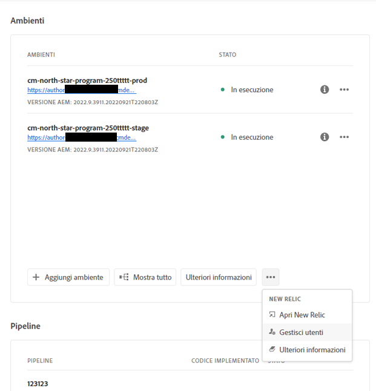
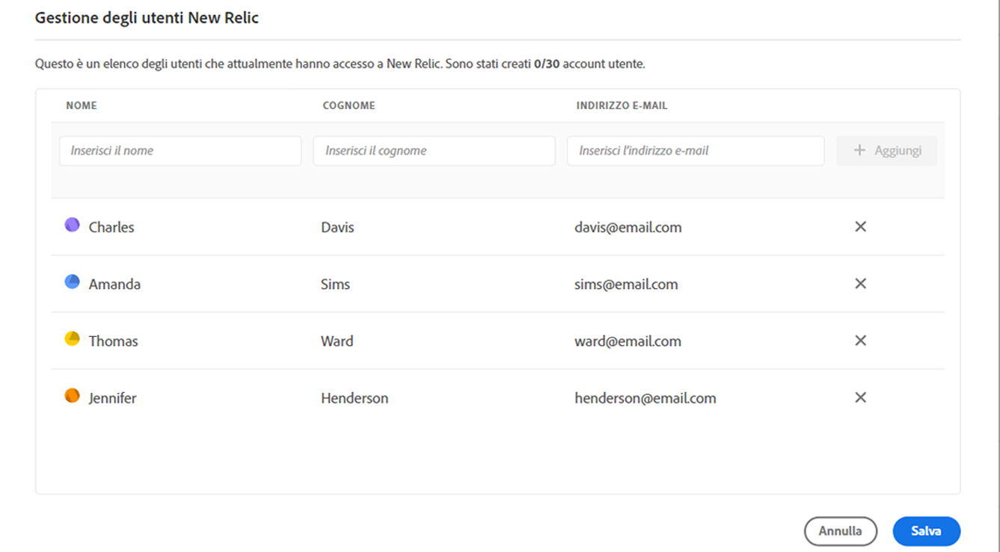
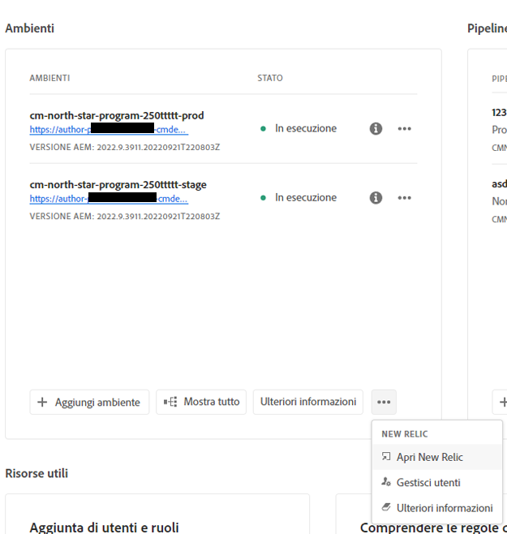

# New Relic One {#user-access}

Scopri il servizio New Relic One di monitoraggio delle prestazioni delle applicazioni (APM) per AEM as a Cloud Service e come accedervi.

## Informazioni su New Relic One {#introduction}

Per Adobe, monitoraggio, disponibilità e prestazioni delle applicazioni sono molto importanti. AEM as a Cloud Service include l’accesso al monitoraggio di New Relic One, fornendo ai team visibilità completa sulle metriche delle prestazioni di sistemi e ambienti come parte dell’offerta standard del prodotto.

Questo documento illustra come gestire l’accesso alle funzioni di monitoraggio delle prestazioni delle applicazioni (APM) di New Relic One negli ambienti AEM as a Cloud Service. La gestione efficace di queste funzioni supporta prestazioni ottimali e massimizza i vantaggi di AEM as a Cloud Service.

Quando si crea un nuovo programma di produzione, viene automaticamente creato l’account secondario New Relic One associato al programma AEM as a Cloud Service. [Questo account secondario deve essere attivato](#activate-sub-account) per iniziare l&#39;acquisizione dei dati.

## Funzioni {#transaction-monitoring}

New Relic One APM per AEM as a Cloud Service presenta numerose funzioni.

* Accesso diretto a un account New Relic One dedicato

* Agente New Relic One APM instrumentato che mostra le chiamate metodo esatte con i numeri delle righe, inclusi dipendenze e database esterni

* Ottimizzazione olistica delle prestazioni grazie alla combinazione di metriche chiave dal monitoraggio a livello di infrastruttura e dal monitoraggio delle applicazioni (Adobe Experience Manager)

* AEM as a Cloud Service espone gli MBean JMX (Java Management Extensions) e i controlli di integrità direttamente in New Relic Insights, consentendo un&#39;ispezione approfondita delle prestazioni dell&#39;applicazione e delle metriche di integrità.

## Attiva il tuo account secondario New Relic One {#activate-sub-account}

Per un programma appena creato, viene creato un account secondario di New Relic One. Tuttavia, per acquisire i dati è necessario attivarlo. Questa attivazione non è automatica. Per attivare l’account secondario, segui la procedura riportata di seguito.

>[!NOTE]
>
>Per gestire l&#39;account secondario New Relic One, l&#39;utente con il ruolo **Proprietario business** o **Responsabile dell&#39;implementazione** deve aver effettuato l&#39;accesso.

1. Accedi a Cloud Manager all’indirizzo [my.cloudmanager.adobe.com](https://my.cloudmanager.adobe.com/) e seleziona l’organizzazione appropriata.

1. Nella console **[Programmi](/help/implementing/cloud-manager/navigation.md#my-programs)** fare clic sul programma per il quale si desidera gestire gli utenti di New Relic One.

1. Nella parte inferiore della scheda **Ambienti** nella pagina di panoramica del programma, fai clic sull&#39;icona  e seleziona **Attiva New Relic**.

   

   * È inoltre possibile accedere all&#39;opzione **Gestisci utenti**. Nella parte superiore della schermata **Ambienti** del programma, fai clic sull&#39;icona .

1. [Esegui una pipeline](/help/implementing/cloud-manager/configuring-pipelines/managing-pipelines.md#running-pipelines) per lo stesso ambiente fino al completamento dell&#39;attivazione dell&#39;account secondario.

Quando l’account secondario è disattivato, non viene effettuata alcuna acquisizione di dati.

## Gestire gli utenti di New Relic One {#manage-users}

Per definire gli utenti dell’account secondario New Relic One associato al programma di AEM as a Cloud Service, segui la procedura riportata di seguito.

>[!NOTE]
>
>Per gestire gli utenti di New Relic One, l&#39;utente con il ruolo **Proprietario business** o **Responsabile dell&#39;implementazione** deve aver effettuato l&#39;accesso.

1. Accedi a Cloud Manager all’indirizzo [my.cloudmanager.adobe.com](https://my.cloudmanager.adobe.com/) e seleziona l’organizzazione appropriata.

1. Fai clic sul programma per il quale desideri gestire gli utenti di New Relic One.

1. Nella parte inferiore della scheda **Ambienti** nella pagina di panoramica del programma, fai clic sull&#39;icona  e seleziona **Gestisci utenti**.

   

   * È inoltre possibile accedere all&#39;opzione **Gestisci utenti**. Nella parte superiore della schermata **Ambienti** del programma, fai clic sull&#39;icona .

1. Nella finestra di dialogo **Gestisci utenti New Relic**, immetti il nome e il cognome dell&#39;utente che desideri aggiungere e fai clic sul pulsante **Aggiungi**. Ripeti questo passaggio per tutti gli utenti che desideri aggiungere.

   

1. Per rimuovere gli utenti di New Relic One, fai clic sul pulsante Elimina all’estrema destra della riga dell’utente.

1. Per creare gli utenti, fai clic su **Salva**.

Una volta definiti gli utenti, New Relic invia un’e-mail di conferma a tutti coloro a cui hai concesso l’accesso, in modo che possano completare il processo di configurazione e accedere.

>[!NOTE]
>
>Se gestisci gli utenti di New Relic One, devi anche aggiungere te stesso o te stessa come utente per poter accedere a te stesso. Avere il ruolo di **Proprietario business** o **Responsabile dell’implementazione** non è sufficiente per avere accesso a New Relic One. Devi creare te stesso o te stessa come utente.

## Attivare l’account utente di New Relic One {#activate-user-account}

Dopo aver creato un account utente di New Relic One come descritto nella sezione precedente, [Gestione degli utenti di New Relic One](#manage-users), New Relic invia a tali utenti un’e-mail di conferma all’indirizzo fornito. Per utilizzare gli account, gli utenti devono prima attivarli con New Relic reimpostando la password.

**Per attivare l&#39;account utente di New Relic One:**

1. Fai clic sul collegamento fornito nell’e-mail inviata da New Relic.

1. Nella pagina di accesso di New Relic, fai clic su **Password dimenticata?**

   

1. Inserisci l’indirizzo e-mail su cui hai ricevuto l’e-mail di conferma, quindi **conferma di voler ricevere il collegamento per reimpostare la password**.

   

1. New Relic ti invia un’e-mail contenente un collegamento per confermare l’account.

Se non ricevi un&#39;e-mail di conferma da New Relic, consulta la [sezione risoluzione dei problemi](#troubshooting).

## Accedere a New Relic One {#accessing-new-relic}

Dopo aver attivato [l&#39;account New Relic](#activate-account), puoi accedere a New Relic One tramite Cloud Manager o direttamente.

**Per accedere a New Relic One tramite Cloud Manager:**

1. Accedi a Cloud Manager all’indirizzo [my.cloudmanager.adobe.com](https://my.cloudmanager.adobe.com/) e seleziona l’organizzazione appropriata.

1. Fare clic sul programma per il quale si desidera accedere a New Relic One.

1. Nella parte inferiore della scheda **Ambienti** nella pagina di panoramica del programma, fai clic sull&#39;icona  e seleziona **Apri New Relic**.

   

   * Puoi anche accedere a New Relic. Nella parte superiore della schermata **Ambienti** del programma, fai clic sull&#39;icona .

1. Dalla nuova scheda del browser che viene visualizzata, accedi a New Relic One.

**Per accedere direttamente a New Relic One:**

1. Accedi alla pagina di accesso di New Relic all’indirizzo [`https://login.newrelic.com/login`](https://login.newrelic.com/login)

1. Accedi a New Relic One.

### Verifica l’e-mail {#verify-email}

Se ti viene richiesto di verificare l’e-mail durante l’accesso a New Relic One, significa che l’e-mail è associata a più account. Puoi scegliere a quale account accedere.

Se non verifichi il tuo indirizzo e-mail, New Relic tenta di accedere con il più recente record utente creato e associato al tuo indirizzo e-mail. Per evitare la verifica dell’e-mail durante ogni tentativo di accesso, fai clic sula casella di controllo **Ricordami** nella schermata di accesso.

Per ulteriore assistenza, apri un ticket di supporto tramite il [Portale di supporto AEM](https://helpx.adobe.com/it/enterprise/using/support-for-experience-cloud.html).

## Risoluzione dei problemi di accesso degli utenti di New Relic One {#troubleshooting}

Se sei stato aggiunto come utente New Relic One, come descritto in [Gestione utenti New Relic One](#manage-users), e non riesci a individuare l&#39;e-mail di conferma dell&#39;account originale, puoi effettuare le seguenti operazioni di risoluzione dei problemi.

**Per risolvere i problemi relativi all&#39;accesso utente di New Relic One:**

1. Accedi alla pagina di accesso di New Relic all’indirizzo [`login.newrelic.com/login`](https://login.newrelic.com/login).

1. Fai clic su **[!UICONTROL Password dimenticata?]**.

   

1. Inserisci l’indirizzo e-mail utilizzato per creare l’account, quindi seleziona il **collegamento per reimpostare la password**.

   

1. New Relic ti invia un’e-mail contenente un collegamento per confermare l’account.

Se dopo aver completato la procedura di registrazione non riesci ad accedere al tuo account a causa di messaggi di errore relativi all&#39;e-mail o alla password, invia un ticket di supporto tramite [Admin Console](https://adminconsole.adobe.com/).

Se non ricevi un’e-mail da New Relic, effettua le seguenti operazioni:

* Controlla i [filtri anti-spam](https://docs.newrelic.com/docs/accounts/accounts-billing/account-setup/create-your-new-relic-account/).
* Se applicabile, [aggiungi New Relic al tuo inserisco nell&#39;elenco Consentiti di e-mail](https://docs.newrelic.com/docs/accounts/accounts/account-maintenance/account-email-settings/#email-whitelist).
* Se nessuno dei due suggerimenti è utile, fornisci un feedback sul ticket di supporto.

## Note sull’utilizzo {#usage-notes}

* È possibile aggiungere fino a un massimo di 30 utenti. Se è stato raggiunto il numero massimo di utenti, rimuovine alcuni per poterne aggiungere di nuovi.
* Gli utenti aggiunti a New Relic sono di tipo **Basic**. Per informazioni dettagliate, consulta la [documentazione di New Relic](https://docs.newrelic.com/docs/accounts/accounts-billing/new-relic-one-user-management/user-type/).
* AEM as a Cloud Service offre unicamente la soluzione New Relic One APM e non fornisce supporto per avvisi, registrazione o integrazioni API.

>[!NOTE]
>
>Se nel tuo account secondario New Relic One non viene rilevata alcuna attività di accesso **utente** per 30 giorni o più, l&#39;agente APM viene interrotto. I dati non vengono inviati da AEM Cloud Service a New Relic. *I dati non vengono inviati finché il tuo account secondario non viene riattivato.*
>
>Segui gli stessi passaggi descritti nella sezione [Attiva l&#39;account secondario New Relic One](#activate-sub-account) di questo documento per riattivare l&#39;account secondario New Relic One.

Per ulteriore assistenza o informazioni sulle offerte New Relic One per il programma AEM as a Cloud Service, apri un ticket di supporto tramite il [portale di supporto AEM](https://helpx.adobe.com/it/enterprise/using/support-for-experience-cloud.html).

## Domande frequenti {#faqs}

+++**Che cosa monitora Adobe con New Relic One?**

Adobe monitora i servizi Author, Publish e Anteprima di AEM as a Cloud Service (quando disponibili) tramite il plug-in Java di New Relic One. Adobe supporta la telemetria e il monitoraggio personalizzati di New Relic One APM in ambienti AEM as a Cloud Service di produzione e non di produzione.

Il tuo account New Relic One è collegato a un account principale gestito da Adobe e dispone di più applicazioni per la generazione di rapporti; tre per ogni ambiente AEM as a Cloud Service.

* Un’applicazione per il servizio Author per ogni ambiente
* Un&#39;applicazione per il servizio `Publish` per ogni ambiente (inclusa la pubblicazione Golden)
* Un’applicazione per il servizio Anteprima per ogni ambiente

Nota:

* ogni applicazione utilizza una sola chiave di licenza.
* Gli ambienti di AEM as a Cloud Service fanno riferimento solamente a un account di New Relic One.
* Le metriche e gli eventi di monitoraggio completi per New Relic One vengono conservati per tre mesi.

+++

+++**Adobe invia notifiche di avviso da New Relic One?**

Adobe fornisce l’accesso a New Relic One solo a scopo di osservabilità e non lo utilizza per gli avvisi dei clienti o per gli avvisi operativi interni. Le notifiche per eventuali incidenti vengono inviate utilizzando [profili di notifica utente](/help/journey-onboarding/notification-profiles.md).
+++

+++**Chi può accedere ai dati del servizio cloud New Relic One?**

L’accesso in lettura completo è concesso a un massimo di 30 membri del team. L’accesso in lettura include tutte le metriche APM raccolte dall’agente New Relic One.
+++

+++**La configurazione SSO personalizzata è supportata?**

La configurazione SSO personalizzata non è supportata per l’account New Relic One fornito da Adobe.
+++

+++**Cosa succede se dispongo già di un abbonamento New Relic locale?**

New Relic One è la nuova piattaforma di osservabilità di New Relic abilitata al supporto Adobe, che consente ai team di osservare, monitorare e visualizzare metriche ed eventi da un’unica posizione.

New Relic One mette a disposizione degli utenti la possibilità di effettuare ricerche in tutti gli account a cui hanno accesso e di visualizzare i dati di tutti i servizi e gli host in un’unica vista.

Il supporto Adobe monitora AEM as a Cloud Service con New Relic One e altri strumenti, mentre i team possono ancora utilizzare New Relic per servizi e infrastrutture on-premise. Possono visualizzare sia i dati dell’account New Relic One di Adobe sia quelli degli account New Relic gestiti dal cliente.

>[!NOTE]
>
>Per visualizzare entrambi i set di dati in New Relic One, l’utente deve disporre delle autorizzazioni appropriate e utilizzare la stessa metodologia di accesso per entrambi gli account (l’account New Relic One di Adobe e l’account New Relic gestito dal cliente).

+++

+++**L&#39;agente APM per il mio account New Relic One è stato arrestato. Cos&#39;è successo?**

[Gli agenti APM vengono interrotti](#limitations) se non viene rilevata alcuna attività per 30 giorni o più. Segui gli stessi passaggi descritti nella sezione [Attiva l&#39;account secondario New Relic One](#activate-sub-account) di questo documento per riattivare l&#39;account secondario New Relic One.
+++
