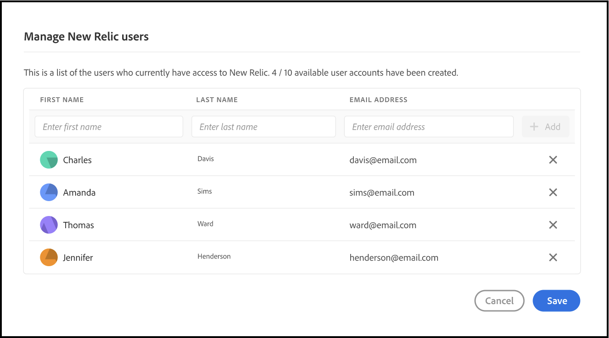

# New Relic One {#user-access}

Scopri il servizio New Relic One di monitoraggio delle prestazioni delle applicazioni (APM) per AEM as a Cloud Service e come accedervi.

## Informazioni su New Relic One {#introduction}

Per Adobe, monitoraggio, disponibilità e prestazioni delle applicazioni sono molto importanti. AEM as a Cloud Service include l’accesso al monitoraggio di New Relic One, fornendo ai team visibilità completa sulle metriche delle prestazioni di sistemi e ambienti come parte dell’offerta standard del prodotto.

Questo articolo illustra come gestire l’accesso alle funzioni di monitoraggio delle prestazioni delle applicazioni (APM) di New Relic One negli ambienti AEM as a Cloud Service. La gestione efficace di queste funzioni supporta prestazioni ottimali e massimizza i vantaggi di AEM as a Cloud Service.

Quando si crea un nuovo programma di produzione, viene automaticamente creato l’account secondario New Relic One associato al programma AEM as a Cloud Service. [Questo account secondario deve essere attivato](#activate-sub-account) per iniziare l&#39;acquisizione dei dati.

## Funzioni {#transaction-monitoring}

New Relic One APM per AEM as a Cloud Service presenta numerose funzioni.

* Accesso diretto a un account New Relic One dedicato.

* Agente New Relic One APM instrumentato che mostra le chiamate al metodo esatto con i numeri di riga, incluse le dipendenze e i database esterni.

* Ottimizzazione olistica delle prestazioni attraverso la combinazione di metriche chiave provenienti dal monitoraggio a livello di infrastruttura e dal monitoraggio delle applicazioni (Adobe Experience Manager).

* Tracciamenti automatici delle modifiche per le esecuzioni della pipeline Cloud Manager, gli aggiornamenti AEM e le operazioni di ripristino del codice. Questi tracker consentono ai team di correlare le implementazioni con le modifiche delle prestazioni dell’applicazione direttamente in New Relic One.

## Attiva il tuo account secondario New Relic One {#activate-sub-account}

Per un programma appena creato, viene creato un account secondario di New Relic One. Tuttavia, per acquisire i dati è necessario attivarlo. Questa attivazione non è automatica. Per attivare l’account secondario, segui la procedura riportata di seguito.

>[!NOTE]
>
>Per gestire l&#39;account secondario New Relic One, l&#39;utente con il ruolo **Proprietario business** deve aver effettuato l&#39;accesso.

**Per attivare l&#39;account secondario New Relic One:**

1. Accedi a Cloud Manager all&#39;indirizzo [experience.adobe.com](https://experience.adobe.com).
   1. Nella sezione **Accesso rapido**, fai clic su **Experience Manager**.
   1. Nel pannello laterale a sinistra, fai clic su **Cloud Manager**.
1. Selezionare un&#39;organizzazione desiderata.
1. Nella console **Programmi** fare clic su un programma per il quale si desidera gestire gli utenti di New Relic One.
1. Dal menu a sinistra, in **Servizi**, fai clic sull&#39;icona  **Ambienti**.
1. Nella pagina Ambienti, nell&#39;angolo superiore destro, fai clic sull&#39;icona , quindi su **Attiva New Relic**.

   

1. [Esegui una pipeline](/help/implementing/cloud-manager/configuring-pipelines/managing-pipelines.md#running-pipelines) per lo stesso ambiente fino al completamento corretto per completare l&#39;attivazione dell&#39;account secondario.

Quando l’account secondario è disattivato, non viene effettuata alcuna acquisizione di dati.

## Gestire gli utenti di New Relic One {#manage-users}

Puoi definire gli utenti del tuo account secondario New Relic One associato al programma AEM as a Cloud Service.

>[!NOTE]
>
>Per gestire gli utenti di New Relic One, l&#39;utente con il ruolo **Proprietario business** o **Responsabile dell&#39;implementazione** deve aver effettuato l&#39;accesso.

**Per gestire gli utenti di New Relic One:**

1. Accedi a Cloud Manager all&#39;indirizzo [experience.adobe.com](https://experience.adobe.com).
   1. Nella sezione **Accesso rapido**, fai clic su **Experience Manager**.
   1. Nel pannello laterale a sinistra, fai clic su **Cloud Manager**.
1. Selezionare un&#39;organizzazione desiderata.
1. Nella console **Programmi** fare clic su un programma per il quale si desidera gestire gli utenti di New Relic One.
1. Dal menu a sinistra, in **Servizi**, fai clic sull&#39;icona  **Ambienti**.
1. Nella pagina Ambienti, nell&#39;angolo superiore destro, fai clic sull&#39;icona , quindi su **Gestisci utenti**.

   

1. Nella finestra di dialogo **Gestisci utenti New Relic** eseguire le operazioni seguenti:

   * Immettere il nome e il cognome dell&#39;utente da aggiungere
   * Immetti l&#39;indirizzo e-mail associato
   * Fai clic sull&#39;icona  **Aggiungi**. Ripeti questo passaggio per ogni utente che desideri aggiungere.
   * Fai clic sull&#39;icona  per rimuovere un utente.

   

1. Fai clic su **Salva**.

Una volta definiti gli utenti, New Relic invia un’e-mail di conferma a ciascuno di essi. Da lì, può completare il processo di attivazione e accedere.

>[!NOTE]
>
>Se gestisci gli utenti di New Relic One, devi aggiungere anche te stesso o te stessa come utente. Il fatto di essere **Proprietario business** o **Responsabile dell&#39;implementazione** non è sufficiente per avere accesso a New Relic One.

## Attivare l’account utente di New Relic One {#activate-user-account}

Dopo aver creato un account utente di New Relic One, come descritto in [Gestione utenti di New Relic One](#manage-users), New Relic invia a tali utenti un&#39;e-mail di conferma all&#39;indirizzo fornito. Per utilizzare gli account, gli utenti devono prima attivarli con New Relic reimpostando la password.

**Per attivare l&#39;account utente di New Relic One:**

1. Fai clic sul collegamento fornito nell’e-mail inviata da New Relic.

1. Nella pagina di accesso di New Relic, fai clic su **Password dimenticata?**

   

1. Inserisci l’indirizzo e-mail su cui hai ricevuto l’e-mail di conferma, quindi **conferma di voler ricevere il collegamento per reimpostare la password**.

   

1. New Relic ti invia un’e-mail contenente un collegamento per confermare l’account.

Se non ricevi un&#39;e-mail di conferma da New Relic, consulta la [sezione risoluzione dei problemi](#troubshooting).

## Apri New Relic One {#accessing-new-relic}

Dopo aver attivato [l&#39;account New Relic](#activate-account), puoi aprire New Relic One tramite Cloud Manager o direttamente.

**Per aprire New Relic One tramite Cloud Manager:**

1. Accedi a Cloud Manager all&#39;indirizzo [experience.adobe.com](https://experience.adobe.com).
   1. Nella sezione **Accesso rapido**, fai clic su **Experience Manager**.
   1. Nel pannello laterale a sinistra, fai clic su **Cloud Manager**.
1. Selezionare un&#39;organizzazione desiderata.
1. Nella console **Programmi** fare clic su un programma per il quale si desidera aprire New Relic One.
1. Dal menu a sinistra, in **Servizi**, fai clic sull&#39;icona  **Ambienti**.
1. Nella pagina Ambienti, nell&#39;angolo superiore destro, fai clic sull&#39;icona , quindi su **Apri New Relic**.

   

1. Dalla nuova scheda del browser che viene visualizzata, accedi a New Relic One.

**Per aprire direttamente New Relic One:**

1. Vai alla [pagina di accesso di New Relic](https://login.newrelic.com/login).

1. Accedi a New Relic One.

### Verifica l’e-mail {#verify-email}

Se ti viene richiesto di verificare l’e-mail durante l’accesso a New Relic One, significa che l’e-mail è associata a più account. Puoi scegliere a quale account accedere.

Se non verifichi il tuo indirizzo e-mail, New Relic tenta di accedere con il più recente record utente creato e associato al tuo indirizzo e-mail. Per evitare la verifica dell’e-mail durante ogni tentativo di accesso, fai clic sula casella di controllo **Ricordami** nella schermata di accesso.

Per ulteriore assistenza, apri un ticket di supporto tramite il [Portale di supporto AEM](https://helpx.adobe.com/it/enterprise/using/support-for-experience-cloud.html).

## Utilizzare il rilevamento delle modifiche {#change-tracker}

Cloud Manager invia automaticamente i tracker delle modifiche a New Relic One ogni volta che vengono completate le esecuzioni della pipeline, gli aggiornamenti di AEM e il ripristino del codice supportati. Questi tracker vengono visualizzati come eventi di modifica nella visualizzazione **Tracciamento delle modifiche** di New Relic, consentendo al team di correlare le distribuzioni con variazioni nelle prestazioni dell&#39;applicazione, nelle percentuali di errore e nella velocità effettiva.

<!-- See also [Introduction to change tracking](https://docs.newrelic.com/docs/change-tracking/overview/) and [Record and view deployments](https://docs.newrelic.com/docs/apm/apm-ui-pages/events/record-deployments/). -->

### Pipeline e flussi di lavoro supportati {#supported-pipelines}

Le seguenti pipeline di Cloud Manager e gli ultimi due tipi di flusso di lavoro generano i tracciatori delle modifiche in New Relic One:

| Tipo di pipeline/flusso di lavoro | Descrizione |
|---|---|
| **Full stack (distribuzione CI_CD)** | Esecuzioni di pipeline full stack. La traccia include il nome della pipeline e l’ID di esecuzione. |
| **Configurazione livello Web** | Esecuzioni della pipeline di configurazione a livello web. La traccia include il nome della pipeline e l’ID di esecuzione. |
| **Front-end** | Esecuzioni della pipeline front-end. La traccia include il nome della pipeline e l’ID di esecuzione. |
| **Configurazione** | Esecuzioni della pipeline di configurazione. La traccia include il nome della pipeline e l’ID di esecuzione. |
| **Aggiornamento AEM** | Aggiornamenti della versione di AEM. Ad esempio, dalla versione {} alla versione {}. I tracciatori vengono creati al completamento dell’evento di modifica dell’ambiente. |
| **Ripristina codice** | Il codice ripristina le operazioni da un repository e un ramo specifici. |

>[!NOTE]
>
>I tracciamenti delle modifiche sono attualmente supportati solo per gli ambienti Skyline. Le pipeline che non rientrano nell’ambito di applicazione, come le pipeline di espansione e le pipeline dei service pack, non generano tracciatori.

### Visualizzare i tracciamenti delle modifiche in New Relic One {#view-change-trackers}

Al termine dell’esecuzione di una pipeline supportata, puoi visualizzare il tracker delle modifiche corrispondente in New Relic One.

**Per visualizzare i rilevatori delle modifiche in New Relic One:**

1. [Accedi a New Relic One](#accessing-new-relic) tramite Cloud Manager o direttamente.
1. Passa a **APM &amp; Services** e seleziona l&#39;applicazione per l&#39;ambiente pertinente.
1. Nella pagina di riepilogo dell&#39;applicazione cercare gli indicatori di rilevamento delle modifiche nel grafico. Passa il puntatore del mouse su un tracciatore per visualizzare i dettagli della distribuzione.

   

1. Fare clic su un evento di modifica nel grafico per aprire una visualizzazione dettagliata.

    <i>Visualizzazione dettagliata di un evento di modifica.</i>

   Il pannello **Dettagli modifica** a destra mostra, tra l&#39;altro, l&#39;entità, la marca temporale, l&#39;epoca, la categoria, l&#39;ID distribuzione e il tipo di API.

   Per ogni rilevamento modifiche inviato da Cloud Manager a New Relic One, il pannello **Attributi di distribuzione** in basso a destra mostra i seguenti attributi:

   | Attributo | Descrizione |
   |---|---|
   | **versione** | Una stringa di descrizione che include il nome della pipeline e l’ID di esecuzione. |
   | **changelog** | Riservato per uso futuro. |
   | **commit** | Riservato per uso futuro. |
   | **collegamento profondo** | Fai clic sull’URL per collegarti nuovamente alla pagina di esecuzione della pipeline in Cloud Manager. |

1. Per visualizzare un elenco completo dei rilevatori delle modifiche, nella barra laterale a sinistra, in **Eventi**, fare clic su **Rilevamento modifiche**.

   La tabella **Eventi di modifica** mostra ogni distribuzione con la relativa marca temporale e descrizione della versione.

   

>[!TIP]
>
>Utilizza i rilevatori di modifiche insieme agli indicatori di prestazioni di New Relic One, ad esempio **Tempo di risposta** e **Throughput**. Questi indicatori consentono di identificare se una particolare distribuzione ha introdotto regressioni o miglioramenti delle prestazioni. Puoi confrontare le metriche precedenti e successive a una distribuzione direttamente nella pagina dei dettagli dell’evento di modifica.

## Risoluzione dei problemi di accesso degli utenti di New Relic One {#troubleshooting}

Se sei stato aggiunto come utente New Relic One, come descritto in [Gestione utenti New Relic One](#manage-users), e non riesci a individuare l&#39;e-mail di conferma dell&#39;account originale, puoi effettuare le seguenti operazioni di risoluzione dei problemi.

**Per risolvere i problemi relativi all&#39;accesso utente di New Relic One:**

1. Accedi alla pagina di accesso di New Relic all’indirizzo [`login.newrelic.com/login`](https://login.newrelic.com/login).

1. Fai clic su **[!UICONTROL Password dimenticata?]**.

   

1. Inserisci l’indirizzo e-mail utilizzato per creare l’account, quindi seleziona il **collegamento per reimpostare la password**.

   

1. New Relic ti invia un’e-mail contenente un collegamento per confermare l’account.

Se dopo aver completato la procedura di registrazione non riesci ad accedere al tuo account a causa di messaggi di errore relativi all&#39;e-mail o alla password, invia un ticket di supporto tramite [Admin Console](https://adminconsole.adobe.com/).

Se non ricevi un’e-mail da New Relic, effettua le seguenti operazioni:

* Controlla i [filtri anti-spam](https://docs.newrelic.com/docs/accounts/accounts-billing/account-setup/create-your-new-relic-account/).
* Se applicabile, [aggiungi New Relic al tuo inserisco nell&#39;elenco Consentiti di e-mail](https://docs.newrelic.com/docs/accounts/accounts/account-maintenance/account-email-settings/#email-whitelist).
* Se nessuno dei due suggerimenti è utile, fornisci un feedback sul ticket di supporto.

## Note sull’utilizzo {#usage-notes}

* È possibile aggiungere fino a un massimo di 30 utenti. Se è stato raggiunto il numero massimo di utenti, rimuovine alcuni per poterne aggiungere di nuovi.
* Gli utenti aggiunti a New Relic sono di tipo **Basic**. Per informazioni dettagliate, consulta la [documentazione di New Relic](https://docs.newrelic.com/docs/accounts/accounts-billing/new-relic-one-user-management/user-type/).
* AEM as a Cloud Service offre unicamente la soluzione New Relic One APM e non fornisce supporto per avvisi, registrazione o integrazioni API.

>[!NOTE]
>
>Se nel tuo account secondario New Relic One non viene rilevata alcuna attività di accesso **utente** per 30 giorni o più, l&#39;agente APM viene interrotto. I dati non vengono inviati da AEM Cloud Service a New Relic. *I dati non vengono inviati finché il tuo account secondario non viene riattivato.*
>
>Segui gli stessi passaggi descritti nella sezione [Attiva l&#39;account secondario New Relic One](#activate-sub-account) di questo documento per riattivare l&#39;account secondario New Relic One.

Per ulteriore assistenza o informazioni sulle offerte New Relic One per il programma AEM as a Cloud Service, apri un ticket di supporto tramite il [portale di supporto AEM](https://helpx.adobe.com/it/enterprise/using/support-for-experience-cloud.html).

## Domande frequenti {#faqs}

+++**Che cosa monitora Adobe con New Relic One?**

Adobe monitora i servizi Author, Publish e Anteprima di AEM as a Cloud Service (quando disponibili) tramite il plug-in Java di New Relic One. Adobe supporta la telemetria e il monitoraggio personalizzati di New Relic One APM in ambienti AEM as a Cloud Service di produzione e non di produzione.

Il tuo account New Relic One è collegato a un account principale gestito da Adobe e dispone di più applicazioni per la generazione di rapporti; tre per ogni ambiente AEM as a Cloud Service.

* Un’applicazione per il servizio Author per ogni ambiente
* Un&#39;applicazione per il servizio `Publish` per ogni ambiente (inclusa la pubblicazione Golden)
* Un’applicazione per il servizio Anteprima per ogni ambiente

Nota:

* ogni applicazione utilizza una sola chiave di licenza.
* Gli ambienti di AEM as a Cloud Service fanno riferimento solamente a un account di New Relic One.
* Le metriche e gli eventi di monitoraggio completi per New Relic One vengono conservati per tre mesi.

+++

+++**Adobe invia notifiche di avviso da New Relic One?**

Adobe fornisce l’accesso a New Relic One solo a scopo di osservabilità e non lo utilizza per gli avvisi dei clienti o per gli avvisi operativi interni. Le notifiche per eventuali incidenti vengono inviate utilizzando [profili di notifica utente](/help/journey-onboarding/notification-profiles.md).
+++

+++**Chi può accedere ai dati del servizio cloud New Relic One?**

L’accesso in lettura completo è concesso a un massimo di 30 membri del team. L’accesso in lettura include tutte le metriche APM raccolte dall’agente New Relic One.
+++

+++**La configurazione SSO personalizzata è supportata?**

La configurazione SSO personalizzata non è supportata per l’account New Relic One fornito da Adobe.
+++

+++**Cosa succede se dispongo già di un abbonamento New Relic locale?**

New Relic One è la nuova piattaforma di osservabilità di New Relic abilitata al supporto Adobe, che consente ai team di osservare, monitorare e visualizzare metriche ed eventi da un’unica posizione.

New Relic One mette a disposizione degli utenti la possibilità di effettuare ricerche in tutti gli account a cui hanno accesso e di visualizzare i dati di tutti i servizi e gli host in un’unica vista.

Il supporto Adobe monitora AEM as a Cloud Service con New Relic One e altri strumenti, mentre i team possono ancora utilizzare New Relic per servizi e infrastrutture on-premise. Possono visualizzare sia i dati dell’account New Relic One di Adobe sia quelli degli account New Relic gestiti dal cliente.

>[!NOTE]
>
>Per visualizzare entrambi i set di dati in New Relic One, l’utente deve disporre delle autorizzazioni appropriate e utilizzare la stessa metodologia di accesso per entrambi gli account (l’account New Relic One di Adobe e l’account New Relic gestito dal cliente).

+++

+++**L&#39;agente APM per il mio account New Relic One è stato arrestato. Cos&#39;è successo?**

[Gli agenti APM vengono interrotti](#limitations) se non viene rilevata alcuna attività per 30 giorni o più. Segui gli stessi passaggi descritti nella sezione [Attiva l&#39;account secondario New Relic One](#activate-sub-account) di questo documento per riattivare l&#39;account secondario New Relic One.
+++
