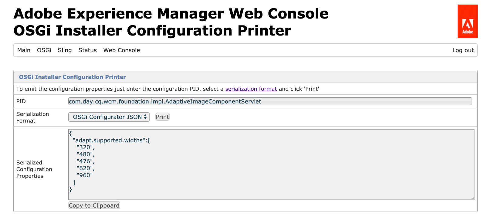

# Configurazione di OSGi per AEM as a Cloud Service {#configuring-osgi-for-aem-as-a-cloud-service}

[](https://www.osgi.org/) OSGiè un elemento fondamentale nello stack tecnologico di Adobe Experience Manager (AEM). Viene utilizzato per controllare i bundle compositi di AEM e le sue configurazioni.

OSGi fornisce le primitive standardizzate che consentono di costruire applicazioni da componenti piccoli, riutilizzabili e collaborativi. Questi componenti possono essere composti in un’applicazione e distribuiti. Questo consente una facile gestione dei bundle OSGi in quanto possono essere arrestati, installati, avviati individualmente. Le interdipendenze vengono gestite automaticamente. Ogni componente OSGi è contenuto in uno dei vari bundle. Per ulteriori informazioni, consulta la [specifica OSGi](https://www.osgi.org/Specifications/HomePage).

Puoi gestire le impostazioni di configurazione per i componenti OSGi tramite file di configurazione che fanno parte di un progetto di codice AEM.

## File di configurazione OSGi {#osgi-configuration-files}

Le modifiche alla configurazione sono definite nei pacchetti di codice del progetto AEM (`ui.apps`) come file di configurazione (`.cfg.json`) in cartelle di configurazione specifiche della modalità di esecuzione:

`/apps/example/config.<runmode>`

Il formato dei file di configurazione OSGi è basato su JSON utilizzando il formato `.cfg.json` definito dal progetto Apache Sling.

Le configurazioni OSGi sono destinate ai componenti OSGi tramite la loro persistenza (PID), che per impostazione predefinita corrisponde al nome della classe Java del componente OSGi. Ad esempio, per fornire la configurazione OSGi per un servizio OSGi implementato da:

`com.example.workflow.impl.ApprovalWorkflow.java`

un file di configurazione OSGi è definito in:

`/apps/example/config/com.example.workflow.impl.ApprovalWorkflow.cfg.json`

seguendo il formato di configurazione cfg.json OSGi .

>[!NOTE]
>
>Versioni precedenti di file di configurazione OSGi supportati utilizzando formati di file diversi come .cfg., .config e come definizioni di risorse XML sling:OsgiConfig. Questi formati vengono sostituiti dal formato di configurazione cfg.json OSGi.

## Risoluzione in modalità di esecuzione {#runmode-resolution}

Configurazioni OSGi specifiche possono essere indirizzate a istanze AEM specifiche utilizzando le modalità di esecuzione. Per utilizzare la modalità runmode, crea le cartelle di configurazione in `/apps/example` (dove esempio è il nome del progetto), nel formato:

`/apps/example/config.<author|publish>.<dev|stage|prod>/`

Eventuali configurazioni OSGi in tali cartelle saranno utilizzate se le modalità di esecuzione definite nel nome della cartella di configurazione corrispondono alle modalità di esecuzione utilizzate da AEM.

Ad esempio, se AEM utilizza le modalità di esecuzione author e dev, verranno applicati i nodi di configurazione in `/apps/example/config.author/` e `/apps/example/config.author.dev/`, mentre i nodi di configurazione in `/apps/example/config.publish/` e `/apps/example/config.author.stage/` non verranno applicati.

Se sono applicabili più configurazioni per lo stesso PID, viene applicata la configurazione con il numero più alto di modalità di esecuzione corrispondenti.

La granularità di questa regola è a livello di PID. Ciò significa che non è possibile definire alcune proprietà per lo stesso PID in `/apps/example/config.author/` e altre specifiche in `/apps/example/config.author.dev/` per lo stesso PID.  La configurazione con il maggior numero di modalità di esecuzione corrispondenti sarà efficace per l&#39;intero PID.

Quando si sviluppa localmente, è possibile trasmettere un parametro di avvio in modalità runmode per determinare quale configurazione OSGI in modalità runmode verrà utilizzata.

## Tipi di valori di configurazione OSGi {#types-of-osgi-configuration-values}

Ci sono tre varietà di valori di configurazione OSGi che possono essere utilizzati con AEM come Cloud Service.

1. **Valori** in linea, che sono valori hardcoded nella configurazione OSGi e memorizzati in Git. Esempio:

   ```json
   {
      "connection.timeout": 1000
   }
   ```

1. **Valori** segreti, ovvero valori che non devono essere memorizzati in Git per motivi di sicurezza. Esempio:

   ```json
   {
   "api-key": "$[secret:server-api-key]"
   } 
   ```

1. **Valori** specifici per l’ambiente, ovvero valori che variano da un ambiente di sviluppo all’altro e che non possono quindi essere oggetto di targeting accurato in modalità di esecuzione (poiché esiste una singola modalità  `dev` runmode in AEM come Cloud Service). Esempio:

   ```json
   {
    "url": "$[env:server-url]"
   }
   ```

   Tieni presente che un singolo file di configurazione OSGi può utilizzare qualsiasi combinazione di questi tipi di valori di configurazione in combinazione. Esempio:

   ```json
   {
   "connection.timeout": 1000,
   "api-key": "$[secret:server-api-key]",
   "url": "$[env:server-url]"
   }
   ```

## Come scegliere il tipo di valore di configurazione OSGi appropriato {#how-to-choose-the-appropriate-osgi-configuration-value-type}

Il caso comune per OSGi utilizza valori di configurazione OSGi in linea. Le configurazioni specifiche per l’ambiente vengono utilizzate solo per casi d’uso specifici in cui un valore differisce tra gli ambienti di sviluppo.


Le configurazioni specifiche per l’ambiente estendono le configurazioni OSGi tradizionali e definite statisticamente che contengono valori in linea, consentendo di gestire i valori di configurazione OSGi esternamente tramite l’API di Cloud Manager. È importante capire quando utilizzare l’approccio comune e tradizionale di definire i valori in linea e memorizzarli in Git, anziché astrarre i valori in configurazioni specifiche per l’ambiente.

Le seguenti linee guida riguardano quando utilizzare configurazioni non segrete e specifiche per l’ambiente:

### Quando utilizzare i valori di configurazione in linea {#when-to-use-inline-configuration-values}

I valori delle configurazioni in linea sono considerati l’approccio standard e devono essere utilizzati quando possibile. Le configurazioni in linea forniscono i vantaggi di:

* Vengono mantenuti, con governance e cronologia delle versioni in Git
* I valori sono implicitamente associati alle distribuzioni del codice
* Non richiedono ulteriori considerazioni sulla distribuzione o sul coordinamento

Ogni volta che definisci un valore di configurazione OSGi, inizia con i valori in linea, tutte le configurazioni selezionate segrete o specifiche per l’ambiente solo se richieste per il caso d’uso.

### Quando utilizzare valori di configurazione specifici dell&#39;ambiente non segreti {#when-to-use-non-secret-environment-specific-configuration-values}

Utilizza solo configurazioni specifiche per l’ambiente (`$[env:ENV_VAR_NAME]`) per valori di configurazione non segreti quando i valori variano in ambienti di sviluppo. Ciò include le istanze di sviluppo locali e qualsiasi AEM come ambiente di sviluppo di Cloud Service. Evita di utilizzare configurazioni non segrete specifiche per l’ambiente per AEM come ambienti di stage o produzione di Cloud Service.

* Utilizza solo configurazioni non segrete specifiche per l’ambiente per i valori di configurazione che differiscono tra gli ambienti di sviluppo, incluse le istanze di sviluppo locali.
* Utilizza invece i valori inline standard nelle configurazioni OSGi per i valori non segreti di Stage e Produzione.  A questo proposito, si sconsiglia di utilizzare configurazioni specifiche per l&#39;ambiente per facilitare l&#39;esecuzione di modifiche di configurazione in fase di runtime agli ambienti di stage e produzione; queste modifiche devono essere introdotte tramite la gestione del codice sorgente.

### Quando utilizzare i valori di configurazione specifici dell&#39;ambiente segreto {#when-to-use-secret-environment-specific-configuration-values}

AEM come Cloud Service richiede l&#39;uso di configurazioni specifiche per l&#39;ambiente (`$[secret:SECRET_VAR_NAME]`) per qualsiasi valore di configurazione OSGi segreto, come password, chiavi API private o qualsiasi altro valore che non può essere memorizzato in Git per motivi di sicurezza.

Utilizza configurazioni specifiche per l’ambiente segreto per memorizzare il valore per i segreti su tutti gli ambienti AEM come ambienti di Cloud Service, inclusi Stage e Produzione.

<!-- ### Adding a New Configuration to the Repository {#adding-a-new-configuration-to-the-repository}

#### What You Need to Know {#what-you-need-to-know}

To add a new configuration to the repository you need to know the following:

1. The **Persistent Identity** (PID) of the service.

   Reference the **Configurations** field in the Web console. The name is shown in brackets after the bundle name (or in the **Configuration Information** towards the bottom of the page).

   For example, create a node `com.day.cq.wcm.core.impl.VersionManagerImpl.` to configure **AEM WCM Version Manager**.

   

1. Whether a specific runmode is required. Create the folder:

    * `config` - for all run modes
    * `config.author` - for the author environment
    * `config.publish` - for the publish environment
    * `config.<run-mode>` - as appropriate

1. Whether a **Configuration** or **Factory Configuration** is necessary.
1. The individual parameters to be configured; including any existing parameter definitions that will need to be recreated.

   Reference the individual parameter field in the Web console. The name is shown in brackets for each parameter.

   For example, create a property
   `versionmanager.createVersionOnActivation` to configure **Create Version on Activation**.

   

1. Does a configuration already exist in `/libs`? To list all configurations in your instance, use the **Query** tool in CRXDE Lite to submit the following SQL query:

   `select * from sling:OsgiConfig`

   If so, this configuration can be copied to ` /apps/<yourProject>/`, then customized in the new location. -->

## Creazione di configurazioni OSGi {#creating-sogi-configurations}

Esistono due modi per creare nuove configurazioni OSGi, come descritto di seguito. L’approccio precedente viene generalmente utilizzato per configurare componenti OSGi personalizzati che hanno proprietà e valori OSGi ben noti dallo sviluppatore e quest’ultimo per i componenti OSGi forniti da AEM.

### Scrittura delle configurazioni OSGi {#writing-osgi-configurations}

I file di configurazione OSGi formattati JSON possono essere scritti manualmente direttamente nel progetto AEM. Questo è spesso il modo più rapido per creare configurazioni OSGi per componenti OSGi ben noti, e in particolare per i componenti OSGi personalizzati che sono stati progettati e sviluppati dallo stesso sviluppatore che definisce le configurazioni. Questo approccio può anche essere utilizzato per copiare/incollare e aggiornare le configurazioni per lo stesso componente OSGi in varie cartelle in modalità runmode.

1. Nell’IDE, apri il progetto `ui.apps`, individua o crea la cartella di configurazione (`/apps/.../config.<runmode>`) che esegue il targeting delle modalità di esecuzione che la nuova configurazione OSGi dovrebbe applicare
1. In questa cartella di configurazione, crea un nuovo file `<PID>.cfg.json`. Il PID è l’identità persistente del componente OSGi, in genere è il nome completo della classe dell’implementazione del componente OSGi. Esempio:
   `/apps/.../config/com.example.workflow.impl.ApprovalWorkflow.cfg.json`
Tieni presente che i nomi dei file di fabbrica della configurazione OSGi utilizzano la convenzione di  `<PID>-<factory-name>.cfg.json` denominazione
1. Apri il nuovo file `.cfg.json` e definisci le combinazioni chiave/valore per le coppie di proprietà e valori OSGi, seguendo il [formato di configurazione OSGi JSON](https://sling.apache.org/documentation/bundles/configuration-installer-factory.html#configuration-files-cfgjson-1).
1. Salva le modifiche apportate al nuovo file `.cfg.json`
1. Aggiungi e esegui il commit del nuovo file di configurazione OSGi su Git

### Generazione di configurazioni OSGi tramite l’SDK di AEM Quickstart {#generating-osgi-configurations-using-the-aem-sdk-quickstart}

La console Web AEM di Jar dell’SDK AEM Quickstart può essere utilizzata per configurare i componenti OSGi ed esportare le configurazioni OSGi come JSON. Questo è utile per configurare componenti OSGi forniti da AEM le cui proprietà OSGi e i relativi formati di valore potrebbero non essere ben compresi dallo sviluppatore che definisce le configurazioni OSGi nel progetto AEM. Tieni presente che l’utilizzo dell’interfaccia utente di configurazione della console Web AEM scrive `.cfg.json` file nell’archivio, pertanto tieni presente quanto segue per evitare potenziali comportamenti imprevisti durante lo sviluppo locale, quando le configurazioni OSGi definite dal progetto AEM possono differire dalle configurazioni generate.

1. Accedi alla console Web AEM di Jar dell&#39;SDK AEM Quickstart come utente amministratore
1. Passa a OSGi > Configurazione
1. Individua il componente OSGi da configurare e tocca il suo titolo da modificare
   
1. Modifica i valori delle proprietà di configurazione OSGi tramite l’interfaccia utente Web in base alle esigenze
1. Registra l&#39;identità persistente (PID) in un luogo sicuro, che verrà utilizzato in seguito per generare la configurazione OSGi JSON
1. Tocca Salva
1. Passa a OSGi > Stampante di configurazione del programma di installazione OSGi
1. Incolla nel PID copiato al passaggio 5, assicurati che il formato di serializzazione sia impostato su &quot;OSGi Configurator JSON&quot;
1. Tocca Stampa,
1. La configurazione OSGi in formato JSON verrà visualizzata nella sezione Proprietà di configurazione serializzate .
   
1. Nell’IDE, apri il progetto `ui.apps`, individua o crea la cartella di configurazione (`/apps/.../config.<runmode>`) che esegue le modalità di esecuzione che la nuova configurazione OSGi dovrebbe applicare.
1. In questa cartella di configurazione, crea un nuovo file `<PID>.cfg.json`. Il PID è lo stesso valore del passaggio 5.
1. Incolla le proprietà di configurazione serializzata dal passaggio 10 nel file `.cfg.json` .
1. Salva le modifiche apportate al nuovo file `.cfg.json`.
1. Aggiungi e conferma il tuo nuovo file di configurazione OSGi a Git.


## Formati delle proprietà di configurazione OSGi {#osgi-configuration-property-formats}

### Valori in linea {#inline-values}

Come ci si può aspettare, i valori in linea vengono formattati come coppie nome-valore standard, seguendo la sintassi JSON standard. Esempio:

```json
{
   "my_var1": "val",
   "my_var2": [ "abc", "def" ],
   "my_var3": 500
}
```

### Valori di configurazione specifici dell&#39;ambiente {#environment-specific-configuration-values}

La configurazione OSGi deve assegnare un segnaposto per la variabile che deve essere definita per ambiente:

```
use $[env:ENV_VAR_NAME]
```

I clienti devono utilizzare questa tecnica solo per le proprietà di configurazione OSGI correlate al loro codice personalizzato; non deve essere utilizzato per sostituire la configurazione OSGI definita da Adobe.

### Valori di configurazione segreti {#secret-configuration-values}

La configurazione OSGi deve assegnare un segnaposto per il segreto che deve essere definito per ambiente:

```
use $[secret:SECRET_VAR_NAME]
```

### Denominazione delle variabili {#variable-naming}

Quanto segue si applica sia ai valori di configurazione specifici dell’ambiente che a quelli segreti.

I nomi delle variabili devono seguire le seguenti regole:

* lunghezza minima: 2
* lunghezza massima: 100
* deve corrispondere a regex: `[a-zA-Z_][a-zA-Z_0-9]*`

I valori per le variabili non devono superare i 2048 caratteri.

### Valori predefiniti {#default-values}

Quanto segue si applica sia ai valori di configurazione specifici dell’ambiente che a quelli segreti.

Se non viene impostato alcun valore per ambiente, in fase di runtime il segnaposto non verrà sostituito e lasciato in posizione poiché non si è verificata alcuna interpolazione. Per evitare questo problema, è possibile fornire un valore predefinito come parte del segnaposto con la seguente sintassi:

```
$[env:ENV_VAR_NAME;default=<value>]
```

Se viene fornito un valore predefinito, il segnaposto viene sostituito con il valore per ambiente, se fornito, o con il valore predefinito fornito.

### Sviluppo locale {#local-development}

Quanto segue si applica sia ai valori di configurazione specifici dell’ambiente che a quelli segreti.

Le variabili possono essere definite nell’ambiente locale in modo che vengano raccolte dall’AEM locale in fase di runtime. Ad esempio, su Linux:

```bash
export ENV_VAR_NAME=my_value
```

Si consiglia di scrivere un semplice script bash che imposti le variabili di ambiente utilizzate nelle configurazioni ed eseguirle prima di avviare AEM. Strumenti come [https://direnv.net/](https://direnv.net/) aiutano a semplificare questo approccio. A seconda del tipo di valori, possono essere sottoposti a Check-In nella gestione del codice sorgente, se possono essere condivisi tra tutti.

I valori per i segreti vengono letti dai file. Pertanto, per ogni segnaposto che utilizza un segreto, è necessario creare un file di testo contenente il valore segreto.

Ad esempio, se si utilizza `$[secret:server_password]`, è necessario creare un file di testo denominato **server_password**. Tutti questi file segreti devono essere archiviati nella stessa directory e la proprietà del framework `org.apache.felix.configadmin.plugin.interpolation.secretsdir` deve essere configurata con quella directory locale.

### Configurazione autore e pubblicazione {#author-vs-publish-configuration}

Se una proprietà OSGI richiede valori diversi per l&#39;autore rispetto alla pubblicazione:

* utilizzare cartelle `config.author` e `config.publish` OSGi separate, come descritto nella sezione [Risoluzione in modalità di esecuzione](#runmode-resolution).
* devono essere utilizzati nomi di variabili indipendenti. Si consiglia di utilizzare un prefisso come `author_<variablename>` e `publish_<variablename>` in cui i nomi delle variabili sono gli stessi

### Esempi di configurazione {#configuration-examples}

Negli esempi seguenti, si supponga che siano presenti 3 ambienti di sviluppo, oltre agli ambienti stage e prod.

**Esempio 1**

L’intento è che il valore della proprietà OSGI `my_var1` sia lo stesso per stage e prod, ma differisca per ciascuno dei 3 ambienti di sviluppo.

<table>
<tr>
<td>
<b>Cartella</b>
</td>
<td>
<b>Contenuto di myfile.cfg.json</b>
</td>
</tr>
<tr>
<td>
config
</td>
<td>
<pre>
{ 
 "my_var1": "val",
 "my_var2": "abc",
 "my_var3": 500
}
</pre>
</td>
</tr>
<tr>
<td>
config.dev
</td>
<td>
<pre>
{ 
 "my_var1": "$[env:my_var1]"
 "my_var2": "abc",
 "my_var3": 500
}
</pre>
</td>
</tr>
</table>

**Esempio 2**

L&#39;intento è che il valore della proprietà OSGI `my_var1` differisca per gli ambienti di stage, prod e per ciascuno dei 3 ambienti di sviluppo. Pertanto, per impostare il valore per `my_var1` per ogni dev env sarà necessario chiamare l’API di Cloud Manager .

<table>
<tr>
<td>
<b>Cartella</b>
</td>
<td>
<b>Contenuto di myfile.cfg.json</b>
</td>
</tr>
<tr>
<td>
config.stage
</td>
<td>
<pre>
{ 
 "my_var1": "val1",
 "my_var2": "abc",
 "my_var3": 500
}
</pre>
</td>
</tr>
<tr>
<td>
config.prod
</td>
<td>
<pre>
{ 
 "my_var1": "val2",
 "my_var2": "abc",
 "my_var3": 500
}
</pre>
</td>
</tr>
<tr>
<td>
config.dev
</td>
<td>
<pre>
{ 
 "my_var1": "$[env:my_var1]"
 "my_var2": "abc",
 "my_var3": 500
}
</pre>
</td>
</tr>
</table>

**Esempio 3**

L’intento è che il valore della proprietà OSGi `my_var1` sia lo stesso per gli ambienti di stage, produzione e solo per uno degli ambienti di sviluppo, ma sia diverso per gli altri due ambienti di sviluppo. In questo caso, è necessario chiamare l’API di Cloud Manager per impostare il valore di `my_var1` per ciascuno degli ambienti di sviluppo, anche per l’ambiente di sviluppo che deve avere lo stesso valore di stage e produzione. Non erediterà il valore impostato nella cartella **config**.

<table>
<tr>
<td>
<b>Cartella</b>
</td>
<td>
<b>Contenuto di myfile.cfg.json</b>
</td>
</tr>
<tr>
<td>
config
</td>
<td>
<pre>
{ 
 "my_var1": "val1",
 "my_var2": "abc",
 "my_var3": 500
}
</pre>
</td>
</tr>
<tr>
<td>
config.dev
</td>
<td>
<pre>
{ 
 "my_var1": "$[env:my_var1]"
 "my_var2": "abc",
 "my_var3": 500
}
</pre>
</td>
</tr>
</table>

Un altro modo per farlo sarebbe quello di impostare un valore predefinito per il token di sostituzione nella cartella config.dev in modo che sia lo stesso valore della cartella **config**.

<table>
<tr>
<td>
<b>Cartella</b>
</td>
<td>
<b>Contenuto di myfile.cfg.json</b>
</td>
</tr>
<tr>
<td>
config
</td>
<td>
<pre>
{ 
 "my_var1": "val1",
 "my_var2": "abc",
 "my_var3": 500
}
</pre>
</td>
</tr>
<tr>
<td>
config.dev
</td>
<td>
<pre>
{ 
 "my_var1": "$[env:my_var1;default=val1]"
 "my_var2": "abc",
 "my_var3": 500
}
</pre>
</td>
</tr>
</table>

## Formato API di Cloud Manager per l&#39;impostazione delle proprietà {#cloud-manager-api-format-for-setting-properties}

Consulta [questa pagina](https://www.adobe.io/apis/experiencecloud/cloud-manager/docs.html#!AdobeDocs/cloudmanager-api-docs/master/create-api-integration.md) su come configurare l&#39;API.
>[!NOTE]
>
>Assicurati che l’API di Cloud Manager utilizzata abbia assegnato il ruolo &quot;Deployment Manager - Cloud Service&quot;. Altri ruoli non sono in grado di eseguire tutti i comandi sottostanti.

### Impostazione dei valori tramite API {#setting-values-via-api}

Una chiamata all’API distribuirà le nuove variabili e i nuovi valori in un ambiente Cloud, simile a una tipica pipeline di distribuzione del codice cliente. I servizi di authoring e pubblicazione verranno riavviati e faranno riferimento ai nuovi valori, in genere impiegando alcuni minuti.

```
PATCH /program/{programId}/environment/{environmentId}/variables
```

```
]
        {
                "name" : "MY_VAR1",
                "value" : "plaintext value",
                "type" : "string"  <---default
        },
        {
                "name" : "MY_VAR2",
                "value" : "<secret value>",
                "type" : "secretString"
        }
]
```

Le variabili predefinite non sono impostate tramite API, ma nella proprietà OSGi stessa.

Per ulteriori informazioni, consulta [questa pagina](https://www.adobe.io/apis/experiencecloud/cloud-manager/api-reference.html#/Environment_Variables/patchEnvironmentVariables) .

### Ottenimento di valori tramite API {#getting-values-via-api}

```
GET /program/{programId}/environment/{environmentId}/variables
```

Per ulteriori informazioni, consulta [questa pagina](https://www.adobe.io/apis/experiencecloud/cloud-manager/api-reference.html#/Environment_Variables/getEnvironmentVariables) .

### Eliminazione di valori tramite API {#deleting-values-via-api}

```
PATCH /program/{programId}/environment/{environmentId}/variables
```

Per eliminare una variabile, includerla con un valore vuoto.

Per ulteriori informazioni, consulta [questa pagina](https://www.adobe.io/apis/experiencecloud/cloud-manager/api-reference.html#/Environment_Variables/patchEnvironmentVariables) .

### Ottenimento dei valori tramite la riga di comando {#getting-values-via-cli}

```bash
$ aio cloudmanager:list-environment-variables ENVIRONMENT_ID
Name     Type         Value
MY_VAR1  string       plaintext value 
MY_VAR2  secretString ****
```


### Impostazione dei valori tramite la riga di comando {#setting-values-via-cli}

```bash
$ aio cloudmanager:set-environment-variables ENVIRONMENT_ID --variable MY_VAR1 "plaintext value" --secret MY_VAR2 "some secret value"
```

### Eliminazione dei valori tramite la riga di comando {#deleting-values-via-cli}

```bash
$ aio cloudmanager:set-environment-variables ENVIRONMENT_ID --delete MY_VAR1 MY_VAR2
```

>[!NOTE]
>
>Per ulteriori informazioni su come configurare i valori utilizzando il plug-in Cloud Manager per Adobe I/O CLI, consulta [questa pagina](https://github.com/adobe/aio-cli-plugin-cloudmanager#aio-cloudmanagerset-environment-variables-environmentid) .

### Numero di variabili {#number-of-variables}

È possibile dichiarare fino a 200 variabili per ambiente.

## Considerazioni sulla distribuzione per valori di configurazione specifici per ambienti e segreti {#deployment-considerations-for-secret-and-environment-specific-configuration-values}

Poiché i valori di configurazione segreti e specifici per l’ambiente sono al di fuori di Git e quindi non fanno parte del AEM formale come meccanismo di implementazione del Cloud Service, il cliente deve gestire, governare e integrare nell’AEM come processo di distribuzione del Cloud Service.

Come accennato in precedenza, la chiamata dell’API implementerà le nuove variabili e i nuovi valori negli ambienti Cloud, in modo simile a una tipica pipeline di distribuzione del codice cliente. I servizi di authoring e pubblicazione verranno riavviati e faranno riferimento ai nuovi valori, in genere impiegando alcuni minuti. Tieni presente che i gate e i test di qualità eseguiti da Cloud Manager durante una distribuzione regolare del codice non vengono eseguiti durante questo processo.

In genere, i clienti chiamano l’API per impostare le variabili di ambiente prima di distribuire il codice che si basa su di esse in Cloud Manager. In alcune situazioni, potrebbe essere utile modificare una variabile esistente dopo che il codice è già stato distribuito.

Tieni presente che l’API potrebbe non riuscire quando è in uso una pipeline, un aggiornamento AEM o una distribuzione cliente, a seconda della parte della pipeline da fine a fine che viene eseguita in quel momento. La risposta di errore indicherà che la richiesta non è riuscita, anche se non indicherà il motivo specifico.

In alcuni casi, la distribuzione del codice cliente pianificato si basa su variabili esistenti per disporre di nuovi valori, il che non sarebbe appropriato per il codice corrente. Se questo è un problema, si raccomanda di apportare modifiche variabili in modo additivo. A questo scopo, crea nuovi nomi di variabili invece di semplicemente modificare il valore di vecchie variabili, il cui codice così vecchio non fa mai riferimento al nuovo valore. Quindi, quando il nuovo rilascio del cliente appare stabile, si può scegliere di rimuovere i valori precedenti.

Allo stesso modo, poiché ai valori di una variabile non viene applicata una versione, un rollback del codice potrebbe causare un riferimento a valori più recenti che causano problemi. Anche in questo caso sarebbe utile la suddetta strategia in materia di variabili additivi.

Questa strategia di variabile additiva è utile anche per gli scenari di disaster recovery in cui, se si desidera ridistribuire il codice da diversi giorni, i nomi e i valori delle variabili a cui fa riferimento rimarranno intatti. Questo si basa su una strategia in cui un cliente attende alcuni giorni prima di rimuovere le variabili meno recenti, altrimenti il codice meno recente non disporrebbe di variabili appropriate a cui fare riferimento.
