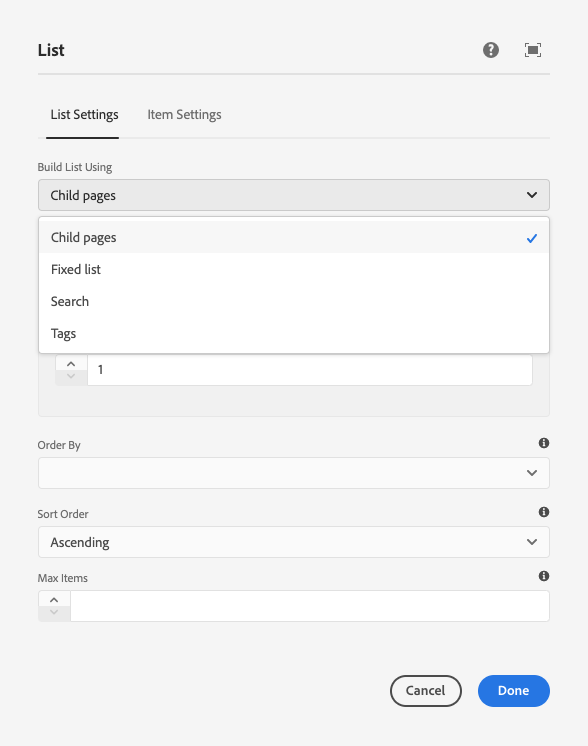

# Utilizzo di Nascondi condizioni {#using-hide-conditions}

È possibile utilizzare le condizioni Nascondi per determinare se una risorsa componente è sottoposta o meno a rendering. Un esempio potrebbe essere quando un autore di modelli configura il Componente core [componente elenco](https://experienceleague.adobe.com/docs/experience-manager-core-components/using/components/list.html) nel [editor modelli](/help/sites-cloud/authoring/features/templates.md) e decide di disabilitare le opzioni per creare l’elenco in base alle pagine figlie. La disattivazione di questa opzione nella finestra di dialogo per progettazione imposta una proprietà in modo che, quando viene eseguito il rendering del componente Elenco, venga valutata la condizione Nascondi e non venga visualizzata l’opzione per visualizzare le pagine figlie.

## Panoramica {#overview}

Le finestre di dialogo possono diventare molto complesse con numerose opzioni per l’utente, che può utilizzare solo una frazione delle opzioni a sua disposizione. Questo può portare a esperienze di interfaccia utente schiaccianti per gli utenti.

Utilizzando le condizioni di nascondi, gli amministratori, gli sviluppatori e gli utenti con privilegi avanzati possono nascondere le risorse in base a un set di regole. Questa funzione consente loro di decidere quali risorse visualizzare quando un autore modifica il contenuto.

>[!NOTE]
>
>Se si nasconde una risorsa basata su un’espressione, le autorizzazioni ACL non vengono sostituite. Il contenuto rimane modificabile ma non viene visualizzato.

## Dettagli sull’implementazione e sull’utilizzo {#implementation-and-usage-details}

`com.adobe.granite.ui.components.FilteringResourceWrapper` è responsabile del filtraggio delle risorse in base all’esistenza e al valore del `granite:hide` , situata nel campo da filtrare. L&#39;implementazione di `/libs/cq/gui/components/authoring/dialog/dialog.jsp` include un&#39;istanza di `FilteringResourceWrapper.`

L’implementazione utilizza il Granite [API Risolutore ELR](https://helpx.adobe.com/experience-manager/6-5/sites/developing/using/reference-materials/granite-ui/api/jcr_root/libs/granite/ui/docs/server/el.html) e aggiunge `cqDesign` tramite ExpressionCustomizer.

Di seguito sono riportati alcuni esempi di condizioni di nascondi in un nodo di progettazione che si trova in `etc/design` o come informativa sui contenuti.

```
${cqDesign.myProperty}
${!cqDesign.myProperty}
${cqDesign.myProperty == 'someText'}
${cqDesign.myProperty != 'someText'}
${cqDesign.myProperty == true}
${cqDesign.myProperty == true}
${cqDesign.property1 == 'someText' && cqDesign.property2 || cqDesign.property3 != 1 || header.myHeader}
```

Quando definisci l’espressione Nascondi, tieni presente quanto segue:

* Per essere valido, è necessario esprimere l’ambito in cui si trova la proprietà (ad esempio, `cqDesign.myProperty`).
* I valori sono di sola lettura.
* Le funzioni (se richieste) devono essere limitate a un determinato set fornito dal servizio.

## Esempio {#example}

Esempi di malattie delle pelli si possono trovare in tutta l’AEM e nella [Componenti core](https://experienceleague.adobe.com/docs/experience-manager-core-components/using/introduction.html?lang=it) in particolare. Ad esempio, considera [componente core elenco](https://experienceleague.adobe.com/docs/experience-manager-core-components/using/components/list.html) come implementato in [Esercitazione WKND.](/help/implementing/developing/introduction/develop-wknd-tutorial.md)

[Utilizzo dell’editor modelli](/help/sites-cloud/authoring/features/templates.md), l’autore del modello può definire nella finestra di dialogo per progettazione le opzioni del componente Elenco disponibili per l’autore della pagina. Opzioni quali se consentire all’elenco di essere statico, un elenco di pagine figlie, un elenco di pagine con tag e così via. può essere abilitato o disabilitato.

Se un autore di modelli sceglie di disabilitare l’opzione pagine figlie, viene impostata una proprietà di progettazione e viene valutata una condizione di nascondi in base a essa, impedendo all’autore della pagina di eseguire il rendering dell’opzione.

1. Per impostazione predefinita, l’autore della pagina può utilizzare il componente core Elenco per creare un elenco utilizzando pagine figlie scegliendo l’opzione **Pagine figlie**.

   

1. Nella finestra di dialogo per progettazione del componente core Elenco, l’autore del modello può scegliere l’opzione **Disabilita elementi figlio** per impedire che l’opzione per generare un elenco basato su pagine figlie venga mostrata all’autore della pagina.

   

1. Un nodo di criterio viene creato in `/conf/wknd/settings/wcm/policies/wknd/components/list` con una proprietà `disableChildren` imposta su `true`.

   

1. La condizione Nascondi è definita come il valore di un `granite:hide` proprietà nel nodo della proprietà della finestra di dialogo `/libs/core/wcm/components/list/v2/list/cq:dialog/content/items/tabs/items/listSettings/items/columns/items/column/items/listFrom/items/children`

   

1. Il valore di `disableChildren` viene estratto dalla configurazione di progettazione e dall’espressione `${cqDesign.disableChildren}` valuta per `false`, il che significa che l’opzione non verrà renderizzata come parte del componente.

1. Opzione **Pagine figlie** non viene più eseguito per l’autore della pagina quando si utilizza il componente Elenco.

   
