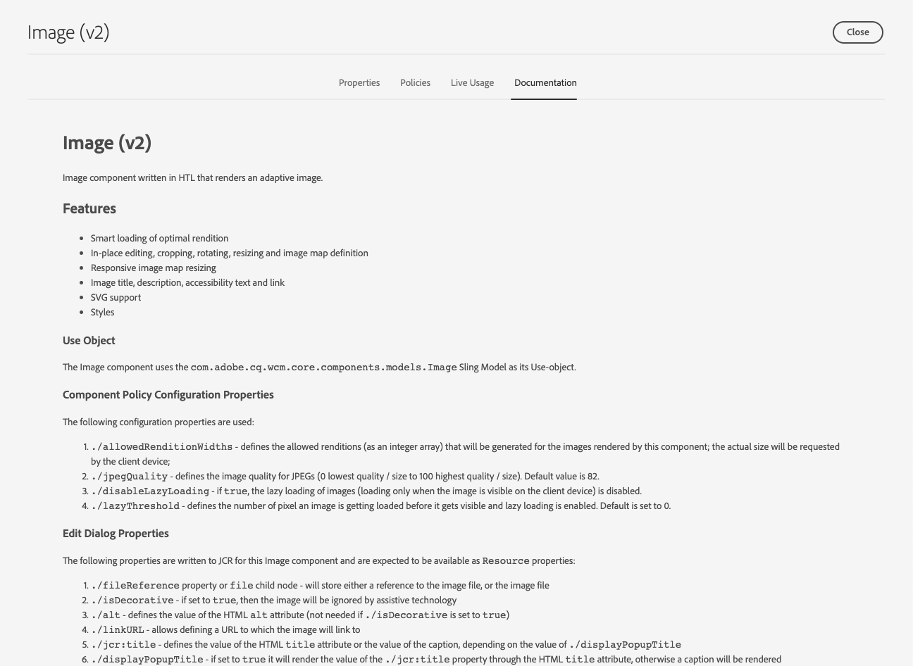

# Guida di riferimento dei componenti {#components-reference-guide}

I componenti sono alla base della creazione di un’esperienza in AEM. I [Componenti core](https://experienceleague.adobe.com/docs/experience-manager-core-components/using/introduction.html?lang=it) e il [Archetipo progetto AEM](https://experienceleague.adobe.com/it/docs/experience-manager-core-components/using/developing/archetype/overview) semplificano l&#39;avvio con un set di strumenti di componenti pronti e affidabili. L&#39;[esercitazione WKND](/help/implementing/developing/introduction/develop-wknd-tutorial.md) spiega allo sviluppatore come utilizzare questi strumenti e come creare componenti personalizzati per creare un sito AEM.

>[!TIP]
>
>Prima di fare riferimento a questo documento, assicurati di aver completato l&#39;[esercitazione WKND](/help/implementing/developing/introduction/develop-wknd-tutorial.md) e di avere quindi familiarità con i [Componenti core](https://experienceleague.adobe.com/docs/experience-manager-core-components/using/introduction.html) e l&#39;[Archetipo progetto AEM](https://experienceleague.adobe.com/it/docs/experience-manager-core-components/using/developing/archetype/overview).

Poiché l’esercitazione WKND copre la maggior parte dei casi d’uso, questo documento è inteso solo come supplemento a tali risorse. Fornisce informazioni tecniche approfondite sulla struttura e la configurazione dei componenti in AEM e non intende essere una guida introduttiva.

## Panoramica {#overview}

Questa sezione descrive concetti e problemi chiave come introduzione ai dettagli necessari per lo sviluppo di componenti personalizzati.

### Pianificazione {#planning}

Prima di iniziare a configurare o codificare il componente, è necessario chiedere:

* Cosa devi fare esattamente con il nuovo componente?
* È necessario creare il componente da zero o è possibile ereditare le nozioni di base da un componente esistente?
* Il componente richiederà logica per selezionare/manipolare il contenuto?
   * La logica deve essere tenuta separata dal livello dell&#39;interfaccia utente. HTL è progettato per garantire che questo accada.
* Il componente avrà bisogno della formattazione CSS?
   * La formattazione CSS deve essere mantenuta separata dalle definizioni dei componenti. Definisci le convenzioni per la denominazione degli elementi HTML in modo da poterli modificare tramite file CSS esterni.
* Quali implicazioni per la sicurezza può presentare il nuovo componente?

### Riutilizzo dei componenti esistenti {#reusing-components}

Prima di dedicare tempo alla creazione di un componente completamente nuovo, è consigliabile personalizzare o estendere i componenti esistenti. [I Componenti core](https://experienceleague.adobe.com/docs/experience-manager-core-components/using/introduction.html) offrono una suite di componenti flessibili, solidi e testati pronti per la produzione.

#### Estensione dei Componenti core {#extending-core-components}

I Componenti core offrono inoltre [chiari modelli di personalizzazione](https://experienceleague.adobe.com/docs/experience-manager-core-components/using/developing/customizing.html?lang=it) che è possibile utilizzare per adattarli alle esigenze del proprio progetto.

#### Sovrapposizione di componenti {#overlying-components}

I componenti possono anche essere ridefiniti con una [sovrapposizione](/help/implementing/developing/introduction/overlays.md) in base alla logica del percorso di ricerca. Tuttavia, in questo caso, [Sling Resource Merger](/help/implementing/developing/introduction/sling-resource-merger.md) non verrà attivato e `/apps` deve definire l&#39;intera sovrapposizione.

#### Estensione delle finestre di dialogo dei componenti {#extending-component-dialogs}

È inoltre possibile ignorare una finestra di dialogo di un componente utilizzando Sling Resource Merger e definendo la proprietà `sling:resourceSuperType`.

Ciò significa che è sufficiente ridefinire le differenze richieste, anziché ridefinire l’intera finestra di dialogo.

### Logica dei contenuti e markup di rendering  {#content-logic-and-rendering-markup}

Il rendering del componente viene eseguito con [HTML](https://www.w3schools.com/htmL/html_intro.asp). Il componente deve definire il HTML necessario per acquisire il contenuto richiesto e quindi eseguirne il rendering come richiesto, sia nell’ambiente di authoring che in quello di pubblicazione.

Si consiglia di mantenere il codice responsabile del markup e del rendering separato dal codice che controlla la logica utilizzata per selezionare il contenuto del componente.

Questa filosofia è supportata da [HTL](https://experienceleague.adobe.com/it/docs/experience-manager-htl/content/overview), un linguaggio di modelli appositamente limitato per garantire che venga utilizzato un linguaggio di programmazione reale per definire la logica di business sottostante. Questo meccanismo evidenzia il codice chiamato per una determinata vista e, se necessario, consente una logica specifica per diverse viste dello stesso componente.

Questa logica (facoltativa) può essere implementata in diversi modi e viene richiamata da HTL con comandi specifici:

* Utilizzo di Java - [Java Use-API](https://experienceleague.adobe.com/docs/experience-manager-htl/content/java-use-api.html) per HTL consente a un file HTL di accedere a metodi helper in una classe Java personalizzata. Questo consente di utilizzare il codice Java per implementare la logica per selezionare e configurare il contenuto del componente.
* Utilizzo di JavaScript - [HTL JavaScript Use-API](https://experienceleague.adobe.com/docs/experience-manager-htl/using/htl/use-api-javascript.html) consente a un file HTL di accedere a codice helper scritto in JavaScript. Questo consente di utilizzare il codice JavaScript per implementare la logica per la selezione e la configurazione del contenuto del componente.
* Utilizzo delle librerie lato client: i siti web moderni si basano in larga misura sull’elaborazione lato client guidata da codici JavaScript e CSS complessi. Per ulteriori informazioni, vedere il documento [Utilizzo delle librerie lato client in AEM as a Cloud Service](/help/implementing/developing/introduction/clientlibs.md).

## Struttura dei componenti {#structure}

La struttura di un componente AEM è potente e flessibile. Le parti principali sono:

* [Tipo risorsa](#resource-type)
* [Definizione del componente](#component-definition)
* [Proprietà e nodi figlio di un componente](#properties-and-child-nodes-of-a-component)
* [Finestre di dialogo](#dialogs)
* [Finestre di dialogo per progettazione](#design-dialogs)

### Tipo risorsa {#resource-type}

Un elemento chiave della struttura è il tipo di risorsa.

* La struttura del contenuto dichiara le intenzioni.
* Il tipo di risorsa li implementa.

Si tratta di un’astrazione che aiuta a garantire che, anche quando l’aspetto cambia nel tempo, l’intenzione rimanga nel tempo.

### Definizione del componente {#component-definition}

La definizione di un componente può essere suddivisa come segue:

* I componenti AEM si basano su [Sling](https://sling.apache.org/documentation.html).
* I componenti AEM si trovano in `/libs/core/wcm/components`.
* I componenti specifici del progetto/sito si trovano in `/apps/<myApp>/components`.
* I componenti standard di AEM sono definiti come `cq:Component` e presentano gli elementi chiave:
   * Proprietà jcr: elenco di proprietà jcr. Queste sono variabili e alcune possono essere facoltative sebbene la struttura di base di un nodo componente, le relative proprietà e i sottonodi siano definiti dalla definizione `cq:Component`.
   * Risorse: definiscono gli elementi statici utilizzati dal componente.
   * Script: vengono utilizzati per implementare il comportamento dell’istanza risultante del componente.

#### Proprietà vitali {#vital-properties}

* **Nodo principale**:
   * `<mycomponent> (cq:Component)` - Nodo gerarchico del componente.
* **Proprietà vitali**:
   * `jcr:title` - Titolo componente; ad esempio, utilizzato come etichetta quando il componente è elencato in [Browser componenti](/help/sites-cloud/authoring/page-editor/editor-side-panel.md#components-browser) e [Console componenti](/help/sites-cloud/authoring/components-console.md).
   * `jcr:description` - Descrizione del componente; utilizzato come suggerimento del mouse nel browser Componenti e nella console Componenti.
   * Per ulteriori informazioni, vedere la sezione [Icona componente](#component-icon).
* **Nodi figlio vitali**:
   * `cq:editConfig (cq:EditConfig)` - Definisce le proprietà di modifica del componente e consente la visualizzazione del componente nel browser Componenti.
      * Se il componente ha una finestra di dialogo, questa verrà visualizzata automaticamente nel browser Componenti o in Sidekick, anche se cq:editConfig non esiste.
   * `cq:childEditConfig (cq:EditConfig)` - Controlla gli aspetti dell&#39;interfaccia utente di authoring per i componenti figlio che non definiscono il proprio `cq:editConfig`.
   * `cq:dialog (nt:unstructured)` - Finestra di dialogo per questo componente. Definisce l’interfaccia che consente all’utente di configurare il componente e/o modificare il contenuto.
   * `cq:design_dialog (nt:unstructured)` - Modifica progettazione per questo componente.

#### Icona componente {#component-icon}

L’icona o l’abbreviazione del componente viene definita tramite le proprietà JCR del componente quando questo viene creato dallo sviluppatore. Queste proprietà vengono valutate nell&#39;ordine seguente e viene utilizzata la prima proprietà valida trovata.

1. `cq:icon` - Proprietà stringa che punta a un&#39;icona standard nella [Libreria interfaccia utente Coral](https://opensource.adobe.com/coral-spectrum/examples/#icon) da visualizzare nel browser componenti.
   * Utilizza il valore dell’attributo HTML dell’icona Coral.
1. `abbreviation` - Proprietà stringa per personalizzare l&#39;abbreviazione del nome del componente nel browser componenti.
   * L’abbreviazione deve essere limitata a due caratteri.
   * Se si specifica una stringa vuota, l&#39;abbreviazione verrà generata dai primi due caratteri della proprietà `jcr:title`.
      * Ad esempio, &quot;Im&quot; per &quot;Immagine&quot;.
      * Il titolo localizzato viene utilizzato per creare l’abbreviazione.
   * L&#39;abbreviazione viene tradotta solo se il componente ha una proprietà `abbreviation_commentI18n`, che viene quindi utilizzata come suggerimento di traduzione.
1. `cq:icon.png` o `cq:icon.svg` - Icona per questo componente, visualizzata nel browser Componenti.
   * 20 x 20 pixel sono le dimensioni delle icone dei componenti standard.
      * Le icone più grandi vengono ridimensionate (lato client).
   * Il colore consigliato è rgb(112, 112, 112) > #707070.
   * Lo sfondo delle icone dei componenti standard è trasparente.
   * Sono supportati solo `.png` e `.svg` file.
   * Se si esegue l&#39;importazione dal file system tramite il plug-in Eclipse, i nomi dei file devono essere preceduti, ad esempio, da `_cq_icon.png` o `_cq_icon.svg`.
   * `.png` ha la precedenza su `.svg` se entrambi sono presenti.

Se nessuna delle proprietà precedenti (`cq:icon`, `abbreviation`, `cq:icon.png` o `cq:icon.svg`) è presente nel componente:

* Il sistema cercherà le stesse proprietà nei super componenti seguendo la proprietà `sling:resourceSuperType`.
* Se non viene trovato nulla o un&#39;abbreviazione vuota a livello di super componente, il sistema creerà l&#39;abbreviazione dalle prime lettere della proprietà `jcr:title` del componente corrente.

Per annullare l&#39;ereditarietà delle icone dai super componenti, l&#39;impostazione di una proprietà `abbreviation` vuota sul componente ripristinerà il comportamento predefinito.

Nella [Console componenti](/help/sites-cloud/authoring/components-console.md#component-details) viene visualizzato il modo in cui è definita l&#39;icona di un particolare componente.

#### Esempio di icona SVG {#svg-icon-example}

```xml
<?xml version="1.0" encoding="utf-8"?>
<!DOCTYPE svg PUBLIC "-//W3C//DTD SVG 1.1//EN" "https://www.w3.org/Graphics/SVG/1.1/DTD/svg11.dtd">
<svg version="1.1" id="Layer_1" xmlns="https://www.w3.org/2000/svg" xmlns:xlink="https://www.w3.org/1999/xlink" x="0px" y="0px"
     width="20px" height="20px" viewBox="0 0 20 20" enable-background="new 0 0 20 20" xml:space="preserve">
    <ellipse cx="5" cy="5" rx="3" ry="3" fill="#707070"/>
    <ellipse cx="15" cy="5" rx="4" ry="4" fill="#707070"/>
    <ellipse cx="5" cy="15" rx="5" ry="5" fill="#707070"/>
    <ellipse cx="15" cy="15" rx="4" ry="4" fill="#707070"/>
</svg>
```

### Proprietà e nodi figlio di un componente {#properties-and-child-nodes-of-a-component}

Molti nodi/proprietà necessari per definire un componente sono comuni a entrambe le interfacce, con differenze che rimangono indipendenti in modo che il componente possa funzionare in entrambi gli ambienti.

Un componente è un nodo di tipo `cq:Component` e presenta le proprietà e i nodi figlio seguenti:

| Nome | Tipo | Descrizione |
|---|---|---|
| `.` | `cq:Component` | Rappresenta il componente corrente. Un componente è di tipo nodo `cq:Component`. |
| `componentGroup` | `String` | Rappresenta il gruppo in cui il componente può essere selezionato nel [browser Componenti](/help/sites-cloud/authoring/page-editor/editor-side-panel.md#components-browser). Un valore che inizia con `.` viene utilizzato per i componenti che non sono disponibili per la selezione dall&#39;interfaccia utente, ad esempio i componenti di base ereditati da altri componenti. |
| `cq:isContainer` | `Boolean` | Indica se il componente è un componente contenitore e può quindi contenere altri componenti, ad esempio un sistema paragrafo. |
| `cq:dialog` | `nt:unstructured` | Questa è la definizione della finestra di dialogo per modifica del componente. |
| `cq:design_dialog` | `nt:unstructured` | Questa è la definizione della finestra di dialogo per progettazione del componente. |
| `cq:editConfig` | `cq:EditConfig` | Definisce la configurazione [edit del componente](#edit-behavior). |
| `cq:htmlTag` | `nt:unstructured` | In questo modo vengono restituiti attributi di tag aggiuntivi che vengono aggiunti al tag HTML circostante. Abilita l’aggiunta di attributi ai div generati automaticamente. |
| `cq:noDecoration` | `Boolean` | Se true, il componente non viene renderizzato con le classi div e css generate automaticamente. |
| `cq:template` | `nt:unstructured` | Se individuato, questo nodo viene utilizzato come modello di contenuto quando il componente viene aggiunto dal browser Componenti. |
| `jcr:created` | `Date` | Data di creazione del componente. |
| `jcr:description` | `String` | Descrizione del componente. |
| `jcr:title` | `String` | Titolo del componente. |
| `sling:resourceSuperType` | `String` | Con questa impostazione, il componente eredita da questo componente. |
| `component.html` | `nt:file` | Questo è il file di script HTL del componente. |
| `cq:icon` | `String` | Questo valore punta all&#39;icona [ del componente](#component-icon) e viene visualizzato nel browser Componenti. |

Se osservi il componente **Testo**, puoi vedere diversi di questi elementi:


Le proprietà di particolare interesse comprendono:

* `jcr:title` - Titolo del componente utilizzato per identificare il componente nel browser Componenti.
* `jcr:description` - Descrizione del componente.
* `sling:resourceSuperType` - Indica il percorso di ereditarietà durante l&#39;estensione di un componente (escludendo una definizione).

I nodi figlio di particolare interesse includono:

* `cq:editConfig` - Controlla gli aspetti visivi del componente durante la modifica.
* `cq:dialog` - Definisce la finestra di dialogo per la modifica del contenuto di questo componente.
* `cq:design_dialog` - Specifica le opzioni di modifica della progettazione per questo componente.

### Finestre di dialogo {#dialogs}

Le finestre di dialogo sono un elemento chiave del componente in quanto forniscono un’interfaccia che consente agli autori di configurare il componente in una pagina di contenuto e fornire input per tale componente. Per informazioni dettagliate su come gli autori di contenuti interagiscono con i componenti, consulta la [documentazione sull&#39;authoring](/help/sites-cloud/authoring/page-editor/edit-content.md).

A seconda della complessità del componente, la finestra di dialogo potrebbe richiedere una o più schede.

Finestre di dialogo per i componenti di AEM:

* Sono `cq:dialog` nodi di tipo `nt:unstructured`.
* Si trovano sotto i relativi nodi `cq:Component` e accanto alle relative definizioni di componenti.
* Definisci la finestra di dialogo per la modifica del contenuto di questo componente.
* Sono definiti utilizzando i componenti dell’interfaccia utente Granite.
* È eseguito il rendering lato server (come componenti Sling), in base alla struttura del contenuto e alla proprietà `sling:resourceType`.
* Contengono una struttura di nodi che descrive i campi all’interno della finestra di dialogo
   * Questi nodi sono `nt:unstructured` con la proprietà `sling:resourceType` richiesta.


Nella finestra di dialogo sono definiti i singoli campi:


### Finestre di dialogo per progettazione {#design-dialogs}

Le finestre di dialogo per progettazione sono simili alle finestre di dialogo utilizzate per modificare e configurare il contenuto, ma forniscono agli autori di modelli l’interfaccia per la pro-configurazione e i dettagli di progettazione per tale componente su un modello di pagina. I modelli di pagina vengono quindi utilizzati dagli autori dei contenuti per creare pagine di contenuto. Per informazioni dettagliate sulla creazione dei modelli, consulta la [documentazione dei modelli](/help/sites-cloud/authoring/page-editor/templates.md).

[Le finestre di dialogo per progettazione vengono utilizzate durante la modifica di un modello di pagina](/help/sites-cloud/authoring/page-editor/templates.md), anche se non sono necessarie per tutti i componenti. Ad esempio, i componenti **Titolo** e **Immagine** dispongono entrambi di finestre di dialogo di progettazione, mentre il componente **Condivisione social media** no.

### Coral UI e Granite UI {#coral-and-granite}

L’interfaccia utente Coral e Granite definiscono l’aspetto di AEM.

* [Coral UI](https://opensource.adobe.com/coral-spectrum/documentation/) fornisce un&#39;interfaccia utente coerente in tutte le soluzioni cloud.
* [L&#39;interfaccia utente Granite](https://helpx.adobe.com/experience-manager/6-5/sites/developing/using/reference-materials/granite-ui/api/jcr_root/libs/granite/ui/index.html) fornisce il markup dell&#39;interfaccia utente Coral racchiuso nei componenti Sling per la creazione di console e finestre di dialogo dell&#39;interfaccia utente.

L’interfaccia utente Granite offre una vasta gamma di widget di base necessari per creare la finestra di dialogo nell’ambiente di authoring. Se necessario, puoi estendere questa selezione e creare un widget personalizzato.

Per ulteriori informazioni, consulta le seguenti risorse:

* [Struttura dell’interfaccia AEM](/help/implementing/developing/introduction/ui-structure.md)

### Personalizzazione dei campi della finestra di dialogo {#customizing-dialog-fields}

<!--
Content not found

>[!TIP]
>
>See the [AEM Gems session](https://docs.adobe.com/content/ddc/en/gems/customizing-dialog-fields-in-touch-ui.html) on customizing dialog fields.
-->

Per creare un widget da utilizzare nella finestra di dialogo di un componente è necessario creare un componente campo dell’interfaccia utente Granite.

Se consideri la finestra di dialogo come un semplice contenitore per un elemento del modulo, puoi anche visualizzare il contenuto principale della finestra di dialogo come campi del modulo. La creazione di un nuovo campo modulo richiede la creazione di un tipo di risorsa, che equivale alla creazione di un componente. Per facilitare questa attività, l&#39;interfaccia utente Granite offre un componente campo generico da cui ereditare (utilizzando `sling:resourceSuperType`):

`/libs/granite/ui/components/coral/foundation/form/field`

Più precisamente, l&#39;interfaccia utente Granite fornisce una serie di componenti di campo adatti all&#39;utilizzo nelle finestre di dialogo o, più in generale, nei [moduli](https://helpx.adobe.com/experience-manager/6-5/sites/developing/using/reference-materials/granite-ui/api/jcr_root/libs/granite/ui/components/foundation/form/index.html).

Dopo aver creato il tipo di risorsa, è possibile creare un&#39;istanza del campo aggiungendo un nuovo nodo nella finestra di dialogo, con la proprietà `sling:resourceType` che fa riferimento al tipo di risorsa appena introdotto.

#### Accesso ai campi della finestra di dialogo {#access-to-dialog-fields}

È inoltre possibile utilizzare le condizioni di rendering (`rendercondition`) per controllare chi ha accesso a schede/campi specifici nella finestra di dialogo, ad esempio:

```text
+ mybutton
  - sling:resourceType = granite/ui/components/coral/foundation/button
  + rendercondition
    - sling:resourceType = myapp/components/renderconditions/group
    - groups = ["administrators"]
```

## Utilizzo dei componenti {#using-components}

Dopo aver creato un componente, devi abilitarlo per utilizzarlo. Il suo utilizzo mostra come la struttura del componente è correlata alla struttura del contenuto risultante nell’archivio.

### Aggiunta del componente al modello {#adding-your-component-to-the-template}

Una volta definito, il componente deve essere reso disponibile per l’uso. Per rendere un componente disponibile per l’utilizzo in un modello, devi abilitarlo nel criterio del Contenitore di layout del modello.

Per informazioni dettagliate sulla creazione dei modelli, consulta la [documentazione dei modelli](/help/sites-cloud/authoring/page-editor/templates.md).

### Componenti e contenuti creati {#components-and-the-content-they-create}

Se si crea e si configura un&#39;istanza del componente **Title** nella pagina: `/content/wknd/language-masters/en/adventures/extreme-ironing.html`


Quindi possiamo vedere la struttura del contenuto creato all’interno dell’archivio:


In particolare, se si considera il testo effettivo di un **componente Titolo**:

* Il contenuto contiene una proprietà `jcr:title` contenente il testo effettivo del titolo immesso dall&#39;autore.
* Contiene anche un riferimento `sling:resourceType` alla definizione del componente.

Le proprietà definite dipendono dalle singole definizioni. Anche se possono essere più complesse di quanto sopra, seguono comunque gli stessi principi di base.

## Gerarchia dei componenti ed ereditarietà {#component-hierarchy-and-inheritance}

I componenti in AEM sono soggetti alla **gerarchia dei tipi di risorsa**. Utilizzato per estendere i componenti utilizzando la proprietà `sling:resourceSuperType`. Questo consente al componente di ereditare da un altro componente.

Per ulteriori informazioni, vedere la sezione [Riutilizzo dei componenti](#reusing-components).

## Modifica comportamento {#edit-behavior}

Questa sezione spiega come configurare il comportamento di modifica di un componente. Ciò include attributi quali le azioni disponibili per il componente, le caratteristiche dell’editor in.place e i listener relativi agli eventi sul componente.

Il comportamento di modifica di un componente è configurato aggiungendo un nodo `cq:editConfig` di tipo `cq:EditConfig` sotto il nodo del componente (di tipo `cq:Component`) e aggiungendo proprietà e nodi figlio specifici. Sono disponibili le seguenti proprietà e nodi figlio:

* `cq:editConfig` proprietà nodo
* [`cq:editConfig` nodi figlio](#configuring-with-cq-editconfig-child-nodes):
   * `cq:dropTargets` (tipo di nodo `nt:unstructured`): definisce un elenco di destinazioni di rilascio che possono accettare un rilascio da una risorsa di content finder (è consentita una singola destinazione di rilascio)
   * `cq:inplaceEditing` (tipo di nodo `cq:InplaceEditingConfig`): definisce una configurazione di modifica diretta per il componente
   * `cq:listeners` (tipo di nodo `cq:EditListenersConfig`): definisce cosa accade prima o dopo che si verifica un&#39;azione sul componente

Esistono molte configurazioni in AEM. Puoi cercare facilmente proprietà specifiche o nodi secondari utilizzando lo strumento Query in **CRXDE Lite**.

### Segnaposto Componente {#component-placeholders}

I componenti devono sempre eseguire il rendering di alcuni HTML visibili all’autore, anche quando il componente non ha contenuto. In caso contrario, potrebbe scomparire visivamente dall’interfaccia dell’editor, rendendolo tecnicamente presente ma invisibile nella pagina e nell’editor. In questo caso, gli autori non potranno selezionare e interagire con il componente vuoto.

Per questo motivo, i componenti devono eseguire il rendering di un segnaposto a condizione che non eseguano il rendering di alcun output visibile quando la pagina viene riprodotta nell&#39;editor pagina (quando la modalità WCM è `edit` o `preview`).
Il markup tipico di HTML per un segnaposto è il seguente:

```HTML
<div class="cq-placeholder" data-emptytext="Component Name"></div>
```

Il tipico script HTL che esegue il rendering del segnaposto di cui sopra HTML è il seguente:

```HTML
<div class="cq-placeholder" data-emptytext="${component.properties.jcr:title}"
     data-sly-test="${(wcmmode.edit || wcmmode.preview) && isEmpty}"></div>
```

Nell&#39;esempio precedente, `isEmpty` è una variabile che è true solo quando il componente non ha contenuto ed è invisibile all&#39;autore.

Per evitare ripetizioni, Adobe consiglia agli implementatori di componenti di utilizzare un modello HTL per questi segnaposto, [simile a quello fornito dai Componenti core](https://github.com/adobe/aem-core-wcm-components/blob/master/content/src/content/jcr_root/apps/core/wcm/components/commons/v1/templates.html).

L’utilizzo del modello nel collegamento precedente viene quindi eseguito con la seguente riga di HTL:

```HTML
<sly data-sly-use.template="core/wcm/components/commons/v1/templates.html"
     data-sly-call="${template.placeholder @ isEmpty=!model.text}"></sly>
```

Nell&#39;esempio precedente, `model.text` è la variabile che è true solo quando il contenuto ha contenuto ed è visibile.

Un esempio di utilizzo di questo modello è disponibile nei Componenti core, [ad esempio nel Componente titolo](https://github.com/adobe/aem-core-wcm-components/blob/master/content/src/content/jcr_root/apps/core/wcm/components/title/v2/title/title.html#L27).

### Configurazione con nodi secondari cq:EditConfig {#configuring-with-cq-editconfig-child-nodes}

#### Eliminazione di Assets in una finestra di dialogo - cq:dropTargets {#cq-droptargets}

Il nodo `cq:dropTargets` (tipo di nodo `nt:unstructured`) definisce la destinazione di rilascio che può accettare un rilascio da una risorsa trascinata da Content Finder. È un nodo di tipo `cq:DropTargetConfig`.

Il nodo figlio di tipo `cq:DropTargetConfig` definisce una destinazione di rilascio nel componente.

### Modifica diretta - cq:inplaceEditing {#cq-inplaceediting}

Un editor locale consente all’utente di modificare il contenuto direttamente nel flusso di contenuto, senza dover aprire una finestra di dialogo. Ad esempio, i componenti standard **Testo** e **Titolo** dispongono entrambi di un editor locale.

Non è necessario/significativo un editor locale per ogni tipo di componente.

Il nodo `cq:inplaceEditing` (tipo di nodo `cq:InplaceEditingConfig`) definisce una configurazione di modifica diretta per il componente. Può avere le seguenti proprietà:

| Nome proprietà | Tipo di proprietà | Valore proprietà |
|---|---|---|
| `active` | `Boolean` | `true` per abilitare la modifica diretta del componente. |
| `configPath` | `String` | Percorso della configurazione dell’editor, che può essere specificata da un nodo di configurazione |
| `editorType` | `String` | I tipi disponibili sono: `plaintext` per contenuti non HTML, `title` converte i titoli grafici in testo normale prima di iniziare la modifica e `text` utilizza l&#39;editor Rich Text |

La configurazione seguente abilita la modifica diretta del componente e definisce `plaintext` come tipo di editor:

```text
    <cq:inplaceEditing
        jcr:primaryType="cq:InplaceEditingConfig"
        active="{Boolean}true"
        editorType="plaintext"/>
```

### Gestione degli eventi dei campi - cq:listeners {#cq-listeners}

Il metodo di gestione degli eventi nei campi della finestra di dialogo viene eseguito con i listener in una [libreria client](/help/implementing/developing/introduction/clientlibs.md) personalizzata.

Per inserire la logica nel campo, è necessario:

* Fai marcare il campo con una determinata classe CSS (l’hook).
* Definisci nella libreria client un listener JS collegato al nome di classe CSS (in modo che la logica personalizzata abbia ambito solo sul tuo campo e non influisca su altri campi dello stesso tipo).

A questo scopo, è necessario conoscere la libreria di widget sottostante con cui desideri interagire. [Consulta la documentazione dell&#39;interfaccia utente Coral](https://opensource.adobe.com/coral-spectrum/documentation/) per identificare l&#39;evento a cui desideri reagire.

Il nodo `cq:listeners` (tipo di nodo `cq:EditListenersConfig`) definisce cosa accade prima o dopo un&#39;azione sul componente. La tabella seguente definisce le proprietà possibili.

| Nome proprietà | Valore proprietà |
|---|---|
| `beforedelete` | Il gestore viene attivato prima della rimozione del componente. |
| `beforeedit` | L’handler viene attivato prima che il componente venga modificato. |
| `beforecopy` | L’handler viene attivato prima che il componente venga copiato. |
| `beforeremove` | L’handler viene attivato prima che il componente venga spostato. |
| `beforeinsert` | Il gestore viene attivato prima dell’inserimento del componente. |
| `beforechildinsert` | L’handler viene attivato prima che il componente venga inserito all’interno di un altro componente (solo contenitori). |
| `afterdelete` | Il gestore viene attivato dopo la rimozione del componente. |
| `afteredit` | Il gestore viene attivato dopo la modifica del componente. |
| `aftercopy` | Il gestore viene attivato dopo la copia del componente. |
| `afterinsert` | Il gestore viene attivato dopo l’inserimento del componente. |
| `aftermove` | Il gestore viene attivato dopo lo spostamento del componente. |
| `afterchildinsert` | L’handler viene attivato dopo che il componente è stato inserito all’interno di un altro componente (solo contenitori). |

>[!NOTE]
>
>Nel caso di componenti nidificati, esistono alcune restrizioni alle azioni definite come proprietà sul nodo `cq:listeners`. Per i componenti nidificati, i valori delle seguenti proprietà **must** devono essere `REFRESH_PAGE`:
>
>* `aftermove`
>* `aftercopy`

Il gestore eventi può essere implementato con un’implementazione personalizzata. Ad esempio, (dove `project.customerAction` è un metodo statico):

`afteredit = "project.customerAction"`

L&#39;esempio seguente equivale alla configurazione `REFRESH_INSERTED`:

`afterinsert="function(path, definition) { this.refreshCreated(path, definition); }"`

Con la seguente configurazione la pagina viene aggiornata dopo che il componente è stato eliminato, modificato, inserito o spostato:

```text
    <cq:listeners
        jcr:primaryType="cq:EditListenersConfig"
        afterdelete="REFRESH_PAGE"
        afteredit="REFRESH_PAGE"
        afterinsert="REFRESH_PAGE"
        afterMove="REFRESH_PAGE"/>
```

### Convalida campo {#field-validation}

La convalida dei campi nell&#39;interfaccia utente Granite e nei widget dell&#39;interfaccia utente Granite viene eseguita utilizzando l&#39;API `foundation-validation`. Per informazioni dettagliate, vedere la documentazione di [`foundation-valdiation` Granite](https://helpx.adobe.com/experience-manager/6-5/sites/developing/using/reference-materials/granite-ui/api/jcr_root/libs/granite/ui/components/coral/foundation/clientlibs/foundation/js/validation/index.html).

### Rilevamento della disponibilità della finestra di dialogo {#dialog-ready}

Se si dispone di un JavaScript personalizzato che deve essere eseguito solo quando la finestra di dialogo è disponibile e pronta, è necessario ascoltare l&#39;evento `dialog-ready`.

Questo evento viene attivato ogni volta che la finestra di dialogo viene caricata (o ricaricata) ed è pronta per l’uso, ovvero ogni volta che si verifica una modifica (creazione/aggiornamento) nel DOM della finestra di dialogo.

`dialog-ready` può essere utilizzato per eseguire l&#39;hook nel codice personalizzato di JavaScript che esegue personalizzazioni sui campi all&#39;interno di una finestra di dialogo o attività simili.

## Anteprima comportamento {#preview-behavior}

Il cookie [WCM Mode](https://www.adobe.io/experience-manager/reference-materials/cloud-service/javadoc/com/day/cq/wcm/api/WCMMode.html) viene impostato quando si passa alla modalità Anteprima anche quando la pagina non viene aggiornata.

Per i componenti con un rendering sensibili alla modalità WCM, è necessario definirli per aggiornarsi in modo specifico e quindi basarsi sul valore del cookie.

## Documentazione dei componenti {#documenting-components}

In qualità di sviluppatore, desideri poter accedere facilmente alla documentazione dei componenti per comprendere rapidamente i relativi:

* Descrizione
* Uso previsto
* Struttura e proprietà del contenuto
* API e punti di estensione esposti
* Ecc.

Per questo motivo, è molto semplice creare qualsiasi markdown della documentazione esistente disponibile all’interno del componente stesso.

È sufficiente inserire un file `README.md` nella struttura del componente.


Questo markdown verrà quindi visualizzato nella [console Componenti](/help/sites-cloud/authoring/components-console.md).



Il markdown supportato è lo stesso dei [frammenti di contenuto](/help/sites-cloud/administering/content-fragments/overview.md).
