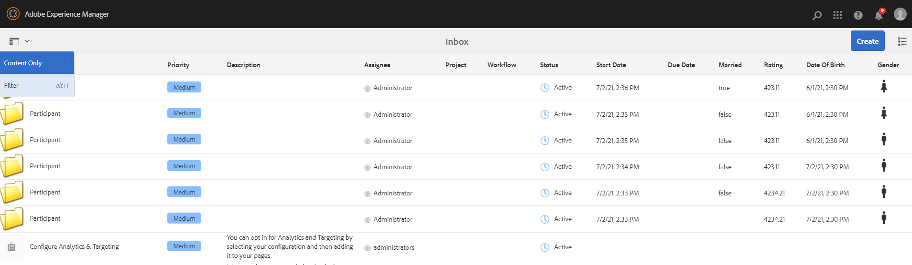

# Configurare i filtri di ricerca per la casella in entrata {#configure-search-filters-inbox}

È possibile configurare i filtri di ricerca per gli elementi della casella in entrata. Basare i criteri di ricerca su una specifica colonna Casella in entrata per filtrare i risultati.

Ad esempio, per filtrare gli elementi della casella in entrata in base a un intervallo di colonne Data di nascita Casella in entrata, è possibile utilizzare il predicato Intervallo date per definire l’intervallo di date.

Di seguito sono riportati i tipi di predicato disponibili per Casella in entrata:

* Predicato intervallo

* Predicato testo

* Predicato intervallo di date

* Predicato proprietà opzioni

>[!NOTE]
>
>Assicurati di essere membro del gruppo `workflow-administrators` per configurare i filtri di ricerca per la casella in entrata.

## Creare o aprire una configurazione personalizzata {#creating-opening-customized-configuration}

1. Passa a **[!UICONTROL Strumenti]**, **[!UICONTROL Generale]**, **[!UICONTROL Cerca in Forms]**.

1. Seleziona la configurazione **[!UICONTROL Barra di ricerca in entrata]** e tocca **[!UICONTROL Modifica]**.
1. Incorpora le modifiche alla configurazione del predicato utilizzando **[!UICONTROL Edit Search Forms]**.
1. Seleziona **[!UICONTROL Fine]** per salvare la configurazione.

## Eliminare una configurazione personalizzata {#delete-customized-configuration}

Per eliminare una configurazione personalizzata:

1. Passa a **[!UICONTROL Strumenti]**, **[!UICONTROL Generale]**, **[!UICONTROL Cerca in Forms]**.

1. Seleziona la configurazione **[!UICONTROL Barra di ricerca in entrata]** e tocca **[!UICONTROL Elimina]**.

## Configura predicato intervallo {#range-predicate}

È possibile filtrare gli elementi della casella in entrata per cercare un intervallo di numeri all’interno di una colonna Casella in entrata utilizzando il predicato Intervallo. È inoltre possibile scegliere di includere valori decimali per i numeri.

Per configurare un predicato di intervallo:

1. Apri il modulo [per la configurazione](#creating-opening-customized-configuration).
1. Tocca la scheda **[!UICONTROL Seleziona predicato]** e trascina **[!UICONTROL Predicato intervallo]** sul modulo.
1. Nella scheda **[!UICONTROL Impostazioni]**, selezionare il nome della colonna Casella in entrata su cui basare la ricerca dal campo **[!UICONTROL Nome colonna]**.
1. Specifica l&#39;etichetta del filtro nel campo **[!UICONTROL Etichetta filtro]** . Selezionare la casella di controllo **[!UICONTROL Abilita valori decimali]** per accettare valori decimali per i numeri durante la definizione dell&#39;intervallo.
1. Specifica una descrizione facoltativa per la configurazione e tocca **[!UICONTROL Fine]** per salvarla.

Le modifiche di configurazione si riflettono all’apertura della pagina Filtri . L’etichetta del filtro specificata al punto 4 viene visualizzata come etichetta con un’opzione per definire i valori massimi e minimi. Quando si preme il tasto Invio, [!DNL Experience Manager] applica i criteri di ricerca sul nome della colonna specificato nel passaggio 3 e restituisce gli elementi della casella in entrata.

>[!NOTE]
>
>L’articolo elenca le opzioni più recenti dell’interfaccia utente. I nomi delle opzioni verranno aggiornati nell’interfaccia utente nella prossima versione.

## Configura predicato di testo {#text-predicate}

Filtrare gli elementi della casella in entrata per cercare una stringa di testo all’interno di una colonna della casella in entrata utilizzando il predicato di testo.

Per configurare un predicato di testo:

1. Apri il modulo [per la configurazione](#creating-opening-customized-configuration).
1. Tocca la scheda **[!UICONTROL Seleziona predicato]** e trascina **[!UICONTROL Predicato di testo]** sul modulo.
1. Nella scheda **[!UICONTROL Impostazioni]**, selezionare il nome della colonna Casella in entrata su cui basare la ricerca dal campo **[!UICONTROL Nome colonna]**.
1. Specificare il testo visualizzato nella casella di testo Ricerca come testo segnaposto nel campo **[!UICONTROL Segnaposto casella di testo ricerca]**.
1. Specifica una descrizione facoltativa per la configurazione e tocca **[!UICONTROL Fine]** per salvarla.

Le modifiche di configurazione si riflettono all’apertura della pagina Filtri . Quando si preme il tasto Invio, [!DNL Experience Manager] applica il testo di ricerca specificato al punto 4 sul nome della colonna specificato al punto 3 e restituisce gli elementi della casella in entrata.

## Configura predicato intervallo date {#date-range-predicate}

È possibile filtrare gli elementi della casella in entrata per cercare un intervallo di date all’interno di una colonna Casella in entrata utilizzando il predicato Intervallo date.

Per configurare un predicato dell’intervallo di date:

1. Apri il modulo [per la configurazione](#creating-opening-customized-configuration).
1. Tocca la scheda **[!UICONTROL Seleziona predicato]** e trascina **[!UICONTROL Predicato intervallo date]** sul modulo.
1. Nella scheda **[!UICONTROL Impostazioni]**, selezionare il nome della colonna Casella in entrata su cui basare la ricerca dal campo **[!UICONTROL Nome colonna]**.
1. Specifica l’etichetta per il filtro dell’intervallo di date nel campo **[!UICONTROL Etichetta filtro]** .
1. Specifica le etichette della data di inizio e della data di fine per il filtro.
1. Specifica una descrizione facoltativa per la configurazione e tocca **[!UICONTROL Fine]** per salvarla.

Le modifiche di configurazione si riflettono all’apertura della pagina Filtri . L’etichetta del filtro specificata al punto 4 viene visualizzata come etichetta per il filtro dell’intervallo di date, insieme alle etichette della data di inizio e della data di fine specificate al punto 5. [!DNL Experience Manager] applica i criteri di ricerca sul nome della colonna specificato al punto 3 e restituisce gli elementi della casella in entrata.

## Configura predicato Opzioni Colonna Personalizzate {#custom-column-options-predicate}

È possibile filtrare gli elementi della casella in entrata per cercare un’opzione personalizzata all’interno di una colonna Casella in entrata utilizzando il predicato Opzioni colonna personalizzate.

Per configurare un predicato Opzioni colonna personalizzate:

1. Apri il modulo [per la configurazione](#creating-opening-customized-configuration).
1. Tocca la scheda **[!UICONTROL Seleziona predicato]** e trascina **[!UICONTROL Predicato opzioni colonna personalizzate]** sul modulo.
1. Nella scheda **[!UICONTROL Impostazioni]**, selezionare il nome della colonna Casella in entrata su cui basare la ricerca dal campo **[!UICONTROL Nome colonna]**.
1. Specifica l’etichetta per il filtro delle opzioni della colonna personalizzato nel campo **[!UICONTROL Etichetta filtro]** .
1. Selezionare la casella di controllo **[!UICONTROL Selezione singola]** per abilitare la selezione di una sola opzione durante l&#39;applicazione di un filtro a una colonna Casella in entrata.
1. Nella sezione **[!UICONTROL Aggiungi opzioni]** :
   1. Seleziona **[!UICONTROL Manuale]** per definire manualmente le opzioni di ricerca del filtro. Tocca **[!UICONTROL Aggiungi opzioni filtro]** per definire la prima opzione. Specifica l’etichetta per l’opzione della colonna e il testo del valore dell’opzione da cercare. Ad esempio, se desideri cercare **Femmina** come valore in una colonna Casella in entrata, puoi specificare **F** come etichetta per l’opzione della colonna e aggiungere **Femmina** come testo del valore dell’opzione. Allo stesso modo, puoi aggiungere altre opzioni di filtro.
   1. Seleziona **[!UICONTROL Percorso JSON]** per definire le opzioni utilizzando un percorso di file JSON. Di seguito è riportato un file JSON di esempio per definire le opzioni di filtro:

      ```JSON
          {
         "options":[
            {
            "text":"Female",
            "value":"F"
            },
            {
            "text":"Male",
            "value":"M"
            }
          ]
        }
      ```

   1. Seleziona **[!UICONTROL Percorso opzioni CRX]** per definire le opzioni utilizzando i percorsi dell&#39;archivio CRX. Tocca **[!UICONTROL Aggiungi percorsi di opzione]** per aggiungere più percorsi. Di seguito è riportato un esempio per definire le opzioni filtro `Male` e `Female` :

      ```JSON
         <gender jcr:primaryType="sling:OrderedFolder">
                        <male
                            jcr:primaryType="nt:unstructured"
                            jcr:title="Male"
                            value="M"/>
                        <female
                            jcr:primaryType="nt:unstructured"
                            jcr:title="Female"
                            value="F"/>
                    </gender>
      ```

1. Specifica una descrizione facoltativa per la configurazione e tocca **[!UICONTROL Fine]** per salvarla.

Le modifiche di configurazione si riflettono all’apertura della pagina Filtri . L’etichetta del filtro specificata al punto 4 viene visualizzata come etichetta per il predicato di opzione per colonna personalizzata. [!DNL Experience Manager] applica i criteri di ricerca definiti al punto 6 sul nome della colonna specificato al punto 3 e restituisce gli elementi della casella in entrata.

Il video seguente illustra i passaggi per filtrare una colonna in base ai valori delle opzioni `true` e `false` .

>[!VIDEO](https://video.tv.adobe.com/v/335679)

## Visualizzare i filtri di ricerca in base ai predicati {#view-search-filters-for-predicates}

Puoi visualizzare i filtri di ricerca in base ai predicati. Selezionare **[!UICONTROL Filtro]** nella pagina Posta in arrivo. I filtri vengono visualizzati nel riquadro a sinistra. È quindi possibile specificare i criteri di ricerca per filtrare gli elementi della casella in entrata.



Per ulteriori informazioni sulla gestione delle configurazioni dei predicati, consulta [Configurazione di Search Forms](search-forms.md).


