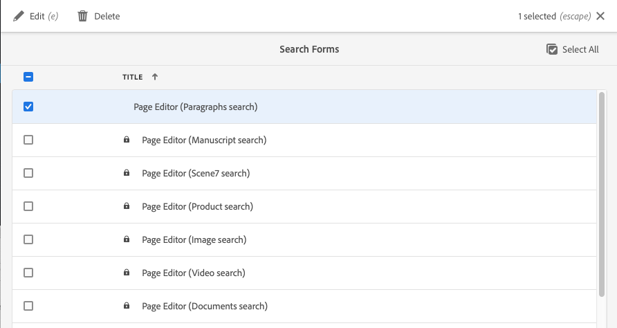

# Configurazione dei moduli di ricerca {#configuring-search-forms}

Adobe Experience Manager as a Cloud Service viene fornito con un potente [Ricerca](/help/sites-cloud/authoring/getting-started/search.md) meccanismo.

In combinazione con questo, è disponibile anche un set di opzioni predefinite per facilitare il filtraggio del contenuto. Questi contengono facet predefiniti come **Data di modifica**, **Stato di pubblicazione** oppure **Stato Livecopy** per accedere rapidamente alle risorse necessarie.

L&#39;obiettivo comune è quello di individuare i contenuti in modo rapido e semplice da:

* [Ricerca e filtro](/help/sites-cloud/authoring/getting-started/search.md#search-and-filter)
* [Selettore della barra](/help/sites-cloud/authoring/getting-started/basic-handling.md#rail-selector)
* la [Browser Risorse](/help/sites-cloud/authoring/fundamentals/environment-tools.md#assets-browser) (durante la modifica delle pagine)

>[!NOTE]
>
>È possibile configurare il sottostante [Ricerca e indicizzazione dei contenuti](/help/operations/indexing.md) servizio.

Utilizzo **Ricerca Forms**, puoi personalizzare ed estendere tali pannelli in base alle tue esigenze specifiche.

La **Ricerca Forms** fornisci una selezione preconfigurata di [predicati](#predicates-and-their-settings) che puoi combinare e definire. La [finestre di dialogo per la configurazione di questi moduli](#configuring-your-search-forms) accessibile tramite:

* **Strumenti**
   * **Generale**
      * **Moduli di ricerca**

## Forms predefinito {#default-forms}

Quando accedi per la prima volta al **Ricerca Forms** console è possibile vedere che tutte le configurazioni hanno un simbolo a lucchetto. Indica che la configurazione corrispondente è quella predefinita (preconfigurata) e non può essere eliminata. Dopo aver personalizzato e salvato una configurazione, il blocco scompare. Viene visualizzato di nuovo quando [elimina la configurazione personalizzata](#deleting-a-configuration-to-reinstate-the-default), nel qual caso viene ripristinato il valore predefinito (e l’indicatore a forma di lucchetto).

Le configurazioni predefinite (elencate in ordine alfabetico) disponibili sono:

* **Barra di ricerca amministrazione risorse**
* **Editor pagina (ricerca documenti)**
* **Editor pagine (ricerca frammenti esperienza)**
* **Editor pagina (ricerca immagini)**
* **Editor pagina (ricerca manoscritto)**
* **Editor pagina (ricerca pagine)**
* **Editor pagina (ricerca paragrafi)**
* **Editor pagina (ricerca prodotti)**
* **Editor pagina (ricerca di Scene7)**
* **Editor pagina (ricerca video)**
* **Barra di ricerca amministrazione progetti**
* **Barra di ricerca traduzione progetti**
* **Barra di ricerca amministrazione sito**
* **Barra di ricerca amministrazione snippet**
* **Barra di ricerca amministrazione Stock**
* **Barra di ricerca dei modelli per frammenti di contenuto**
* **Barra di ricerca amministrazione progetti**
* **Barra di ricerca traduzione progetti**

>[!NOTE]
>
>Per ulteriori dettagli sui moduli di ricerca relativi alle risorse, consulta [Risorse - Facet di ricerca](/help/assets/search-facets.md)

## Predicati e relative impostazioni {#predicates-and-their-settings}

### Predicati {#predicates}

Sono disponibili i seguenti predicati, a seconda della configurazione:

<table>
 <tbody>
  <tr>
   <th>Predicato</th>
   <th>Scopo</th>
   <th>Impostazioni</th>
  </tr>
  <tr>
   <td>Analytics</td>
   <td>Funzionalità di ricerca/filtro nel browser Sites quando vengono visualizzati i dati basati su Analytics. I filtri di ricerca di Analytics vengono caricati per corrispondere alle colonne di analisi personalizzate mappate.</td>
   <td>
    <ul>
     <li>Etichetta campo</li>
     <li>Descrizione</li>
    </ul> </td>
  </tr>
  <tr>
   <td>Stato approvazione</td>
   <td>Cerca in base allo stato di approvazione.</td>
   <td>
    <ul>
     <li>Etichetta campo</li>
     <li>Nome proprietà*</li>
     <li>Descrizione</li>
    </ul> 
   </td>
  </tr>
  <tr>
   <td>Autore</td>
   <td>Cerca in base all’autore.</td>
   <td>
    <ul>
     <li>Segnaposto</li>
     <li>Nome proprietà*</li>
     <li>Descrizione</li>
    </ul> 
   </td>
  </tr>
  <tr>
   <td>Ritirato da</td>
   <td>Cerca le risorse estratte da un utente specifico.</td>
   <td>
    <ul>
     <li>Etichetta campo</li>
     <li>Segnaposto</li>
     <li>Descrizione</li>
    </ul> 
   </td>
  </tr>
  <tr>
   <td>Stato ritiro</td>
   <td>Cerca le risorse con uno stato di pagamento specifico.</td>
   <td>
    <ul>
     <li>Etichetta campo</li>
     <li>Nome proprietà*</li>
     <li>Descrizione</li>
    </ul> 
   </td>
  </tr>
  <tr>
   <td>Componenti</td>
   <td>Consente a un autore di cercare/filtrare le pagine che contengono un componente specifico. Ad esempio, una galleria di immagini.  </td>
   <td>
    <ul>
     <li>Segnaposto</li>
     <li>Nome proprietà*</li>
     <li>Profondità proprietà</li>
     <li>Descrizione</li>
    </ul> </td>
  </tr>
  <tr>
   <td>Intervallo date</td>
   <td>Cerca le risorse create all’interno di un intervallo specificato per una proprietà data. Nel pannello Ricerca, puoi specificare le date di inizio e fine.</td>
   <td>
    <ul>
     <li>Etichetta campo</li>
     <li>Segnaposto</li>
     <li>Nome proprietà*</li>
     <li>Testo intervallo (Da)*</li>
     <li>Testo intervallo (A)*</li>
     <li>Descrizione</li>
    </ul> </td>
  </tr>
  <tr>
   <td>Stato scadenza</td>
   <td>Cerca le risorse in base allo stato di scadenza.</td>
   <td>
    <ul>
     <li>Etichetta campo</li>
     <li>Nome proprietà*</li>
     <li>Descrizione</li>
    </ul> </td>
  </tr>
  <tr>
   <td>Dimensione file</td>
   <td>Filtrare le risorse in base alle loro dimensioni.</td>
   <td>
    <ul>
     <li>Etichetta campo</li>
     <li>Nome proprietà*</li>
     <li>Percorso opzione</li>
     <li>Descrizione</li>
    </ul> </td>
  </tr>
  <tr>
   <td>Tipo file</td>
   <td>Cerca le risorse in base al tipo di file/mime.</td>
   <td>
    <ul>
     <li>Etichetta campo</li> 
     <li>Nome proprietà*</li>
     <li>Percorso tipo mime</li>
     <li>Descrizione</li>
    </ul> 
   </td>
  </tr>
  <tr>
   <td>Testo completo</td>
   <td>predicato di ricerca per ricerche full-text. È mappato con l'operatore "jcr:contains".</td>
   <td>
    <ul>
     <li>Segnaposto</li>
     <li>Nome proprietà</li>
     <li>Descrizione</li>
    </ul> </td>
  </tr>
  <tr>
   <td>Gruppo</td>
   <td>predicato di ricerca per il gruppo (utilizzato solo nel predicato Approfondimenti).</td>
   <td>
    <ul>
     <li>Etichetta campo</li>
     <li>Descrizione</li>
    </ul> </td>
  </tr>
  <tr>
   <td>Filtro nascosto</td>
   <td>Filtro su proprietà e valore non visibile all'utente.</td>
   <td>
    <ul>
     <li>Nome proprietà*</li>
     <li>Valore proprietà*</li>
     <li>Descrizione</li>
    </ul> </td>
  </tr>
  <tr>
   <td>Approfondimenti</td>
   <td>Cerca in base a una selezione di parametri di Approfondimenti .</td>
   <td>Si tratta di un predicato complesso composto da più predicati:
    <ul>
     <li>Gruppo</li>
     <li>Intervallo</li>
     <li>Opzioni</li>
    </ul> 
   </td>
  </tr>
  <tr>
   <td>Membro della raccolta</td>
   <td>Cercare risorse che sono membri di una raccolta</td>
   <td>
    <ul>
     <li>Descrizione</li>
    </ul> 
   </td>
  </tr>
  <tr>
   <td>Proprietà con più valori</td>
   <td>Consente di cercare più valori di una proprietà specificata.</td>
   <td>
    <ul>
     <li>Etichetta campo</li>
     <li>Segnaposto</li>
     <li>Nome proprietà*</li>
     <li>Supporto delimitatore</li>
     <li>Delimitatori di ingresso</li>
     <li>Ignora maiuscole/minuscole</li>
     <li>Descrizione</li>
    </ul> 
   </td>
  </tr>
  <tr>
   <td>Opzioni</td>
   <td>
Le opzioni sono nodi di contenuto creati dall’utente.
 
Vedi <a href="#addinganoptionspredicate">Aggiunta di un predicato Opzioni</a> per ulteriori informazioni.
 </td>
   <td>
    <ul>
     <li>Etichetta campo</li>
     <li>Nome proprietà*</li>
     <li>Selezione singola</li>
     <li>Aggiungi opzioni</li>
     <li>Manuale</li>
     <li>Descrizione</li>
    </ul> </td>
  </tr>
  <tr>
   <td>Proprietà Options</td>
   <td>Cerca una o più proprietà dell’opzione.</td>
   <td>
    <ul>
     <li>Etichetta campo</li>
     <li>Nome proprietà*</li>
     <li>Percorso nodo opzioni</li>
     <li>Profondità proprietà</li>
     <li>Selezione singola</li>
     <li>Descrizione</li>
    </ul> </td>
  </tr>
  <tr>
   <td>Stato pagina</td>
   <td>Filtrare le pagine in base al loro stato.</td>
   <td>
    <ul>
     <li>Etichetta campo</li>
     <li>Nome proprietà pubblicazione*</li>
     <li>Nome proprietà pagine bloccate*</li>
     <li>Descrizione</li>
    </ul> </td>
  </tr>
  <tr>
   <td>Percorso</td>
   <td>Filtrare in base a un percorso specifico. Puoi specificare più percorsi come opzioni.</td>
   <td>
    <ul>
     <li>Etichetta campo</li>
     <li>Aggiungi percorsi di ricerca</li>
     <li>Descrizione</li>
    </ul> </td>
  </tr>
  <tr>
   <td>Browser Percorsi</td>
   <td>Fornisci un browser del percorso da cercare sotto un percorso principale predefinito.</td>
   <td>
    <ul>
     <li>Segnaposto</li>
     <li>Percorso directory principale</li>
     <li>Descrizione</li>
    </ul> 
   </td>
  </tr>
  <tr>
   <td>Tracciato nascosto</td>
   <td>Un filtro sul percorso, non visibile all'utente.</td>
   <td>
    <ul>
     <li>Nome proprietà (`path`)</li>
     <li>Valore proprietà (`/content/dam`)</li>
    </ul> 
   </td>
  </tr>
  <tr>
   <td>Proprietà</td>
   <td>Cerca in una proprietà specificata.</td>
   <td>
    <ul>
     <li>Etichetta campo</li>
     <li>Segnaposto</li>
     <li>Nome proprietà</li>
     <li>Ricerca parziale</li>
     <li>Ignora maiuscole/minuscole</li>
     <li>Descrizione</li>
    </ul> 
   </td>
  </tr>
  <tr>
   <td>Stato pubblicazione</td>
   <td>Filtrare le risorse in base al loro stato di pubblicazione.</td>
   <td>
    <ul>
     <li>Etichetta campo</li>
     <li>Nome proprietà*</li>
     <li>Descrizione</li>
    </ul> </td>
  </tr>
  <tr>
   <td>Intervallo</td>
   <td>Cerca risorse che si trovano in un intervallo specificato. Nel pannello Ricerca puoi specificare i valori minimo e massimo per l’intervallo.</td>
   <td>
    <ul>
     <li>Etichetta campo</li>
     <li>Nome proprietà*</li>
     <li>Descrizione</li>
    </ul> </td>
  </tr>
  <tr>
   <td>Valutazione</td>
   <td>Cerca risorse in base al loro punteggio medio.  </td>
   <td>
    <ul>
     <li>Etichetta campo</li>
     <li>Nome proprietà*</li>
     <li>Percorso opzione</li>
     <li>Descrizione</li>
    </ul> </td>
  </tr>
  <tr>
   <td>Data relativa</td>
   <td>Filtrare le risorse in base alla data relativa della loro creazione. Ad esempio, 1 settimana fa, 1 mese fa.</td>
   <td>
    <ul>
     <li>Etichetta campo</li>
     <li>Nome proprietà*</li>
     <li>Data relativa</li>
     <li>Descrizione</li>
    </ul> </td>
  </tr>
  <tr>
   <td>Intervallo cursore</td>
   <td>Un predicato di ricerca comune che estende il predicato dell'intervallo con la funzionalità di scorrimento. Il valore della proprietà ricercata deve essere compreso tra i limiti del cursore.</td>
   <td>
    <ul>
     <li>Etichetta campo</li>
     <li>Nome proprietà*</li>
     <li>Percorso nodo opzioni</li>
     <li>Descrizione</li>
    </ul> </td>
  </tr>
  <tr>
   <td>Stato</td>
   <td>Cerca in base allo stato di approvazione e di pagamento.</td>
   <td>Si tratta di un predicato complesso composto da più predicati:
    <ul>
     <li>Stato approvazione</li>
     <li>Stato ritiro</li>
    </ul> 
   </td>
  </tr>
  <tr>
   <td>Tag</td>
   <td>Cerca in base ai tag.</td>
   <td>
    <ul>
     <li>Lavello da campo</li>
     <li>Segnaposto</li>
     <li>Nome proprietà*</li>
     <li>Mostra opzione di corrispondenza con tutti i tag</li>
     <li>Percorso tag radice</li>
     <li>Descrizione</li>
    </ul> </td>
  </tr>
  <tr>
   <td>Modelli</td>
   <td>Cerca in base al modello selezionato.</td>
   <td>
    <ul>
     <li>Segnaposto</li>
     <li>Nome proprietà*</li>
     <li>Descrizione</li>
    </ul> 
   </td>
  </tr>
  <tr>
   <td>Stato traduzione</td>
   <td>Cerca in base allo stato della traduzione.</td>
   <td>
    <ul>
     <li>Etichetta campo</li>
    </ul> 
   </td>
  </tr>
 </tbody>
</table>

<!--
  <tr>
   <td>Date ???</td>
   <td>Slider-based search of assets based on a date property.</td>
   <td>
    <ul>
     <li>Field Label</li>
     <li>Property Name*</li>
     <li>Description</li>
    </ul> </td>
  </tr>
  <tr>
   <td>Asset Last Modified ?????</td>
   <td>Date the asset was last modified.  </td>
   <td>A customized predicate, based on the Date Predicate.</td>
  </tr>
  <tr>
   <td>Range Options ???</td>
   <td>A specific search predicate for Assets and the same as common Slider Predicate. Is still available due to backward compatibilty issues.</td>
   <td>
    <ul>
     <li>Field Label</li>
     <li>Property Name*</li>
     <li>Option Path</li>
     <li>Description</li>
    </ul> </td>
  </tr>
  <tr>
   <td>Tag </td>
   <td>Search assets based on tags. You can configure the Path property to populate various tags in the Tags list.</td>
   <td>
    <ul>
     <li>Field Label</li>
     <li>Property Name*</li>
     <li>Option Path</li>
     <li>Description</li>
    </ul> </td>
  </tr>
-->

>[!NOTE]
>
>I predicati di ricerca comuni sono definiti in:
>  `/libs/cq/gui/components/common/admin/customsearch/searchpredicates`
>
>Queste informazioni sono solo a scopo di riferimento, non è necessario apportare modifiche a `/libs`.

<!--
>* Search predicates related only to siteadmin (classic UI) are located under:
> `/libs/cq/gui/components/siteadmin/admin/searchpanel/searchpredicates`
>   * These are deprecated and only available for backward compatibility.
>
-->

### Impostazioni del predicato {#predicate-settings}

A seconda del predicato è disponibile una selezione di impostazioni per la configurazione, tra cui:

* **Etichetta campo**

   Etichetta che verrà visualizzata come intestazione comprimibile o come etichetta di campo del predicato.

* **Descrizione**

   Dettagli descrittivi per l&#39;utente.

* **Segnaposto**

   Testo vuoto o il segnaposto del predicato nel caso in cui non venga inserito alcun testo di filtro.

* **Nome proprietà**

   Proprietà su cui eseguire la ricerca. Utilizza un percorso relativo e i caratteri jolly `*/*/*` specifica la profondità della proprietà relativa al `jcr:content` nodo (ogni asterisco rappresenta un livello di nodo).

   Se desideri eseguire la ricerca solo su un nodo figlio di primo livello della risorsa che ha `x` sulla proprietà `jcr:content` uso del nodo `*/jcr:content/x`

* **Profondità proprietà**

   Profondità massima per la ricerca di tale proprietà all&#39;interno delle risorse. È quindi possibile eseguire una ricerca su tale proprietà su una risorsa e sugli elementi secondari ricorsivi fino a quando il livello degli elementi secondari non è uguale a profondità specificata.

* **Valore proprietà**

   Il valore della proprietà come stringa assoluta o come linguaggio di espressione; ad esempio, `cq:Page` o

   `${empty requestPathInfo.suffix ? "/content" : requestPathInfo.suffix}`.

* **Testo intervallo**

   Etichetta del campo intervallo nel **Intervallo date** predicato.

* **Percorso opzione**

   L’utente può selezionare il percorso utilizzando il browser percorsi nella scheda delle impostazioni del predicato. Dopo aver selezionato la **+** viene utilizzata per aggiungere la selezione all&#39;elenco delle opzioni valide (quindi la **-** da rimuovere se necessario).

   Le opzioni sono nodi di contenuto creati dall’utente con la seguente struttura:

   `(jcr:primaryType = nt:unstructured, value (String), jcr:title (String))`

* **Percorso nodo opzioni**
Efficacemente la stessa 
**Percorso opzioni**, solo nel campo predicato comune, l’altro è specifico per le risorse.

* **Selezione singola**
Se questa opzione è selezionata, le opzioni vengono visualizzate come caselle di controllo che consentono una sola selezione. Se selezionata per errore, è possibile deselezionare una casella di controllo.

* **Nome/i proprietà Publish and Live Copy**
Le etichette per le caselle di controllo pubblica e Live Copy per il predicato specifico Sites.

* &amp;Ultimo; sulle etichette dei campi nel **Impostazioni** scheda significa che i campi sono obbligatori e, se lasciato vuoto, viene visualizzato un messaggio di errore.

## Configurazione della ricerca in Forms {#configuring-your-search-forms}

### Creazione/apertura di una configurazione personalizzata {#creating-opening-a-customized-configuration}

1. Passa a **Strumenti**, **Generale**, **Ricerca Forms**.

1. Seleziona la configurazione da personalizzare.
1. Utilizza la **Modifica** per aprire la configurazione da aggiornare.
1. Se vuoi personalizzare una nuova [aggiungi nuovi campi predicato e definisci le impostazioni](#add-edit-a-predicate-field-and-define-field-settings) se necessario. Se disponi di una personalizzazione esistente puoi selezionare un campo esistente e [aggiorna le impostazioni](#add-edit-a-predicate-field-and-define-field-settings).
1. Seleziona **Fine** per salvare la configurazione. Le modifiche possono essere visualizzate alla successiva utilizzo della configurazione.

   >[!NOTE]
   >
   >Le configurazioni personalizzate sono memorizzate (a seconda dei casi) in:
   >
   >* `/apps/cq/gui/content/facets/<option>`
   >* `/apps/commerce/gui/content/facets/<option>`

### Aggiungere o modificare un campo predicato e definire le impostazioni del campo {#add-edit-a-predicate-field-and-define-field-settings}

Puoi aggiungere o modificare i campi e definirne/aggiornarne le impostazioni:

1. [Apri la configurazione personalizzata](#creating-opening-a-customized-configuration) per l&#39;aggiornamento.
1. Per aggiungere un nuovo campo, apri la **Seleziona predicato** e trascina il predicato desiderato nella posizione desiderata. Ad esempio, il **Predicato intervallo date**:

   

1. A seconda se:

   * Si sta aggiungendo un nuovo campo:

      Dopo aver aggiunto il predicato **Impostazioni** viene aperta la scheda e vengono visualizzate le proprietà che è possibile definire.

   * Aggiornare un predicato esistente:

      Seleziona il campo predicato (a destra), quindi apri il **Impostazioni** scheda .
   Ad esempio, le impostazioni per **Predicato intervallo date**:

   

1. Apporta le modifiche necessarie e conferma con **Fine**. Le modifiche possono essere visualizzate alla successiva utilizzo della configurazione.

### Anteprima della configurazione di ricerca {#previewing-the-search-configuration}

1. Seleziona l’icona Anteprima :

   

1. In questo modo i moduli di ricerca vengono visualizzati (completamente espansi) nella colonna Ricerca della console appropriata.

   

1. **Chiudi** l’anteprima per restituire e completare la configurazione.

### Eliminazione di un campo predicato {#deleting-a-predicate-field}

1. [Apri la configurazione personalizzata](#creating-opening-a-customized-configuration) per l&#39;aggiornamento.
1. Seleziona il campo predicato (a destra), apri il **Impostazioni** , quindi seleziona la **Elimina** (in basso a sinistra).

   

1. Viene visualizzata una finestra di dialogo per richiedere la conferma dell’azione di eliminazione.

1. Conferma questa e tutte le altre modifiche con **Fine**.

### Eliminazione di una configurazione (per ripristinare il valore predefinito) {#deleting-a-configuration-to-reinstate-the-default}

Una volta personalizzata una configurazione, le impostazioni predefinite verranno ignorate. È possibile ripristinare la configurazione predefinita eliminando la configurazione personalizzata.

>[!NOTE]
>
>Non è possibile eliminare le configurazioni predefinite.

L’eliminazione di una configurazione personalizzata viene eseguita dalla console:

1. Seleziona la configurazione richiesta (ad esempio, **Editor pagina (ricerca paragrafi)**) e quindi il **Elimina** nella barra degli strumenti:

   

1. La configurazione personalizzata verrà eliminata e quella predefinita ripristinata (questo è indicato dalla riapparizione del simbolo del lucchetto nella console).

### Aggiunta di predicati di opzioni {#adding-options-predicates}

I predicati di opzione (Opzioni, Proprietà Opzioni) consentono di configurare un elemento da cercare. Sono solitamente utilizzati per cercare qualcosa direttamente sotto la pagina; ad esempio, una proprietà sul nodo della pagina.

L’esempio seguente (per eseguire ricerche in base al modello utilizzato per creare una pagina) illustra i passaggi necessari:

1. Crea il nodo che definisce la proprietà su cui eseguire la ricerca.

   Sarà necessario un nodo principale che contenga le definizioni delle singole opzioni per renderle disponibili all&#39;utente.

   I nodi per le singole opzioni hanno bisogno delle proprietà:

   * `jcr:title` - l’etichetta del campo da visualizzare nella barra di ricerca
   * `value` - il valore della proprietà su cui eseguire la ricerca

   

   >[!NOTE]
   >
   >You ***deve*** non modificare nulla nel `/libs` percorso.
   >
   >Questo perché il contenuto di `/libs` viene sovrascritto la prossima volta che aggiorni l’istanza (e potrebbe essere sovrascritto quando applichi un hotfix o un feature pack).
   >
   >Il metodo consigliato per la configurazione e altre modifiche è:
   >
   >1. Ricrea l&#39;elemento richiesto, così come esiste in `/libs`, `/apps`. In questo caso da:
   >1. `/libs/cq/gui/content/common/options/predicates`
   >1. Apporta modifiche a `/apps.`

1. Apri **Ricerca Forms** e seleziona la configurazione da aggiornare. Ad esempio: **Barra di ricerca amministrazione siti**. Quindi seleziona **Modifica**.

1. A seconda della configurazione, aggiungi un **Opzioni** o **Proprietà Options** alla configurazione.
1. Aggiornare i campi, in particolare:

   * **Nome proprietà**

      Specifica la proprietà nodo da cercare sui nodi target. Ad esempio:

      `jcr:content/cq:template`

   * **Percorso nodo opzione**

      Seleziona il percorso in cui vengono mantenute le opzioni. Ad esempio:

      `/apps/cq/gui/content/common/options/predicates/templatetype`
   

1. Seleziona **Fine** per salvare la configurazione.
1. Passa alla console appropriata (in questo esempio, **Sites**) e apri la **Ricerca - Filtri** barra. Saranno visibili i nuovi moduli di ricerca definiti e le varie opzioni disponibili. Seleziona l’opzione richiesta per visualizzare i risultati della ricerca.

   

## Autorizzazioni utente {#user-permissions}

Nella tabella seguente sono elencate le autorizzazioni necessarie per eseguire le azioni di modifica, eliminazione e visualizzazione in anteprima sui moduli di ricerca.

<table>
 <thead>
  <tr>
   <td><strong>Azione</strong></td>
   <td><strong>Autorizzazioni</strong></td>
  </tr>
 </thead>
 <tbody>
  <tr>
   <td>Modifica </td>
   <td>Autorizzazioni di lettura e scrittura sul <code>/apps </code>nodo.</td>
  </tr>
  <tr>
   <td>Elimina</td>
   <td>Autorizzazioni di lettura, scrittura, eliminazione per <code>/apps</code> nodo</td>
  </tr>
  <tr>
   <td>Anteprima</td>
   <td>Autorizzazioni di lettura, scrittura, eliminazione per <code>/var/dam/content</code> nodo.  Autorizzazioni di lettura e scrittura sul <code>/apps</code> nodo.</td>
  </tr>
 </tbody>
</table>
