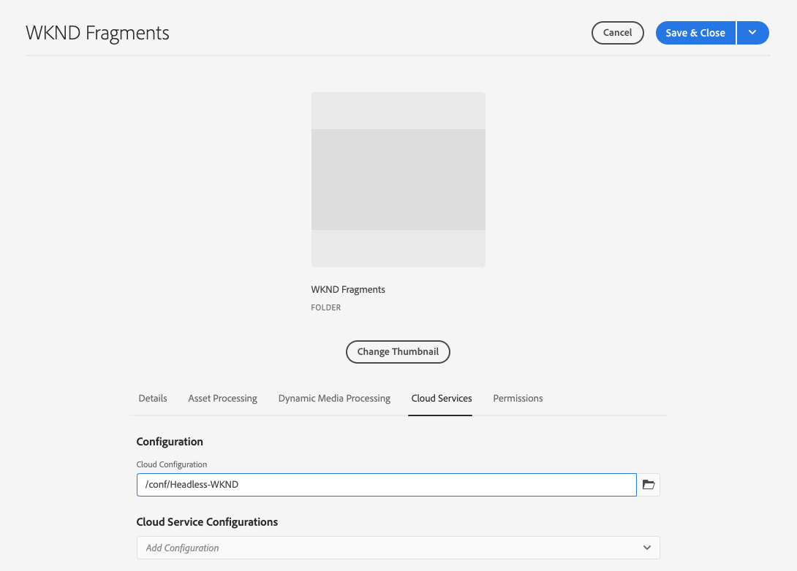

# Creazione di una cartella di risorse Guida di avvio rapido senza intestazione{#creating-an-assets-folder}

I modelli di frammenti di contenuto definiscono la struttura dei frammenti di contenuto. I frammenti di contenuto vengono quindi memorizzati nelle cartelle delle risorse.

##  Che cos’è una cartella di risorse? {#what-is-an-assets-folder}

[Dopo aver creato ](create-content-model.md) modelli di frammenti di contenuto che definiscono la struttura desiderata per i futuri frammenti di contenuto, è possibile creare alcuni frammenti.

Tuttavia dovrete prima creare una cartella di risorse in cui memorizzarle.

Le cartelle delle risorse vengono utilizzate per [organizzare risorse di contenuto tradizionali](/help/assets/manage-digital-assets.md) come immagini e video, nonché per i frammenti di contenuto.

## Come creare una cartella di risorse {#how-to-create-an-assets-folder}

Un amministratore dovrebbe creare delle cartelle solo occasionalmente per organizzare il contenuto durante la creazione. Ai fini di questa guida introduttiva, è sufficiente creare una sola cartella.

1. Accedi al AEM come Cloud Service e dal menu principale seleziona **Navigazione -> Risorse -> File**.
1. Toccate o fate clic su **Crea -> Cartella**.
1. Specificare un **Titolo** e un **Nome** per la cartella.
   * Il **Titolo** deve essere descrittivo.
   * Il **Nome** diventerà il nome del nodo nella directory archivio.
      * Verrà generato automaticamente in base al titolo e verrà modificato in base alle convenzioni di denominazione [AEM.](/help/implementing/developing/introduction/naming-conventions.md)
      * Può essere regolato se necessario.

   
1. Selezionare la cartella appena creata, quindi selezionare **Proprietà** dalla barra degli strumenti (oppure utilizzare la `p` [scelta rapida da tastiera.](/help/sites-cloud/authoring/getting-started/keyboard-shortcuts.md))
1. Nella finestra **Proprietà**, selezionare la scheda **Cloud Services**.
1. Per **Configurazione cloud** Selezionare la [configurazione creata in precedenza.](create-configuration.md)

   
1. Toccate o fate clic su **Salva e chiudi**.
1. Toccate o fate clic su **OK** nella finestra di conferma.

   

Potete creare ulteriori sottocartelle all’interno della cartella appena creata. Le sottocartelle erediteranno la **Configurazione cloud** della cartella principale. Tuttavia, questo può essere ignorato se desiderate utilizzare modelli di un’altra configurazione.

Se si utilizza una struttura del sito localizzata, è possibile [creare una radice della lingua](/help/assets/translate-assets.md) sotto la nuova cartella.

## Passaggi successivi {#next-steps}

Dopo aver creato una cartella per i frammenti di contenuto, puoi passare alla quarta parte della guida introduttiva e [creare frammenti di contenuto.](create-content-fragment.md)

>!![TIP]
Per informazioni complete sulla gestione dei frammenti di contenuto, consultare la [documentazione relativa ai frammenti di contenuto](/help/assets/content-fragments/content-fragments.md)
