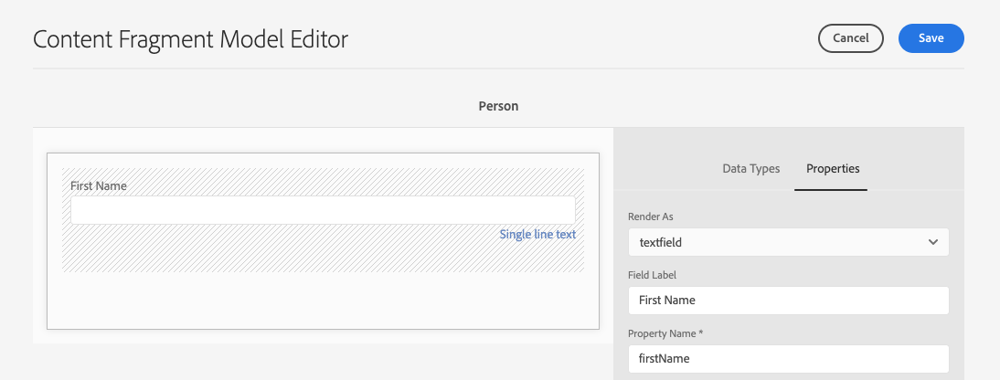

# Creazione di modelli di frammenti di contenuto Guida rapida senza titolo {#creating-content-fragment-models}

I modelli di frammento di contenuto definiscono la struttura del contenuto che verrà creato e distribuito utilizzando AEM funzionalità headless.

## Che cosa sono i modelli di frammento di contenuto? {#what-are-content-fragment-models}

[Dopo aver creato una configurazione, ](create-configuration.md) potete utilizzarla per creare modelli di frammenti di contenuto.

I modelli di frammento di contenuto definiscono la struttura dei dati e del contenuto che sarà creata e gestita in AEM. Servono come una sorta di impalcatura per i contenuti. Quando si sceglie di creare il contenuto, gli autori selezioneranno tra i modelli di frammento di contenuto definiti, che li guidano nella creazione del contenuto.

## Come creare un modello di frammento di contenuto {#how-to-create-a-content-fragment-model}

Un architetto dell&#39;informazione eseguirebbe queste attività solo sporadicamente, quando sono necessari nuovi modelli. Ai fini di questa guida introduttiva, è necessario creare un solo modello.

1. Accedi al AEM come Cloud Service e dal menu principale seleziona **Strumenti -> Risorse -> Modelli di frammenti di contenuto**.
1. Toccate o fate clic sulla cartella creata creando la configurazione.

   
1. Tocca o fai clic su **Crea**.
1. Fornire un **Titolo modello**, **Tag** e **Descrizione**. È inoltre possibile selezionare o deselezionare **Abilita modello** per controllare se il modello è immediatamente attivato al momento della creazione.

   
1. Nella finestra di conferma, toccate o fate clic su **Apri** per configurare il modello.

   
1. Utilizzando l&#39; **Editor modello frammento di contenuto**, creare il modello di frammento di contenuto trascinando e rilasciando i campi dalla colonna **Tipi di dati**.

   

1. Una volta inserito un campo, è necessario configurarne le proprietà. L&#39;editor passerà automaticamente alla scheda **Proprietà** per il campo aggiunto in cui è possibile fornire i campi obbligatori.

   
1. Al termine, toccate o fate clic su **Salva**. Il modello appena creato viene salvato in modalità **Bozza**.

   
1. Il modello deve essere abilitato per poterlo utilizzare (se non è già abilitato). Selezionare il modello appena creato, quindi toccare o fare clic su **Abilita**.

   
1. Per confermare l&#39;abilitazione del modello, toccate o fate clic su **Abilita** nella finestra di dialogo di conferma.

   
1. Il modello è ora abilitato e pronto per l&#39;uso.

   

L&#39; **Editor modello frammento di contenuto** supporta molti tipi di dati diversi, ad esempio campi di testo semplici, riferimenti di risorse, riferimenti ad altri modelli e dati JSON.

Potete creare più modelli. I modelli possono fare riferimento ad altri frammenti di contenuto. Utilizzare [configurazioni](create-configuration.md) per organizzare i modelli.

## Passaggi successivi {#next-steps}

Dopo aver definito le strutture dei frammenti di contenuto creando modelli, è possibile passare alla terza parte della guida introduttiva e [creare cartelle in cui memorizzare i frammenti stessi.](create-assets-folder.md)

>[!TIP]
>
>Per informazioni complete sui modelli di frammenti di contenuto, consultare la [Documentazione sui modelli di frammenti di contenuto](/help/assets/content-fragments/content-fragments-models.md)
