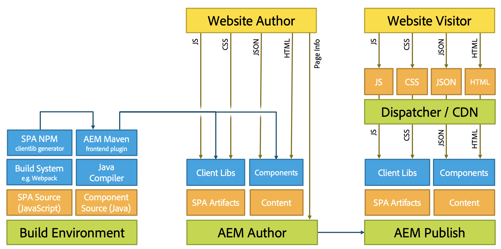

# Sviluppo di SPA per AEM {#developing-spas-for-aem}

Le applicazioni a pagina singola (SPA) possono offrire esperienze coinvolgenti agli utenti di siti web. Gli sviluppatori desiderano essere in grado di creare siti utilizzando framework SPA e gli autori desiderano modificare i contenuti all’interno di AEM per un sito creato utilizzando tali frameworks.

Questo articolo presenta questioni importanti da considerare quando si coinvolge uno sviluppatore front-end per sviluppare un SPA per l’AEM e fornisce una panoramica dell’architettura dell’AEM relativa alla diffusione dell’SPA sull’AEM.

## Principi di sviluppo dell&#39;SPA per l&#39;AEM {#spa-development-principles-for-aem}

Lo sviluppo di applicazioni a pagina singola in AEM presuppone che lo sviluppatore front-end osservi le best practice standard durante la creazione di una SPA. Se come sviluppatore front-end segui queste best practice generali e alcuni principi specifici dell’AEM, il tuo SPA funziona con [AEM e le sue funzionalità di authoring dei contenuti](introduction.md#content-editing-experience-with-spa).

* **[Portabilità](#portability)** - Come per tutti i componenti, i componenti devono essere costruiti in modo da essere il più possibile portatili. La SPA deve essere realizzata con componenti portabili e riutilizzabili.
* **[AEM definisce la struttura del sito](#aem-drives-site-structure)**: lo sviluppatore front-end crea componenti e possiede la loro struttura interna, ma si basa su AEM per definire la struttura dei contenuti del sito.
* **[Rendering dinamico](#dynamic-rendering)** - Tutto il rendering deve essere dinamico.
* **[Routing dinamico](#dynamic-routing)** - La SPA è responsabile del routing e AEM lo ascolta ed esegue il recupero in base ad esso. Anche altri routing devono essere dinamici.

Se tieni presenti questi principi durante lo sviluppo dell’SPA, diventa il più flessibile e scalabile possibile, consentendo al contempo tutte le funzionalità di authoring dell’AEM supportate.

Se non è necessario supportare le funzioni di creazione dell’AEM, considera un’opzione [Modello di progettazione SPA](#spa-design-models).

### Portabilità {#portability}

Come per qualsiasi altro componente, i componenti devono essere progettati in modo da massimizzarne la portabilità. È necessario evitare qualsiasi modello che possa compromettere la portabilità o la riutilizzabilità dei componenti per garantire compatibilità, flessibilità e manutenibilità in futuro.

Il SPA risultante dovrebbe essere costruito con componenti altamente portatili e riutilizzabili.

### Struttura del sito di guida AEM {#aem-drives-site-structure}

Lo sviluppatore front-end deve considerarsi responsabile della creazione di una libreria di componenti SPA utilizzati per creare l’app. Lo sviluppatore front-end ha il pieno controllo della struttura interna dei componenti. [Tuttavia, l&#39;AEM è sempre il proprietario della struttura del sito](editor-overview.md).

Questo controllo significa che lo sviluppatore front-end può aggiungere contenuto del cliente prima o dopo il punto di ingresso dei componenti e può anche effettuare una chiamata di terze parti all’interno del componente. Tuttavia, lo sviluppatore front-end non ha il pieno controllo, ad esempio, del modo in cui i componenti vengono nidificati.

### Rendering dinamico {#dynamic-rendering}

L’SPA deve basarsi solo sul rendering dinamico dei contenuti. Questa aspettativa è l’impostazione predefinita in cui l’AEM recupera ed esegue il rendering di tutti gli elementi secondari della struttura del contenuto.

Qualsiasi rendering esplicito che punti a contenuti specifici viene considerato come rendering statico e, sebbene supportato, è compatibile con le funzioni di authoring dei contenuti dell’AEM. Inoltre, essa viola il principio di [portabilità](#portability).

### Routing dinamico {#dynamic-routing}

Come per il rendering, anche tutte le operazioni di instradamento devono essere dinamiche. Nell&#39;AEM, [l&#39;SPA deve essere sempre proprietario dell&#39;instradamento](routing.md) e l’AEM lo ascolta e ne recupera i contenuti in base a esso.

Qualsiasi instradamento statico funziona rispetto al [principio di portabilità](#portability) e limita l’autore in quanto non è compatibile con le funzioni di authoring dei contenuti dell’AEM. Ad esempio, con il routing statico, se l’autore di contenuto desidera modificare un percorso o una pagina, deve chiedere allo sviluppatore front-end di farlo.

## Archetipo progetto AEM {#aem-project-archetype}

Qualsiasi progetto AEM deve utilizzare l’[archetipo di progetto AEM](https://experienceleague.adobe.com/docs/experience-manager-core-components/using/developing/archetype/overview.html?lang=it), che supporta progetti SPA utilizzando React o Angular e sfrutta l’SDK di SPA.

## Modelli di progettazione SPA {#spa-design-models}

Se il [Principi per lo sviluppo dell&#39;SPA nell&#39;AEM](#spa-development-principles-for-aem) sono seguiti, quindi l’SPA funziona con tutte le funzioni di authoring dei contenuti AEM supportate.

In alcuni casi, tuttavia, questa funzionalità non è del tutto necessaria. Nella tabella seguente viene fornita una panoramica dei vari modelli di progettazione, dei vantaggi e degli svantaggi.

<table>
 <tbody>
  <tr>
   <th><strong>Modello di progettazione  </strong></th>
   <th><strong>Vantaggi</strong></th>
   <th><strong>Svantaggi</strong></th>
  </tr>
  <tr>
   <td>L’AEM viene utilizzato come CMS headless senza utilizzare <a href="/help/implementing/developing/hybrid/reference-materials.md">Framework SDK dell’editor SPA.</a></td>
   <td>Lo sviluppatore front-end ha il pieno controllo dell’app.</td>
   <td>
Gli autori dei contenuti non possono utilizzare l’esperienza di authoring dei contenuti AEM.
 
Il codice non è portatile né riutilizzabile se contiene riferimenti statici o di routing.
 
Non consente l’utilizzo dell’editor di modelli, pertanto lo sviluppatore front-end deve mantenere i modelli modificabili tramite JCR.
 </td>
  </tr>
  <tr>
   <td>Lo sviluppatore front-end utilizza il framework SDK dell’editor SPA, ma apre solo alcune aree all’autore di contenuto.</td>
   <td>Lo sviluppatore mantiene il controllo sull’app abilitando l’authoring solo nelle aree limitate dell’app.</td>
   <td>
Gli autori dei contenuti sono limitati a un set limitato di esperienze di authoring dei contenuti AEM.
 
Il codice rischia di non essere portatile o riutilizzabile se contiene riferimenti statici o routing.
 
Non consente l’utilizzo dell’editor di modelli, pertanto lo sviluppatore front-end deve mantenere i modelli modificabili tramite JCR.
 </td>
  </tr>
  <tr>
   <td>Il progetto utilizza appieno l’SDK dell’editor dell’SPA e i componenti front-end vengono sviluppati come una libreria e la struttura del contenuto dell’app viene delegata all’AEM.</td>
   <td>
L’app è riutilizzabile e portatile.
 
L’autore del contenuto può modificare l’app utilizzando l’esperienza di authoring dei contenuti AEM.  
 
L’SPA è compatibile con l’editor di modelli.
 </td>
   <td>
Lo sviluppatore non ha il controllo della struttura dell’app e della parte di contenuto delegata all’AEM.
 
Lo sviluppatore può comunque riservare alcune aree dell’app per i contenuti che non devono essere creati con l’AEM.
 </td>
  </tr>
 </tbody>
</table>

>[!NOTE]
>
>Sebbene tutti i modelli siano supportati dall’AEM, solo implementando il terzo (e seguendo i [Principi di sviluppo SPA](#spa-development-principles-for-aem)) sono gli autori di contenuti in grado di interagire con il contenuto dell’SPA nell’AEM e di modificarlo.

## Migrazione dall’SPA esistente all’AEM {#migrating-existing-spas-to-aem}

Generalmente, se l’SPA segue le [Principi di sviluppo dell&#39;SPA per l&#39;AEM](#spa-development-principles-for-aem), quindi l’SPA funziona nell’AEM ed è modificabile utilizzando l’editor AEM SPA.

Segui questi passaggi per preparare il tuo SPA esistente a lavorare con l’AEM.

1. **Rendi i componenti JS modulari.** - Renderli in grado di essere renderizzati in qualsiasi ordine, posizione e dimensione.
1. **Utilizza i contenitori forniti dall’SDK per posizionare i componenti sullo schermo.** - L’AEM fornisce un componente per il sistema di pagine e paragrafi da utilizzare.
1. **Crea un componente AEM per ogni componente JS.** - I componenti AEM definiscono la finestra di dialogo e l’output JSON.

## Istruzioni per sviluppatori front-end {#instructions-for-front-end-developers}

Il compito principale nel coinvolgere uno sviluppatore front-end per creare un SPA per l’AEM è quello di concordare i componenti e i relativi modelli JSON.

Di seguito è riportato uno schema dei passaggi che uno sviluppatore front-end deve seguire quando sviluppa un SPA per l’AEM.

1. **Concordare i componenti e il relativo modello JSON**

   Gli sviluppatori front-end e gli sviluppatori back-end dell’AEM devono concordare i componenti necessari e un modello, in modo da garantire una corrispondenza uno-a-uno tra i componenti SPA e i componenti back-end.

   I componenti AEM sono ancora necessari soprattutto per fornire finestre di dialogo di modifica ed esportare il modello di componente.

1. **Nei componenti React, accedi al modello tramite`this.props.cqModel`**

   Una volta concordati i componenti e impostato il modello JSON, lo sviluppatore front-end è libero di sviluppare l’SPA e può semplicemente accedere al modello JSON tramite `this.props.cqModel`.

1. **Implementare i `render()` metodo**

   Lo sviluppatore front-end implementa `render()` e può utilizzare i campi della sezione `cqModel` proprietà. Questo metodo restituisce i frammenti DOM e HTML inseriti nella pagina. Questo metodo è anche il metodo standard per creare un’app in React.

1. **Mappare il componente al tipo di risorsa AEM tramite`MapTo()`**

   Il mapping memorizza le classi dei componenti e viene utilizzato internamente dal `Container` per recuperare e creare un’istanza dinamica dei componenti in base al tipo di risorsa specificato.

   Questa mappa funge da &quot;colla&quot; tra front-end e back-end in modo che l’editor sappia a quali componenti corrispondono i componenti di reazione.

   Il `Page` e `ResponsiveGrid` sono buoni esempi di classi che estendono la base `Container`.

1. **Definire il `EditConfig` come parametro per`MapTo()`**

   Questo parametro è necessario per indicare all’editor come deve essere denominato il componente, purché non sia ancora stato eseguito il rendering o non sia presente alcun contenuto da riprodurre.

1. **Estendi il fornito `Container` classe per pagine e contenitori**

   I sistemi di pagine e paragrafi devono estendere questa classe in modo che la delega ai componenti interni funzioni come previsto.

1. **Implementare una soluzione di routing che utilizzi HTML5 `History` API.**

   Quando `ModelRouter` è abilitato, chiamando il `pushState` e `replaceState` le funzioni attivano una richiesta al `PageModelManager` per recuperare un frammento mancante del modello.

   La versione corrente di `ModelRouter` supporta solo l’utilizzo di URL che puntano al percorso effettivo delle risorse dei punti di ingresso del modello Sling. Non supporta l’utilizzo di URL personalizzati o alias.

   Il `ModelRouter` può essere disabilitato o configurato per ignorare un elenco di espressioni regolari.

## AEM-agnostico {#aem-agnostic}

Questi blocchi di codice illustrano in che modo i componenti React e Angular non hanno bisogno di nulla che sia specifico per Adobe o AEM.

* Tutto ciò che si trova all’interno del componente JavaScript è indipendente dall’AEM.
* Ciò che è specifico per l’AEM, tuttavia, è che il componente JS deve essere mappato su un componente AEM con l’helper MapTo.

Il `MapTo` helper è la &quot;colla&quot; che consente di abbinare i componenti back-end e front-end:

* Indica al contenitore JS (o al sistema paragrafo JS) quale componente JS è responsabile del rendering di ciascuno dei componenti presenti nel JSON.
* Aggiunge un attributo di dati HTML al HTML di cui viene eseguito il rendering del componente JS, in modo che l’editor SPA sappia quale finestra di dialogo visualizzare per l’autore quando modifica il componente.

Per ulteriori informazioni sull&#39;utilizzo di `MapTo` e la creazione dell’SPA per l’AEM in generale, consulta la Guida introduttiva per il framework scelto.

* [Guida introduttiva dell’SPA nell’AEM con React](getting-started-react.md)
* [Guida introduttiva dell’SPA nell’AEM con l’uso di Angular](getting-started-angular.md)

## Architettura e SPA del AEM {#aem-architecture-and-spas}

L’architettura generale dell’AEM, compresi gli ambienti di sviluppo, authoring e pubblicazione, non cambia quando si utilizza l’SPA. Tuttavia, è utile capire in che modo lo sviluppo dell’SPA si inserisce in questa architettura.

* **Ambiente di build**

  In questo ambiente viene eseguito il check-out dell&#39;origine dell&#39;applicazione SPA e dell&#39;origine dei componenti.

   * Il generatore clientlib NPM crea una libreria client dal progetto SPA.
   * Tale libreria viene presa da Maven e implementata dal plug-in Maven Build insieme al componente nell’istanza di authoring dell’AEM.

* **Autore AEM**

  I contenuti vengono creati nell’autore dell’AEM, inclusa la creazione dell’SPA.

  Quando si modifica un SPA utilizzando l’Editor SPA nell’ambiente di authoring:

   1. L&#39;SPA richiede il HTML esterno.
   1. CSS caricato.
   1. Viene caricato il JavaScript dell’applicazione SPA.
   1. Quando viene eseguita l’applicazione SPA, viene richiesto il JSON, che consente all’app di creare il DOM della pagina, incluso `cq-data` attributi.
   1. Il `cq-data` gli attributi consentono all’editor di caricare informazioni di pagina aggiuntive in modo che possa sapere quali configurazioni di modifica sono disponibili per i componenti.

* **Pubblicazione AEM**

  Dove i contenuti creati e le librerie compilate, inclusi gli artefatti dell’applicazione SPA, le librerie client e i componenti, vengono pubblicati per il consumo pubblico.

* **Dispatcher/CDN**

  Dispatcher funge da livello di caching dell’AEM per i visitatori del sito.
   * Le richieste vengono elaborate in modo simile a come si trovano nell’istanza di authoring dell’AEM. Tuttavia, non vi è alcuna richiesta di informazioni della pagina, perché sono necessarie solo dall’editor.
   * JavaScript, CSS, JSON e HTML sono memorizzati nella cache, ottimizzando la pagina per una consegna rapida.

>[!NOTE]
>
>All’interno dell’AEM, non è necessario eseguire meccanismi di sviluppo JavaScript né eseguire JavaScript stesso. L’AEM ospita solo gli artefatti compilati dell’applicazione SPA.

## Passaggi successivi {#next-steps}

* [Guida introduttiva dell’SPA nell’AEM con React](getting-started-react.md) mostra come viene creato un SPA di base per l’utilizzo dell’Editor SPA nell’AEM utilizzando React.
* [Guida introduttiva dell’SPA nell’AEM con Angular](getting-started-angular.md) mostra come un SPA di base viene creato per funzionare con l’Editor SPA nell’AEM utilizzando Angular.
* La [Panoramica dell’editor di SPA](editor-overview.md) approfondisce il modello di comunicazione tra AEM e SPA.
* [Progetto WKND SPA](wknd-tutorial.md) è un tutorial dettagliato sull’implementazione di un semplice progetto SPA nell’AEM.
* [Mappatura di un modello dinamico a un componente per SPA](model-to-component-mapping.md) spiega il modello dinamico alla mappatura dei componenti e come funziona all’interno dell’SPA nell’AEM.
* [Blueprint SPA](blueprint.md) offre un approfondimento sul funzionamento dell’SDK dell’SPA per l’AEM nel caso in cui si desideri implementare l’SPA nell’AEM per un framework diverso da React o Angular. Oppure, vorresti semplicemente una comprensione più profonda.
