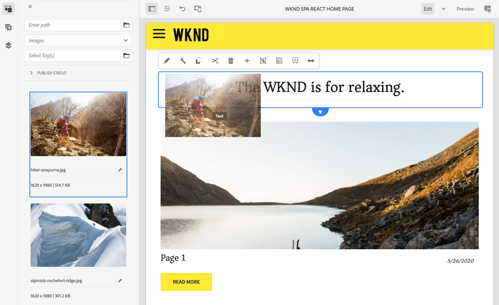
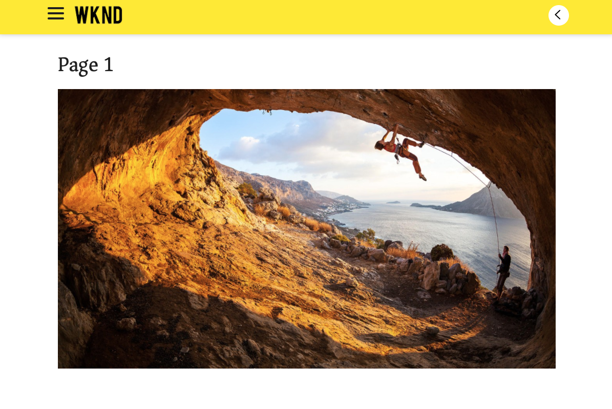
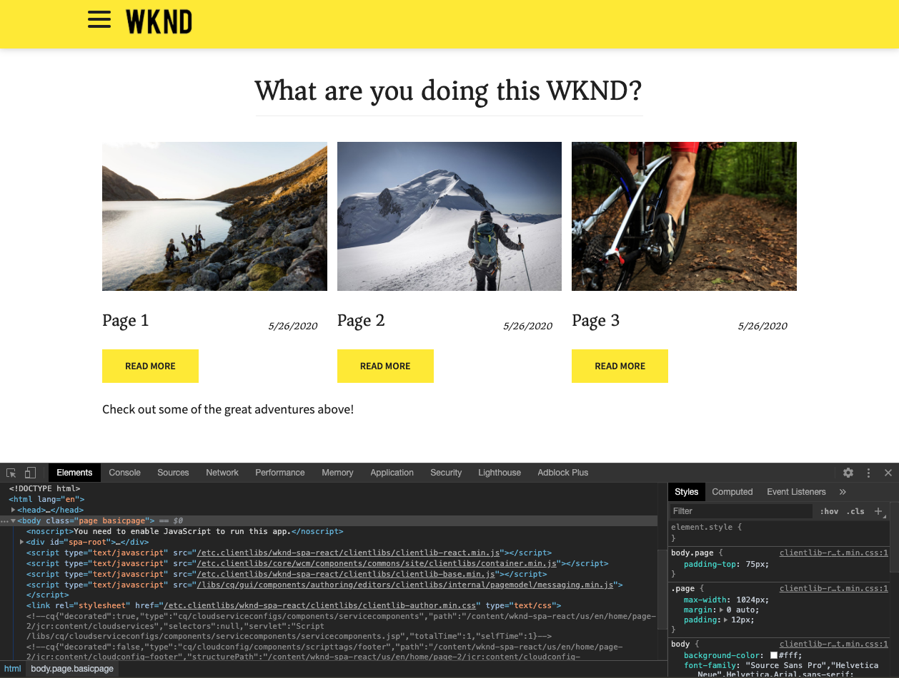

# Introduzione alla SPA e procedura dettagliata {#spa-introduction}

Le applicazioni a pagina singola (SPA) possono offrire esperienze coinvolgenti agli utenti di siti web. Gli sviluppatori desiderano essere in grado di creare siti utilizzando framework SPA e gli autori desiderano modificare i contenuti all’interno di AEM per un sito creato utilizzando tali frameworks.

L’editor di SPA offre una soluzione completa per il supporto di SPA in AEM. Questo articolo illustra l’utilizzo di un’applicazione di SPA di base per l’authoring e illustra come si relaziona con l’editor di SPA di AEM sottostante.

{{ue-over-spa}}

## Introduzione {#introduction}

### Obiettivo dell’articolo {#article-objective}

Questo articolo introduce i concetti di base delle SPA prima di guidare il lettore attraverso una procedura dettagliata dell’editor di SPA utilizzando una semplice applicazione SPA per illustrare la modifica dei contenuti di base. Viene quindi descritto come creare la pagina e come l’applicazione SPA si relaziona e interagisce con l’editor di SPA di AEM.

L’obiettivo di questa introduzione e di questa procedura dettagliata è dimostrare a uno sviluppatore AEM perché le SPA sono rilevanti, come funzionano in generale, come una SPA viene gestita dall’editor di SPA AEM e come si differenzia da un’applicazione AEM standard.

## Requisiti {#requirements}

La procedura dettagliata si basa sulle funzionalità di AEM standard e sull’app di esempio del progetto SPA WKND. Per seguire questa procedura dettagliata, è necessario disporre dei seguenti elementi.

* [Il più recente SDK di sviluppo di AEMaaCS](/help/release-notes/release-notes-cloud/release-notes-current.md)
   * Dovrebbe funzionare come ambiente di sviluppo locale.
   * Devi disporre dei diritti di amministratore del sistema.
* [L’app di esempio del progetto SPA WKND disponibile su GitHub](https://github.com/adobe/aem-guides-wknd-spa)
   * Scarica l’[ultima versione dell’app React](https://github.com/adobe/aem-guides-wknd-spa/releases) con nome simile a `wknd-spa-react.all-X.Y.Z-SNAPSHOT.zip`.
   * Scarica le [immagini di esempio più recenti per l’app](https://github.com/adobe/aem-guides-wknd-spa/releases) con nome simile a `wknd-spa-sample-images-X.Y.Z.zip`.
   * [Utilizza il gestore di pacchetti](/help/implementing/developing/tools/package-manager.md) per installare entrambi i pacchetti come faresti con qualsiasi altro pacchetto in AEM.
   * Ai fini della procedura dettagliata, non è necessario installare l’app tramite Maven.

>[!CAUTION]
>
>Questo documento utilizza l’[app del progetto SPA WKND](https://github.com/adobe/aem-guides-wknd-spa) solo a scopo dimostrativo. Non utilizzarlo per alcun lavoro di progetto.

>[!TIP]
>
>Qualsiasi progetto AEM deve utilizzare l’[archetipo di progetto AEM](https://experienceleague.adobe.com/docs/experience-manager-core-components/using/developing/archetype/overview.html?lang=it), che supporta progetti SPA utilizzando React o Angular e sfrutta l’SDK di SPA.

### Cos’è una SPA? {#what-is-a-spa}

Un’applicazione a pagina singola (SPA) è diversa da una pagina convenzionale in quanto viene sottoposta a rendering lato client ed è principalmente basata su Javascript, utilizzando le chiamate Ajax per caricare i dati e aggiornare dinamicamente la pagina. La maggior parte o tutto il contenuto viene recuperato una volta nel caricamento di una singola pagina con risorse aggiuntive caricate in modo asincrono in base alle esigenze, a seconda dell’interazione dell’utente con la pagina.

Questo riduce la necessità di aggiornare le pagine e offre all’utente un’esperienza caratterizzata da fluidità e rapidità, che si rivela più simile all’esperienza assicurata da un’app nativa.

L’editor AEM di SPA consente agli sviluppatori front-end di creare SPA che possono essere integrate in un sito AEM, permettendo agli autori dei contenuti di modificare il contenuto delle SPA con la stessa facilità con cui sono modificati altri contenuti AEM.

### Perché una SPA? {#why-a-spa}

Essendo più veloce, fluida e più simile a un’applicazione nativa, una SPA diventa un’esperienza molto piacevole non solo per il visitatore della pagina web, ma anche per gli esperti di marketing e gli sviluppatori grazie al tipo di funzionamento delle SPA.

#### Visitatori {#visitors}

* I visitatori desiderano esperienze di tipo nativo quando interagiscono con i contenuti.
* È dimostrato che più veloce sarà una pagina, più probabile sarà una conversione.

#### Persone addette al marketing {#marketers}

* Le persone addette al marketing desiderano offrire esperienze avanzate e di tipo nativo per invitare la clientela a interagire pienamente con i contenuti.
* La personalizzazione può rendere queste esperienze ancora più coinvolgenti.

#### Sviluppatori {#developers}

* Gli sviluppatori vogliono una netta separazione delle competenze tra contenuti e presentazioni.
* Una separazione pulita rende il sistema più estensibile e consente uno sviluppo front-end indipendente.

### Come funziona una SPA? {#how-does-a-spa-work}

L’idea principale alla base di SPA è che le chiamate verso e la dipendenza da un server vengono diminuite al fine di ridurre al minimo i ritardi causati dalla latenza del server, in modo che la SPA si avvicini alla reattività di un’applicazione nativa.

In una pagina web tradizionale sequenziale, vengono caricati solo i dati necessari per la pagina immediata. Questo significa che quando l&#39;utente si sposta su un’altra pagina, il server viene chiamato per le risorse aggiuntive. Potrebbero essere necessarie chiamate aggiuntive mentre l&#39;utente interagisce con gli elementi della pagina. Queste chiamate multiple possono dare una sensazione di attesa o ritardo in quanto la pagina deve soddisfare le richieste dell&#39;utente.

Per un’esperienza più fluida, che si avvicina a ciò che l&#39;utente si aspetta dalle app native per dispositivi mobili, una SPA carica tutti i dati necessari all&#39;utente al primo caricamento. Anche se l’operazione inizialmente potrebbe richiedere un po’ più di tempo, elimina la necessità di chiamate server aggiuntive.

Effettuando il rendering sul lato client, gli elementi di pagina reagiscono più rapidamente e le interazioni con la pagina da parte del visitatore sono immediate. Eventuali dati aggiuntivi che potrebbero essere necessari vengono chiamati in modo asincrono per massimizzare la velocità della pagina.

>[!TIP]
>
>Per informazioni tecniche sul funzionamento delle SPA in AEM, consulta gli articoli:
>
>* [Guida introduttiva alle SPA in AEM usando React](getting-started-react.md)
>* [Guida introduttiva alle SPA in AEM che usano Angular](getting-started-angular.md)
>
>Per un’analisi più approfondita della progettazione, dell’architettura e del flusso di lavoro tecnico dell’editor di SPA, consulta l’articolo:
>
>* [Panoramica dell’editor di SPA](editor-overview.md).

## Esperienza di modifica dei contenuti con SPA {#content-editing-experience-with-spa}

Quando viene creata una SPA per usare l’editor SPA di AEM, chi crea il contenuto non nota alcuna differenza durante la modifica e la creazione di contenuti. È disponibile una funzionalità AEM comune e non è necessaria alcuna modifica al flusso di lavoro dell’autore.

1. Modifica l’app del progetto SPA WKND in AEM.

   `http://localhost:4502/editor.html/content/wknd-spa-react/us/en/home.html`

   

1. Seleziona un componente testo e osserva che la barra degli strumenti è simile a quella di qualsiasi altro componente. Seleziona **Modifica**.

   

1. Modifica il contenuto come normale in AEM e osserva che le modifiche sono persistenti.

   

1. Utilizza il browser Risorse per trascinare una nuova immagine in un componente immagine.

   

1. La modifica viene mantenuta.

   

Sono supportati ulteriori strumenti di authoring, come il trascinamento e il rilascio di componenti aggiuntivi sulla pagina, la ridisposizione dei componenti e la modifica del layout, come in qualsiasi applicazione AEM non SPA.

>[!NOTE]
>
>L’editor di SPA non modifica il DOM dell’applicazione. La stessa SPA è responsabile del DOM.
>
>Per vedere come funziona, continua con la sezione successiva di questo articolo [App SPA ed editor di SPA AEM](#spa-apps-and-the-aem-spa-editor).

## App SPA ed editor di SPA AEM {#spa-apps-and-the-aem-spa-editor}

L&#39;esperienza del comportamento di un&#39;applicazione a pagina singola per l&#39;utente e la successiva ispezione della pagina dell&#39;applicazione a pagina singola consentono di comprendere meglio il funzionamento di un&#39;app SAP con l&#39;editor di applicazioni a pagina singola in AEM.

### Utilizzo di un’applicazione SPA {#using-an-spa-application}

1. Carica l’applicazione del progetto SPA WKND sul server di pubblicazione o utilizzando l’opzione **Visualizza come pubblicato** dal menu **Informazioni pagina** nell’editor di pagina.

   `http://<host>:<port>/content/wknd-spa-react/us/en/home.html`

   

   Osserva la struttura delle pagine, inclusa la navigazione verso pagine secondarie, menu e schede articolo.

1. Passa a una pagina secondaria utilizzando il menu e controlla che la pagina venga caricata immediatamente senza la necessità di un aggiornamento.

   

1. Apri gli strumenti di sviluppo incorporati del browser e monitora l’attività di rete mentre navighi nelle pagine secondarie.

   

   C’è molto poco traffico mentre passi da una pagina all’altra nell’app. La pagina non viene ricaricata e vengono richieste solo le nuove immagini.

   La SPA gestisce il contenuto e il routing interamente sul lato client.

Quindi, se la pagina non viene ricaricata durante la navigazione tra le pagine secondarie, come viene caricata?

La sezione successiva, [Caricamento di un’applicazione SPA](#loading-a-spa-application), approfondisce la procedura di caricamento della SPA e spiega come caricare il contenuto in modo sincrono e asincrono.

### Caricamento di un’applicazione SPA {#loading-a-spa-application}

1. Se non è già stata caricata, carica l’app del progetto SPA WKND sul server di pubblicazione o utilizzando l’opzione **Visualizza come pubblicato** dal menu **Informazioni pagina** nell’editor pagina.

   `http://<host>:<port>/content/wknd-spa-react/us/en/home.html`

   

1. Utilizza lo strumento incorporato del browser per visualizzare l’origine della pagina.
1. Il contenuto della sorgente è limitato.
   * La pagina non ha alcun contenuto all’interno del corpo. È composta principalmente da fogli di stile e da una chiamata a vari script come `clientlib-react.min.js`.
   * Questi script sono i driver primari di questa applicazione e sono responsabili del rendering di tutti i contenuti.

1. Utilizza gli strumenti incorporati del browser per ispezionare la pagina. Visualizza il contenuto del DOM completamente caricato.

   

1. Passa alla scheda Rete in Ispettore e ricarica la pagina.

   Le richieste di immagini vengono ignorate. Nota che le risorse principali caricate per la pagina sono la pagina stessa, il CSS, il JavaScript di React, le sue dipendenze e i dati JSON per la pagina.

   

1. Carica il `home.model.json` in una nuova scheda.

   `http://<host>:<port>/content/wknd-spa-react/us/en/home.model.json`

   

   L’editor SPA AEM sfrutta [AEM Content Services](/help/sites-cloud/administering/content-fragments/overview.md#content-fragments-and-content-services) per distribuire l’intero contenuto della pagina come un modello JSON.

   Implementando interfacce specifiche, i modelli Sling forniscono le informazioni necessarie alla SPA. La distribuzione dei dati JSON viene delegata verso il basso a ciascun componente (dalla pagina, al paragrafo, al componente, e così via).

   Ogni componente sceglie cosa esporre e come riprodurlo (lato server con HTL o lato client con React o Angular). Questo articolo si concentra sul rendering lato client con React.

1. Il modello può anche raggruppare le pagine in modo che vengano caricate in modo sincrono, riducendo il numero di ricaricamenti di pagina necessari.

   Nell’esempio dell’app del progetto SPA WKND, le pagine `home`, `page-1`, `page-2` e `page-3` vengono caricate in modo sincrono, in quanto le persone solitamente visitano tutte le pagine.

   Questo comportamento non è obbligatorio ed è completamente definibile.

   

1. Per visualizzare questa differenza di comportamento, ricaricare la pagina `home` e cancellare l’attività di rete dell’ispettore. Passa a `page-1` nel menu della pagina e osserva che l’unica attività di rete è una richiesta dell’immagine di `page-1`. Non è necessario caricare `page-1`.

   

### Interazione con l’editor SPA {#interaction-with-the-spa-editor}

Utilizzando l’applicazione di esempio per progetti SPA WKND, è chiaro come si comporta l’app e come viene caricata quando viene pubblicata, utilizzando servizi per contenuti per la distribuzione di contenuti JSON e il caricamento asincrono delle risorse.

Inoltre, per l’autore di contenuti, la creazione di contenuti tramite un editor SPA avviene direttamente all’interno di AEM.

Nella sezione seguente esploreremo il contratto che consente all’editor di SPA di relazionare i componenti all’interno della SPA con i componenti AEM e ottenere questa esperienza di editing perfetta.

1. Caricare l’applicazione del progetto SPA WKND nell’editor e passare alla modalità **Anteprima**.

   `http://<host>:<port>/editor.html/content/wknd-spa-react/us/en/home.html`

1. Utilizzando gli strumenti di sviluppo incorporati nel browser, esamina il contenuto della pagina. Con lo strumento di selezione, selezionare un componente modificabile nella pagina e visualizzare i dettagli dell’elemento.

   Il componente ha un nuovo attributo dati `data-cq-data-path`.

   

   Per esempio

   `data-cq-data-path="/content/wknd-spa-react/us/en/home/jcr:content/root/responsivegrid/text`

   Questo percorso consente il recupero e l’associazione dell’oggetto di modifica del contesto di configurazione di ciascun componente.

   Questo è l’unico attributo di markup necessario affinché l’editor riconosca questo come componente modificabile all’interno della SPA. In base a questo attributo, l’editor SPA determinerà la configurazione modificabile associata al componente, in modo che vengano caricati il frame, la barra degli strumenti e così via corretti.

   Vengono inoltre aggiunti alcuni nomi di classe specifici per contrassegnare i segnaposto e per la funzionalità di trascinamento della risorsa.

   >[!NOTE]
   >
   >Questo comportamento è diverso dalle pagine di cui è stato eseguito il rendering lato server in AEM, dove è presente un elemento `cq` per ogni componente modificabile.
   >
   >Questo approccio nell’editor di SPA elimina la necessità di inserire elementi personalizzati, basandosi solo su un attributo di dati aggiuntivo e semplificando il markup per lo sviluppatore front-end.

## Headful e headless in AEM {#headful-headless}

Le SPA possono essere abilitate con livelli flessibili di integrazione all’interno di AEM, comprese le SPA sviluppate e mantenute al di fuori di AEM. Inoltre, le applicazioni a pagina singola possono essere utilizzate all’interno di AEM, utilizzando al contempo AEM per distribuire contenuti ad endpoint aggiuntivi in modo headless.

>[!TIP]
>
>Per saperne di più, consulta il documento [Headful e headless in AEM](/help/implementing/developing/headful-headless.md).

## Passaggi successivi {#next-steps}

Ora che è chiara l’esperienza di modifica SPA in AEM e come una SPA si relaziona con l’editor di SPA, approfondisci ulteriormente il modo in cui viene creata una SPA.

* [Guida introduttiva a SPA in AEM usando React](getting-started-react.md) mostra come viene creata una SPA di base per lavorare con l’editor SPA in AEM utilizzando React
* [Guida introduttiva alla SPA in AEM usando Angular](getting-started-angular.md) mostra come viene creata una SPA di base per lavorare con l’editor SPA in AEM utilizzando Angular
* La [Panoramica dell’editor di SPA](editor-overview.md) approfondisce il modello di comunicazione tra AEM e SPA.
* [Sviluppo di SPA per AEM](developing.md) descrive come coinvolgere gli sviluppatori front-end nello sviluppo di una SPA per AEM e come le SPA interagiscono con l’architettura di AEM.
