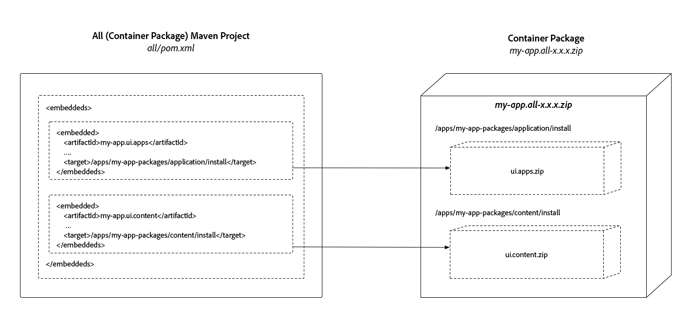

# Struttura dei progetti AEM

>[!TIP]
>
>Acquisisci familiarità con [AEM Project Archetype use](https://experienceleague.adobe.com/it/docs/experience-manager-core-components/using/developing/archetype/overview) di base e con [FileVault Content Maven Plug-in](/help/implementing/developing/tools/maven-plugin.md), in quanto questo articolo si basa su questi concetti e conoscenze.

Questo articolo illustra le modifiche necessarie affinché i progetti Adobe Experience Manager Maven siano compatibili con AEM as a Cloud Service, garantendo che rispettino la suddivisione dei contenuti mutabili e immutabili. Inoltre, le dipendenze vengono stabilite per creare distribuzioni deterministiche non in conflitto e vengono inserite in una struttura distribuibile.

Le distribuzioni delle applicazioni AEM devono essere composte da un singolo pacchetto AEM. A sua volta, questo pacchetto deve contenere pacchetti secondari che comprendono tutto ciò che l’applicazione richiede per funzionare, inclusi il codice, la configurazione e qualsiasi contenuto di base di supporto.

AEM richiede una separazione di **contenuto** e **codice**, il che significa che un singolo pacchetto di contenuti **non può** essere distribuito a **entrambe** `/apps` e aree scrivibili di runtime (ad esempio, `/content`, `/conf`, `/home` o a qualsiasi elemento diverso da `/apps`) dell&#39;archivio. Al contrario, l’applicazione deve separare codice e contenuto in pacchetti discreti da distribuire in AEM.

La struttura del pacchetto descritta in questo documento è compatibile **sia** con le distribuzioni di sviluppo locali che con le distribuzioni di AEM Cloud Service.

>[!TIP]
>
>Le configurazioni descritte in questo documento sono fornite da [AEM Project Maven Archetype 24 o versione successiva](https://github.com/adobe/aem-project-archetype/releases).

## Aree mutabili e immutabili dell’archivio {#mutable-vs-immutable}

Le aree `/apps` e `/libs` di AEM sono considerate **immutabili** perché non possono essere modificate (create, aggiornate, eliminate) dopo l&#39;avvio di AEM (ovvero in fase di runtime). Qualsiasi tentativo di modificare un’area immutabile in fase di runtime non riesce.

Tutte le altre aree del repository, `/content`, `/conf`, `/var`, `/etc`, `/oak:index`, `/system`, `/tmp` e così via, sono tutte **mutabili**, il che significa che possono essere modificate in fase di esecuzione.

>[!WARNING]
>
>Come nelle versioni precedenti di AEM, `/libs` non deve essere modificato. Solo il codice prodotto AEM può essere distribuito a `/libs`.

### Indici Oak {#oak-indexes}

Gli indici Oak (`/oak:index`) sono gestiti dal processo di distribuzione di AEM as a Cloud Service. Il motivo è che Cloud Manager deve attendere che venga distribuito e completamente reindicizzato un nuovo indice prima di passare alla nuova immagine del codice.

Per questo motivo, anche se gli indici Oak sono modificabili in fase di esecuzione, devono essere distribuiti come codice in modo che possano essere installati prima di installare eventuali pacchetti modificabili. Pertanto `/oak:index` configurazioni fanno parte del pacchetto codice e non del pacchetto contenuto [come descritto di seguito](#recommended-package-structure).

>[!TIP]
>
>Per ulteriori dettagli sull&#39;indicizzazione in AEM as a Cloud Service, vedere [Ricerca e indicizzazione dei contenuti](/help/operations/indexing.md).

## Struttura consigliata dei pacchetti {#recommended-package-structure}


Questo diagramma fornisce una panoramica della struttura di progetto e degli artefatti di distribuzione dei pacchetti consigliati.

La struttura consigliata per la distribuzione delle applicazioni è la seguente:

### Pacchetti codice/Bundle OSGi

+ Il file Jar del bundle OSGi viene generato e incorporato direttamente nel progetto all.

+ Il pacchetto `ui.apps` contiene tutto il codice da distribuire e distribuisce solo in `/apps`. Gli elementi comuni del pacchetto `ui.apps` includono, ma non sono limitati a:
   + [Definizioni dei componenti e script HTL](https://experienceleague.adobe.com/it/docs/experience-manager-htl/content/overview)
      + `/apps/my-app/components`
   + JavaScript e CSS (tramite [Librerie client](/help/implementing/developing/introduction/clientlibs.md))
      + `/apps/my-app/clientlibs`
   + [Sovrapposizioni](/help/implementing/developing/introduction/overlays.md) di `/libs`
      + `/apps/cq`, `/apps/dam/` e così via.
   + Configurazioni in base al contesto di fallback
      + `/apps/settings`
   + ACL (autorizzazioni)
      + Qualsiasi `rep:policy` per qualsiasi percorso in `/apps`
   + [Script in bundle precompilati](https://experienceleague.adobe.com/docs/experience-manager-core-components/using/developing/archetype/precompiled-bundled-scripts.html)

>[!NOTE]
>
>Lo stesso codice deve essere distribuito in tutti gli ambienti. Questo codice garantisce un livello di affidabilità tale che anche le convalide nell’ambiente di staging siano in produzione. Per ulteriori informazioni, vedere la sezione relativa a [Modalità di esecuzione](/help/implementing/deploying/overview.md#runmodes).


### Pacchetti di contenuti

+ Il pacchetto `ui.content` contiene tutto il contenuto e la configurazione. Il pacchetto di contenuto contiene tutte le definizioni dei nodi non presenti nei pacchetti `ui.apps` o `ui.config` o, in altre parole, qualsiasi elemento non presente in `/apps` o `/oak:index`. Gli elementi comuni del pacchetto `ui.content` includono, ma non sono limitati a:
   + Configurazioni in base al contesto
      + `/conf`
   + Strutture di contenuto complesse e obbligatorie (ovvero, strutture di contenuto che si basano su ed estendono oltre le strutture di contenuto della linea di base definite in Repo Init).
      + `/content`, `/content/dam` e così via.
   + Tassonomie di assegnazione tag gestite
      + `/content/cq:tags`
   + Nodi etc legacy (idealmente, esegui la migrazione di questi nodi in posizioni non etc)
      + `/etc`

### Pacchetti contenitore

+ Il pacchetto `all` è un pacchetto contenitore che include SOLO artefatti distribuibili, il file JAR del bundle OSGI, `ui.apps`, `ui.config` e `ui.content` pacchetti come incorporamenti. Il pacchetto `all` non deve avere **alcun contenuto o codice** proprio, ma deve delegare l&#39;intera distribuzione al repository ai relativi sottopacchetti o file JAR del bundle OSGi.

  I pacchetti sono ora inclusi utilizzando la configurazione incorporata del plug-in Maven [FileVault Package &#x200B;](#embeddeds), anziché la configurazione `<subPackages>`.

  Per implementazioni Experience Manager complesse, può essere utile creare più progetti/pacchetti `ui.apps`, `ui.config` e `ui.content` che rappresentano siti o tenant specifici in AEM. Se si adotta questo approccio, assicurati che venga rispettata la suddivisione tra contenuto mutabile e immutabile e che i pacchetti di contenuti richiesti e i file Jar del bundle OSGi vengano incorporati come pacchetti secondari nel pacchetto di contenuti contenitore `all`.

  Ad esempio, una struttura complessa del pacchetto di contenuti di distribuzione potrebbe essere simile alla seguente:

   + Il pacchetto di contenuto `all` incorpora i pacchetti seguenti, per creare un singolo artefatto di distribuzione
      + `common.ui.apps` distribuisce il codice richiesto da **entrambi** sito A e sito B
      + Jar del bundle OSGi `site-a.core` richiesto dal sito A
      + `site-a.ui.apps` distribuisce il codice richiesto dal sito A
      + `site-a.ui.config` distribuisce le configurazioni OSGi richieste dal sito A
      + `site-a.ui.content` distribuisce il contenuto e la configurazione richiesti dal sito A
      + Jar del bundle OSGi `site-b.core` richiesto dal sito B
      + `site-b.ui.apps` distribuisce il codice richiesto dal sito B
      + `site-b.ui.config` distribuisce le configurazioni OSGi richieste dal sito B
      + `site-b.ui.content` distribuisce il contenuto e la configurazione richiesti dal sito B

+ Il pacchetto `ui.config` contiene tutte le [configurazioni OSGi](/help/implementing/deploying/configuring-osgi.md):
   + Considerato codice e appartiene ai bundle OSGi, ma non contiene nodi di contenuto regolari. In questo modo viene contrassegnato come pacchetto contenitore
   + Cartella organizzativa contenente le definizioni di configurazione OSGi specifiche per la modalità di esecuzione
      + `/apps/my-app/osgiconfig`
   + Cartella di configurazione OSGi comune contenente le configurazioni OSGi predefinite applicabili a tutte le destinazioni di distribuzione AEM as a Cloud Service di destinazione
      + `/apps/my-app/osgiconfig/config`
   + Eseguire cartelle di configurazione OSGi specifiche per la modalità che contengono configurazioni OSGi predefinite applicabili a tutte le destinazioni di distribuzione AEM as a Cloud Service di destinazione
      + `/apps/my-app/osgiconfig/config.<author|publish>.<dev|stage|prod>`
   + Script di configurazione OSGi Repo iniziale
      + [Repo Init](#repo-init) è il metodo consigliato per distribuire il contenuto (mutabile) che fa parte logicamente dell&#39;applicazione AEM. Le configurazioni OSGi Repo Init devono trovarsi nella cartella `config.<runmode>` appropriata come descritto in precedenza e devono essere utilizzate per definire:
         + Strutture di contenuto della linea di base
         + Utenti
         + Utenti del servizio
         + Gruppi
         + ACL (autorizzazioni)

### Pacchetti di applicazioni aggiuntivi{#extra-application-packages}

Se altri progetti AEM, a loro volta costituiti da pacchetti di codice e contenuti, vengono utilizzati dalla distribuzione AEM, i pacchetti contenitore devono essere incorporati nel pacchetto `all` del progetto.

Ad esempio, un progetto AEM che include due applicazioni AEM di un fornitore potrebbe essere simile al seguente:

+ Il pacchetto di contenuto `all` incorpora i pacchetti seguenti, per creare un singolo artefatto di distribuzione
   + Jar del bundle OSGi `core` richiesto dall&#39;applicazione AEM
   + `ui.apps` distribuisce il codice richiesto dall&#39;applicazione AEM
   + `ui.config` distribuisce le configurazioni OSGi richieste dall&#39;applicazione AEM
   + `ui.content` distribuisce il contenuto e la configurazione richiesti dall&#39;applicazione AEM
   + `vendor-x.all` distribuisce tutto (codice e contenuto) richiesto dall&#39;applicazione X del fornitore
   + `vendor-y.all` distribuisce tutto (codice e contenuto) richiesto dall&#39;applicazione Y del fornitore

## Tipi di pacchetti {#package-types}

I pacchetti devono essere contrassegnati con il relativo tipo di pacchetto dichiarato. I tipi di pacchetto aiutano a chiarire lo scopo e la distribuzione di un pacchetto.

+ I pacchetti contenitore devono impostare `packageType` su `container`. I pacchetti contenitore non devono contenere nodi regolari. Sono consentiti solo bundle, configurazioni e pacchetti secondari OSGi. I contenitori in AEM as a Cloud Service non possono utilizzare [hook di installazione](https://jackrabbit.apache.org/filevault/installhooks.html).
+ I pacchetti di codice (immutabili) devono impostare `packageType` su `application`.
+ I pacchetti di contenuto (modificabili) devono impostare `packageType` su `content`.


Per ulteriori informazioni, consulta [Apache Jackrabbit FileVault - Documentazione del plug-in Maven per pacchetti](https://jackrabbit.apache.org/filevault-package-maven-plugin/package-mojo.html#packageType), [Apache Jackrabbit Package Types](https://jackrabbit.apache.org/filevault/packagetypes.html) e [FileVault Maven configuration snippet](#marking-packages-for-deployment-by-adoube-cloud-manager) di seguito.

>[!TIP]
>
>Vedere la sezione [Frammenti XML POM](#xml-package-types) di seguito per un frammento completo.

## Contrassegno dei pacchetti per la distribuzione da parte di Adobe Cloud Manager {#marking-packages-for-deployment-by-adoube-cloud-manager}

Per impostazione predefinita, Adobe Cloud Manager raccoglie tutti i pacchetti prodotti dalla build Maven. Tuttavia, poiché il pacchetto contenitore (`all`) è l&#39;unico artefatto di distribuzione che contiene tutti i pacchetti di codice e contenuto, è necessario assicurarsi che **solo** il pacchetto contenitore (`all`) sia distribuito. Per questo motivo, gli altri pacchetti generati dalla build Maven devono essere contrassegnati con la configurazione FileVault Content Package Maven Plug-In di `<properties><cloudManagerTarget>none</cloudManageTarget></properties>`.

>[!TIP]
>
>Vedere la sezione [Frammenti XML POM](#pom-xml-snippets) di seguito per un frammento completo.

## Repo iniziale{#repo-init}

Repo Init fornisce istruzioni, o script, per definire le strutture JCR, che vanno dalle strutture di nodi comuni come le strutture di cartelle a utenti, utenti del servizio, gruppi e definizioni ACL.

I vantaggi principali di Repo Init sono le autorizzazioni implicite per eseguire tutte le azioni definite dagli script. Inoltre, tali script vengono richiamati nelle prime fasi del ciclo di vita della distribuzione, garantendo che tutte le strutture JCR richieste esistano al momento dell’esecuzione del codice temporale.

Anche se gli script Repo Init stessi vivono nel progetto `ui.config` come script, possono e devono essere utilizzati per definire le seguenti strutture mutabili:

+ Strutture di contenuto della linea di base
+ Utenti del servizio
+ Utenti
+ Gruppi
+ ACL

Gli script Repo Init sono archiviati come `scripts` voci di `RepositoryInitializer` configurazioni di fabbrica OSGi. Di conseguenza, possono essere indirizzati implicitamente dalla modalità di esecuzione, consentendo differenze tra gli script di inizializzazione dell’archivio di AEM Author e AEM Publish Services oppure tra ambienti (Dev, Stage e Prod).

Le configurazioni OSGi Repo Init vengono scritte in modo ottimale nel formato di configurazione OSGi [`.config`](https://sling.apache.org/documentation/bundles/configuration-installer-factory.html#configuration-files-config-1) in quanto supportano più righe, il che rappresenta un&#39;eccezione alle best practice di utilizzo di [`.cfg.json` per definire le configurazioni OSGi](https://sling.apache.org/documentation/bundles/configuration-installer-factory.html#configuration-files-cfgjson-1).

Quando si definiscono Utenti e Gruppi, solo i gruppi sono considerati parte dell’applicazione e sono parte integrante della sua funzione. Puoi comunque definire gli utenti e i gruppi dell’organizzazione in fase di runtime in AEM. Ad esempio, se un flusso di lavoro personalizzato assegna il lavoro a un gruppo denominato, definisci tale gruppo tramite Repo Init nell’applicazione AEM. Tuttavia, se il raggruppamento è puramente organizzativo, come &quot;Wendy&#39;s Team&quot; e &quot;Sean&#39;s Team&quot;, è meglio definire e gestire questi gruppi in fase di esecuzione in AEM.

>[!TIP]
>
>Gli script di inizializzazione dell&#39;archivio *devono* essere definiti nel campo `scripts` in linea oppure la configurazione di `references` non funziona.

Il vocabolario completo per gli script Repo Init è disponibile nella [documentazione Apache Sling Repo Init](https://sling.apache.org/documentation/bundles/repository-initialization.html#the-repoinit-repository-initialization-language).

>[!TIP]
>
>Per uno snippet completo, consulta la sezione [Repo Init Snippets](#snippet-repo-init) di seguito.

## Pacchetto di struttura dell’archivio {#repository-structure-package}

I pacchetti di codice richiedono la configurazione della configurazione del plug-in Maven FileVault per fare riferimento a `<repositoryStructurePackage>` che impone la correttezza delle dipendenze strutturali (per garantire che un pacchetto di codice non venga installato su un altro). Puoi [creare il tuo pacchetto della struttura dell&#39;archivio per il progetto](repository-structure-package.md).

**È richiesto solo** per i pacchetti codice, ovvero per tutti i pacchetti contrassegnati con `<packageType>application</packageType>`.

Per informazioni su come creare un pacchetto della struttura dell&#39;archivio per l&#39;applicazione, vedere [Sviluppare un pacchetto della struttura dell&#39;archivio](repository-structure-package.md).

I pacchetti di contenuto (`<packageType>content</packageType>`) **non** richiedono questo pacchetto della struttura dell&#39;archivio.

>[!TIP]
>
>Vedere la sezione [Frammenti XML POM](#xml-repository-structure-package) di seguito per un frammento completo.

## Incorporazione di pacchetti secondari nel pacchetto contenitore{#embeddeds}

I pacchetti di contenuto o codice vengono inseriti in una speciale cartella &quot;side-car&quot; e possono essere destinati all’installazione su AEM Author, AEM Publish o entrambi, utilizzando la configurazione `<embeddeds>` del plug-in FileVault Maven. Non utilizzare la configurazione `<subPackages>`.

I casi d’uso comuni includono:

+ ACL/autorizzazioni che differiscono tra gli utenti di AEM Author e gli utenti di AEM Publish
+ Configurazioni utilizzate per supportare attività solo su AEM Author
+ Codice come le integrazioni con sistemi di back-office, necessario solo per l’esecuzione su AEM Author



Per eseguire il targeting di AEM Author, AEM pubblica o entrambi, il pacchetto è incorporato nel pacchetto contenitore `all` in una posizione cartella speciale, nel formato seguente:

`/apps/<app-name>-packages/(content|application|container)/install(.author|.publish)?`

Suddivisione di questa struttura di cartelle:

+ La cartella di primo livello **deve essere** `/apps`.
+ La cartella di secondo livello rappresenta l&#39;applicazione con `-packages` dopo il nome della cartella. Spesso esiste una sola cartella di secondo livello in cui sono incorporati tutti i pacchetti secondari. Tuttavia, è possibile creare un numero qualsiasi di cartelle di secondo livello per rappresentare al meglio la struttura logica dell’applicazione:
   + `/apps/my-app-packages`
   + `/apps/my-other-app-packages`
   + `/apps/vendor-packages`

  >[!WARNING]
  >
  >Per convenzione, le cartelle incorporate in un pacchetto secondario sono denominate con il suffisso `-packages`. Questo nome garantisce che il codice di distribuzione e i pacchetti di contenuto siano **not** distribuiti nelle cartelle di destinazione di qualsiasi pacchetto secondario `/apps/<app-name>/...`, determinando un comportamento di installazione distruttivo e ciclico.

+ La cartella di terzo livello deve essere
  `application`, `content` o `container`
   + La cartella `application` contiene pacchetti di codice
   + La cartella `content` contiene pacchetti di contenuti
   + La cartella `container` contiene [pacchetti di applicazioni aggiuntivi](#extra-application-packages) che potrebbero essere inclusi dall&#39;applicazione AEM.
Questo nome di cartella corrisponde ai [tipi di pacchetto](#package-types) dei pacchetti che contiene.
+ La cartella di quarto livello contiene i pacchetti secondari e deve essere una delle seguenti:
   + `install` per eseguire l&#39;installazione su **sia** AEM Author che AEM Publish
   + `install.author` in modo da installare **only** su AEM Author
   + `install.publish` in modo da installare **only** su AEM publish
Solo `install.author` e `install.publish` sono destinazioni supportate. Altre modalità di esecuzione **non sono** supportate.

Ad esempio, una distribuzione che contiene pacchetti specifici per l’authoring e la pubblicazione di AEM può avere un aspetto simile al seguente:

+ Il pacchetto contenitore `all` incorpora i seguenti pacchetti, per creare un singolo artefatto di distribuzione
   + `ui.apps` incorporato in `/apps/my-app-packages/application/install` distribuisce il codice sia in AEM Author che in AEM Publish
   + `ui.apps.author` incorporato in `/apps/my-app-packages/application/install.author` distribuisce il codice solo ad AEM Author
   + `ui.content` incorporato in `/apps/my-app-packages/content/install` distribuisce contenuto e configurazione sia in AEM Author che in AEM Publish
   + `ui.content.publish` incorporato in `/apps/my-app-packages/content/install.publish` distribuisce contenuto e configurazione solo in AEM publish

>[!TIP]
>
>Vedere la sezione [Frammenti XML POM](#xml-embeddeds) di seguito per un frammento completo.

### Definizione filtro del pacchetto contenitore {#container-package-filter-definition}

A causa dell&#39;incorporamento del codice e dei pacchetti secondari di contenuto nel pacchetto contenitore, i percorsi di destinazione incorporati devono essere aggiunti al `filter.xml` del progetto contenitore. In questo modo i pacchetti incorporati vengono inclusi nel pacchetto contenitore quando generato.

È sufficiente aggiungere le voci `<filter root="/apps/<my-app>-packages"/>` per tutte le cartelle di secondo livello che contengono pacchetti secondari da distribuire.

>[!TIP]
>
>Vedere la sezione [Frammenti XML POM](#xml-container-package-filters) di seguito per un frammento completo.

## Incorporazione di pacchetti di terze parti {#embedding-3rd-party-packages}

Tutti i pacchetti devono essere disponibili tramite l&#39;[archivio di artefatti Maven pubblico di Adobe](https://repo1.maven.org/maven2/com/adobe/) o un archivio di artefatti Maven pubblico accessibile e di terze parti referenziabile.

Se i pacchetti di terze parti si trovano in **archivio di artefatti Maven pubblico di Adobe**, non è necessaria alcuna ulteriore configurazione per consentire ad Adobe Cloud Manager di risolvere gli artefatti.

Se i pacchetti di terze parti si trovano in un **archivio di artefatti Maven pubblico di terze parti**, questo archivio deve essere registrato in `pom.xml` del progetto e incorporato seguendo il metodo [descritto sopra](#embeddeds).

L&#39;applicazione o i connettori di terze parti devono essere incorporati utilizzando il pacchetto `all` come contenitore nel pacchetto contenitore del progetto (`all`).

L&#39;aggiunta di dipendenze Maven segue le pratiche Maven standard e l&#39;incorporamento di artefatti di terze parti (pacchetti di codice e contenuti) sono [descritti sopra](#embedding-3rd-party-packages).

>[!TIP]
>
>Vedere la sezione [Frammenti XML POM](#xml-3rd-party-maven-repositories) di seguito per un frammento completo.

## Dipendenze dei pacchetti tra `ui.apps` da `ui.content` pacchetti {#package-dependencies}

Per garantire la corretta installazione dei pacchetti, si consiglia di stabilire le dipendenze tra i pacchetti.

La regola generale è che i pacchetti contenenti contenuto mutabile (`ui.content`) devono dipendere dal codice immutabile (`ui.apps`) che supporta il rendering e l&#39;utilizzo del contenuto mutabile.

Un&#39;eccezione rilevante a questa regola generale è se il pacchetto di codice immutabile (`ui.apps` o qualsiasi altro), __only__ contiene bundle OSGi. In tal caso, nessun pacchetto AEM deve dichiarare una dipendenza da esso. Il motivo è che i pacchetti di codice immutabile che __solo__ contengono bundle OSGi non sono registrati con AEM [Gestione pacchetti](/help/implementing/developing/tools/package-manager.md). Pertanto, qualsiasi pacchetto AEM che dipende da esso ha una dipendenza non soddisfatta e non può essere installato.

>[!TIP]
>
>Vedere la sezione [Frammenti XML POM](#xml-package-dependencies) di seguito per un frammento completo.

I pattern comuni per le dipendenze dei pacchetti di contenuti sono:

### Dipendenze dei pacchetti di distribuzione semplici {#simple-deployment-package-dependencies}

Con l&#39;uso di maiuscole/minuscole, il pacchetto di contenuto mutabile `ui.content` dipende dal pacchetto di codice immutabile `ui.apps`.

+ `all` non ha dipendenze
   + `ui.apps` non ha dipendenze
   + `ui.content` dipende da `ui.apps`

### Dipendenze dei pacchetti di distribuzione complesse {#complex-deploxment-package-dependencies}

Le distribuzioni complesse si espandono in base al caso semplice e impostano le dipendenze tra il contenuto mutabile corrispondente e i pacchetti di codice immutabile. Se necessario, è possibile stabilire le dipendenze anche tra pacchetti di codice immutabili.

+ `all` non ha dipendenze
   + `common.ui.apps.common` non ha dipendenze
   + `site-a.ui.apps` dipende da `common.ui.apps`
   + `site-a.ui.content` dipende da `site-a.ui.apps`
   + `site-b.ui.apps` dipende da `common.ui.apps`
   + `site-b.ui.content` dipende da `site-b.ui.apps`

## Sviluppo e distribuzione locali {#local-development-and-deployment}

Le strutture e l&#39;organizzazione del progetto descritte in questo articolo sono **completamente compatibili** istanze di AEM per lo sviluppo locale.

## Frammenti XML POM {#pom-xml-snippets}

Di seguito sono riportati snippet di configurazione Maven `pom.xml` che possono essere aggiunti ai progetti Maven per allinearli ai consigli di cui sopra.

### Tipi di pacchetti {#xml-package-types}

I pacchetti di codice e contenuto, distribuiti come pacchetti secondari, devono dichiarare un tipo di pacchetto di **applicazione** o **contenuto**, a seconda di ciò che contengono.

#### Tipi di pacchetti contenitore {#container-package-types}

Il progetto `all/pom.xml` del contenitore **non** dichiara un `<packageType>`.

#### Tipi di pacchetti codice (immutabili) {#immutable-package-types}

I pacchetti di codice devono impostare `packageType` su `application`.

In `ui.apps/pom.xml`, le direttive di configurazione della build `<packageType>application</packageType>` della dichiarazione del plug-in `filevault-package-maven-plugin` dichiarano il relativo tipo di pacchetto.

```xml
...
<build>
  <plugins>
    <plugin>
      <groupId>org.apache.jackrabbit</groupId>
      <artifactId>filevault-package-maven-plugin</artifactId>
      <extensions>true</extensions>
      <configuration>
        <group>${project.groupId}</group>
        <name>my-app.ui.apps</name>
        <packageType>application</packageType>
        <accessControlHandling>merge</accessControlHandling>
        <properties>
          <cloudManagerTarget>none</cloudManagerTarget>
        </properties>
      </configuration>
    </plugin>
    ...
```

#### Tipi di pacchetti di contenuti (mutabili) {#mutable-package-types}

I pacchetti di contenuti devono impostare `packageType` su `content`.

In `ui.content/pom.xml`, la direttiva di configurazione della build `<packageType>content</packageType>` della dichiarazione del plug-in `filevault-package-maven-plugin` dichiara il relativo tipo di pacchetto.

```xml
...
<build>
  <plugins>
    <plugin>
      <groupId>org.apache.jackrabbit</groupId>
      <artifactId>filevault-package-maven-plugin</artifactId>
      <extensions>true</extensions>
      <configuration>
        <group>${project.groupId}</group>
        <name>my-app.ui.content</name>
        <packageType>content</packageType>
        <accessControlHandling>merge</accessControlHandling>
        <properties>
          <cloudManagerTarget>none</cloudManagerTarget>
        </properties>
      </configuration>
    </plugin>
    ...
```

### Contrassegno dei pacchetti per l’implementazione di Adobe Cloud Manager {#cloud-manager-target}

In ogni progetto che genera un pacchetto, **fatta eccezione** per il progetto contenitore (`all`), aggiungi `<cloudManagerTarget>none</cloudManagerTarget>` alla configurazione `<properties>`della dichiarazione del plug-in `filevault-package-maven-plugin`, in modo da assicurarti che **non siano** distribuiti da Adobe Cloud Manager. Il pacchetto contenitore (`all`) deve essere il singolo pacchetto distribuito tramite Cloud Manager, che a sua volta incorpora tutti i pacchetti richiesti di codice e contenuto.

```xml
...
<build>
  <plugins>
    <plugin>
      <groupId>org.apache.jackrabbit</groupId>
      <artifactId>filevault-package-maven-plugin</artifactId>
      <extensions>true</extensions>
      <configuration>
        ...
        <properties>
          <cloudManagerTarget>none</cloudManagerTarget>
        </properties>
      </configuration>
    </plugin>
    ...
```

### Repo iniziale{#snippet-repo-init}

Gli script Repo Init che contengono gli script Repo Init sono definiti nella configurazione di fabbrica OSGi `RepositoryInitializer` tramite la proprietà `scripts`. Poiché questi script sono definiti nelle configurazioni OSGi, possono essere facilmente delimitati dalla modalità di esecuzione utilizzando la semantica di cartella `../config.<runmode>`.

Poiché gli script sono in genere dichiarazioni su più righe, è più semplice definirli nel file `.config` rispetto al formato `.cfg.json` basato su JSON.

`/apps/my-app/config.author/org.apache.sling.jcr.repoinit.RepositoryInitializer-author.config`

```plain
scripts=["
    create service user my-data-reader-service

    set ACL on /var/my-data
        allow jcr:read for my-data-reader-service
    end

    create path (sling:Folder) /conf/my-app/settings
"]
```

La proprietà OSGi `scripts` contiene le direttive definite dal linguaggio Repo Init di [Apache Sling](https://sling.apache.org/documentation/bundles/repository-initialization.html#the-repoinit-repository-initialization-language).

### Pacchetto di struttura dell’archivio {#xml-repository-structure-package}

In `ui.apps/pom.xml` e in qualsiasi altro `pom.xml` che dichiara un pacchetto di codice (`<packageType>application</packageType>`), aggiungere la seguente configurazione del pacchetto di struttura dell&#39;archivio al plug-in Maven FileVault. Puoi [creare il tuo pacchetto della struttura dell&#39;archivio per il progetto](repository-structure-package.md).

```xml
...
<build>
  <plugins>
    <plugin>
      <groupId>org.apache.jackrabbit</groupId>
      <artifactId>filevault-package-maven-plugin</artifactId>
      <extensions>true</extensions>
      <configuration>
        ...
        <repositoryStructurePackages>
          <repositoryStructurePackage>
              <groupId>${project.groupId}</groupId>
              <artifactId>ui.apps.structure</artifactId>
              <version>${project.version}</version>
          </repositoryStructurePackage>
        </repositoryStructurePackages>
      </configuration>
    </plugin>
    ...
```

### Incorporazione di pacchetti secondari nel pacchetto contenitore {#xml-embeddeds}

In `all/pom.xml`, aggiungere le seguenti `<embeddeds>` direttive alla dichiarazione del plug-in `filevault-package-maven-plugin`. Ricorda che **non** utilizza la configurazione `<subPackages>`. Il motivo è che include i pacchetti secondari in `/etc/packages` anziché `/apps/my-app-packages/<application|content|container>/install(.author|.publish)?`.

```xml
...
<plugin>
  <groupId>org.apache.jackrabbit</groupId>
  <artifactId>filevault-package-maven-plugin</artifactId>
  <extensions>true</extensions>
  <configuration>
      ...
      <embeddeds>

          <!-- Include the application's ui.apps and ui.content packages -->
          <!-- Ensure the artifactIds are correct -->

          <!-- OSGi Bundle Jar file that deploys to BOTH AEM Author and AEM Publish -->
          <embedded>
              <groupId>${project.groupId}</groupId>
              <artifactId>my-app.core</artifactId>
              <type>jar</type>
              <target>/apps/my-app-packages/application/install</target>
          </embedded>

          <!-- Code package that deploys to BOTH AEM Author and AEM Publish -->
          <embedded>
              <groupId>${project.groupId}</groupId>
              <artifactId>my-app.ui.apps</artifactId>
              <type>zip</type>
              <target>/apps/my-app-packages/application/install</target>
          </embedded>

           <!-- OSGi configuration code package that deploys to BOTH AEM Author and AEM Publish -->
          <embedded>
              <groupId>${project.groupId}</groupId>
              <artifactId>my-app.ui.config</artifactId>
              <type>zip</type>
              <target>/apps/my-app-packages/application/install</target>
          </embedded>

          <!-- Code package that deploys ONLY to AEM Author -->
          <embedded>
              <groupId>${project.groupId}</groupId>
              <artifactId>my-app.ui.apps.author</artifactId>
              <type>zip</type>
              <target>/apps/my-app-packages/application/install.author</target>
          </embedded>

          <!-- Content package that deploys to BOTH AEM Author and AEM Publish -->
          <embedded>
              <groupId>${project.groupId}</groupId>
              <artifactId>my-app.ui.content</artifactId>
              <type>zip</type>
              <target>/apps/my-app-packages/content/install</target>
          </embedded>

          <!-- Content package that deploys ONLY to AEM Publish -->
          <embedded>
              <groupId>${project.groupId}</groupId>
              <artifactId>my-app.ui.content.publish-only</artifactId>
              <type>zip</type>
              <target>/apps/my-app-packages/content/install.publish</target>
          </embedded>

          <!-- Include any other extra packages  -->
          <embedded>
              <groupId>com.vendor.x</groupId>
              <artifactId>vendor.plug-in.all</artifactId>
              <type>zip</type>
              <target>/apps/vendor-packages/container/install</target>
          </embedded>
      <embeddeds>
  </configuration>
</plugin>
...
```

### Definizione filtro del pacchetto contenitore {#xml-container-package-filters}

Nel `all` (`filter.xml`) del progetto `all/src/main/content/jcr_root/META-INF/vault/definition/filter.xml`, **include** le cartelle `-packages` che contengono pacchetti secondari da distribuire:

```xml
<filter root="/apps/my-app-packages"/>
```

Se nelle destinazioni incorporate vengono utilizzati più `/apps/*-packages`, è necessario enumerarli tutti.

### Archivi Maven di terze parti {#xml-3rd-party-maven-repositories}

>[!WARNING]
>
>L’aggiunta di più archivi Maven può estendere i tempi di build Maven man mano che vengono verificati ulteriori archivi Maven per le dipendenze.

Nel `pom.xml` del progetto reactor, aggiungi eventuali direttive dell’archivio Maven pubblico di terze parti necessarie. La configurazione `<repository>` completa deve essere disponibile dal provider dell&#39;archivio di terze parti.

```xml
<repositories>
  ...
  <repository>
      <id>3rd-party-repository</id>
      <name>Public Third-Party Repository</name>
      <url>https://repo.3rdparty.example.com/...</url>
      <releases>
          <enabled>true</enabled>
          <updatePolicy>never</updatePolicy>
      </releases>
      <snapshots>
          <enabled>false</enabled>
      </snapshots>
  </repository>
  ...
</repositories>
```

### Dipendenze dei pacchetti tra `ui.apps` da `ui.content` pacchetti {#xml-package-dependencies}

In `ui.content/pom.xml`, aggiungere le seguenti `<dependencies>` direttive alla dichiarazione del plug-in `filevault-package-maven-plugin`.

```xml
...
<plugin>
  <groupId>org.apache.jackrabbit</groupId>
  <artifactId>filevault-package-maven-plugin</artifactId>
  <extensions>true</extensions>
  <configuration>
      ...
      <dependencies>
        <!-- Declare the content package dependency in the ui.content/pom.xml on the ui.apps project -->
        <dependency>
            <groupId${project.groupId}</groupId>
            <artifactId>my-app.ui.apps</artifactId>
            <version>${project.version}</version>
        </dependency>
      </dependencies>
    ...
  </configuration>
</plugin>
...
```

### Pulizia della cartella di destinazione del progetto contenitore {#xml-clean-container-package}

In `all/pom.xml`, aggiungi il plug-in `maven-clean-plugin` che pulisce la directory di destinazione prima di una build Maven.

```xml
<plugins>
  ...
  <plugin>
    <artifactId>maven-clean-plugin</artifactId>
    <executions>
      <execution>
        <id>auto-clean</id>
        <!-- Run at the beginning of the build rather than the default, which is after the build is done -->
        <phase>initialize</phase>
        <goals>
          <goal>clean</goal>
        </goals>
      </execution>
    </executions>
  </plugin>
  ...
</plugins>
```

## Risorse aggiuntive {#additional-resources}

+ [Gestire i pacchetti con Maven](/help/implementing/developing/tools/maven-plugin.md)
+ [Plug-in Maven pacchetto contenuti FileVault](https://jackrabbit.apache.org/filevault-package-maven-plugin/)
