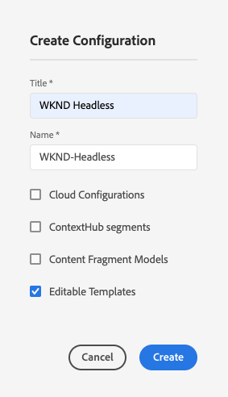
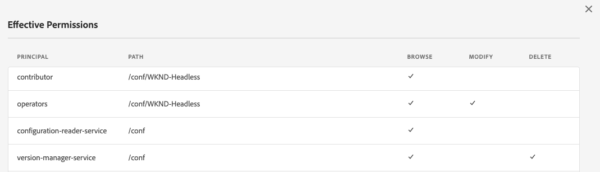

# Configurazioni e browser di configurazione {#configuration-browser}

Le configurazioni di Adobe Experience Manager (AEM) servono per gestire le impostazioni in AEM e fungono da aree di lavoro.

## Cos&#39;è una configurazione? {#what-is-a-configuration}

Una configurazione può essere considerata da due punti di vista diversi.

* [Un amministratore](#configurations-administrator) utilizza le configurazioni come aree di lavoro all&#39;interno di AEM per definire e gestire gruppi di impostazioni.
* [Uno sviluppatore](#configurations-developer) utilizza il meccanismo di configurazione sottostante che implementa le configurazioni per mantenere e cercare le impostazioni in AEM.

In sintesi: dal punto di vista di un amministratore, per configurazioni si intende il modo in cui vengono create le aree di lavoro per gestire le impostazioni in AEM; lo sviluppatore deve invece comprendere in che modo AEM utilizza e gestisce queste configurazioni all’interno dell’archivio.

Indipendentemente dal tuo punto di vista, le configurazioni hanno due finalità principali in AEM:

* Le configurazioni abilitano determinate funzioni per determinati gruppi di utenti.
* Le configurazioni definiscono i diritti di accesso per tali funzioni.

## Configurazioni come amministratore {#configurations-administrator}

L’amministratore di AEM e gli autori possono considerare le configurazioni come aree di lavoro. Queste aree di lavoro possono essere utilizzate per raccogliere gruppi di impostazioni e i relativi contenuti associati a scopo organizzativo implementando i diritti di accesso per tali funzioni.

È possibile creare configurazioni per molte funzioni diverse all’interno di AEM.

* [Segmenti Context Hub](/help/sites-cloud/authoring/personalization/contexthub-segmentation.md)
* [Modelli per frammenti di contenuto](/help/sites-cloud/administering/content-fragments/managing-content-fragment-models.md)
* [Modelli modificabili](/help/sites-cloud/authoring/page-editor/templates.md)
* varie configurazioni cloud

### Esempio {#administrator-example}

Ad esempio, un amministratore può creare due configurazioni per i modelli modificabili.

* WKND generale
* WKND-Magazine

L’amministratore può quindi creare modelli di pagina generali utilizzando la configurazione WKND-General e quindi modelli specifici per la rivista in WKND-Magazine.

L’amministratore può quindi associare il WKND-General a tutto il contenuto del sito WKND. Tuttavia, la configurazione WKND-Magazine sarebbe associata solo al sito della rivista.

In questo modo:

* Quando un autore di contenuti crea una pagina per la rivista, può scegliere tra modelli generali (WKND-General) o modelli di rivista (WKND-Magazine).
* Quando un autore di contenuti crea una pagina per un’altra parte del sito che non è la rivista, può scegliere solo tra i modelli generali (WKND-General).

Configurazioni simili sono possibili non solo per i modelli modificabili, ma anche per le configurazioni cloud, i segmenti ContextHub e i modelli per frammenti di contenuto.

### Utilizzo del browser configurazioni {#using-configuration-browser}

Il browser di configurazioni consente all’amministratore di creare, gestire e configurare facilmente i diritti di accesso alle configurazioni in AEM.

>[!NOTE]
>
>È possibile creare configurazioni utilizzando il Browser configurazioni solo se l&#39;utente dispone dei diritti `admin`. Tali diritti `admin` sono necessari anche per assegnare diritti di accesso alla configurazione o per modificare in altro modo una configurazione.

#### Creazione di una configurazione  {#creating-a-configuration}

È semplice creare una configurazione in AEM utilizzando il Browser configurazioni.

1. Accedi ad AEM as a Cloud Service e dal menu principale seleziona **Strumenti** > **Generale** > **Browser configurazioni**.
1. Seleziona **Crea**.
1. Specifica il **titolo** e il **nome** da assegnare alla configurazione.

   

   * Il **titolo** deve essere descrittivo.
   * Il **nome** diventa il nome del nodo nell’archivio.
      * Viene generato automaticamente dal titolo, secondo le [convenzioni di denominazione di AEM](naming-conventions.md).
      * Se necessario è possibile modificarlo.
1. Controlla il tipo di configurazioni che desideri consentire.
   * [Segmenti Context Hub](/help/sites-cloud/authoring/personalization/contexthub-segmentation.md)
   * [Modelli per frammenti di contenuto](/help/sites-cloud/administering/content-fragments/managing-content-fragment-models.md)
   * [Modelli modificabili](/help/sites-cloud/authoring/page-editor/templates.md)
   * varie configurazioni cloud
1. Seleziona **Crea**.

>[!TIP]
>
>Le configurazioni possono essere nidificate.

#### Modifica delle configurazioni e dei relativi diritti di accesso {#access-rights}

Se consideri le configurazioni come aree di lavoro, puoi impostare i diritti di accesso su tali configurazioni per imporre a chi può o meno accedere a tali aree di lavoro.

1. Accedi ad AEM as a Cloud Service e dal menu principale seleziona **Strumenti** > **Generale** > **Browser configurazioni**.
1. Selezionare la configurazione da modificare, quindi selezionare **Proprietà** nella barra degli strumenti.
1. Selezionate le feature aggiuntive da aggiungere alla configurazione.

   >[!NOTE]
   >
   >Una volta creata la configurazione, non è possibile deselezionare una feature.

1. Utilizza il pulsante **Autorizzazioni effettive** per visualizzare una matrice di ruoli e le autorizzazioni attualmente concesse alle configurazioni.
   
1. Per assegnare nuove autorizzazioni, immettere il nome dell&#39;utente o del gruppo nel campo **Seleziona utente o gruppo** della sezione **Aggiungi nuove autorizzazioni**.
   * Il campo **Seleziona utente o gruppo** offre il completamento automatico in base agli utenti e ai ruoli esistenti.
1. Selezionare l&#39;utente o il ruolo appropriato dai risultati di completamento automatico.
   * È possibile selezionare più utenti o ruoli.
1. Verificare le opzioni di accesso che uno o più utenti o ruoli selezionati devono avere e fare clic su **Aggiungi**.
   
1. Ripeti i passaggi in modo da poter selezionare utenti o ruoli e assegnare diritti di accesso aggiuntivi in base alle esigenze.
1. Al termine, seleziona **Salva e chiudi**.

## Configurazioni come sviluppatore {#configurations-developer}

In qualità di sviluppatore, è importante sapere come AEM as a Cloud Service funziona con le configurazioni e come elabora la risoluzione della configurazione.

### Separazione di configurazione e contenuto {#separation-of-config-and-content}

Anche se l&#39;amministratore [e gli utenti possono considerare le configurazioni come aree di lavoro](#configurations-administrator) per gestire impostazioni e contenuti diversi, è importante comprendere che le configurazioni e i contenuti sono archiviati e gestiti separatamente da AEM nell&#39;archivio.

* `/content` è la home page di tutti i contenuti.
* `/conf` è la home di tutte le configurazioni.

Il contenuto fa riferimento alla configurazione associata tramite una proprietà `cq:conf`. AEM esegue una ricerca in base al contenuto e alla relativa proprietà contestuale `cq:conf` per trovare la configurazione appropriata.

### Esempio {#developer-example}

Per questo esempio, supponiamo che tu disponga di un codice dell’applicazione interessato alle impostazioni DAM.

```java
Conf conf = resource.adaptTo(Conf.class);
ValueMap imageServerSettings = conf.getItem("dam/imageserver");
String bgkcolor = imageServerSettings.get("bgkcolor", "FFFFFF");
```

Il punto iniziale di tutte le ricerche di configurazione è una risorsa di contenuto in `/content`. Potrebbe trattarsi di una pagina, di un componente all’interno di una pagina, di una risorsa o di una cartella DAM. Si tratta del contenuto effettivo per il quale stai cercando la configurazione corretta che si applica in questo contesto.

Ora con l&#39;oggetto `Conf` a portata di mano, puoi recuperare l&#39;elemento di configurazione specifico che ti interessa. In questo caso è `dam/imageserver`, ovvero una raccolta di impostazioni relative a `imageserver`. La chiamata `getItem` restituisce un `ValueMap`. Quindi leggi una proprietà stringa `bgkcolor` e fornisci il valore predefinito &quot;FFFFFF&quot; nel caso in cui la proprietà (o l&#39;intero elemento di configurazione) non sia presente.

Ora diamo un’occhiata al contenuto JCR corrispondente:

```text
/content/dam/wknd
    + jcr:content
      - cq:conf = "/conf/wknd"
    + image.png [dam:Asset]

/conf/wknd
    + settings
      + dam
        + imageserver [cq:Page]
          + jcr:content
            - bgkcolor = "FF0000"
```

In questo esempio, puoi assumere una cartella DAM specifica per WKND qui e una configurazione corrispondente. A partire dalla cartella `/content/dam/wknd`, è possibile vedere che esiste una proprietà stringa denominata `cq:conf` che fa riferimento alla configurazione applicata alla sottostruttura. La proprietà è impostata su `jcr:content` di una cartella risorse o di una pagina. Questi collegamenti `conf` sono espliciti, quindi è facile seguirli semplicemente guardando il contenuto in CRXDE.

Saltando all&#39;interno di `/conf`, seguire il riferimento e verificare che sia presente un nodo `/conf/wknd`. Questa è una configurazione. La ricerca è trasparente per il codice dell’applicazione. Il codice di esempio non dispone mai di un riferimento dedicato, ma è nascosto dietro l&#39;oggetto `Conf`. La configurazione applicabile viene controllata tramite il contenuto JCR.

La configurazione contiene un nodo `settings` a nome fisso che contiene gli elementi effettivi, inclusi `dam/imageserver` necessari in questo caso. Tale elemento può essere considerato come un &quot;documento impostazioni&quot; ed è rappresentato da un `cq:Page` che include un `jcr:content` che contiene il contenuto effettivo.

Viene infine visualizzata la proprietà `bgkcolor` necessaria per questo codice di esempio. Il `ValueMap` recuperato da `getItem` si basa sul nodo `jcr:content` della pagina.

### Risoluzione configurazione {#configuration-resolution}

L’esempio di base precedente mostrava una singola configurazione. Tuttavia, in molti casi è necessario disporre di configurazioni diverse, ad esempio una configurazione globale predefinita, una diversa per ogni marchio e forse una specifica per i sottoprogetti.

Per supportare questa ricerca della configurazione, AEM dispone di un meccanismo di ereditarietà e fallback nell’ordine di preferenza seguente:

1. `/conf/<siteconfig>/<parentconfig>/<myconfig>`
   * Configurazione specifica a cui si fa riferimento da `cq:conf` in `/content`
   * La gerarchia è arbitraria e può essere progettata proprio come la struttura del sito, questo non è l&#39;attività del codice dell&#39;applicazione
   * Modificabile in fase di runtime da utenti con privilegi di configurazione
1. `/conf/<siteconfig>/<parentconfig>`
   * Esamina i padri per le configurazioni di fallback
   * Modificabile in fase di runtime da utenti con privilegi di configurazione
1. `/conf/<siteconfig>`
   * Esamina i padri per le configurazioni di fallback
   * Modificabile in fase di runtime da utenti con privilegi di configurazione
1. `/conf/global`
   * Impostazioni globali del sistema
   * Valori predefiniti globali per l&#39;installazione
   * Impostato da un ruolo `admin`
   * Modificabile in fase di runtime da utenti con privilegi di configurazione
1. `/apps`
   * Valori predefiniti applicazione
   * Risolto con l’implementazione dell’applicazione
   * Sola lettura in fase di runtime
1. `/libs`
   * Valori predefiniti di AEM
   * Modificabile solo da Adobe, accesso al progetto non consentito
   * Risolto con l’implementazione dell’applicazione
   * Sola lettura in fase di runtime

### Utilizzo delle configurazioni {#using-configurations}

Le configurazioni in AEM si basano su Configurazioni in base al contesto di Sling. I bundle Sling forniscono un’API di servizio che può essere utilizzata per ottenere configurazioni in base al contesto. Le configurazioni in base al contesto sono configurazioni correlate a una risorsa di contenuto o a una struttura di risorse come [descritto nell&#39;esempio precedente](#developer-example).

Per ulteriori dettagli su configurazioni in base al contesto, esempi e come utilizzarle, consulta la [documentazione di Sling](https://sling.apache.org/documentation/bundles/context-aware-configuration/context-aware-configuration.html).

### Console Web di ConfMgr {#confmgr-web-console}

A scopo di debug e test, è disponibile una console Web **ConfMgr** in `https://<host>:<port>/system/console/conf`, che può mostrare le configurazioni per un determinato percorso/elemento.


Fornisci semplicemente:

* **Percorso contenuto**
* **Elemento**
* **Utente**

Fai clic su **Risolvi** per vedere quali configurazioni vengono risolte e ottenere esempi di codice utili per risolverle.

### Console Web di configurazione in base al contesto {#context-aware-web-console}

A scopo di debug e test, è disponibile una console Web **Configurazione in base al contesto** in `https://<host>:<port>/system/console/slingcaconfig`, che consente di eseguire query sulle configurazioni in base al contesto nell&#39;archivio e di visualizzarne le proprietà.


Fornisci semplicemente:

* **Percorso contenuto**
* **Nome configurazione**

Fai clic su **Risolvi** per recuperare i percorsi e le proprietà di contesto associati per la configurazione selezionata.
