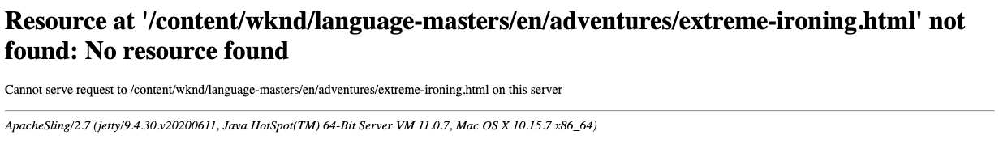

# Personalizzazione delle pagine di errore {#customizing-error-pages}

AEM viene fornito con un gestore degli errori standard per la gestione degli errori HTTP, ad esempio mostrando:

Per rispondere agli errori, AEM fornisce uno script `404.jsp` in `/libs/sling/servlet/errorhandler`.

>[!TIP]
>
>Poiché AEM è basato su Apache Sling, ulteriori informazioni sono disponibili [nella documentazione sulla gestione degli errori di Apache](https://sling.apache.org/documentation/the-sling-engine/errorhandling.html).

>[!NOTE]
>
>In un&#39;istanza di authoring, il filtro di debug [ di CQ WCM è abilitato per impostazione predefinita. ](/help/implementing/deploying/configuring-osgi.md) Questo determina sempre il codice di risposta 200. Il gestore degli errori predefinito risponde scrivendo la traccia full stack nella risposta.
>
>In un&#39;istanza di pubblicazione, il filtro di debug CQ WCM è **sempre** disabilitato (anche se configurato come abilitato).

>[!NOTE]
>
>Per ulteriori informazioni sulla gestione degli errori con Dispatcher, vedere [Configurazione delle pagine di errore CDN](/help/implementing/dispatcher/cdn-error-pages.md).

## Personalizzare le pagine visualizzate dal gestore degli errori {#how-to-customize-pages-shown-by-the-error-handler}

Puoi sviluppare script personalizzati per personalizzare le pagine visualizzate dal gestore degli errori quando viene rilevato un errore. A tale scopo, si utilizza il meccanismo di sovrapposizione standard di [AEM](/help/implementing/developing/introduction/overlays.md) in modo che le pagine personalizzate vengano create in `/apps` e sovrappongano le pagine predefinite in `/libs`.

1. Nell’archivio, copia gli script predefiniti:

   * da `/libs/sling/servlet/errorhandler/`
   * a `/apps/sling/servlet/errorhandler/`

   Il percorso di destinazione non esiste per impostazione predefinita, pertanto devi crearlo quando esegui questa operazione per la prima volta.

1. Passa a `/apps/sling/servlet/errorhandler`. Qui puoi effettuare le seguenti operazioni:

   * modificare lo script esistente appropriato per fornire le informazioni richieste. Oppure
   * crea e modifica un nuovo script per il codice richiesto.

1. Salva le modifiche e verifica.

>[!CAUTION]
>
>Lo script `404.jsp` è stato specificamente progettato per gestire l&#39;autenticazione AEM, in particolare per consentire l&#39;accesso al sistema in caso di errori.
>
>Pertanto, la sostituzione di questo script deve essere effettuata con molta attenzione.

### Personalizzazione della risposta agli errori HTTP 500 {#customizing-the-response-to-http-errors}

L&#39;errore interno del server HTTP [500](https://www.w3.org/Protocols/rfc2616/rfc2616-sec10.html) indica un errore sul lato server, ad esempio il fatto che il server ha incontrato una condizione imprevista che ha impedito il completamento della richiesta.

Quando l’elaborazione delle richieste genera un’eccezione, il framework Sling Apache (su cui è basato AEM):

* Registra l’eccezione
* E restituisce nel corpo della risposta:
   * Il codice di risposta HTTP 500
   * Traccia dello stack di eccezioni

È possibile creare uno script [ personalizzando le pagine visualizzate dal gestore degli errori](#how-to-customize-pages-shown-by-the-error-handler). `500.jsp` Tuttavia, viene utilizzato solo se `HttpServletResponse.sendError(500)` viene eseguito in modo esplicito, ovvero da un servizio di raccolta eccezioni.

In caso contrario, il codice di risposta è impostato su 500, ma lo script `500.jsp` non viene eseguito.

Per gestire gli errori 500, il nome file dello script del gestore degli errori deve essere uguale a quello della classe di eccezione (o superclasse). Per gestire tutte queste eccezioni è possibile creare uno script `/apps/sling/servlet/errorhandler/Throwable.jsp` o `/apps/sling/servlet/errorhandler/Exception.jsp`.

>[!NOTE]
>
>In AEM as Cloud Service, la CDN fornisce una pagina di errore generica quando viene ricevuto un errore 5XX dal backend. Per consentire la trasmissione della risposta effettiva del backend, è necessario aggiungere la seguente intestazione alla risposta: `x-aem-error-pass: true`.
>>Questo funziona solo per le risposte provenienti da AEM o dal livello Apache/Dispatcher. Altri errori imprevisti provenienti dai livelli intermedi dell’infrastruttura visualizzeranno comunque la pagina di errore generico.

>[!CAUTION]
>
>In un&#39;istanza di authoring, il filtro di debug [ di CQ WCM è abilitato per impostazione predefinita. ](/help/implementing/deploying/configuring-osgi.md) Questo determina sempre il codice di risposta 200. Il gestore degli errori predefinito risponde scrivendo la traccia full stack nella risposta.
>
>Per un gestore degli errori personalizzato, sono necessarie risposte con codice 500, pertanto il filtro di debug WCM [CQ deve essere disabilitato](/help/implementing/deploying/configuring-osgi.md). In questo modo viene restituito il codice di risposta 500, che a sua volta attiva il gestore di errori Sling corretto.
>
>In un&#39;istanza di pubblicazione, il filtro di debug CQ WCM è **sempre** disabilitato (anche se configurato come abilitato).
