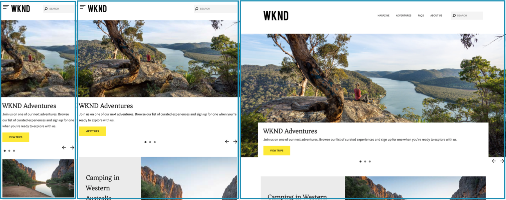

# Progettazione reattiva {#responsive-design}

Con il design reattivo, le stesse esperienze possono essere visualizzate in modo efficace su più dispositivi in più orientamenti.

>[!TIP]
>
>Questo documento fornisce una panoramica della progettazione reattiva per gli sviluppatori e del modo in cui le funzioni vengono realizzate in AEM. Sono disponibili risorse aggiuntive:
>
>* Per gli autori di contenuto, i dettagli sull&#39;utilizzo delle funzionalità di progettazione reattiva in una pagina di contenuto sono disponibili nel documento [Layout reattivo.](/help/sites-cloud/authoring/page-editor/responsive-layout.md)
>* Per gli amministratori del sito, i dettagli sulla configurazione del contenitore di layout per i siti sono descritti nel documento [Configurazione del contenitore di layout e della modalità di layout.](/help/sites-cloud/administering/responsive-layout.md)

## Panoramica {#overview}

Progetta le esperienze in modo che si adattino al riquadro di visualizzazione client in cui vengono visualizzate. Con il design reattivo, le stesse pagine possono essere visualizzate in modo efficace su più dispositivi in entrambi gli orientamenti. L&#39;immagine seguente illustra alcuni modi in cui una pagina può rispondere alle modifiche apportate alle dimensioni del riquadro di visualizzazione:

* Layout: utilizza layout a colonna singola per riquadri di visualizzazione più piccoli e layout a più colonne per riquadri di visualizzazione più grandi.
* Dimensione testo: utilizza dimensioni maggiori del testo (se appropriato, ad esempio le intestazioni) nelle finestre di visualizzazione più grandi.
* Contenuto: include solo il contenuto più importante quando viene visualizzato su dispositivi più piccoli.
* Navigazione: sono disponibili strumenti specifici per i dispositivi per accedere ad altre pagine.
* Immagini: distribuiscono rappresentazioni di immagini appropriate per il riquadro di visualizzazione client in base alle dimensioni della finestra.



Sviluppare applicazioni Adobe Experience Manager (AEM) che generano HTML5 adattabile a più dimensioni di finestra e orientamenti. Ad esempio, i seguenti intervalli di larghezze dei riquadri di visualizzazione corrispondono a vari tipi di dispositivi e orientamenti

* Larghezza massima di 480 pixel (telefono, verticale)
* Larghezza massima di 767 pixel (telefono, orizzontale)
* Larghezza compresa tra 768 e 979 pixel (tablet, verticale)
* Larghezza compresa tra 980 e 1199 pixel (tablet, orizzontale)
* Larghezza uguale o superiore a 1200 px (desktop)

Per informazioni sull’implementazione del comportamento di progettazione reattiva, consulta i seguenti argomenti:

* [Query multimediali](#using-media-queries)
* [Griglie fluide](#developing-a-fluid-grid)
* [Immagini adattive](#using-adaptive-images)

Mentre progetti, utilizza la barra degli strumenti **Emulatore** per visualizzare in anteprima le pagine in diverse dimensioni dello schermo.

## Prima di sviluppare {#before-you-develop}

Prima di sviluppare l’applicazione AEM che supporta le pagine web, è necessario prendere diverse decisioni relative alla progettazione. Ad esempio, è necessario disporre delle seguenti informazioni:

* Dispositivi di destinazione
* Le dimensioni del riquadro di visualizzazione di destinazione
* I layout di pagina per ciascuna dimensione del riquadro di visualizzazione di destinazione

### Struttura dell&#39;applicazione {#application-structure}

La struttura tipica delle applicazioni AEM supporta tutte le implementazioni di progettazione reattiva:

* I componenti della pagina risiedono sotto `/apps/<application_name>/components`
* I modelli si trovano sotto `/apps/<application_name>/templates`

## Utilizzo delle query multimediali {#using-media-queries}

Le query multimediali consentono l’utilizzo selettivo degli stili CSS per il rendering delle pagine. Gli strumenti e le funzioni di sviluppo di AEM consentono di implementare in modo efficace ed efficiente le query multimediali nelle applicazioni.

Il gruppo W3C fornisce il consiglio [Media Queries](https://www.w3.org/TR/css3-mediaqueries/) che descrive questa funzione CSS3 e la sintassi.

### Creazione del file CSS {#creating-the-css-file}

Nel file CSS, definisci le query multimediali in base alle proprietà dei dispositivi di destinazione. La seguente strategia di implementazione è efficace per la gestione degli stili per ogni query multimediale:

* Utilizza una [cartella Libreria client](clientlibs.md) per definire il CSS assemblato al momento del rendering della pagina.
* Definisci ogni query multimediale e gli stili associati in file CSS separati. È utile utilizzare nomi di file che rappresentino le funzioni dispositivo della query multimediale.
* Definisci gli stili comuni a tutti i dispositivi in un file CSS separato.
* Nel file css.txt della cartella Libreria client, ordinare i file CSS di elenco come richiesto nel file CSS assemblato.

L&#39;esercitazione [WKND](develop-wknd-tutorial.md) utilizza questa strategia per definire gli stili nella progettazione del sito. Il file CSS utilizzato da WKND si trova in `/apps/wknd/clientlibs/clientlib-grid/less/grid.less`.

### Utilizzo delle query multimediali con le pagine AEM {#using-media-queries-with-aem-pages}

[Il progetto di esempio WKND](/help/implementing/developing/introduction/develop-wknd-tutorial.md) e [Archetipo progetto AEM](https://experienceleague.adobe.com/docs/experience-manager-core-components/using/developing/archetype/overview.html?lang=it) utilizzano il [Componente core pagina](https://experienceleague.adobe.com/docs/experience-manager-core-components/using/wcm-components/page.html?lang=it), che include clientlibs tramite i criteri di pagina.

Se il tuo componente pagina non è basato sul componente core pagina, puoi anche includere la cartella della libreria client nello script HTL o JSP. In questo modo si genera e si fa riferimento al file CSS con le query multimediali necessarie per il funzionamento della griglia reattiva.

#### HTL {#htl}

```html
<sly data-sly-use.clientlib="${'/libs/granite/sightly/templates/clientlib.html'}">
<sly data-sly-call="${clientlib.all @ categories='apps.weretail.all'}"/>
```

#### JSP {#jsp}

```xml
<ui:includeClientLib categories="apps.weretail.all"/>
```

Lo script JSP genera il seguente codice HTML che fa riferimento ai fogli di stile:

```xml
<link rel="stylesheet" href="/etc/designs/weretail/clientlibs-all.css" type="text/css">
<link href="/etc/designs/weretail.css" rel="stylesheet" type="text/css">
```

## Anteprima per dispositivi specifici {#previewing-for-specific-devices}

L’emulatore ti consente di visualizzare in anteprima le pagine in diverse dimensioni di riquadri di visualizzazione, in modo da poter testare il comportamento del design reattivo. Quando modifichi una pagina nella console Sites, tocca o fai clic sull&#39;icona **Emulatore** per visualizzare l&#39;emulatore.


Nella barra degli strumenti dell&#39;emulatore puoi toccare o fare clic sull&#39;icona **Dispositivi** per visualizzare un menu a discesa in cui puoi selezionare un dispositivo. Quando selezioni un dispositivo, la pagina cambia in base alle dimensioni del riquadro di visualizzazione.


### Specifica dei gruppi di dispositivi {#specifying-device-groups}

Per specificare i gruppi di dispositivi visualizzati nell&#39;elenco **Dispositivi**, aggiungere una proprietà `cq:deviceGroups` al nodo `jcr:content` della pagina modello del sito. Il valore della proprietà è un array di percorsi ai nodi del gruppo di dispositivi.

Ad esempio, la pagina del modello del sito WKND è `/conf/wknd/settings/wcm/template-types/empty-page/structure`. Il nodo `jcr:content` sotto di esso include la seguente proprietà:

* Nome: `cq:deviceGroups`
* Tipo: `String[]`
* Valore: `mobile/groups/responsive`

Nodi del gruppo di dispositivi nella cartella `/etc/mobile/groups`.

## Immagini reattive {#responsive-images}

Le pagine reattive si adattano dinamicamente al dispositivo su cui vengono riprodotte, offrendo un’esperienza migliore per l’utente. Tuttavia, è anche importante che le risorse siano ottimizzate per il punto di interruzione e il dispositivo per ridurre al minimo il tempo di caricamento delle pagine.

[Il componente core Immagine](https://experienceleague.adobe.com/docs/experience-manager-core-components/using/wcm-components/image.html?lang=it) offre funzionalità quali la selezione di immagini adattive.

* Per impostazione predefinita, il componente Immagine utilizza [Adaptive Image Servlet](https://experienceleague.adobe.com/docs/experience-manager-core-components/using/developing/adaptive-image-servlet.html?lang=it) per distribuire la rappresentazione corretta.
* [La consegna di immagini ottimizzate per il web](https://experienceleague.adobe.com/docs/experience-manager-core-components/using/developing/web-optimized-image-delivery.html?lang=it) è disponibile anche tramite una semplice casella di controllo nei suoi criteri, che fornisce risorse immagine da DAM in formato WebP e può ridurre la dimensione di download di un&#39;immagine di circa il 25% in media.

## Contenitore di layout {#layout-container}

Il Contenitore di layout di AEM consente di implementare in modo efficiente ed efficace il layout dinamico per adattare le dimensioni della pagina al riquadro di visualizzazione client.

>[La documentazione GitHub](https://adobe-marketing-cloud.github.io/aem-responsivegrid/) della griglia reattiva è un riferimento che può essere dato agli sviluppatori front-end consentendo loro di utilizzare la griglia di AEM al di fuori di AEM, ad esempio, durante la creazione di modelli statici di HTML per un futuro sito AEM.

>[!TIP]
>
>Per ulteriori informazioni sul funzionamento del Contenitore di layout e su come abilitare i layout reattivi per i contenuti, vedere il documento [Configurazione del Contenitore di layout e della modalità di layout](/help/sites-cloud/administering/responsive-layout.md).

## Griglie reattive nidificate {#nested-responsive-grids}

In alcuni casi potrebbe essere necessario nidificare le griglie reattive per supportare le esigenze del progetto. Tuttavia, tieni presente che la best practice consigliata da Adobe è quella di mantenere la struttura il più piatto possibile.

Quando non puoi evitare di utilizzare griglie reattive nidificate, assicurati che:

* Tutti i contenitori (contenitori, schede, fisarmoniche, ecc.) hanno la proprietà `layout = responsiveGrid`.
* Non combinare la proprietà `layout = simple` nella gerarchia dei contenitori.

Sono inclusi tutti i contenitori strutturali del modello della pagina.

Il numero di colonna del contenitore interno non deve mai essere maggiore di quello del contenitore esterno. L&#39;esempio seguente soddisfa questa condizione. Mentre il numero di colonna del contenitore esterno è 8 per la schermata predefinita (desktop), il numero di colonna del contenitore interno è 4.

>[!BEGINTABS]

>[!TAB Esempio di struttura del nodo]

```text
container
  @layout = responsiveGrid
  cq:responsive
    default
      @offset = 0
      @width = 8
  container
  @layout = responsiveGrid
    cq:responsive
      default
        @offset = 0
        @width = 4
    text
      @text =" Text Column 1"
```

>[!TAB Esempio di HTML risultante]

```html
<div class="container responsivegrid aem-GridColumn--default--none aem-GridColumn aem-GridColumn--default--8 aem-GridColumn--offset--default--0">
  <div id="container-c9955c233c" class="cmp-container">
    <div class="aem-Grid aem-Grid--8 aem-Grid--default--8 ">
      <div class="container responsivegrid aem-GridColumn--default--none aem-GridColumn aem-GridColumn--offset--default--0 aem-GridColumn--default--4">
        <div id="container-8414e95866" class="cmp-container">
          <div class="aem-Grid aem-Grid--4 aem-Grid--default--4 ">
            <div class="text aem-GridColumn aem-GridColumn--default--4">
              <div data-cmp-data-layer="..." id="text-1234567890" class="cmp-text">
                <p>Text Column 1</p>
              </div>
            </div>
          </div>
        </div>
      </div>
    </div>
  </div>
</div>
```

>[!ENDTABS]
