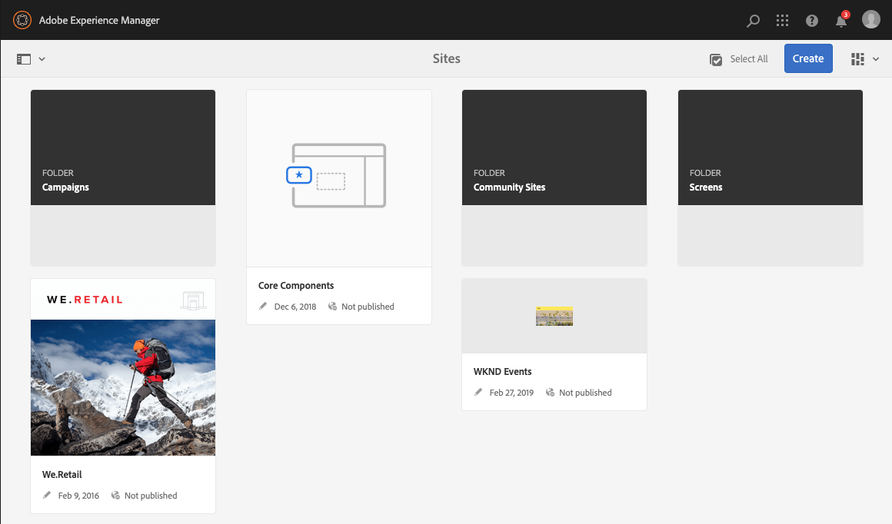
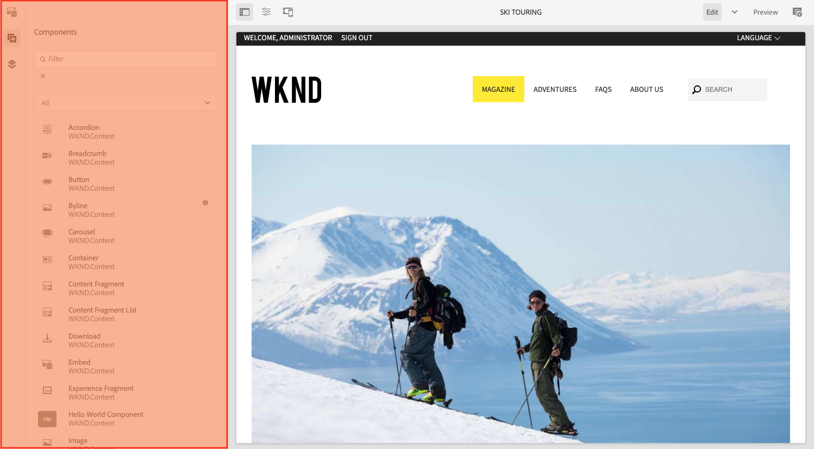

# Struttura dell’interfaccia AEM {#structure-of-the-aem-ui}

L’interfaccia utente dell’AEM ha diversi principi di base ed è composta da diversi elementi chiave:

## Console {#consoles}

### Layout e ridimensionamento di base {#basic-layout-and-resizing}

L’interfaccia utente supporta sia i dispositivi mobili che quelli desktop, ma invece di creare due stili, l’AEM utilizza uno stile che funziona per tutti gli schermi e i dispositivi.

Tutti i moduli utilizzano lo stesso layout di base, che nell’AEM può essere visto come:

Il layout rispetta uno stile di progettazione reattivo e si adatta alle dimensioni del dispositivo o della finestra in uso.

Ad esempio, quando la risoluzione scende al di sotto di 1024 px (come su un dispositivo mobile), il display viene regolato di conseguenza:

### Barra intestazione {#header-bar}

La barra dell’intestazione mostra gli elementi globali, tra cui:

* Il logo e lo specifico prodotto/soluzione attualmente in uso; per l’AEM questo costituisce anche un collegamento alla navigazione globale
* Ricerca
* Icona per accedere alle risorse della guida
* Icona per accedere ad altre soluzioni
* Indicatore (e accesso) di tutti gli avvisi o elementi della casella in entrata che ti aspettano
* L’icona utente, insieme a un collegamento per la gestione del profilo

### Barra degli strumenti {#toolbar}

La barra degli strumenti è contestuale alla posizione e mette in superficie gli strumenti rilevanti per il controllo della vista o delle risorse nella pagina seguente. La barra degli strumenti è specifica per il prodotto, ma presenta alcune caratteristiche in comune con gli elementi.

In qualsiasi posizione, la barra degli strumenti mostra le azioni attualmente disponibili:

Dipende anche dal fatto che una risorsa sia attualmente selezionata:

### Barra a sinistra {#left-rail}

La barra a sinistra può essere aperta/nascosta come richiesto per mostrare:

* **Solo contenuto**
* **Struttura contenuto**
* **Timeline**
* **Riferimenti**
* **Filtro**

Il valore predefinito è **Solo contenuto** (barra nascosta).

## Authoring delle pagine {#page-authoring}

Quando si creano le pagine, le aree strutturali sono le seguenti.

### Frame del contenuto {#content-frame}

Il rendering del contenuto della pagina viene eseguito nel frame del contenuto. Il frame del contenuto è completamente indipendente dall’editor, per garantire che non vi siano conflitti dovuti a CSS o JavaScript.

La cornice di contenuto si trova nella sezione destra della finestra, sotto la barra degli strumenti.

### Frame dell&#39;editor {#editor-frame}

Il frame dell&#39;editor abilita le funzioni di modifica.

Il frame dell’editor è un contenitore (astratto) per tutti gli elementi di authoring delle pagine. Si trova sopra la cornice del contenuto e include:

* Barra degli strumenti superiore
* Pannello laterale
* Tutte le sovrapposizioni
* Qualsiasi altro elemento di creazione pagina, ad esempio la barra degli strumenti del componente

### Pannello laterale {#side-panel}

Contiene tre schede predefinite. Il **Risorse** e **Componenti** Le schede consentono di selezionare tali elementi, trascinarli dal pannello e rilasciarli sulla pagina. Il **Struttura contenuto** consente di controllare la gerarchia dei contenuti nella pagina.

Il pannello laterale è nascosto per impostazione predefinita. Se questa opzione è selezionata, verrà visualizzata sul lato sinistro oppure scorrerà per coprire l&#39;intera finestra quando la dimensione della finestra è inferiore a 1024 px, come ad esempio in un dispositivo mobile.

### Pannello laterale - Risorse {#side-panel-assets}

Nella scheda Risorse puoi selezionare dall’intervallo di risorse. Puoi anche filtrare in base a un termine specifico o selezionare un gruppo.

### Pannello laterale - Gruppi di risorse {#side-panel-asset-groups}

Nella scheda Risorse è disponibile un elenco a discesa che puoi utilizzare per selezionare i gruppi di risorse specifici.

### Pannello laterale - Componenti {#side-panel-components}

Nella scheda Componenti puoi selezionare uno dei componenti disponibili. Puoi anche filtrare in base a un termine specifico o selezionare un gruppo.

### Pannello laterale - Struttura contenuto {#side-panel-content-tree}

Nella scheda Struttura contenuto è possibile visualizzare la gerarchia del contenuto nella pagina. Facendo clic su una voce nella scheda, si passa a e si seleziona l’elemento nella pagina all’interno dell’editor.

### Sovrapposizioni {#overlays}

Questi si sovrappongono alla cornice del contenuto e vengono utilizzati dal [livelli](#layer) realizzare i meccanismi che consentono di interagire (in modo completamente trasparente) con i componenti e i relativi contenuti.

Le sovrapposizioni sono live nel frame dell’editor (con tutti gli altri elementi di authoring della pagina), anche se in realtà sovrappongono i componenti appropriati nel frame del contenuto.

### Layer {#layer}

Un livello è un bundle indipendente di funzionalità che può essere attivato per:

* Fornisci una visualizzazione diversa della pagina
* Consente di manipolare e/o interagire con una pagina

I livelli forniscono funzionalità avanzate per l’intera pagina, anziché azioni specifiche per un singolo componente.

L’AEM include diversi livelli già implementati per l’authoring delle pagine, tra cui, ad esempio, i livelli Modifica, Anteprima e Annota.

>[!NOTE]
>
>I livelli sono un concetto potente che influisce sulla visualizzazione e sull’interazione dell’utente con il contenuto della pagina. Quando sviluppate i vostri livelli dovete assicurarvi che il livello si ripulisca quando viene chiuso.

### Switcher livello {#layer-switcher}

Il selettore livello consente di scegliere il livello da utilizzare. Quando è chiuso, indica il livello attualmente in uso.

Il selettore livelli è disponibile come elenco a discesa dalla barra degli strumenti (nella parte superiore della finestra, all’interno del frame dell’editor).

### Barra degli strumenti del componente {#component-toolbar}

Ogni istanza di un componente mostra la propria barra degli strumenti quando fa clic su di esso (una volta o con un doppio clic lento). La barra degli strumenti contiene le azioni specifiche (ad esempio, copia, incolla, open-editor) disponibili per l’istanza del componente nella pagina.

A seconda dello spazio disponibile, le barre degli strumenti del componente sono posizionate nell’angolo superiore o inferiore destro del componente appropriato.

## Ulteriori informazioni {#further-information}

<!--For more details about the concepts around the touch-enabled UI, continue to the article [Concepts of the AEM Touch-Enabled UI](/help/sites-developing/touch-ui-concepts.md).-->

Per ulteriori informazioni tecniche, vedere [Set di documentazione JS](https://helpx.adobe.com/experience-manager/6-5/sites/developing/using/reference-materials/jsdoc/ui-touch/editor-core/index.html) per l’editor pagina.
